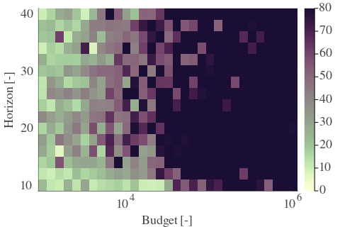
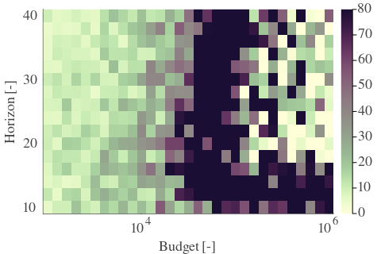
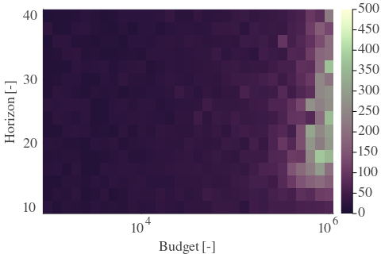

# Results for the file dp_AB_20230508.csv 

Generated on 2023-11-03 23:49:54

---

**Exploration parameter = 0**

| Cₚ = 0 | γ = 0.7, S = 0.0% | γ = 0.75, S = 0.0% | γ = 0.8, S = 0.0% | 
| --- | --- | --- | --- | 
| Mean |  |  |  | 
| Std |  |  |  | 

| Cₚ = 0 | γ = 0.85, S = 0.0% | γ = 0.9, S = 0.0% | γ = 0.95, S = 0.0% | 
| --- | --- | --- | --- | 
| Mean |  |  |  | 
| Std |  |  |  | 

| Cₚ = 0 | γ = 1.0, S = 0.0% | 
| --- | --- | 
| Mean |  | 
| Std |  | 

---

**Exploration parameter = 2**

| Cₚ = 2 | γ = 0.7, S = 0.0% | γ = 0.75, S = 0.0% | γ = 0.8, S = 0.0% | 
| --- | --- | --- | --- | 
| Mean |  |  |  | 
| Std |  |  |  | 

| Cₚ = 2 | γ = 0.85, S = 0.0% | γ = 0.9, S = 0.0% | γ = 0.95, S = 0.0% | 
| --- | --- | --- | --- | 
| Mean |  |  |  | 
| Std |  |  |  | 

| Cₚ = 2 | γ = 1.0, S = 0.0% | 
| --- | --- | 
| Mean |  | 
| Std |  | 

---

**Exploration parameter = 4**

| Cₚ = 4 | γ = 0.7, S = 0.0% | γ = 0.75, S = 0.0% | γ = 0.8, S = 0.0% | 
| --- | --- | --- | --- | 
| Mean |  |  |  | 
| Std |  |  |  | 

| Cₚ = 4 | γ = 0.85, S = 0.0% | γ = 0.9, S = 0.0% | γ = 0.95, S = 0.0% | 
| --- | --- | --- | --- | 
| Mean |  |  |  | 
| Std |  |  |  | 

| Cₚ = 4 | γ = 1.0, S = 0.0% | 
| --- | --- | 
| Mean |  | 
| Std |  | 

---

**Exploration parameter = 8**

| Cₚ = 8 | γ = 0.7, S = 0.0% | γ = 0.75, S = 0.0% | γ = 0.8, S = 0.0% | 
| --- | --- | --- | --- | 
| Mean |  |  |  | 
| Std |  |  |  | 

| Cₚ = 8 | γ = 0.85, S = 0.0% | γ = 0.9, S = 0.0% | γ = 0.95, S = 0.0% | 
| --- | --- | --- | --- | 
| Mean |  |  |  | 
| Std |  |  |  | 

| Cₚ = 8 | γ = 1.0, S = 0.0% | 
| --- | --- | 
| Mean |  | 
| Std |  | 

---

**Exploration parameter = 16**

| Cₚ = 16 | γ = 0.7, S = 0.0% | γ = 0.75, S = 0.0% | γ = 0.8, S = 0.0% | 
| --- | --- | --- | --- | 
| Mean |  |  |  | 
| Std |  |  |  | 

| Cₚ = 16 | γ = 0.85, S = 0.0% | γ = 0.9, S = 0.0% | γ = 0.95, S = 1.41% | 
| --- | --- | --- | --- | 
| Mean |  |  |  | 
| Std |  |  |  | 

| Cₚ = 16 | γ = 1.0, S = 0.4% | 
| --- | --- | 
| Mean |  | 
| Std |  | 

---

**Exploration parameter = 32**

| Cₚ = 32 | γ = 0.7, S = 0.0% | γ = 0.75, S = 0.0% | γ = 0.8, S = 0.0% | 
| --- | --- | --- | --- | 
| Mean |  |  |  | 
| Std |  |  |  | 

| Cₚ = 32 | γ = 0.85, S = 0.0% | γ = 0.9, S = 0.0% | γ = 0.95, S = 5.44% | 
| --- | --- | --- | --- | 
| Mean |  |  |  | 
| Std |  |  |  | 

| Cₚ = 32 | γ = 1.0, S = 11.29% | 
| --- | --- | 
| Mean |  | 
| Std |  | 

---

**Exploration parameter = 64**

| Cₚ = 64 | γ = 0.7, S = 0.0% | γ = 0.75, S = 0.0% | γ = 0.8, S = 0.0% | 
| --- | --- | --- | --- | 
| Mean |  |  |  | 
| Std |  |  |  | 

| Cₚ = 64 | γ = 0.85, S = 0.0% | γ = 0.9, S = 0.0% | γ = 0.95, S = 3.23% | 
| --- | --- | --- | --- | 
| Mean |  |  |  | 
| Std |  |  |  | 

| Cₚ = 64 | γ = 1.0, S = 19.76% | 
| --- | --- | 
| Mean |  | 
| Std |  | 

---

**Exploration parameter = 128**

| Cₚ = 128 | γ = 0.7, S = 0.0% | γ = 0.75, S = 0.0% | γ = 0.8, S = 0.0% | 
| --- | --- | --- | --- | 
| Mean |  |  |  | 
| Std |  |  |  | 

| Cₚ = 128 | γ = 0.85, S = 0.0% | γ = 0.9, S = 0.0% | γ = 0.95, S = 0.0% | 
| --- | --- | --- | --- | 
| Mean |  |  |  | 
| Std |  |  |  | 

| Cₚ = 128 | γ = 1.0, S = 11.09% | 
| --- | --- | 
| Mean |  | 
| Std |  | 

---

**Exploration parameter = 256**

| Cₚ = 256 | γ = 0.7, S = 0.0% | γ = 0.75, S = 0.0% | γ = 0.8, S = 0.0% | 
| --- | --- | --- | --- | 
| Mean |  |  |  | 
| Std |  |  |  | 

| Cₚ = 256 | γ = 0.85, S = 0.0% | γ = 0.9, S = 0.0% | γ = 0.95, S = 0.0% | 
| --- | --- | --- | --- | 
| Mean |  |  |  | 
| Std |  |  |  | 

| Cₚ = 256 | γ = 1.0, S = 0.0% | 
| --- | --- | 
| Mean |  | 
| Std |  | 

