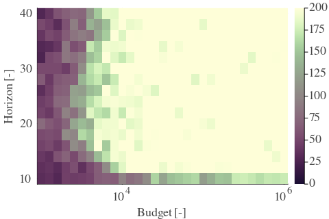

# Results for the file csv/dp_M_20230413.csv 

Generated on 2023-04-13 14:41:30

---

**Exploration parameter = 8**

| $C_p=8$| $\gamma = 0.9$| $\gamma = 0.95$| $\gamma = 1.0$| 
| --- | --- | --- | --- | 
| Mean |  |  |  | 
| Std |  |  |  | 

---

**Exploration parameter = 16**

| $C_p=16$| $\gamma = 0.9$| $\gamma = 0.95$| $\gamma = 1.0$| 
| --- | --- | --- | --- | 
| Mean |  |  |  | 
| Std |  |  |  | 

---

**Exploration parameter = 32**

| $C_p=32$| $\gamma = 0.9$| $\gamma = 0.95$| $\gamma = 1.0$| 
| --- | --- | --- | --- | 
| Mean |  |  |  | 
| Std |  |  |  | 

