# Results for the file dp_Q_20230426.csv 

Generated on 2023-11-03 23:49:53

---

**Exploration parameter = 0**

| Cₚ = 0 | γ = 0.7, S = 0.0% | γ = 0.75, S = 0.0% | γ = 0.8, S = 0.0% | 
| --- | --- | --- | --- | 
| Mean |  |  |  | 
| Std |  |  |  | 

| Cₚ = 0 | γ = 0.85, S = 0.0% | γ = 0.9, S = 0.0% | γ = 0.95, S = 0.0% | 
| --- | --- | --- | --- | 
| Mean |  |  |  | 
| Std |  |  |  | 

| Cₚ = 0 | γ = 1.0, S = 0.0% | 
| --- | --- | 
| Mean |  | 
| Std | 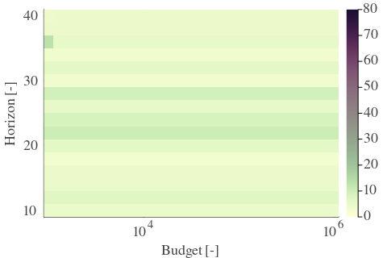 | 

---

**Exploration parameter = 2**

| Cₚ = 2 | γ = 0.7, S = 0.0% | γ = 0.75, S = 0.0% | γ = 0.8, S = 0.0% | 
| --- | --- | --- | --- | 
| Mean | 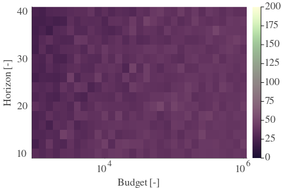 | 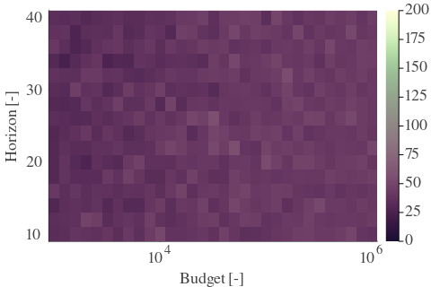 | 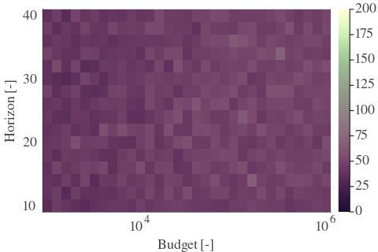 | 
| Std | 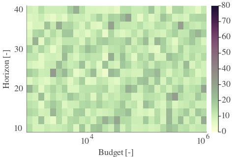 | 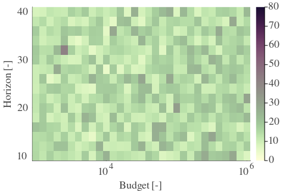 | 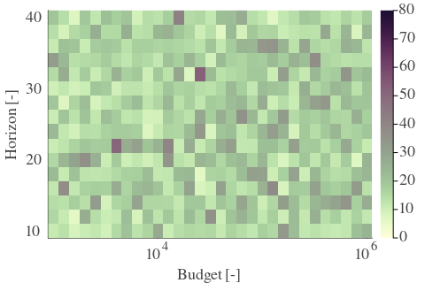 | 

| Cₚ = 2 | γ = 0.85, S = 0.0% | γ = 0.9, S = 0.0% | γ = 0.95, S = 0.0% | 
| --- | --- | --- | --- | 
| Mean | 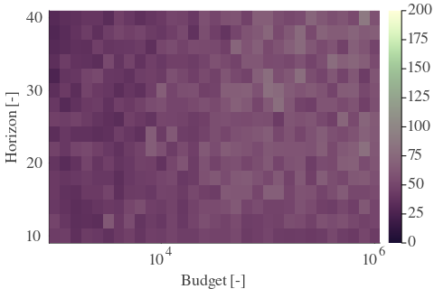 | 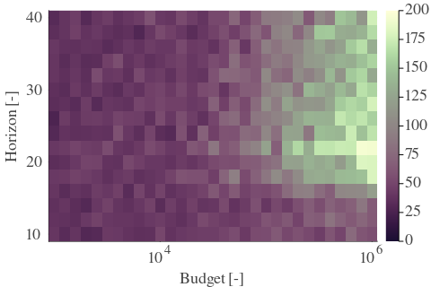 | 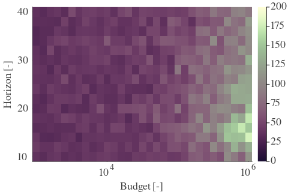 | 
| Std | 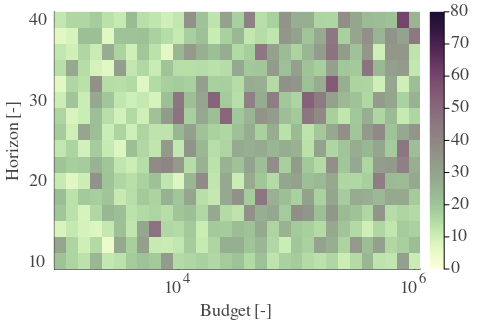 | 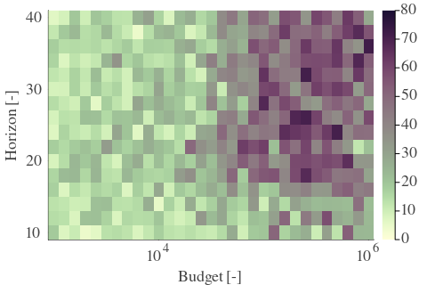 | 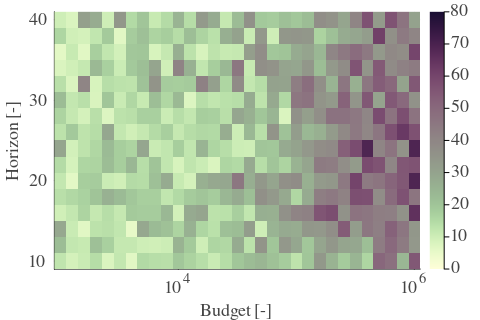 | 

| Cₚ = 2 | γ = 1.0, S = 0.0% | 
| --- | --- | 
| Mean |  | 
| Std | 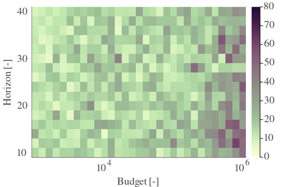 | 

---

**Exploration parameter = 4**

| Cₚ = 4 | γ = 0.7, S = 0.0% | γ = 0.75, S = 0.0% | γ = 0.8, S = 0.0% | 
| --- | --- | --- | --- | 
| Mean | 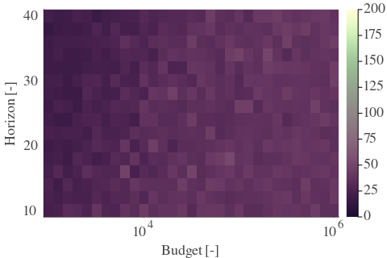 | 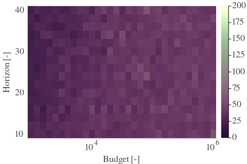 | 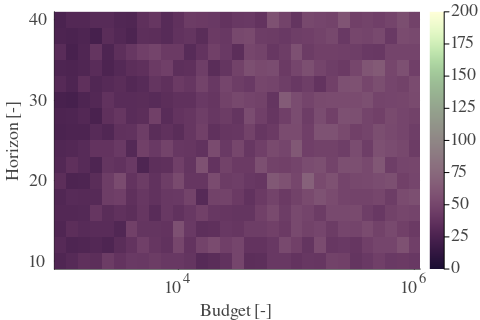 | 
| Std | 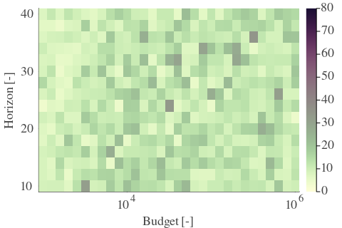 | 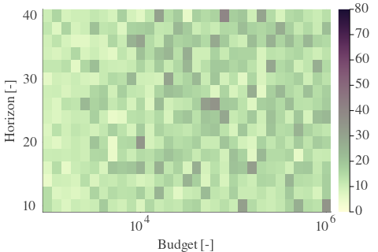 | 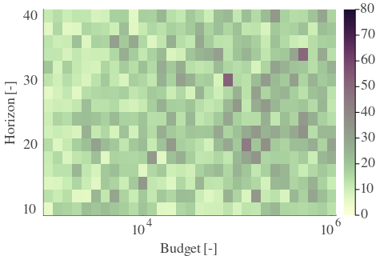 | 

| Cₚ = 4 | γ = 0.85, S = 0.0% | γ = 0.9, S = 4.44% | γ = 0.95, S = 1.01% | 
| --- | --- | --- | --- | 
| Mean | 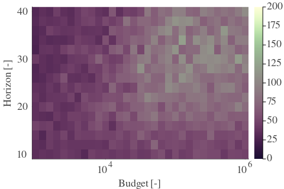 | 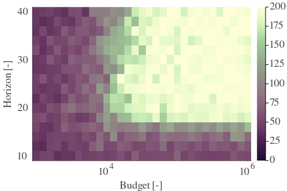 | 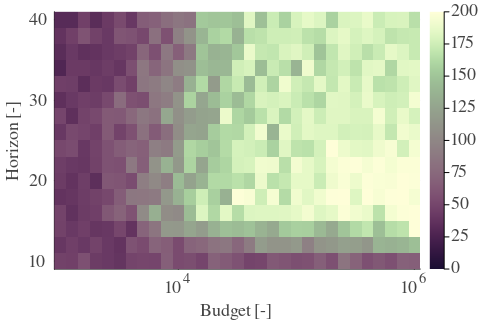 | 
| Std | 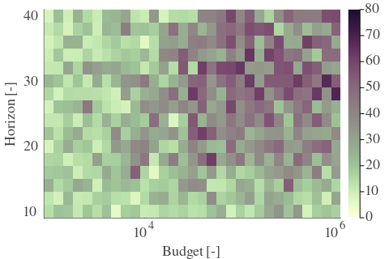 | 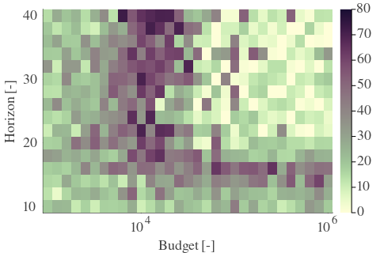 |  | 

| Cₚ = 4 | γ = 1.0, S = 1.21% | 
| --- | --- | 
| Mean | 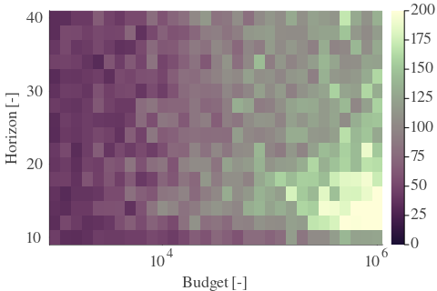 | 
| Std | 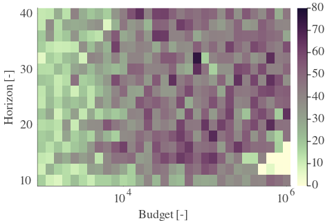 | 

---

**Exploration parameter = 8**

| Cₚ = 8 | γ = 0.7, S = 0.0% | γ = 0.75, S = 0.0% | γ = 0.8, S = 0.0% | 
| --- | --- | --- | --- | 
| Mean |  | 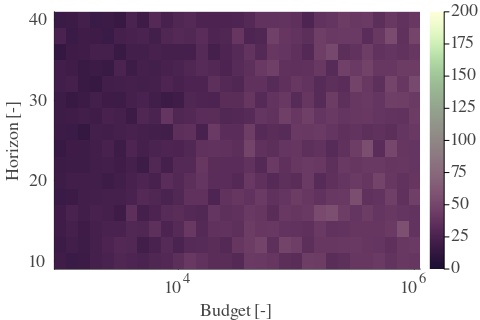 | 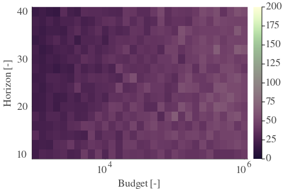 | 
| Std | 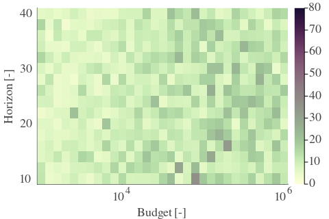 | 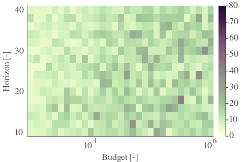 | 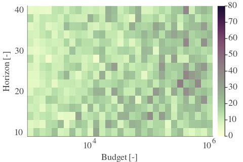 | 

| Cₚ = 8 | γ = 0.85, S = 0.0% | γ = 0.9, S = 23.99% | γ = 0.95, S = 35.89% | 
| --- | --- | --- | --- | 
| Mean | 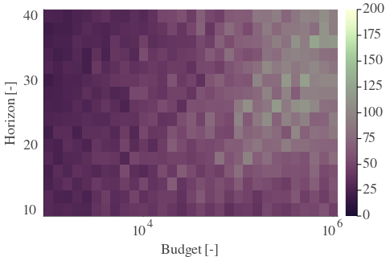 | 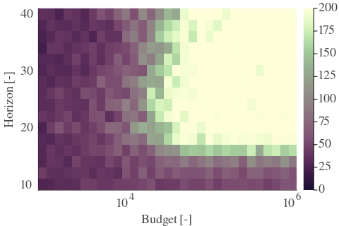 | 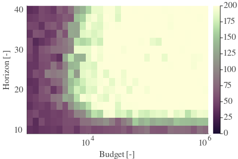 | 
| Std | 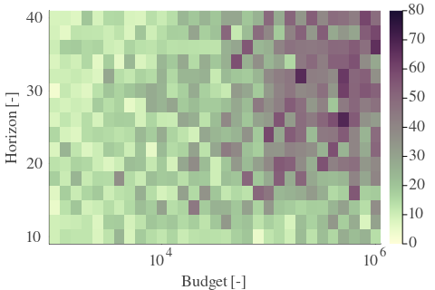 |  | 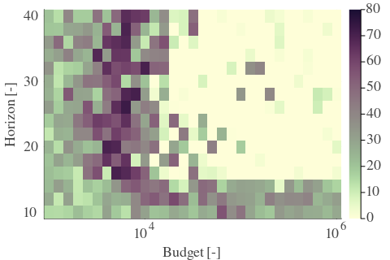 | 

| Cₚ = 8 | γ = 1.0, S = 6.25% | 
| --- | --- | 
| Mean | 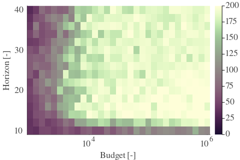 | 
| Std | 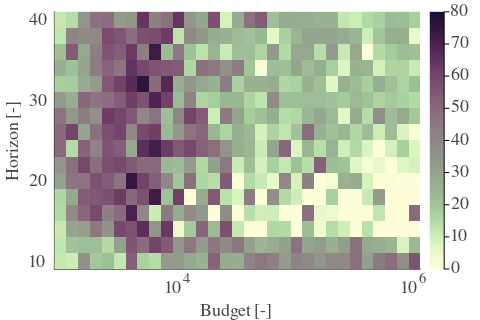 | 

---

**Exploration parameter = 16**

| Cₚ = 16 | γ = 0.7, S = 0.0% | γ = 0.75, S = 0.0% | γ = 0.8, S = 0.0% | 
| --- | --- | --- | --- | 
| Mean | 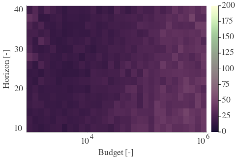 | 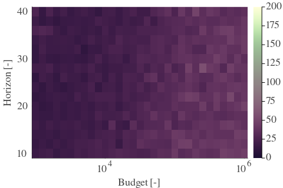 | 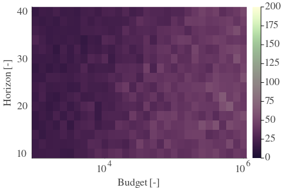 | 
| Std | 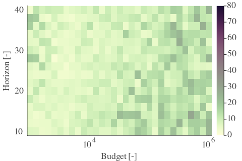 | 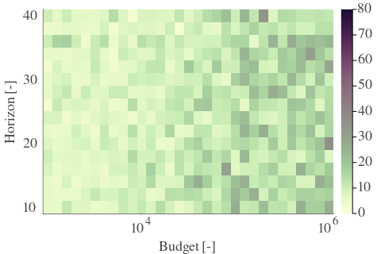 | 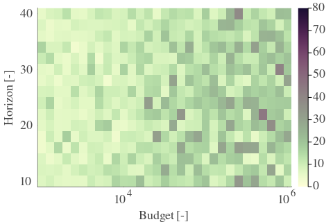 | 

| Cₚ = 16 | γ = 0.85, S = 0.0% | γ = 0.9, S = 13.51% | γ = 0.95, S = 36.69% | 
| --- | --- | --- | --- | 
| Mean | 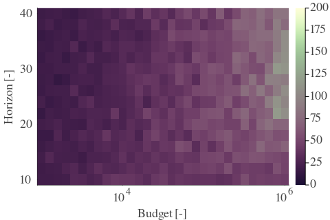 | 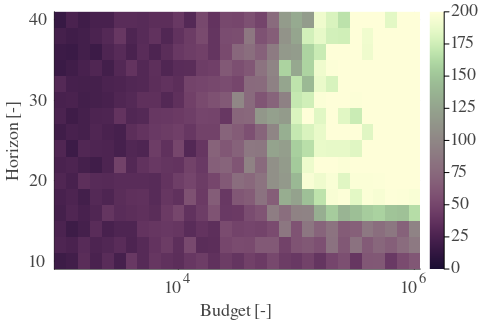 | 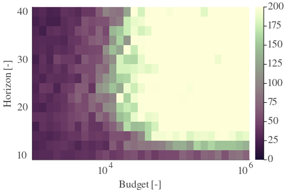 | 
| Std | 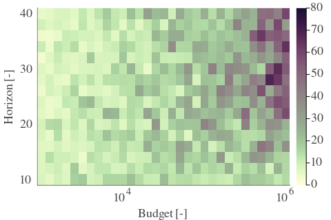 | 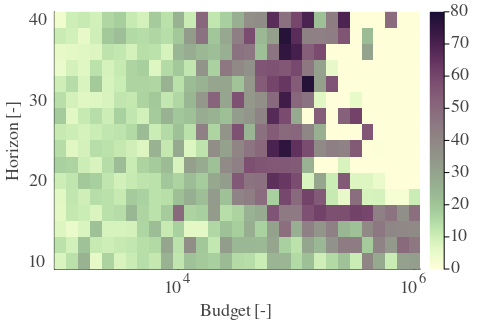 |  | 

| Cₚ = 16 | γ = 1.0, S = 49.8% | 
| --- | --- | 
| Mean |  | 
| Std |  | 

---

**Exploration parameter = 32**

| Cₚ = 32 | γ = 0.7, S = 0.0% | γ = 0.75, S = 0.0% | γ = 0.8, S = 0.0% | 
| --- | --- | --- | --- | 
| Mean |  |  |  | 
| Std |  |  |  | 

| Cₚ = 32 | γ = 0.85, S = 0.0% | γ = 0.9, S = 1.41% | γ = 0.95, S = 21.98% | 
| --- | --- | --- | --- | 
| Mean |  |  |  | 
| Std |  |  |  | 

| Cₚ = 32 | γ = 1.0, S = 44.76% | 
| --- | --- | 
| Mean |  | 
| Std |  | 

---

**Exploration parameter = 64**

| Cₚ = 64 | γ = 0.7, S = 0.0% | γ = 0.75, S = 0.0% | γ = 0.8, S = 0.0% | 
| --- | --- | --- | --- | 
| Mean |  |  |  | 
| Std |  |  |  | 

| Cₚ = 64 | γ = 0.85, S = 0.0% | γ = 0.9, S = 0.0% | γ = 0.95, S = 7.46% | 
| --- | --- | --- | --- | 
| Mean |  |  |  | 
| Std |  |  |  | 

| Cₚ = 64 | γ = 1.0, S = 27.02% | 
| --- | --- | 
| Mean |  | 
| Std |  | 

---

**Exploration parameter = 128**

| Cₚ = 128 | γ = 0.7, S = 0.0% | γ = 0.75, S = 0.0% | γ = 0.8, S = 0.0% | 
| --- | --- | --- | --- | 
| Mean |  |  |  | 
| Std |  |  |  | 

| Cₚ = 128 | γ = 0.85, S = 0.0% | γ = 0.9, S = 0.0% | γ = 0.95, S = 0.0% | 
| --- | --- | --- | --- | 
| Mean |  |  |  | 
| Std |  |  |  | 

| Cₚ = 128 | γ = 1.0, S = 11.29% | 
| --- | --- | 
| Mean |  | 
| Std |  | 

---

**Exploration parameter = 256**

| Cₚ = 256 | γ = 0.7, S = 0.0% | γ = 0.75, S = 0.0% | γ = 0.8, S = 0.0% | 
| --- | --- | --- | --- | 
| Mean |  |  |  | 
| Std |  |  |  | 

| Cₚ = 256 | γ = 0.85, S = 0.0% | γ = 0.9, S = 0.0% | γ = 0.95, S = 0.0% | 
| --- | --- | --- | --- | 
| Mean |  |  |  | 
| Std |  |  |  | 

| Cₚ = 256 | γ = 1.0, S = 0.4% | 
| --- | --- | 
| Mean |  | 
| Std |  | 

