# Results for the file dp_U_20230501 

Generated on 2023-05-02 08:36:51

---

**Exploration parameter = 16**

| Cₚ = 16| γ = 0.9 | γ = 0.95 | γ = 1.0 | 
| --- | --- | --- | --- | 
| Mean | 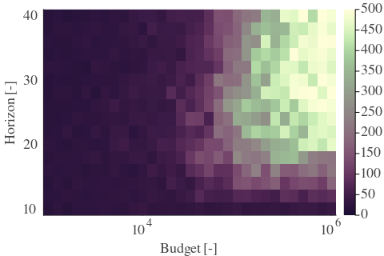 | 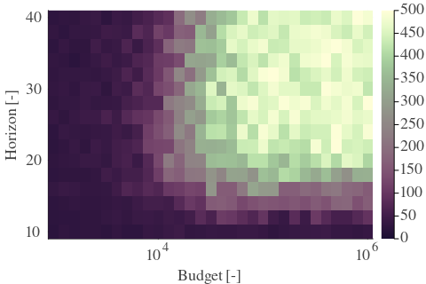 | 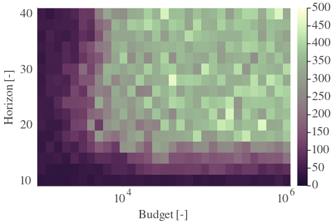 | 
| Std | 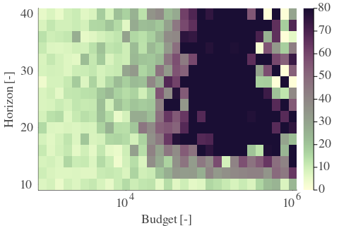 | 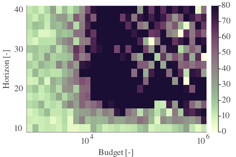 | 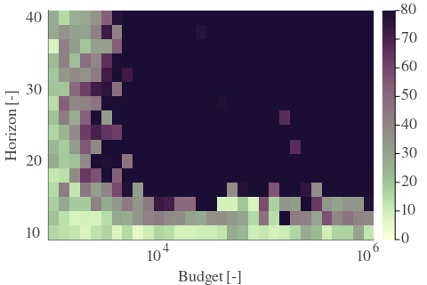 | 

---

**Exploration parameter = 32**

| Cₚ = 32| γ = 0.9 | γ = 0.95 | γ = 1.0 | 
| --- | --- | --- | --- | 
| Mean | 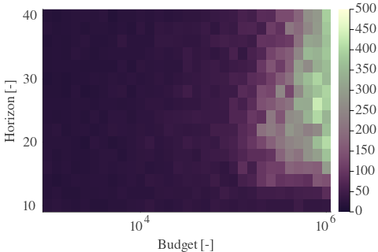 | 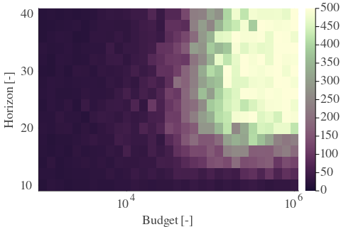 | 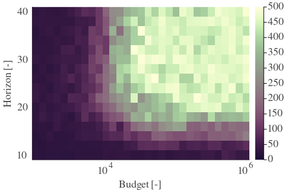 | 
| Std | 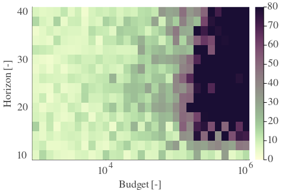 | 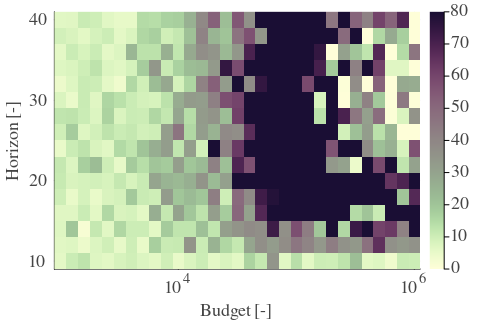 | 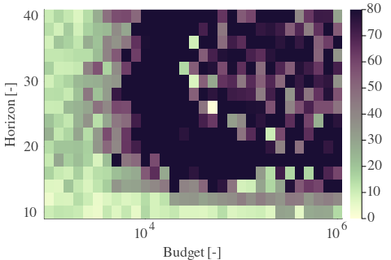 | 

