# Results for the file dp_U_20230501.csv 

Generated on 2023-05-12 09:25:38

---

**Exploration parameter = 16**

| Cₚ = 16 | γ = 0.9 | γ = 0.95 | γ = 1.0 | 
| --- | --- | --- | --- | 
| Mean |  |  |  | 
| Std |  |  |  | 

---

**Exploration parameter = 32**

| Cₚ = 32 | γ = 0.9 | γ = 0.95 | γ = 1.0 | 
| --- | --- | --- | --- | 
| Mean |  |  |  | 
| Std |  |  |  | 

---

**Exploration parameter = 64**

| Cₚ = 64 | γ = 0.9 | γ = 0.95 | γ = 1.0 | 
| --- | --- | --- | --- | 
| Mean | 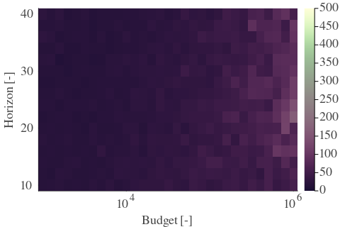 | 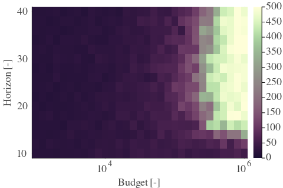 |  | 
| Std | 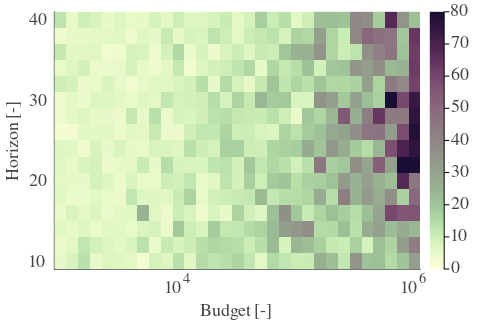 | 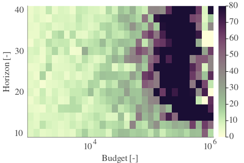 | 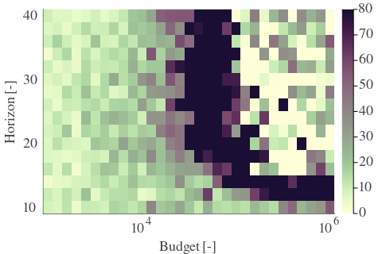 | 

---

**Exploration parameter = 128**

| Cₚ = 128 | γ = 0.9 | γ = 0.95 | γ = 1.0 | 
| --- | --- | --- | --- | 
| Mean | 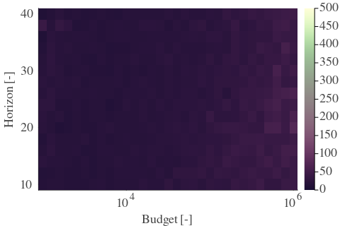 | 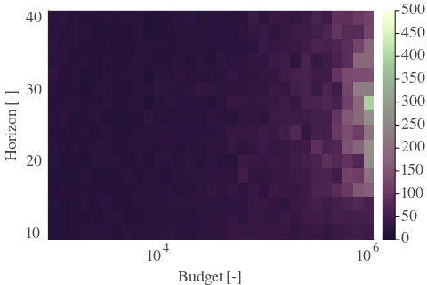 |  | 
| Std | 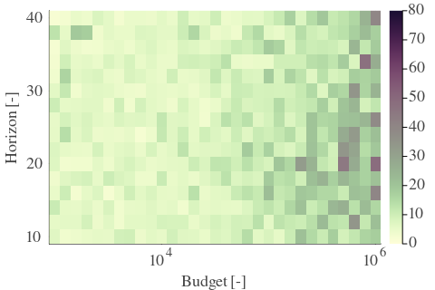 | 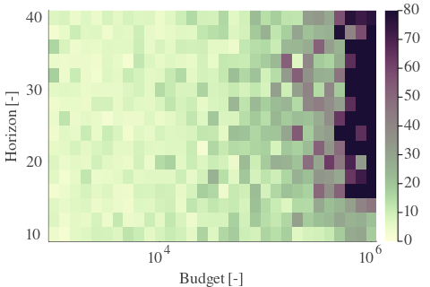 | 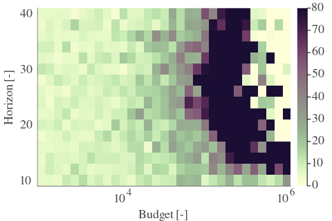 | 

---

**Exploration parameter = 256**

| Cₚ = 256 | γ = 0.9 | γ = 0.95 | γ = 1.0 | 
| --- | --- | --- | --- | 
| Mean | 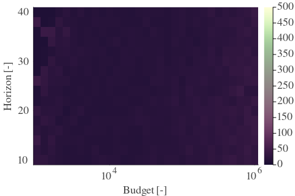 |  | 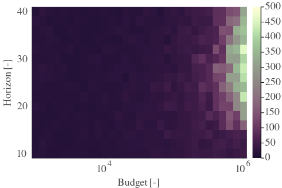 | 
| Std | 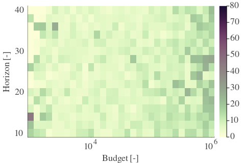 | 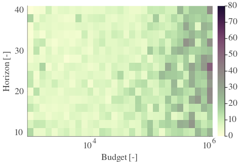 |  | 

