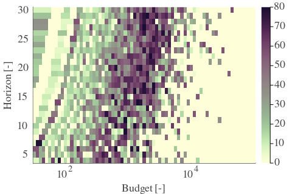
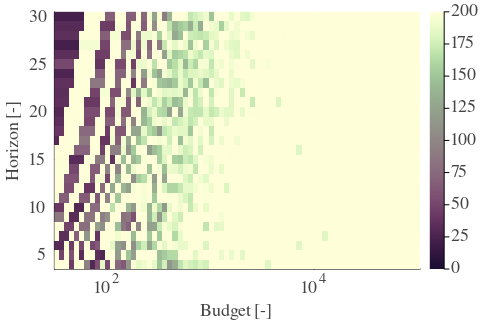
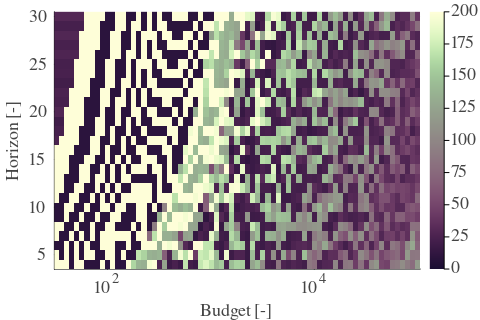
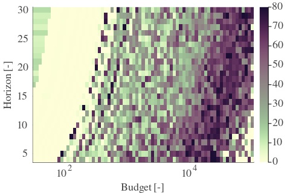
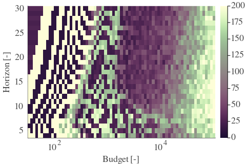
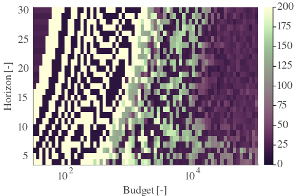
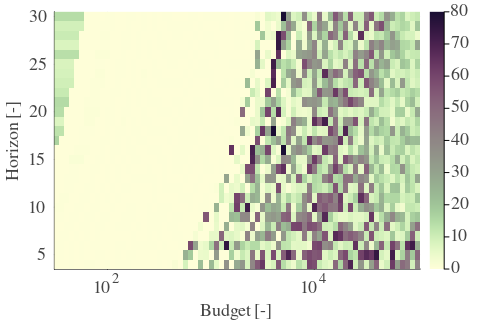
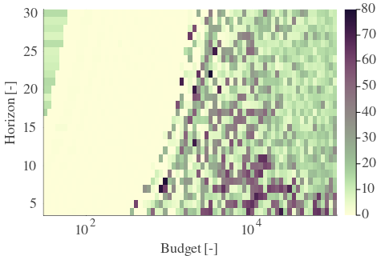

# Results for the file sp_AA_20230324.csv 

Generated on 2023-11-03 14:14:11

---

**Exploration parameter = 0**

| Cₚ = 0 | γ = 0.5, S = 0.0% | γ = 0.55, S = 0.0% | γ = 0.6, S = 0.0% | 
| --- | --- | --- | --- | 
| Mean |  |  |  | 
| Std |  |  |  | 

| Cₚ = 0 | γ = 0.65, S = 0.0% | γ = 0.7, S = 0.0% | γ = 0.75, S = 0.0% | 
| --- | --- | --- | --- | 
| Mean |  |  |  | 
| Std |  |  |  | 

| Cₚ = 0 | γ = 0.8, S = 0.0% | γ = 0.85, S = 0.0% | γ = 0.9, S = 0.0% | 
| --- | --- | --- | --- | 
| Mean |  |  |  | 
| Std |  |  |  | 

| Cₚ = 0 | γ = 0.95, S = 0.0% | γ = 1.0, S = 0.0% | 
| --- | --- | --- | 
| Mean |  |  | 
| Std |  |  | 

---

**Exploration parameter = 2**

| Cₚ = 2 | γ = 0.5, S = 19.35% | γ = 0.55, S = 25.51% | γ = 0.6, S = 32.71% | 
| --- | --- | --- | --- | 
| Mean |  |  |  | 
| Std |  |  |  | 

| Cₚ = 2 | γ = 0.65, S = 42.1% | γ = 0.7, S = 54.51% | γ = 0.75, S = 65.88% | 
| --- | --- | --- | --- | 
| Mean |  |  |  | 
| Std |  |  |  | 

| Cₚ = 2 | γ = 0.8, S = 75.48% | γ = 0.85, S = 78.04% | γ = 0.9, S = 77.99% | 
| --- | --- | --- | --- | 
| Mean |  |  |  | 
| Std |  |  |  | 

| Cₚ = 2 | γ = 0.95, S = 78.93% | γ = 1.0, S = 79.76% | 
| --- | --- | --- | 
| Mean |  |  | 
| Std |  |  | 

---

**Exploration parameter = 4**

| Cₚ = 4 | γ = 0.5, S = 17.27% | γ = 0.55, S = 17.27% | γ = 0.6, S = 20.92% | 
| --- | --- | --- | --- | 
| Mean |  |  |  | 
| Std |  |  |  | 

| Cₚ = 4 | γ = 0.65, S = 26.76% | γ = 0.7, S = 34.43% | γ = 0.75, S = 43.45% | 
| --- | --- | --- | --- | 
| Mean |  |  |  | 
| Std |  |  |  | 

| Cₚ = 4 | γ = 0.8, S = 53.47% | γ = 0.85, S = 65.31% | γ = 0.9, S = 76.11% | 
| --- | --- | --- | --- | 
| Mean |  |  |  | 
| Std |  |  |  | 

| Cₚ = 4 | γ = 0.95, S = 80.28% | γ = 1.0, S = 83.67% | 
| --- | --- | --- | 
| Mean |  |  | 
| Std |  |  | 

---

**Exploration parameter = 8**

| Cₚ = 8 | γ = 0.5, S = 19.35% | γ = 0.55, S = 16.74% | γ = 0.6, S = 16.74% | 
| --- | --- | --- | --- | 
| Mean |  |  |  | 
| Std |  |  |  | 

| Cₚ = 8 | γ = 0.65, S = 17.06% | γ = 0.7, S = 21.7% | γ = 0.75, S = 27.07% | 
| --- | --- | --- | --- | 
| Mean |  |  |  | 
| Std |  |  |  | 

| Cₚ = 8 | γ = 0.8, S = 35.42% | γ = 0.85, S = 45.23% | γ = 0.9, S = 54.83% | 
| --- | --- | --- | --- | 
| Mean |  |  |  | 
| Std |  |  |  | 

| Cₚ = 8 | γ = 0.95, S = 66.15% | γ = 1.0, S = 76.32% | 
| --- | --- | --- | 
| Mean |  |  | 
| Std |  |  | 

---

**Exploration parameter = 16**

| Cₚ = 16 | γ = 0.5, S = 20.92% | γ = 0.55, S = 20.97% | γ = 0.6, S = 18.94% | 
| --- | --- | --- | --- | 
| Mean |  |  |  | 
| Std |  |  |  | 

| Cₚ = 16 | γ = 0.65, S = 16.28% | γ = 0.7, S = 15.18% | γ = 0.75, S = 16.17% | 
| --- | --- | --- | --- | 
| Mean |  |  |  | 
| Std |  |  |  | 

| Cₚ = 16 | γ = 0.8, S = 20.76% | γ = 0.85, S = 29.32% | γ = 0.9, S = 37.98% | 
| --- | --- | --- | --- | 
| Mean |  |  |  | 
| Std |  |  |  | 

| Cₚ = 16 | γ = 0.95, S = 45.59% | γ = 1.0, S = 55.56% | 
| --- | --- | --- | 
| Mean |  |  | 
| Std |  |  | 

---

**Exploration parameter = 32**

| Cₚ = 32 | γ = 0.5, S = 23.89% | γ = 0.55, S = 21.7% | γ = 0.6, S = 20.34% | 
| --- | --- | --- | --- | 
| Mean |  |  |  | 
| Std |  |  |  | 

| Cₚ = 32 | γ = 0.65, S = 19.98% | γ = 0.7, S = 18.78% | γ = 0.75, S = 16.28% | 
| --- | --- | --- | --- | 
| Mean |  |  |  | 
| Std |  |  |  | 

| Cₚ = 32 | γ = 0.8, S = 15.86% | γ = 0.85, S = 17.01% | γ = 0.9, S = 24.2% | 
| --- | --- | --- | --- | 
| Mean |  |  |  | 
| Std |  |  |  | 

| Cₚ = 32 | γ = 0.95, S = 33.02% | γ = 1.0, S = 40.69% | 
| --- | --- | --- | 
| Mean |  |  | 
| Std |  |  | 

---

**Exploration parameter = 64**

| Cₚ = 64 | γ = 0.5, S = 27.39% | γ = 0.55, S = 26.24% | γ = 0.6, S = 23.89% | 
| --- | --- | --- | --- | 
| Mean |  |  |  | 
| Std |  |  |  | 

| Cₚ = 64 | γ = 0.65, S = 21.49% | γ = 0.7, S = 20.29% | γ = 0.75, S = 19.56% | 
| --- | --- | --- | --- | 
| Mean |  |  |  | 
| Std |  |  |  | 

| Cₚ = 64 | γ = 0.8, S = 18.31% | γ = 0.85, S = 16.43% | γ = 0.9, S = 15.44% | 
| --- | --- | --- | --- | 
| Mean |  |  |  | 
| Std |  |  |  | 

| Cₚ = 64 | γ = 0.95, S = 20.81% | γ = 1.0, S = 27.8% | 
| --- | --- | --- | 
| Mean |  |  | 
| Std |  |  | 

---

**Exploration parameter = 128**

| Cₚ = 128 | γ = 0.5, S = 30.31% | γ = 0.55, S = 28.95% | γ = 0.6, S = 27.39% | 
| --- | --- | --- | --- | 
| Mean |  |  |  | 
| Std |  |  |  | 

| Cₚ = 128 | γ = 0.65, S = 26.08% | γ = 0.7, S = 24.2% | γ = 0.75, S = 21.8% | 
| --- | --- | --- | --- | 
| Mean |  |  |  | 
| Std |  |  |  | 

| Cₚ = 128 | γ = 0.8, S = 20.45% | γ = 0.85, S = 18.99% | γ = 0.9, S = 17.42% | 
| --- | --- | --- | --- | 
| Mean |  |  |  | 
| Std |  |  |  | 

| Cₚ = 128 | γ = 0.95, S = 15.86% | γ = 1.0, S = 18.26% | 
| --- | --- | --- | 
| Mean |  |  | 
| Std |  |  | 

---

**Exploration parameter = 256**

| Cₚ = 256 | γ = 0.5, S = 32.55% | γ = 0.55, S = 31.4% | γ = 0.6, S = 30.41% | 
| --- | --- | --- | --- | 
| Mean |  |  |  | 
| Std |  |  |  | 

| Cₚ = 256 | γ = 0.65, S = 28.79% | γ = 0.7, S = 27.65% | γ = 0.75, S = 26.13% | 
| --- | --- | --- | --- | 
| Mean |  |  |  | 
| Std |  |  |  | 

| Cₚ = 256 | γ = 0.8, S = 24.36% | γ = 0.85, S = 22.54% | γ = 0.9, S = 20.45% | 
| --- | --- | --- | --- | 
| Mean |  |  |  | 
| Std |  |  |  | 

| Cₚ = 256 | γ = 0.95, S = 18.47% | γ = 1.0, S = 17.06% | 
| --- | --- | --- | 
| Mean |  |  | 
| Std |  |  | 

---

**Exploration parameter = 512**

| Cₚ = 512 | γ = 0.5, S = 35.52% | γ = 0.55, S = 34.22% | γ = 0.6, S = 32.6% | 
| --- | --- | --- | --- | 
| Mean |  |  |  | 
| Std |  |  |  | 

| Cₚ = 512 | γ = 0.65, S = 31.19% | γ = 0.7, S = 30.52% | γ = 0.75, S = 29.47% | 
| --- | --- | --- | --- | 
| Mean |  |  |  | 
| Std |  |  |  | 

| Cₚ = 512 | γ = 0.8, S = 27.07% | γ = 0.85, S = 26.29% | γ = 0.9, S = 24.41% | 
| --- | --- | --- | --- | 
| Mean |  |  |  | 
| Std |  |  |  | 

| Cₚ = 512 | γ = 0.95, S = 21.8% | γ = 1.0, S = 19.93% | 
| --- | --- | --- | 
| Mean |  |  | 
| Std |  |  | 

---

**Exploration parameter = 1024**

| Cₚ = 1024 | γ = 0.5, S = 38.76% | γ = 0.55, S = 37.04% | γ = 0.6, S = 35.58% | 
| --- | --- | --- | --- | 
| Mean |  |  |  | 
| Std |  |  |  | 

| Cₚ = 1024 | γ = 0.65, S = 33.96% | γ = 0.7, S = 33.28% | γ = 0.75, S = 32.19% | 
| --- | --- | --- | --- | 
| Mean |  |  |  | 
| Std |  |  |  | 

| Cₚ = 1024 | γ = 0.8, S = 30.26% | γ = 0.85, S = 29.21% | γ = 0.9, S = 27.28% | 
| --- | --- | --- | --- | 
| Mean |  |  |  | 
| Std |  |  |  | 

| Cₚ = 1024 | γ = 0.95, S = 25.25% | γ = 1.0, S = 23.42% | 
| --- | --- | --- | 
| Mean |  |  | 
| Std |  |  | 

