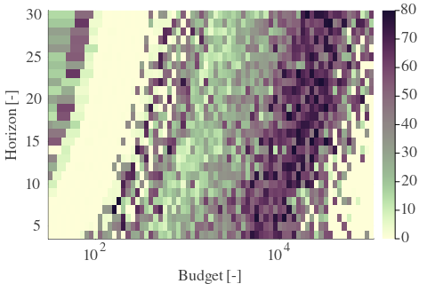
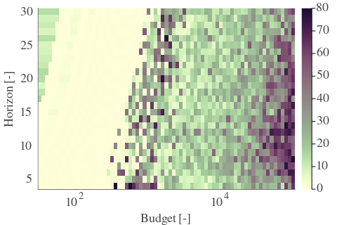
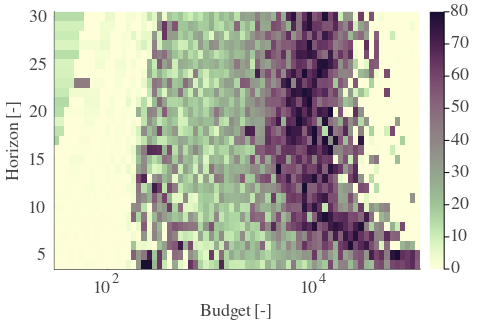
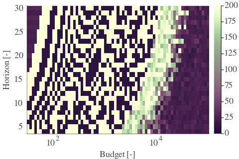

# Results for the file csv/sp_AB_20230324.csv 

Generated on 2023-03-26 00:07:20

---

**Exploration parameter = 0**

| $C_p=0$| $\gamma = 0.5$| $\gamma = 0.55$| $\gamma = 0.6$| 
| --- | --- | --- | --- | 
| Mean |  |  |  | 
| Std |  |  |  | 

| $C_p=0$| $\gamma = 0.65$| $\gamma = 0.7$| $\gamma = 0.75$| 
| --- | --- | --- | --- | 
| Mean |  |  |  | 
| Std |  |  |  | 

| $C_p=0$| $\gamma = 0.8$| $\gamma = 0.85$| $\gamma = 0.9$| 
| --- | --- | --- | --- | 
| Mean |  |  |  | 
| Std |  |  |  | 

| $C_p=0$| $\gamma = 0.95$| $\gamma = 1.0$| 
| --- | --- | --- | 
| Mean |  |  | 
| Std |  |  | 

---

**Exploration parameter = 2**

| $C_p=2$| $\gamma = 0.5$| $\gamma = 0.55$| $\gamma = 0.6$| 
| --- | --- | --- | --- | 
| Mean |  |  |  | 
| Std |  |  |  | 

| $C_p=2$| $\gamma = 0.65$| $\gamma = 0.7$| $\gamma = 0.75$| 
| --- | --- | --- | --- | 
| Mean |  |  |  | 
| Std |  |  |  | 

| $C_p=2$| $\gamma = 0.8$| $\gamma = 0.85$| $\gamma = 0.9$| 
| --- | --- | --- | --- | 
| Mean |  |  |  | 
| Std |  |  |  | 

| $C_p=2$| $\gamma = 0.95$| $\gamma = 1.0$| 
| --- | --- | --- | 
| Mean |  |  | 
| Std |  |  | 

---

**Exploration parameter = 4**

| $C_p=4$| $\gamma = 0.5$| $\gamma = 0.55$| $\gamma = 0.6$| 
| --- | --- | --- | --- | 
| Mean |  |  |  | 
| Std |  |  |  | 

| $C_p=4$| $\gamma = 0.65$| $\gamma = 0.7$| $\gamma = 0.75$| 
| --- | --- | --- | --- | 
| Mean |  |  |  | 
| Std |  |  |  | 

| $C_p=4$| $\gamma = 0.8$| $\gamma = 0.85$| $\gamma = 0.9$| 
| --- | --- | --- | --- | 
| Mean |  |  |  | 
| Std |  |  |  | 

| $C_p=4$| $\gamma = 0.95$| $\gamma = 1.0$| 
| --- | --- | --- | 
| Mean |  |  | 
| Std |  |  | 

---

**Exploration parameter = 8**

| $C_p=8$| $\gamma = 0.5$| $\gamma = 0.55$| $\gamma = 0.6$| 
| --- | --- | --- | --- | 
| Mean |  |  |  | 
| Std |  |  |  | 

| $C_p=8$| $\gamma = 0.65$| $\gamma = 0.7$| $\gamma = 0.75$| 
| --- | --- | --- | --- | 
| Mean |  |  |  | 
| Std |  |  |  | 

| $C_p=8$| $\gamma = 0.8$| $\gamma = 0.85$| $\gamma = 0.9$| 
| --- | --- | --- | --- | 
| Mean |  |  |  | 
| Std |  |  |  | 

| $C_p=8$| $\gamma = 0.95$| $\gamma = 1.0$| 
| --- | --- | --- | 
| Mean |  |  | 
| Std |  |  | 

---

**Exploration parameter = 16**

| $C_p=16$| $\gamma = 0.5$| $\gamma = 0.55$| $\gamma = 0.6$| 
| --- | --- | --- | --- | 
| Mean |  |  |  | 
| Std |  |  |  | 

| $C_p=16$| $\gamma = 0.65$| $\gamma = 0.7$| $\gamma = 0.75$| 
| --- | --- | --- | --- | 
| Mean |  |  |  | 
| Std |  |  |  | 

| $C_p=16$| $\gamma = 0.8$| $\gamma = 0.85$| $\gamma = 0.9$| 
| --- | --- | --- | --- | 
| Mean |  |  |  | 
| Std |  |  |  | 

| $C_p=16$| $\gamma = 0.95$| $\gamma = 1.0$| 
| --- | --- | --- | 
| Mean |  |  | 
| Std |  |  | 

---

**Exploration parameter = 32**

| $C_p=32$| $\gamma = 0.5$| $\gamma = 0.55$| $\gamma = 0.6$| 
| --- | --- | --- | --- | 
| Mean |  |  |  | 
| Std |  |  |  | 

| $C_p=32$| $\gamma = 0.65$| $\gamma = 0.7$| $\gamma = 0.75$| 
| --- | --- | --- | --- | 
| Mean |  |  |  | 
| Std |  |  |  | 

| $C_p=32$| $\gamma = 0.8$| $\gamma = 0.85$| $\gamma = 0.9$| 
| --- | --- | --- | --- | 
| Mean |  |  |  | 
| Std |  |  |  | 

| $C_p=32$| $\gamma = 0.95$| $\gamma = 1.0$| 
| --- | --- | --- | 
| Mean |  |  | 
| Std |  |  | 

---

**Exploration parameter = 64**

| $C_p=64$| $\gamma = 0.5$| $\gamma = 0.55$| $\gamma = 0.6$| 
| --- | --- | --- | --- | 
| Mean |  |  |  | 
| Std |  |  |  | 

| $C_p=64$| $\gamma = 0.65$| $\gamma = 0.7$| $\gamma = 0.75$| 
| --- | --- | --- | --- | 
| Mean |  |  |  | 
| Std |  |  |  | 

| $C_p=64$| $\gamma = 0.8$| $\gamma = 0.85$| $\gamma = 0.9$| 
| --- | --- | --- | --- | 
| Mean |  |  |  | 
| Std |  |  |  | 

| $C_p=64$| $\gamma = 0.95$| $\gamma = 1.0$| 
| --- | --- | --- | 
| Mean |  |  | 
| Std |  |  | 

---

**Exploration parameter = 128**

| $C_p=128$| $\gamma = 0.5$| $\gamma = 0.55$| $\gamma = 0.6$| 
| --- | --- | --- | --- | 
| Mean |  |  |  | 
| Std |  |  |  | 

| $C_p=128$| $\gamma = 0.65$| $\gamma = 0.7$| $\gamma = 0.75$| 
| --- | --- | --- | --- | 
| Mean |  |  |  | 
| Std |  |  |  | 

| $C_p=128$| $\gamma = 0.8$| $\gamma = 0.85$| $\gamma = 0.9$| 
| --- | --- | --- | --- | 
| Mean |  |  |  | 
| Std |  |  |  | 

| $C_p=128$| $\gamma = 0.95$| $\gamma = 1.0$| 
| --- | --- | --- | 
| Mean |  |  | 
| Std |  |  | 

---

**Exploration parameter = 256**

| $C_p=256$| $\gamma = 0.5$| $\gamma = 0.55$| $\gamma = 0.6$| 
| --- | --- | --- | --- | 
| Mean |  |  |  | 
| Std |  |  |  | 

| $C_p=256$| $\gamma = 0.65$| $\gamma = 0.7$| $\gamma = 0.75$| 
| --- | --- | --- | --- | 
| Mean |  |  |  | 
| Std |  |  |  | 

| $C_p=256$| $\gamma = 0.8$| $\gamma = 0.85$| $\gamma = 0.9$| 
| --- | --- | --- | --- | 
| Mean |  |  |  | 
| Std |  |  |  | 

| $C_p=256$| $\gamma = 0.95$| $\gamma = 1.0$| 
| --- | --- | --- | 
| Mean |  |  | 
| Std |  |  | 

---

**Exploration parameter = 512**

| $C_p=512$| $\gamma = 0.5$| $\gamma = 0.55$| $\gamma = 0.6$| 
| --- | --- | --- | --- | 
| Mean |  |  |  | 
| Std |  |  |  | 

| $C_p=512$| $\gamma = 0.65$| $\gamma = 0.7$| $\gamma = 0.75$| 
| --- | --- | --- | --- | 
| Mean |  |  |  | 
| Std |  |  |  | 

| $C_p=512$| $\gamma = 0.8$| $\gamma = 0.85$| $\gamma = 0.9$| 
| --- | --- | --- | --- | 
| Mean |  |  |  | 
| Std |  |  |  | 

| $C_p=512$| $\gamma = 0.95$| $\gamma = 1.0$| 
| --- | --- | --- | 
| Mean |  |  | 
| Std |  |  | 

---

**Exploration parameter = 1024**

| $C_p=1024$| $\gamma = 0.5$| $\gamma = 0.55$| $\gamma = 0.6$| 
| --- | --- | --- | --- | 
| Mean |  |  |  | 
| Std |  |  |  | 

| $C_p=1024$| $\gamma = 0.65$| $\gamma = 0.7$| $\gamma = 0.75$| 
| --- | --- | --- | --- | 
| Mean |  |  |  | 
| Std |  |  |  | 

| $C_p=1024$| $\gamma = 0.8$| $\gamma = 0.85$| $\gamma = 0.9$| 
| --- | --- | --- | --- | 
| Mean |  |  |  | 
| Std |  |  |  | 

| $C_p=1024$| $\gamma = 0.95$| $\gamma = 1.0$| 
| --- | --- | --- | 
| Mean |  |  | 
| Std |  |  | 

