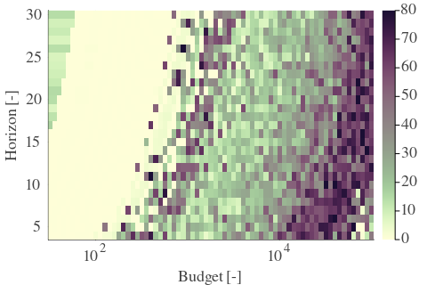
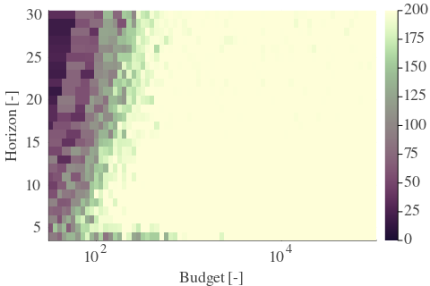
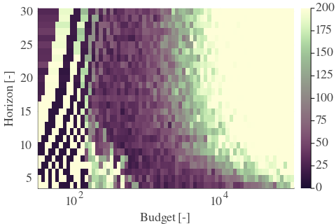
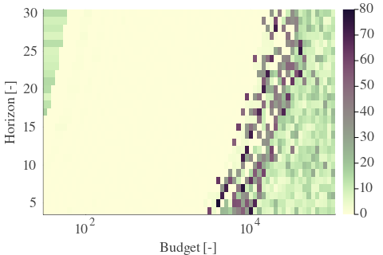

# Results for the file sp_AB_20230324.csv 

Generated on 2023-11-03 14:14:12

---

**Exploration parameter = 0**

| Cₚ = 0 | γ = 0.5, S = 0.0% | γ = 0.55, S = 0.0% | γ = 0.6, S = 0.0% | 
| --- | --- | --- | --- | 
| Mean |  |  |  | 
| Std |  |  |  | 

| Cₚ = 0 | γ = 0.65, S = 0.0% | γ = 0.7, S = 0.0% | γ = 0.75, S = 0.0% | 
| --- | --- | --- | --- | 
| Mean |  |  |  | 
| Std |  |  |  | 

| Cₚ = 0 | γ = 0.8, S = 0.0% | γ = 0.85, S = 0.0% | γ = 0.9, S = 0.0% | 
| --- | --- | --- | --- | 
| Mean |  |  |  | 
| Std |  |  |  | 

| Cₚ = 0 | γ = 0.95, S = 0.0% | γ = 1.0, S = 0.0% | 
| --- | --- | --- | 
| Mean |  |  | 
| Std |  |  | 

---

**Exploration parameter = 2**

| Cₚ = 2 | γ = 0.5, S = 16.12% | γ = 0.55, S = 19.46% | γ = 0.6, S = 24.99% | 
| --- | --- | --- | --- | 
| Mean |  |  |  | 
| Std |  |  |  | 

| Cₚ = 2 | γ = 0.65, S = 31.35% | γ = 0.7, S = 41.84% | γ = 0.75, S = 52.32% | 
| --- | --- | --- | --- | 
| Mean |  |  |  | 
| Std |  |  |  | 

| Cₚ = 2 | γ = 0.8, S = 66.56% | γ = 0.85, S = 69.54% | γ = 0.9, S = 69.17% | 
| --- | --- | --- | --- | 
| Mean |  |  |  | 
| Std |  |  |  | 

| Cₚ = 2 | γ = 0.95, S = 63.48% | γ = 1.0, S = 48.67% | 
| --- | --- | --- | 
| Mean |  |  | 
| Std |  |  | 

---

**Exploration parameter = 4**

| Cₚ = 4 | γ = 0.5, S = 18.94% | γ = 0.55, S = 17.01% | γ = 0.6, S = 16.8% | 
| --- | --- | --- | --- | 
| Mean |  |  |  | 
| Std |  |  |  | 

| Cₚ = 4 | γ = 0.65, S = 23.21% | γ = 0.7, S = 29.84% | γ = 0.75, S = 35.47% | 
| --- | --- | --- | --- | 
| Mean |  |  |  | 
| Std |  |  |  | 

| Cₚ = 4 | γ = 0.8, S = 44.5% | γ = 0.85, S = 56.81% | γ = 0.9, S = 68.08% | 
| --- | --- | --- | --- | 
| Mean |  |  |  | 
| Std |  |  |  | 

| Cₚ = 4 | γ = 0.95, S = 69.8% | γ = 1.0, S = 64.42% | 
| --- | --- | --- | 
| Mean |  |  | 
| Std |  |  | 

---

**Exploration parameter = 8**

| Cₚ = 8 | γ = 0.5, S = 20.19% | γ = 0.55, S = 18.57% | γ = 0.6, S = 18.15% | 
| --- | --- | --- | --- | 
| Mean |  |  |  | 
| Std |  |  |  | 

| Cₚ = 8 | γ = 0.65, S = 18.36% | γ = 0.7, S = 21.75% | γ = 0.75, S = 25.46% | 
| --- | --- | --- | --- | 
| Mean |  |  |  | 
| Std |  |  |  | 

| Cₚ = 8 | γ = 0.8, S = 31.35% | γ = 0.85, S = 39.44% | γ = 0.9, S = 49.92% | 
| --- | --- | --- | --- | 
| Mean |  |  |  | 
| Std |  |  |  | 

| Cₚ = 8 | γ = 0.95, S = 63.12% | γ = 1.0, S = 67.4% | 
| --- | --- | --- | 
| Mean |  |  | 
| Std |  |  | 

---

**Exploration parameter = 16**

| Cₚ = 16 | γ = 0.5, S = 23.94% | γ = 0.55, S = 22.43% | γ = 0.6, S = 19.77% | 
| --- | --- | --- | --- | 
| Mean |  |  |  | 
| Std |  |  |  | 

| Cₚ = 16 | γ = 0.65, S = 18.31% | γ = 0.7, S = 17.21% | γ = 0.75, S = 17.74% | 
| --- | --- | --- | --- | 
| Mean |  |  |  | 
| Std |  |  |  | 

| Cₚ = 16 | γ = 0.8, S = 23.42% | γ = 0.85, S = 28.9% | γ = 0.9, S = 33.96% | 
| --- | --- | --- | --- | 
| Mean |  |  |  | 
| Std |  |  |  | 

| Cₚ = 16 | γ = 0.95, S = 45.23% | γ = 1.0, S = 55.14% | 
| --- | --- | --- | 
| Mean |  |  | 
| Std |  |  | 

---

**Exploration parameter = 32**

| Cₚ = 32 | γ = 0.5, S = 26.81% | γ = 0.55, S = 25.09% | γ = 0.6, S = 23.89% | 
| --- | --- | --- | --- | 
| Mean |  |  |  | 
| Std |  |  |  | 

| Cₚ = 32 | γ = 0.65, S = 21.96% | γ = 0.7, S = 20.08% | γ = 0.75, S = 18.36% | 
| --- | --- | --- | --- | 
| Mean |  |  |  | 
| Std |  |  |  | 

| Cₚ = 32 | γ = 0.8, S = 16.33% | γ = 0.85, S = 18.88% | γ = 0.9, S = 25.82% | 
| --- | --- | --- | --- | 
| Mean |  |  |  | 
| Std |  |  |  | 

| Cₚ = 32 | γ = 0.95, S = 31.61% | γ = 1.0, S = 40.22% | 
| --- | --- | --- | 
| Mean |  |  | 
| Std |  |  | 

---

**Exploration parameter = 64**

| Cₚ = 64 | γ = 0.5, S = 29.47% | γ = 0.55, S = 28.22% | γ = 0.6, S = 26.81% | 
| --- | --- | --- | --- | 
| Mean |  |  |  | 
| Std |  |  |  | 

| Cₚ = 64 | γ = 0.65, S = 25.2% | γ = 0.7, S = 23.63% | γ = 0.75, S = 21.34% | 
| --- | --- | --- | --- | 
| Mean |  |  |  | 
| Std |  |  |  | 

| Cₚ = 64 | γ = 0.8, S = 19.35% | γ = 0.85, S = 16.74% | γ = 0.9, S = 15.91% | 
| --- | --- | --- | --- | 
| Mean |  |  |  | 
| Std |  |  |  | 

| Cₚ = 64 | γ = 0.95, S = 21.07% | γ = 1.0, S = 27.75% | 
| --- | --- | --- | 
| Mean |  |  | 
| Std |  |  | 

---

**Exploration parameter = 128**

| Cₚ = 128 | γ = 0.5, S = 32.08% | γ = 0.55, S = 30.62% | γ = 0.6, S = 29.32% | 
| --- | --- | --- | --- | 
| Mean |  |  |  | 
| Std |  |  |  | 

| Cₚ = 128 | γ = 0.65, S = 28.53% | γ = 0.7, S = 26.5% | γ = 0.75, S = 24.62% | 
| --- | --- | --- | --- | 
| Mean |  |  |  | 
| Std |  |  |  | 

| Cₚ = 128 | γ = 0.8, S = 23.0% | γ = 0.85, S = 19.82% | γ = 0.9, S = 17.74% | 
| --- | --- | --- | --- | 
| Mean |  |  |  | 
| Std |  |  |  | 

| Cₚ = 128 | γ = 0.95, S = 15.44% | γ = 1.0, S = 19.09% | 
| --- | --- | --- | 
| Mean |  |  | 
| Std |  |  | 

---

**Exploration parameter = 256**

| Cₚ = 256 | γ = 0.5, S = 34.69% | γ = 0.55, S = 33.39% | γ = 0.6, S = 32.13% | 
| --- | --- | --- | --- | 
| Mean |  |  |  | 
| Std |  |  |  | 

| Cₚ = 256 | γ = 0.65, S = 30.83% | γ = 0.7, S = 29.42% | γ = 0.75, S = 28.01% | 
| --- | --- | --- | --- | 
| Mean |  |  |  | 
| Std |  |  |  | 

| Cₚ = 256 | γ = 0.8, S = 26.03% | γ = 0.85, S = 23.79% | γ = 0.9, S = 20.87% | 
| --- | --- | --- | --- | 
| Mean |  |  |  | 
| Std |  |  |  | 

| Cₚ = 256 | γ = 0.95, S = 17.68% | γ = 1.0, S = 15.18% | 
| --- | --- | --- | 
| Mean |  |  | 
| Std |  |  | 

---

**Exploration parameter = 512**

| Cₚ = 512 | γ = 0.5, S = 37.87% | γ = 0.55, S = 37.09% | γ = 0.6, S = 35.16% | 
| --- | --- | --- | --- | 
| Mean |  |  |  | 
| Std |  |  |  | 

| Cₚ = 512 | γ = 0.65, S = 33.49% | γ = 0.7, S = 32.55% | γ = 0.75, S = 30.46% | 
| --- | --- | --- | --- | 
| Mean |  |  |  | 
| Std |  |  |  | 

| Cₚ = 512 | γ = 0.8, S = 29.26% | γ = 0.85, S = 27.13% | γ = 0.9, S = 24.36% | 
| --- | --- | --- | --- | 
| Mean |  |  |  | 
| Std |  |  |  | 

| Cₚ = 512 | γ = 0.95, S = 20.66% | γ = 1.0, S = 18.47% | 
| --- | --- | --- | 
| Mean |  |  | 
| Std |  |  | 

---

**Exploration parameter = 1024**

| Cₚ = 1024 | γ = 0.5, S = 40.79% | γ = 0.55, S = 39.33% | γ = 0.6, S = 38.24% | 
| --- | --- | --- | --- | 
| Mean |  |  |  | 
| Std |  |  |  | 

| Cₚ = 1024 | γ = 0.65, S = 36.98% | γ = 0.7, S = 36.1% | γ = 0.75, S = 33.75% | 
| --- | --- | --- | --- | 
| Mean |  |  |  | 
| Std |  |  |  | 

| Cₚ = 1024 | γ = 0.8, S = 31.87% | γ = 0.85, S = 29.63% | γ = 0.9, S = 27.96% | 
| --- | --- | --- | --- | 
| Mean |  |  |  | 
| Std |  |  |  | 

| Cₚ = 1024 | γ = 0.95, S = 24.67% | γ = 1.0, S = 21.96% | 
| --- | --- | --- | 
| Mean |  |  | 
| Std |  |  | 

