# Results for the file sp_AC_20230326.csv 

Generated on 2023-11-03 14:14:13

---

**Exploration parameter = 0**

| Cₚ = 0 | γ = 0.5, S = 0.0% | γ = 0.55, S = 0.0% | γ = 0.6, S = 0.0% | 
| --- | --- | --- | --- | 
| Mean |  |  |  | 
| Std |  |  |  | 

| Cₚ = 0 | γ = 0.65, S = 0.0% | γ = 0.7, S = 0.0% | γ = 0.75, S = 0.0% | 
| --- | --- | --- | --- | 
| Mean |  |  |  | 
| Std |  |  |  | 

| Cₚ = 0 | γ = 0.8, S = 0.0% | γ = 0.85, S = 0.0% | γ = 0.9, S = 0.0% | 
| --- | --- | --- | --- | 
| Mean |  |  |  | 
| Std |  |  |  | 

| Cₚ = 0 | γ = 0.95, S = 0.0% | γ = 1.0, S = 0.0% | 
| --- | --- | --- | 
| Mean |  |  | 
| Std |  |  | 

---

**Exploration parameter = 2**

| Cₚ = 2 | γ = 0.5, S = 28.85% | γ = 0.55, S = 35.84% | γ = 0.6, S = 43.45% | 
| --- | --- | --- | --- | 
| Mean |  |  |  | 
| Std |  |  | 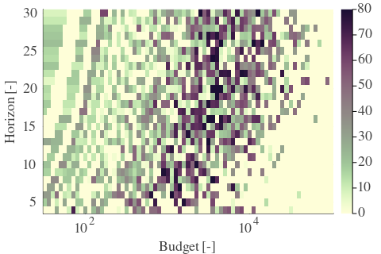 | 

| Cₚ = 2 | γ = 0.65, S = 51.8% | γ = 0.7, S = 59.52% | γ = 0.75, S = 67.66% | 
| --- | --- | --- | --- | 
| Mean |  |  |  | 
| Std |  |  |  | 

| Cₚ = 2 | γ = 0.8, S = 77.41% | γ = 0.85, S = 80.59% | γ = 0.9, S = 80.33% | 
| --- | --- | --- | --- | 
| Mean |  | 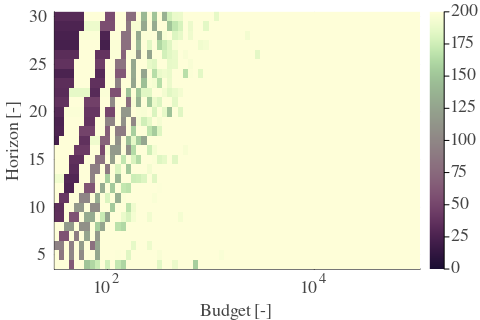 |  | 
| Std |  |  |  | 

| Cₚ = 2 | γ = 0.95, S = 81.79% | γ = 1.0, S = 83.2% | 
| --- | --- | --- | 
| Mean |  |  | 
| Std |  |  | 

---

**Exploration parameter = 4**

| Cₚ = 4 | γ = 0.5, S = 20.24% | γ = 0.55, S = 20.87% | γ = 0.6, S = 25.82% | 
| --- | --- | --- | --- | 
| Mean |  |  |  | 
| Std |  |  |  | 

| Cₚ = 4 | γ = 0.65, S = 31.98% | γ = 0.7, S = 39.33% | γ = 0.75, S = 48.62% | 
| --- | --- | --- | --- | 
| Mean |  |  |  | 
| Std |  |  |  | 

| Cₚ = 4 | γ = 0.8, S = 57.85% | γ = 0.85, S = 65.94% | γ = 0.9, S = 75.17% | 
| --- | --- | --- | --- | 
| Mean |  |  |  | 
| Std |  |  |  | 

| Cₚ = 4 | γ = 0.95, S = 79.6% | γ = 1.0, S = 83.99% | 
| --- | --- | --- | 
| Mean |  |  | 
| Std |  |  | 

---

**Exploration parameter = 8**

| Cₚ = 8 | γ = 0.5, S = 19.87% | γ = 0.55, S = 18.94% | γ = 0.6, S = 17.79% | 
| --- | --- | --- | --- | 
| Mean |  |  |  | 
| Std |  |  |  | 

| Cₚ = 8 | γ = 0.65, S = 18.83% | γ = 0.7, S = 21.86% | γ = 0.75, S = 30.2% | 
| --- | --- | --- | --- | 
| Mean |  |  | 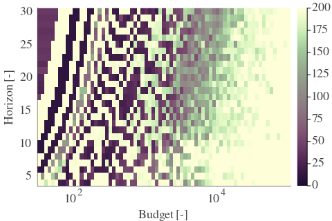 | 
| Std |  |  |  | 

| Cₚ = 8 | γ = 0.8, S = 37.72% | γ = 0.85, S = 47.47% | γ = 0.9, S = 56.44% | 
| --- | --- | --- | --- | 
| Mean |  |  |  | 
| Std |  |  | 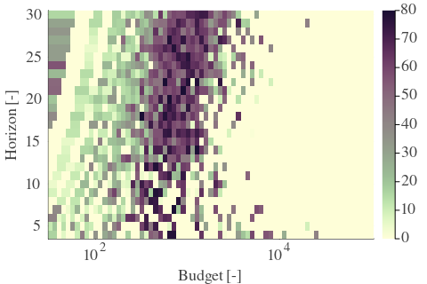 | 

| Cₚ = 8 | γ = 0.95, S = 65.94% | γ = 1.0, S = 73.34% | 
| --- | --- | --- | 
| Mean |  |  | 
| Std |  |  | 

---

**Exploration parameter = 16**

| Cₚ = 16 | γ = 0.5, S = 21.07% | γ = 0.55, S = 20.45% | γ = 0.6, S = 18.62% | 
| --- | --- | --- | --- | 
| Mean |  |  |  | 
| Std |  |  | 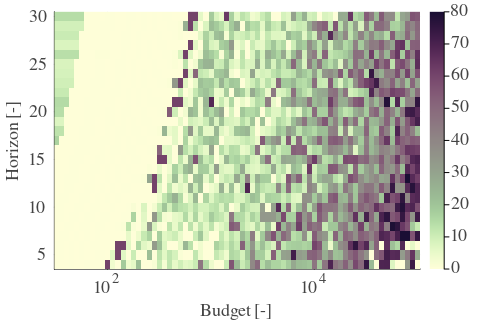 | 

| Cₚ = 16 | γ = 0.65, S = 16.95% | γ = 0.7, S = 16.28% | γ = 0.75, S = 17.27% | 
| --- | --- | --- | --- | 
| Mean |  |  |  | 
| Std |  |  |  | 

| Cₚ = 16 | γ = 0.8, S = 22.69% | γ = 0.85, S = 30.93% | γ = 0.9, S = 38.71% | 
| --- | --- | --- | --- | 
| Mean |  |  |  | 
| Std |  |  |  | 

| Cₚ = 16 | γ = 0.95, S = 48.41% | γ = 1.0, S = 58.01% | 
| --- | --- | --- | 
| Mean |  |  | 
| Std |  |  | 

---

**Exploration parameter = 32**

| Cₚ = 32 | γ = 0.5, S = 23.47% | γ = 0.55, S = 21.6% | γ = 0.6, S = 20.29% | 
| --- | --- | --- | --- | 
| Mean |  |  |  | 
| Std |  |  |  | 

| Cₚ = 32 | γ = 0.65, S = 19.56% | γ = 0.7, S = 17.94% | γ = 0.75, S = 16.69% | 
| --- | --- | --- | --- | 
| Mean |  | 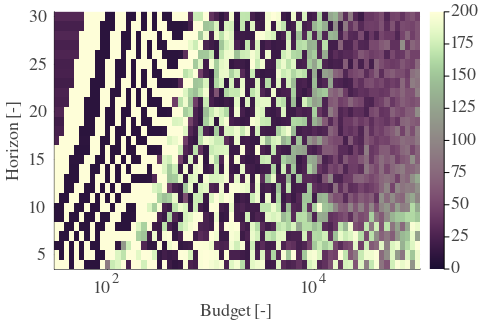 | 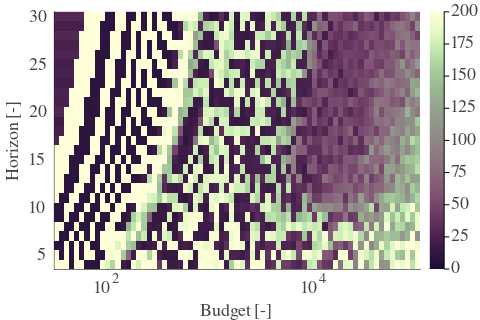 | 
| Std |  |  |  | 

| Cₚ = 32 | γ = 0.8, S = 16.01% | γ = 0.85, S = 18.31% | γ = 0.9, S = 24.2% | 
| --- | --- | --- | --- | 
| Mean |  |  |  | 
| Std |  |  |  | 

| Cₚ = 32 | γ = 0.95, S = 34.27% | γ = 1.0, S = 43.51% | 
| --- | --- | --- | 
| Mean |  |  | 
| Std |  |  | 

---

**Exploration parameter = 64**

| Cₚ = 64 | γ = 0.5, S = 27.65% | γ = 0.55, S = 25.4% | γ = 0.6, S = 22.95% | 
| --- | --- | --- | --- | 
| Mean |  |  |  | 
| Std |  |  | 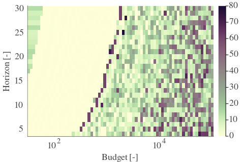 | 

| Cₚ = 64 | γ = 0.65, S = 20.87% | γ = 0.7, S = 19.56% | γ = 0.75, S = 19.41% | 
| --- | --- | --- | --- | 
| Mean |  |  |  | 
| Std |  |  |  | 

| Cₚ = 64 | γ = 0.8, S = 17.94% | γ = 0.85, S = 16.95% | γ = 0.9, S = 16.43% | 
| --- | --- | --- | --- | 
| Mean |  |  |  | 
| Std |  |  |  | 

| Cₚ = 64 | γ = 0.95, S = 21.13% | γ = 1.0, S = 29.06% | 
| --- | --- | --- | 
| Mean | 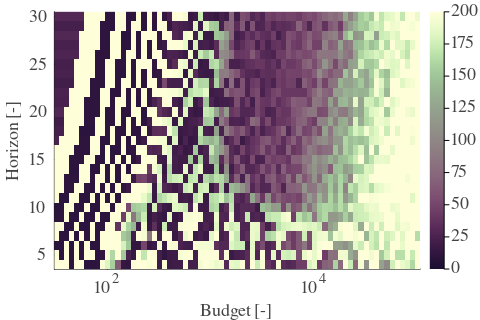 |  | 
| Std |  |  | 

---

**Exploration parameter = 128**

| Cₚ = 128 | γ = 0.5, S = 29.63% | γ = 0.55, S = 27.86% | γ = 0.6, S = 26.19% | 
| --- | --- | --- | --- | 
| Mean |  |  |  | 
| Std |  |  |  | 

| Cₚ = 128 | γ = 0.65, S = 24.47% | γ = 0.7, S = 22.69% | γ = 0.75, S = 21.49% | 
| --- | --- | --- | --- | 
| Mean |  |  | 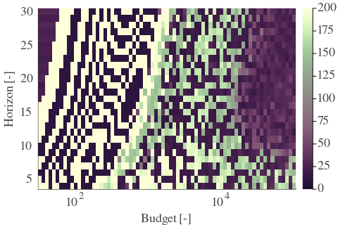 | 
| Std |  |  |  | 

| Cₚ = 128 | γ = 0.8, S = 19.67% | γ = 0.85, S = 19.2% | γ = 0.9, S = 17.94% | 
| --- | --- | --- | --- | 
| Mean |  |  |  | 
| Std |  |  |  | 

| Cₚ = 128 | γ = 0.95, S = 17.16% | γ = 1.0, S = 17.89% | 
| --- | --- | --- | 
| Mean |  |  | 
| Std |  |  | 

---

**Exploration parameter = 256**

| Cₚ = 256 | γ = 0.5, S = 32.66% | γ = 0.55, S = 30.67% | γ = 0.6, S = 28.69% | 
| --- | --- | --- | --- | 
| Mean | 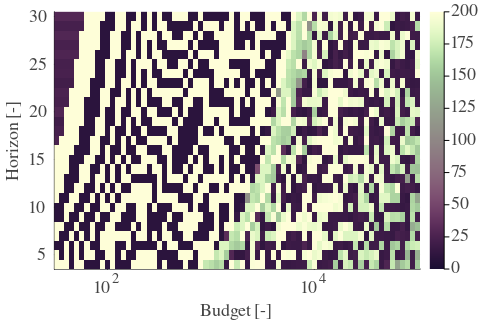 |  |  | 
| Std |  |  |  | 

| Cₚ = 256 | γ = 0.65, S = 26.76% | γ = 0.7, S = 25.93% | γ = 0.75, S = 25.04% | 
| --- | --- | --- | --- | 
| Mean | 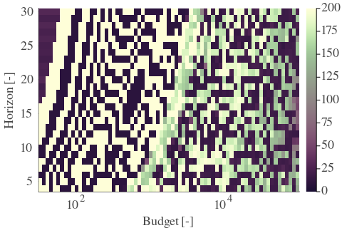 | 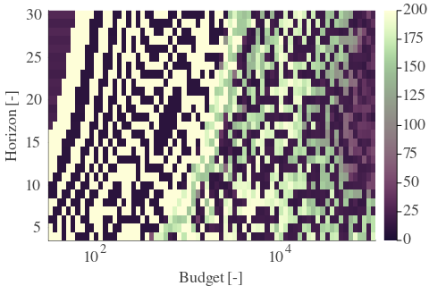 |  | 
| Std |  |  |  | 

| Cₚ = 256 | γ = 0.8, S = 23.89% | γ = 0.85, S = 22.64% | γ = 0.9, S = 21.07% | 
| --- | --- | --- | --- | 
| Mean |  |  |  | 
| Std |  |  | 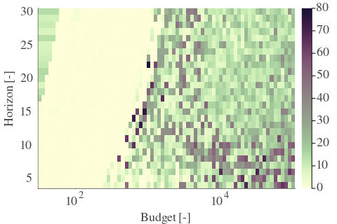 | 

| Cₚ = 256 | γ = 0.95, S = 19.35% | γ = 1.0, S = 18.1% | 
| --- | --- | --- | 
| Mean |  |  | 
| Std |  |  | 

---

**Exploration parameter = 512**

| Cₚ = 512 | γ = 0.5, S = 35.16% | γ = 0.55, S = 33.39% | γ = 0.6, S = 31.77% | 
| --- | --- | --- | --- | 
| Mean |  |  |  | 
| Std |  |  |  | 

| Cₚ = 512 | γ = 0.65, S = 29.47% | γ = 0.7, S = 28.69% | γ = 0.75, S = 27.65% | 
| --- | --- | --- | --- | 
| Mean |  |  |  | 
| Std |  |  |  | 

| Cₚ = 512 | γ = 0.8, S = 26.86% | γ = 0.85, S = 25.4% | γ = 0.9, S = 24.73% | 
| --- | --- | --- | --- | 
| Mean |  |  |  | 
| Std |  |  |  | 

| Cₚ = 512 | γ = 0.95, S = 22.54% | γ = 1.0, S = 21.28% | 
| --- | --- | --- | 
| Mean |  |  | 
| Std |  |  | 

---

**Exploration parameter = 1024**

| Cₚ = 1024 | γ = 0.5, S = 38.24% | γ = 0.55, S = 36.2% | γ = 0.6, S = 34.64% | 
| --- | --- | --- | --- | 
| Mean |  |  |  | 
| Std |  |  | 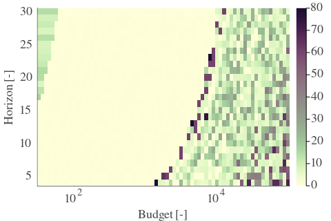 | 

| Cₚ = 1024 | γ = 0.65, S = 32.34% | γ = 0.7, S = 31.87% | γ = 0.75, S = 30.26% | 
| --- | --- | --- | --- | 
| Mean |  |  |  | 
| Std |  |  |  | 

| Cₚ = 1024 | γ = 0.8, S = 29.42% | γ = 0.85, S = 29.0% | γ = 0.9, S = 27.18% | 
| --- | --- | --- | --- | 
| Mean | 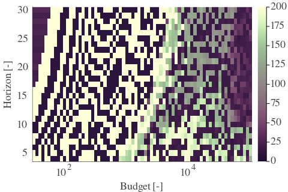 |  |  | 
| Std |  |  |  | 

| Cₚ = 1024 | γ = 0.95, S = 26.4% | γ = 1.0, S = 24.83% | 
| --- | --- | --- | 
| Mean |  |  | 
| Std |  |  | 

