# Results for the file sp_AD_20230326.csv 

Generated on 2023-11-03 14:14:13

---

**Exploration parameter = 0**

| Cₚ = 0 | γ = 0.5, S = 0.0% | γ = 0.55, S = 0.0% | γ = 0.6, S = 0.0% | 
| --- | --- | --- | --- | 
| Mean |  |  |  | 
| Std |  |  |  | 

| Cₚ = 0 | γ = 0.65, S = 0.0% | γ = 0.7, S = 0.0% | γ = 0.75, S = 0.0% | 
| --- | --- | --- | --- | 
| Mean |  |  |  | 
| Std |  |  |  | 

| Cₚ = 0 | γ = 0.8, S = 0.0% | γ = 0.85, S = 0.0% | γ = 0.9, S = 0.0% | 
| --- | --- | --- | --- | 
| Mean |  |  |  | 
| Std |  |  |  | 

| Cₚ = 0 | γ = 0.95, S = 0.0% | γ = 1.0, S = 0.0% | 
| --- | --- | --- | 
| Mean |  |  | 
| Std |  |  | 

---

**Exploration parameter = 2**

| Cₚ = 2 | γ = 0.5, S = 31.77% | γ = 0.55, S = 34.79% | γ = 0.6, S = 40.53% | 
| --- | --- | --- | --- | 
| Mean |  |  |  | 
| Std |  |  |  | 

| Cₚ = 2 | γ = 0.65, S = 43.4% | γ = 0.7, S = 49.97% | γ = 0.75, S = 57.85% | 
| --- | --- | --- | --- | 
| Mean |  | 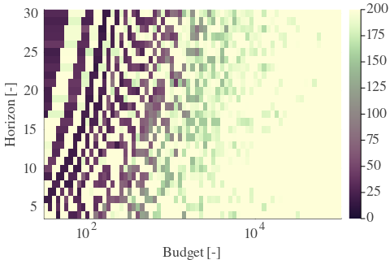 |  | 
| Std |  |  |  | 

| Cₚ = 2 | γ = 0.8, S = 66.3% | γ = 0.85, S = 71.67% | γ = 0.9, S = 73.24% | 
| --- | --- | --- | --- | 
| Mean |  |  |  | 
| Std |  |  |  | 

| Cₚ = 2 | γ = 0.95, S = 74.91% | γ = 1.0, S = 75.9% | 
| --- | --- | --- | 
| Mean |  |  | 
| Std |  |  | 

---

**Exploration parameter = 4**

| Cₚ = 4 | γ = 0.5, S = 27.96% | γ = 0.55, S = 28.33% | γ = 0.6, S = 28.27% | 
| --- | --- | --- | --- | 
| Mean |  |  |  | 
| Std |  |  |  | 

| Cₚ = 4 | γ = 0.65, S = 30.05% | γ = 0.7, S = 34.79% | γ = 0.75, S = 41.73% | 
| --- | --- | --- | --- | 
| Mean |  | 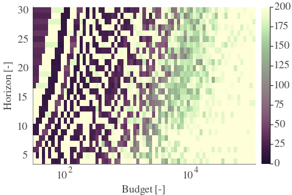 |  | 
| Std |  |  |  | 

| Cₚ = 4 | γ = 0.8, S = 47.99% | γ = 0.85, S = 56.91% | γ = 0.9, S = 63.12% | 
| --- | --- | --- | --- | 
| Mean |  |  |  | 
| Std |  |  |  | 

| Cₚ = 4 | γ = 0.95, S = 68.08% | γ = 1.0, S = 72.56% | 
| --- | --- | --- | 
| Mean |  |  | 
| Std | 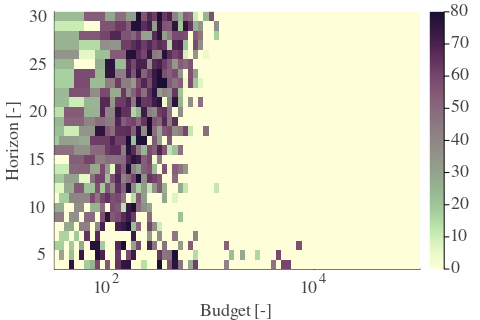 |  | 

---

**Exploration parameter = 8**

| Cₚ = 8 | γ = 0.5, S = 28.17% | γ = 0.55, S = 27.23% | γ = 0.6, S = 24.78% | 
| --- | --- | --- | --- | 
| Mean |  |  |  | 
| Std |  |  | 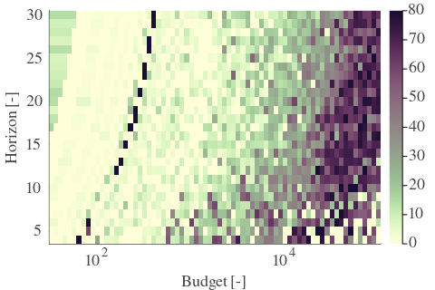 | 

| Cₚ = 8 | γ = 0.65, S = 22.59% | γ = 0.7, S = 23.74% | γ = 0.75, S = 28.33% | 
| --- | --- | --- | --- | 
| Mean |  |  |  | 
| Std |  |  |  | 

| Cₚ = 8 | γ = 0.8, S = 35.0% | γ = 0.85, S = 41.05% | γ = 0.9, S = 48.93% | 
| --- | --- | --- | --- | 
| Mean |  |  |  | 
| Std |  |  |  | 

| Cₚ = 8 | γ = 0.95, S = 57.38% | γ = 1.0, S = 62.6% | 
| --- | --- | --- | 
| Mean |  |  | 
| Std |  |  | 

---

**Exploration parameter = 16**

| Cₚ = 16 | γ = 0.5, S = 31.51% | γ = 0.55, S = 29.16% | γ = 0.6, S = 25.51% | 
| --- | --- | --- | --- | 
| Mean |  |  |  | 
| Std |  |  |  | 

| Cₚ = 16 | γ = 0.65, S = 22.54% | γ = 0.7, S = 18.73% | γ = 0.75, S = 18.31% | 
| --- | --- | --- | --- | 
| Mean |  | 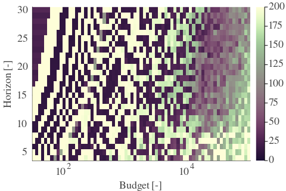 |  | 
| Std |  |  |  | 

| Cₚ = 16 | γ = 0.8, S = 22.64% | γ = 0.85, S = 28.95% | γ = 0.9, S = 35.52% | 
| --- | --- | --- | --- | 
| Mean |  |  |  | 
| Std |  |  |  | 

| Cₚ = 16 | γ = 0.95, S = 43.82% | γ = 1.0, S = 50.29% | 
| --- | --- | --- | 
| Mean |  |  | 
| Std |  |  | 

---

**Exploration parameter = 32**

| Cₚ = 32 | γ = 0.5, S = 32.86% | γ = 0.55, S = 31.04% | γ = 0.6, S = 27.54% | 
| --- | --- | --- | --- | 
| Mean |  |  |  | 
| Std |  |  |  | 

| Cₚ = 32 | γ = 0.65, S = 24.67% | γ = 0.7, S = 19.61% | γ = 0.75, S = 17.63% | 
| --- | --- | --- | --- | 
| Mean |  |  |  | 
| Std |  |  |  | 

| Cₚ = 32 | γ = 0.8, S = 16.9% | γ = 0.85, S = 18.15% | γ = 0.9, S = 23.21% | 
| --- | --- | --- | --- | 
| Mean |  |  |  | 
| Std |  |  |  | 

| Cₚ = 32 | γ = 0.95, S = 30.73% | γ = 1.0, S = 38.24% | 
| --- | --- | --- | 
| Mean |  |  | 
| Std |  |  | 

---

**Exploration parameter = 64**

| Cₚ = 64 | γ = 0.5, S = 36.15% | γ = 0.55, S = 33.85% | γ = 0.6, S = 30.2% | 
| --- | --- | --- | --- | 
| Mean |  |  |  | 
| Std |  |  |  | 

| Cₚ = 64 | γ = 0.65, S = 26.03% | γ = 0.7, S = 20.92% | γ = 0.75, S = 19.09% | 
| --- | --- | --- | --- | 
| Mean | 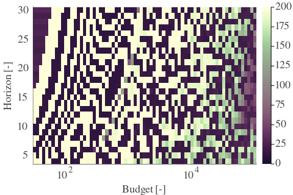 |  |  | 
| Std | 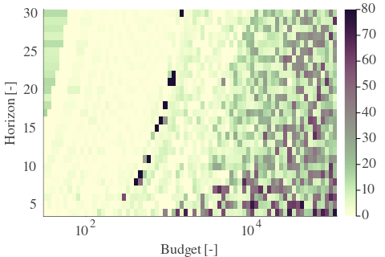 | 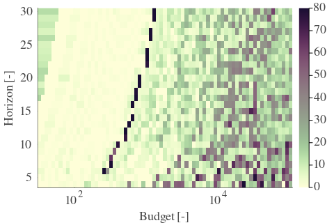 |  | 

| Cₚ = 64 | γ = 0.8, S = 18.52% | γ = 0.85, S = 18.21% | γ = 0.9, S = 18.05% | 
| --- | --- | --- | --- | 
| Mean |  |  |  | 
| Std |  |  |  | 

| Cₚ = 64 | γ = 0.95, S = 19.56% | γ = 1.0, S = 25.72% | 
| --- | --- | --- | 
| Mean |  |  | 
| Std |  |  | 

---

**Exploration parameter = 128**

| Cₚ = 128 | γ = 0.5, S = 38.55% | γ = 0.55, S = 36.98% | γ = 0.6, S = 32.71% | 
| --- | --- | --- | --- | 
| Mean |  |  |  | 
| Std |  |  |  | 

| Cₚ = 128 | γ = 0.65, S = 29.37% | γ = 0.7, S = 24.1% | γ = 0.75, S = 21.96% | 
| --- | --- | --- | --- | 
| Mean |  |  |  | 
| Std |  |  |  | 

| Cₚ = 128 | γ = 0.8, S = 20.76% | γ = 0.85, S = 19.61% | γ = 0.9, S = 19.25% | 
| --- | --- | --- | --- | 
| Mean |  |  |  | 
| Std |  |  | 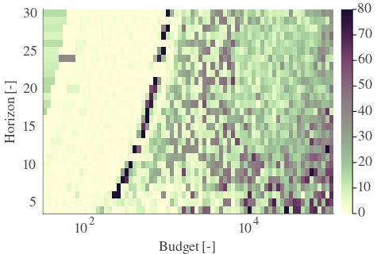 | 

| Cₚ = 128 | γ = 0.95, S = 18.57% | γ = 1.0, S = 17.94% | 
| --- | --- | --- | 
| Mean |  |  | 
| Std |  |  | 

---

**Exploration parameter = 256**

| Cₚ = 256 | γ = 0.5, S = 40.22% | γ = 0.55, S = 39.44% | γ = 0.6, S = 35.94% | 
| --- | --- | --- | --- | 
| Mean |  |  |  | 
| Std | 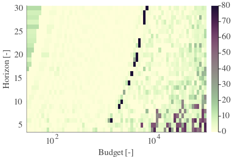 |  |  | 

| Cₚ = 256 | γ = 0.65, S = 33.18% | γ = 0.7, S = 27.13% | γ = 0.75, S = 24.78% | 
| --- | --- | --- | --- | 
| Mean |  |  |  | 
| Std |  |  |  | 

| Cₚ = 256 | γ = 0.8, S = 23.63% | γ = 0.85, S = 22.8% | γ = 0.9, S = 22.43% | 
| --- | --- | --- | --- | 
| Mean |  |  |  | 
| Std |  |  |  | 

| Cₚ = 256 | γ = 0.95, S = 21.7% | γ = 1.0, S = 19.51% | 
| --- | --- | --- | 
| Mean |  |  | 
| Std |  |  | 

---

**Exploration parameter = 512**

| Cₚ = 512 | γ = 0.5, S = 43.3% | γ = 0.55, S = 42.2% | γ = 0.6, S = 38.45% | 
| --- | --- | --- | --- | 
| Mean |  |  |  | 
| Std |  | 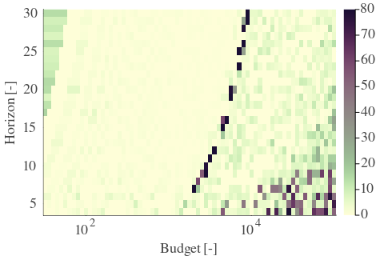 |  | 

| Cₚ = 512 | γ = 0.65, S = 35.21% | γ = 0.7, S = 29.73% | γ = 0.75, S = 27.33% | 
| --- | --- | --- | --- | 
| Mean |  |  |  | 
| Std |  |  |  | 

| Cₚ = 512 | γ = 0.8, S = 26.6% | γ = 0.85, S = 25.4% | γ = 0.9, S = 25.09% | 
| --- | --- | --- | --- | 
| Mean |  |  |  | 
| Std |  |  |  | 

| Cₚ = 512 | γ = 0.95, S = 24.1% | γ = 1.0, S = 23.74% | 
| --- | --- | --- | 
| Mean |  |  | 
| Std |  |  | 

---

**Exploration parameter = 1024**

| Cₚ = 1024 | γ = 0.5, S = 44.97% | γ = 0.55, S = 44.39% | γ = 0.6, S = 41.58% | 
| --- | --- | --- | --- | 
| Mean |  |  |  | 
| Std |  |  |  | 

| Cₚ = 1024 | γ = 0.65, S = 37.77% | γ = 0.7, S = 32.03% | γ = 0.75, S = 29.99% | 
| --- | --- | --- | --- | 
| Mean |  |  |  | 
| Std |  |  |  | 

| Cₚ = 1024 | γ = 0.8, S = 28.9% | γ = 0.85, S = 28.01% | γ = 0.9, S = 27.6% | 
| --- | --- | --- | --- | 
| Mean |  |  |  | 
| Std |  |  |  | 

| Cₚ = 1024 | γ = 0.95, S = 26.86% | γ = 1.0, S = 25.87% | 
| --- | --- | --- | 
| Mean |  |  | 
| Std | 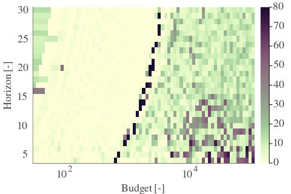 |  | 

