# Results for the file sp_AE_20230327.csv 

Generated on 2023-11-03 14:14:14

---

**Exploration parameter = 0**

| Cₚ = 0 | γ = 0.5, S = 0.0% | γ = 0.55, S = 0.0% | γ = 0.6, S = 0.0% | 
| --- | --- | --- | --- | 
| Mean |  |  |  | 
| Std |  |  |  | 

| Cₚ = 0 | γ = 0.65, S = 0.0% | γ = 0.7, S = 0.0% | γ = 0.75, S = 0.0% | 
| --- | --- | --- | --- | 
| Mean |  |  |  | 
| Std |  |  |  | 

| Cₚ = 0 | γ = 0.8, S = 0.0% | γ = 0.85, S = 0.0% | γ = 0.9, S = 0.0% | 
| --- | --- | --- | --- | 
| Mean |  |  |  | 
| Std |  |  |  | 

| Cₚ = 0 | γ = 0.95, S = 0.0% | γ = 1.0, S = 0.0% | 
| --- | --- | --- | 
| Mean |  |  | 
| Std |  |  | 

---

**Exploration parameter = 2**

| Cₚ = 2 | γ = 0.5, S = 13.98% | γ = 0.55, S = 18.15% | γ = 0.6, S = 22.01% | 
| --- | --- | --- | --- | 
| Mean |  |  |  | 
| Std |  |  |  | 

| Cₚ = 2 | γ = 0.65, S = 30.93% | γ = 0.7, S = 41.78% | γ = 0.75, S = 49.24% | 
| --- | --- | --- | --- | 
| Mean |  |  | 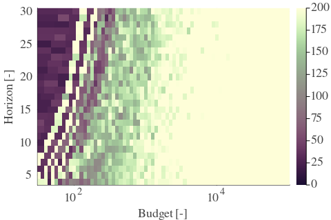 | 
| Std |  |  |  | 

| Cₚ = 2 | γ = 0.8, S = 62.81% | γ = 0.85, S = 68.23% | γ = 0.9, S = 70.79% | 
| --- | --- | --- | --- | 
| Mean |  |  |  | 
| Std |  |  |  | 

| Cₚ = 2 | γ = 0.95, S = 71.73% | γ = 1.0, S = 66.04% | 
| --- | --- | --- | 
| Mean |  |  | 
| Std |  |  | 

---

**Exploration parameter = 4**

| Cₚ = 4 | γ = 0.5, S = 16.17% | γ = 0.55, S = 15.75% | γ = 0.6, S = 17.37% | 
| --- | --- | --- | --- | 
| Mean |  | 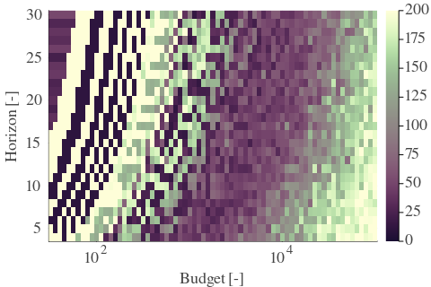 |  | 
| Std |  |  |  | 

| Cₚ = 4 | γ = 0.65, S = 19.2% | γ = 0.7, S = 25.98% | γ = 0.75, S = 33.75% | 
| --- | --- | --- | --- | 
| Mean |  |  |  | 
| Std |  |  |  | 

| Cₚ = 4 | γ = 0.8, S = 42.2% | γ = 0.85, S = 51.75% | γ = 0.9, S = 64.79% | 
| --- | --- | --- | --- | 
| Mean |  |  |  | 
| Std |  |  | 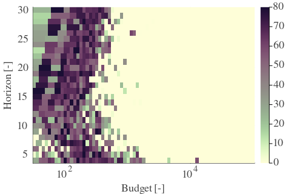 | 

| Cₚ = 4 | γ = 0.95, S = 70.11% | γ = 1.0, S = 71.99% | 
| --- | --- | --- | 
| Mean |  |  | 
| Std |  |  | 

---

**Exploration parameter = 8**

| Cₚ = 8 | γ = 0.5, S = 21.07% | γ = 0.55, S = 18.73% | γ = 0.6, S = 15.75% | 
| --- | --- | --- | --- | 
| Mean |  |  |  | 
| Std |  |  | 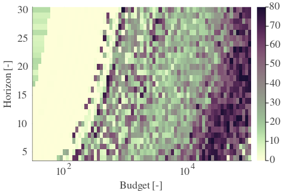 | 

| Cₚ = 8 | γ = 0.65, S = 15.91% | γ = 0.7, S = 17.48% | γ = 0.75, S = 23.84% | 
| --- | --- | --- | --- | 
| Mean |  |  |  | 
| Std |  |  |  | 

| Cₚ = 8 | γ = 0.8, S = 29.58% | γ = 0.85, S = 37.82% | γ = 0.9, S = 45.44% | 
| --- | --- | --- | --- | 
| Mean |  |  |  | 
| Std |  |  |  | 

| Cₚ = 8 | γ = 0.95, S = 56.13% | γ = 1.0, S = 65.1% | 
| --- | --- | --- | 
| Mean |  |  | 
| Std |  |  | 

---

**Exploration parameter = 16**

| Cₚ = 16 | γ = 0.5, S = 21.13% | γ = 0.55, S = 21.02% | γ = 0.6, S = 20.34% | 
| --- | --- | --- | --- | 
| Mean |  |  |  | 
| Std |  |  |  | 

| Cₚ = 16 | γ = 0.65, S = 18.21% | γ = 0.7, S = 15.75% | γ = 0.75, S = 15.96% | 
| --- | --- | --- | --- | 
| Mean |  |  |  | 
| Std | 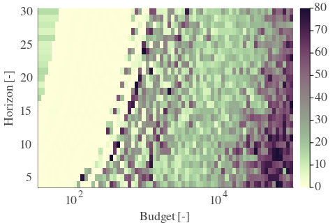 |  |  | 

| Cₚ = 16 | γ = 0.8, S = 18.99% | γ = 0.85, S = 26.19% | γ = 0.9, S = 32.6% | 
| --- | --- | --- | --- | 
| Mean |  |  |  | 
| Std |  |  |  | 

| Cₚ = 16 | γ = 0.95, S = 39.54% | γ = 1.0, S = 50.18% | 
| --- | --- | --- | 
| Mean |  |  | 
| Std | 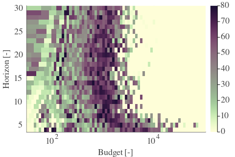 |  | 

---

**Exploration parameter = 32**

| Cₚ = 32 | γ = 0.5, S = 25.14% | γ = 0.55, S = 23.53% | γ = 0.6, S = 21.39% | 
| --- | --- | --- | --- | 
| Mean |  |  |  | 
| Std |  |  |  | 

| Cₚ = 32 | γ = 0.65, S = 20.24% | γ = 0.7, S = 20.24% | γ = 0.75, S = 18.62% | 
| --- | --- | --- | --- | 
| Mean |  |  |  | 
| Std |  | 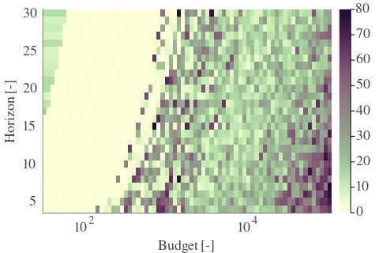 |  | 

| Cₚ = 32 | γ = 0.8, S = 16.33% | γ = 0.85, S = 16.07% | γ = 0.9, S = 22.43% | 
| --- | --- | --- | --- | 
| Mean |  |  |  | 
| Std |  |  |  | 

| Cₚ = 32 | γ = 0.95, S = 28.95% | γ = 1.0, S = 35.84% | 
| --- | --- | --- | 
| Mean |  |  | 
| Std |  |  | 

---

**Exploration parameter = 64**

| Cₚ = 64 | γ = 0.5, S = 28.38% | γ = 0.55, S = 27.28% | γ = 0.6, S = 25.46% | 
| --- | --- | --- | --- | 
| Mean |  |  |  | 
| Std |  |  |  | 

| Cₚ = 64 | γ = 0.65, S = 23.16% | γ = 0.7, S = 22.01% | γ = 0.75, S = 20.08% | 
| --- | --- | --- | --- | 
| Mean |  |  | 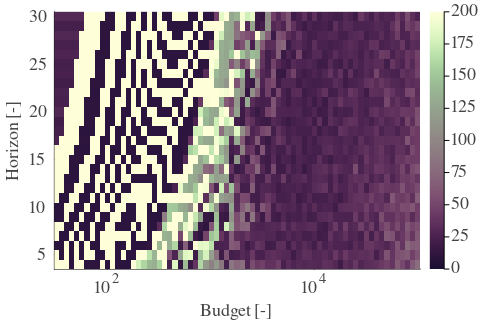 | 
| Std |  |  |  | 

| Cₚ = 64 | γ = 0.8, S = 19.77% | γ = 0.85, S = 17.48% | γ = 0.9, S = 15.6% | 
| --- | --- | --- | --- | 
| Mean |  |  | 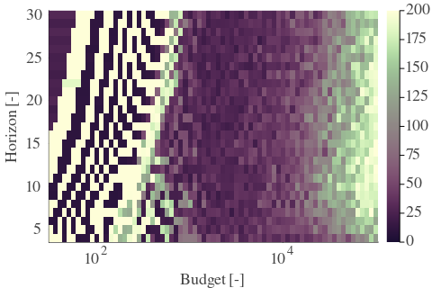 | 
| Std |  |  |  | 

| Cₚ = 64 | γ = 0.95, S = 19.2% | γ = 1.0, S = 25.14% | 
| --- | --- | --- | 
| Mean |  |  | 
| Std |  |  | 

---

**Exploration parameter = 128**

| Cₚ = 128 | γ = 0.5, S = 30.83% | γ = 0.55, S = 30.1% | γ = 0.6, S = 28.06% | 
| --- | --- | --- | --- | 
| Mean |  | 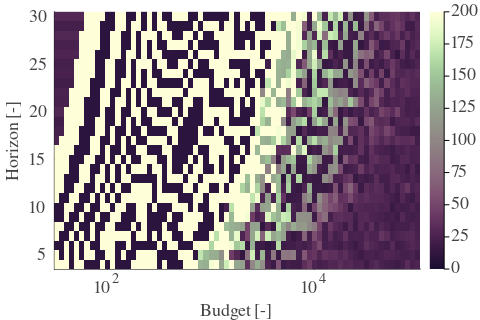 |  | 
| Std |  |  |  | 

| Cₚ = 128 | γ = 0.65, S = 26.92% | γ = 0.7, S = 26.08% | γ = 0.75, S = 23.68% | 
| --- | --- | --- | --- | 
| Mean |  |  |  | 
| Std |  |  | 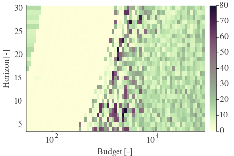 | 

| Cₚ = 128 | γ = 0.8, S = 22.07% | γ = 0.85, S = 20.24% | γ = 0.9, S = 18.21% | 
| --- | --- | --- | --- | 
| Mean |  |  |  | 
| Std |  |  |  | 

| Cₚ = 128 | γ = 0.95, S = 16.12% | γ = 1.0, S = 16.43% | 
| --- | --- | --- | 
| Mean |  | 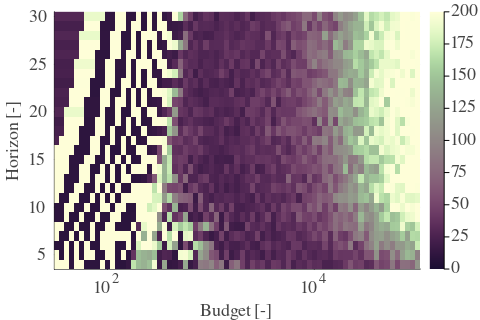 | 
| Std |  |  | 

---

**Exploration parameter = 256**

| Cₚ = 256 | γ = 0.5, S = 33.7% | γ = 0.55, S = 32.29% | γ = 0.6, S = 30.67% | 
| --- | --- | --- | --- | 
| Mean |  |  |  | 
| Std |  |  |  | 

| Cₚ = 256 | γ = 0.65, S = 30.05% | γ = 0.7, S = 28.69% | γ = 0.75, S = 27.44% | 
| --- | --- | --- | --- | 
| Mean |  |  |  | 
| Std |  |  |  | 

| Cₚ = 256 | γ = 0.8, S = 26.29% | γ = 0.85, S = 24.05% | γ = 0.9, S = 21.91% | 
| --- | --- | --- | --- | 
| Mean |  |  |  | 
| Std |  |  |  | 

| Cₚ = 256 | γ = 0.95, S = 19.3% | γ = 1.0, S = 16.64% | 
| --- | --- | --- | 
| Mean |  |  | 
| Std |  |  | 

---

**Exploration parameter = 512**

| Cₚ = 512 | γ = 0.5, S = 36.62% | γ = 0.55, S = 35.37% | γ = 0.6, S = 33.39% | 
| --- | --- | --- | --- | 
| Mean |  |  |  | 
| Std |  |  | 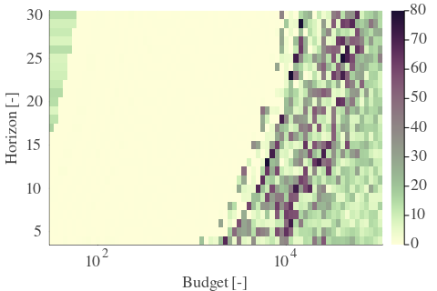 | 

| Cₚ = 512 | γ = 0.65, S = 32.5% | γ = 0.7, S = 31.19% | γ = 0.75, S = 30.31% | 
| --- | --- | --- | --- | 
| Mean |  |  |  | 
| Std |  |  |  | 

| Cₚ = 512 | γ = 0.8, S = 29.0% | γ = 0.85, S = 26.97% | γ = 0.9, S = 25.61% | 
| --- | --- | --- | --- | 
| Mean |  |  |  | 
| Std |  |  |  | 

| Cₚ = 512 | γ = 0.95, S = 22.74% | γ = 1.0, S = 19.3% | 
| --- | --- | --- | 
| Mean | 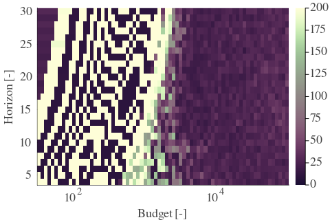 |  | 
| Std |  |  | 

---

**Exploration parameter = 1024**

| Cₚ = 1024 | γ = 0.5, S = 39.54% | γ = 0.55, S = 38.55% | γ = 0.6, S = 36.15% | 
| --- | --- | --- | --- | 
| Mean |  |  |  | 
| Std |  |  |  | 

| Cₚ = 1024 | γ = 0.65, S = 35.52% | γ = 0.7, S = 33.85% | γ = 0.75, S = 33.23% | 
| --- | --- | --- | --- | 
| Mean |  |  |  | 
| Std |  |  |  | 

| Cₚ = 1024 | γ = 0.8, S = 32.08% | γ = 0.85, S = 30.36% | γ = 0.9, S = 28.48% | 
| --- | --- | --- | --- | 
| Mean |  |  |  | 
| Std |  |  |  | 

| Cₚ = 1024 | γ = 0.95, S = 25.77% | γ = 1.0, S = 22.9% | 
| --- | --- | --- | 
| Mean |  |  | 
| Std |  |  | 

