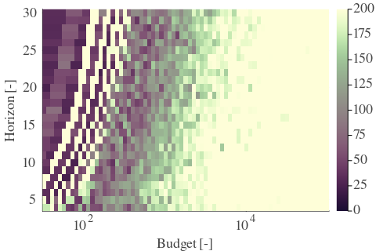
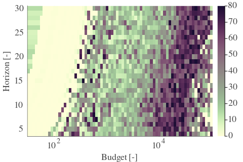
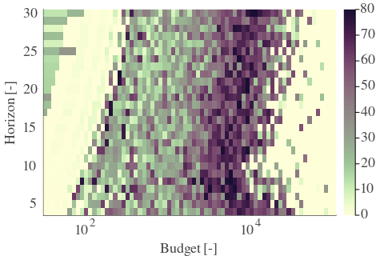
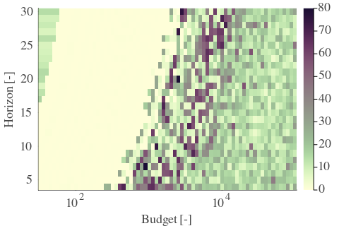
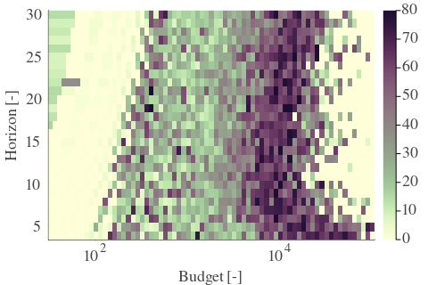
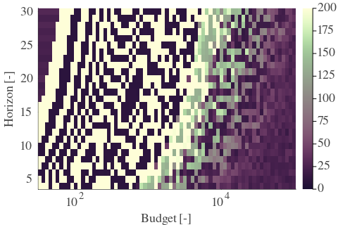
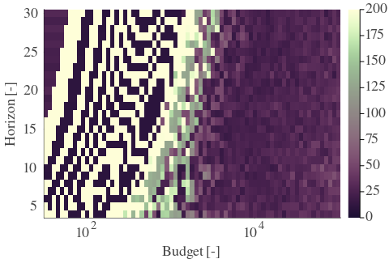
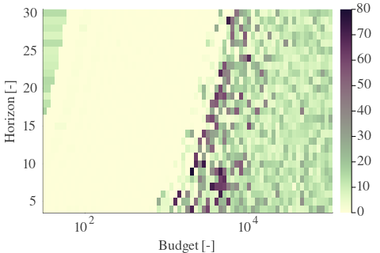
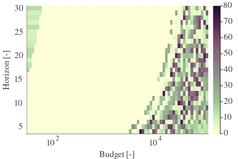

# Results for the file sp_AF_20230327.csv 

Generated on 2023-11-03 14:14:15

---

**Exploration parameter = 0**

| Cₚ = 0 | γ = 0.5, S = 0.0% | γ = 0.55, S = 0.0% | γ = 0.6, S = 0.0% | 
| --- | --- | --- | --- | 
| Mean |  |  |  | 
| Std |  |  |  | 

| Cₚ = 0 | γ = 0.65, S = 0.0% | γ = 0.7, S = 0.0% | γ = 0.75, S = 0.0% | 
| --- | --- | --- | --- | 
| Mean |  |  |  | 
| Std |  |  |  | 

| Cₚ = 0 | γ = 0.8, S = 0.0% | γ = 0.85, S = 0.0% | γ = 0.9, S = 0.0% | 
| --- | --- | --- | --- | 
| Mean |  |  |  | 
| Std |  |  |  | 

| Cₚ = 0 | γ = 0.95, S = 0.0% | γ = 1.0, S = 0.0% | 
| --- | --- | --- | 
| Mean |  |  | 
| Std |  |  | 

---

**Exploration parameter = 2**

| Cₚ = 2 | γ = 0.5, S = 14.4% | γ = 0.55, S = 18.1% | γ = 0.6, S = 22.8% | 
| --- | --- | --- | --- | 
| Mean |  |  |  | 
| Std |  |  |  | 

| Cₚ = 2 | γ = 0.65, S = 31.72% | γ = 0.7, S = 41.58% | γ = 0.75, S = 48.88% | 
| --- | --- | --- | --- | 
| Mean |  |  |  | 
| Std |  |  |  | 

| Cₚ = 2 | γ = 0.8, S = 63.75% | γ = 0.85, S = 68.54% | γ = 0.9, S = 70.58% | 
| --- | --- | --- | --- | 
| Mean |  |  |  | 
| Std |  |  |  | 

| Cₚ = 2 | γ = 0.95, S = 71.31% | γ = 1.0, S = 66.61% | 
| --- | --- | --- | 
| Mean |  |  | 
| Std |  |  | 

---

**Exploration parameter = 4**

| Cₚ = 4 | γ = 0.5, S = 16.38% | γ = 0.55, S = 16.01% | γ = 0.6, S = 17.63% | 
| --- | --- | --- | --- | 
| Mean |  |  |  | 
| Std |  |  |  | 

| Cₚ = 4 | γ = 0.65, S = 19.98% | γ = 0.7, S = 25.77% | γ = 0.75, S = 34.01% | 
| --- | --- | --- | --- | 
| Mean |  |  |  | 
| Std |  |  |  | 

| Cₚ = 4 | γ = 0.8, S = 42.41% | γ = 0.85, S = 52.06% | γ = 0.9, S = 63.22% | 
| --- | --- | --- | --- | 
| Mean |  |  |  | 
| Std |  |  |  | 

| Cₚ = 4 | γ = 0.95, S = 70.16% | γ = 1.0, S = 73.19% | 
| --- | --- | --- | 
| Mean |  |  | 
| Std |  |  | 

---

**Exploration parameter = 8**

| Cₚ = 8 | γ = 0.5, S = 21.13% | γ = 0.55, S = 18.57% | γ = 0.6, S = 15.96% | 
| --- | --- | --- | --- | 
| Mean |  |  |  | 
| Std |  |  |  | 

| Cₚ = 8 | γ = 0.65, S = 16.17% | γ = 0.7, S = 17.58% | γ = 0.75, S = 22.9% | 
| --- | --- | --- | --- | 
| Mean |  |  |  | 
| Std |  |  |  | 

| Cₚ = 8 | γ = 0.8, S = 29.53% | γ = 0.85, S = 37.51% | γ = 0.9, S = 45.38% | 
| --- | --- | --- | --- | 
| Mean |  |  |  | 
| Std |  |  |  | 

| Cₚ = 8 | γ = 0.95, S = 55.82% | γ = 1.0, S = 65.62% | 
| --- | --- | --- | 
| Mean |  |  | 
| Std |  |  | 

---

**Exploration parameter = 16**

| Cₚ = 16 | γ = 0.5, S = 20.97% | γ = 0.55, S = 20.92% | γ = 0.6, S = 20.4% | 
| --- | --- | --- | --- | 
| Mean |  |  |  | 
| Std |  |  |  | 

| Cₚ = 16 | γ = 0.65, S = 18.21% | γ = 0.7, S = 15.91% | γ = 0.75, S = 15.55% | 
| --- | --- | --- | --- | 
| Mean |  |  |  | 
| Std |  |  |  | 

| Cₚ = 16 | γ = 0.8, S = 18.62% | γ = 0.85, S = 26.6% | γ = 0.9, S = 33.65% | 
| --- | --- | --- | --- | 
| Mean |  |  |  | 
| Std |  |  |  | 

| Cₚ = 16 | γ = 0.95, S = 40.17% | γ = 1.0, S = 49.24% | 
| --- | --- | --- | 
| Mean |  |  | 
| Std |  |  | 

---

**Exploration parameter = 32**

| Cₚ = 32 | γ = 0.5, S = 25.2% | γ = 0.55, S = 23.63% | γ = 0.6, S = 21.34% | 
| --- | --- | --- | --- | 
| Mean |  |  |  | 
| Std |  |  |  | 

| Cₚ = 32 | γ = 0.65, S = 20.5% | γ = 0.7, S = 20.03% | γ = 0.75, S = 18.41% | 
| --- | --- | --- | --- | 
| Mean |  |  |  | 
| Std |  |  |  | 

| Cₚ = 32 | γ = 0.8, S = 16.01% | γ = 0.85, S = 15.75% | γ = 0.9, S = 22.43% | 
| --- | --- | --- | --- | 
| Mean |  |  |  | 
| Std |  |  |  | 

| Cₚ = 32 | γ = 0.95, S = 28.85% | γ = 1.0, S = 35.73% | 
| --- | --- | --- | 
| Mean |  |  | 
| Std |  |  | 

---

**Exploration parameter = 64**

| Cₚ = 64 | γ = 0.5, S = 28.33% | γ = 0.55, S = 27.13% | γ = 0.6, S = 25.4% | 
| --- | --- | --- | --- | 
| Mean |  |  |  | 
| Std |  |  |  | 

| Cₚ = 64 | γ = 0.65, S = 23.32% | γ = 0.7, S = 21.86% | γ = 0.75, S = 20.08% | 
| --- | --- | --- | --- | 
| Mean |  |  |  | 
| Std |  |  |  | 

| Cₚ = 64 | γ = 0.8, S = 19.3% | γ = 0.85, S = 17.58% | γ = 0.9, S = 15.55% | 
| --- | --- | --- | --- | 
| Mean |  |  |  | 
| Std |  |  |  | 

| Cₚ = 64 | γ = 0.95, S = 18.62% | γ = 1.0, S = 24.78% | 
| --- | --- | --- | 
| Mean |  |  | 
| Std |  |  | 

---

**Exploration parameter = 128**

| Cₚ = 128 | γ = 0.5, S = 31.04% | γ = 0.55, S = 29.84% | γ = 0.6, S = 27.96% | 
| --- | --- | --- | --- | 
| Mean |  |  |  | 
| Std |  |  |  | 

| Cₚ = 128 | γ = 0.65, S = 26.76% | γ = 0.7, S = 25.77% | γ = 0.75, S = 23.63% | 
| --- | --- | --- | --- | 
| Mean |  |  |  | 
| Std |  |  |  | 

| Cₚ = 128 | γ = 0.8, S = 22.22% | γ = 0.85, S = 20.14% | γ = 0.9, S = 18.26% | 
| --- | --- | --- | --- | 
| Mean |  |  |  | 
| Std |  |  |  | 

| Cₚ = 128 | γ = 0.95, S = 16.17% | γ = 1.0, S = 15.81% | 
| --- | --- | --- | 
| Mean |  |  | 
| Std |  |  | 

---

**Exploration parameter = 256**

| Cₚ = 256 | γ = 0.5, S = 33.54% | γ = 0.55, S = 32.29% | γ = 0.6, S = 30.46% | 
| --- | --- | --- | --- | 
| Mean |  |  |  | 
| Std |  |  |  | 

| Cₚ = 256 | γ = 0.65, S = 30.1% | γ = 0.7, S = 28.64% | γ = 0.75, S = 27.28% | 
| --- | --- | --- | --- | 
| Mean |  |  |  | 
| Std |  |  |  | 

| Cₚ = 256 | γ = 0.8, S = 25.93% | γ = 0.85, S = 24.0% | γ = 0.9, S = 21.44% | 
| --- | --- | --- | --- | 
| Mean |  |  |  | 
| Std |  |  |  | 

| Cₚ = 256 | γ = 0.95, S = 19.3% | γ = 1.0, S = 16.22% | 
| --- | --- | --- | 
| Mean |  |  | 
| Std |  |  | 

---

**Exploration parameter = 512**

| Cₚ = 512 | γ = 0.5, S = 36.62% | γ = 0.55, S = 35.16% | γ = 0.6, S = 33.33% | 
| --- | --- | --- | --- | 
| Mean |  |  |  | 
| Std |  |  |  | 

| Cₚ = 512 | γ = 0.65, S = 32.39% | γ = 0.7, S = 31.09% | γ = 0.75, S = 30.05% | 
| --- | --- | --- | --- | 
| Mean |  |  |  | 
| Std |  |  |  | 

| Cₚ = 512 | γ = 0.8, S = 29.11% | γ = 0.85, S = 27.13% | γ = 0.9, S = 25.3% | 
| --- | --- | --- | --- | 
| Mean |  |  |  | 
| Std |  |  |  | 

| Cₚ = 512 | γ = 0.95, S = 22.95% | γ = 1.0, S = 19.2% | 
| --- | --- | --- | 
| Mean |  |  | 
| Std |  |  | 

---

**Exploration parameter = 1024**

| Cₚ = 1024 | γ = 0.5, S = 39.44% | γ = 0.55, S = 38.34% | γ = 0.6, S = 36.1% | 
| --- | --- | --- | --- | 
| Mean |  |  |  | 
| Std |  |  |  | 

| Cₚ = 1024 | γ = 0.65, S = 35.42% | γ = 0.7, S = 33.75% | γ = 0.75, S = 33.12% | 
| --- | --- | --- | --- | 
| Mean |  |  |  | 
| Std |  |  |  | 

| Cₚ = 1024 | γ = 0.8, S = 31.66% | γ = 0.85, S = 30.1% | γ = 0.9, S = 28.43% | 
| --- | --- | --- | --- | 
| Mean |  |  |  | 
| Std |  |  |  | 

| Cₚ = 1024 | γ = 0.95, S = 25.98% | γ = 1.0, S = 22.74% | 
| --- | --- | --- | 
| Mean |  |  | 
| Std |  |  | 

