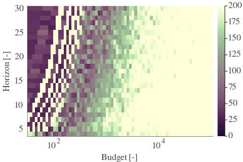
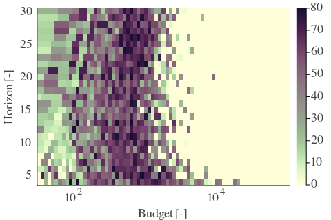
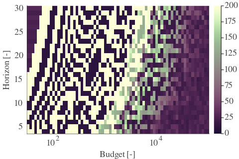
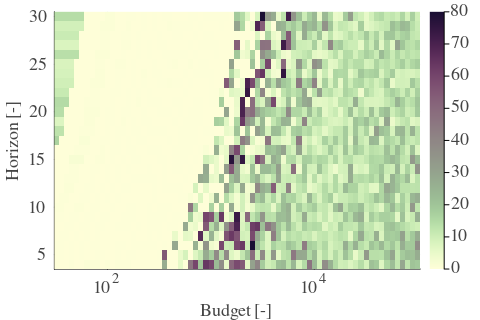
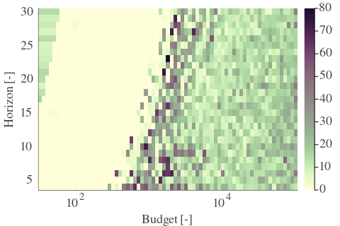
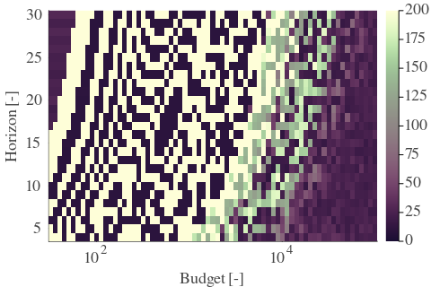
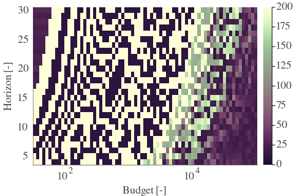
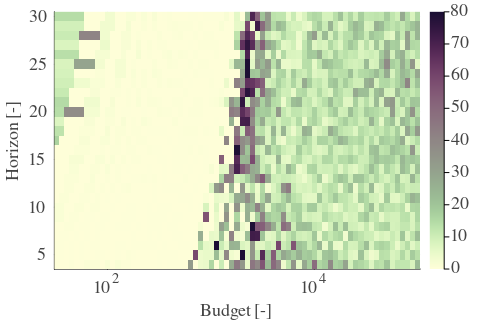

# Results for the file sp_AG_20230327.csv 

Generated on 2023-11-03 14:14:15

---

**Exploration parameter = 0**

| Cₚ = 0 | γ = 0.5, S = 0.0% | γ = 0.55, S = 0.0% | γ = 0.6, S = 0.0% | 
| --- | --- | --- | --- | 
| Mean |  |  |  | 
| Std |  |  |  | 

| Cₚ = 0 | γ = 0.65, S = 0.0% | γ = 0.7, S = 0.0% | γ = 0.75, S = 0.0% | 
| --- | --- | --- | --- | 
| Mean |  |  |  | 
| Std |  |  |  | 

| Cₚ = 0 | γ = 0.8, S = 0.0% | γ = 0.85, S = 0.0% | γ = 0.9, S = 0.0% | 
| --- | --- | --- | --- | 
| Mean |  |  |  | 
| Std |  |  |  | 

| Cₚ = 0 | γ = 0.95, S = 0.0% | γ = 1.0, S = 0.0% | 
| --- | --- | --- | 
| Mean |  |  | 
| Std |  |  | 

---

**Exploration parameter = 2**

| Cₚ = 2 | γ = 0.5, S = 14.81% | γ = 0.55, S = 18.52% | γ = 0.6, S = 22.59% | 
| --- | --- | --- | --- | 
| Mean |  |  |  | 
| Std |  |  |  | 

| Cₚ = 2 | γ = 0.65, S = 31.3% | γ = 0.7, S = 41.84% | γ = 0.75, S = 48.93% | 
| --- | --- | --- | --- | 
| Mean |  |  |  | 
| Std |  |  |  | 

| Cₚ = 2 | γ = 0.8, S = 64.21% | γ = 0.85, S = 69.01% | γ = 0.9, S = 70.63% | 
| --- | --- | --- | --- | 
| Mean |  |  |  | 
| Std |  |  |  | 

| Cₚ = 2 | γ = 0.95, S = 71.31% | γ = 1.0, S = 66.56% | 
| --- | --- | --- | 
| Mean |  |  | 
| Std |  |  | 

---

**Exploration parameter = 4**

| Cₚ = 4 | γ = 0.5, S = 16.17% | γ = 0.55, S = 15.96% | γ = 0.6, S = 17.06% | 
| --- | --- | --- | --- | 
| Mean |  |  |  | 
| Std |  |  |  | 

| Cₚ = 4 | γ = 0.65, S = 19.3% | γ = 0.7, S = 26.81% | γ = 0.75, S = 33.49% | 
| --- | --- | --- | --- | 
| Mean |  |  |  | 
| Std |  |  |  | 

| Cₚ = 4 | γ = 0.8, S = 42.57% | γ = 0.85, S = 51.54% | γ = 0.9, S = 64.48% | 
| --- | --- | --- | --- | 
| Mean |  |  |  | 
| Std |  |  |  | 

| Cₚ = 4 | γ = 0.95, S = 70.53% | γ = 1.0, S = 72.51% | 
| --- | --- | --- | 
| Mean |  |  | 
| Std |  |  | 

---

**Exploration parameter = 8**

| Cₚ = 8 | γ = 0.5, S = 20.81% | γ = 0.55, S = 18.62% | γ = 0.6, S = 15.7% | 
| --- | --- | --- | --- | 
| Mean |  |  |  | 
| Std |  |  |  | 

| Cₚ = 8 | γ = 0.65, S = 15.81% | γ = 0.7, S = 17.84% | γ = 0.75, S = 21.8% | 
| --- | --- | --- | --- | 
| Mean |  |  |  | 
| Std |  |  |  | 

| Cₚ = 8 | γ = 0.8, S = 30.05% | γ = 0.85, S = 37.09% | γ = 0.9, S = 45.64% | 
| --- | --- | --- | --- | 
| Mean |  |  |  | 
| Std |  |  |  | 

| Cₚ = 8 | γ = 0.95, S = 56.39% | γ = 1.0, S = 64.68% | 
| --- | --- | --- | 
| Mean |  |  | 
| Std |  |  | 

---

**Exploration parameter = 16**

| Cₚ = 16 | γ = 0.5, S = 21.23% | γ = 0.55, S = 21.23% | γ = 0.6, S = 20.55% | 
| --- | --- | --- | --- | 
| Mean |  |  |  | 
| Std |  |  |  | 

| Cₚ = 16 | γ = 0.65, S = 18.21% | γ = 0.7, S = 15.86% | γ = 0.75, S = 15.96% | 
| --- | --- | --- | --- | 
| Mean |  |  |  | 
| Std |  |  |  | 

| Cₚ = 16 | γ = 0.8, S = 18.78% | γ = 0.85, S = 26.29% | γ = 0.9, S = 33.7% | 
| --- | --- | --- | --- | 
| Mean |  |  |  | 
| Std |  |  |  | 

| Cₚ = 16 | γ = 0.95, S = 39.33% | γ = 1.0, S = 50.39% | 
| --- | --- | --- | 
| Mean |  |  | 
| Std |  |  | 

---

**Exploration parameter = 32**

| Cₚ = 32 | γ = 0.5, S = 25.25% | γ = 0.55, S = 23.58% | γ = 0.6, S = 21.44% | 
| --- | --- | --- | --- | 
| Mean |  |  |  | 
| Std |  |  |  | 

| Cₚ = 32 | γ = 0.65, S = 20.55% | γ = 0.7, S = 20.19% | γ = 0.75, S = 18.41% | 
| --- | --- | --- | --- | 
| Mean |  |  |  | 
| Std |  |  |  | 

| Cₚ = 32 | γ = 0.8, S = 16.17% | γ = 0.85, S = 16.48% | γ = 0.9, S = 22.43% | 
| --- | --- | --- | --- | 
| Mean |  |  |  | 
| Std |  |  |  | 

| Cₚ = 32 | γ = 0.95, S = 28.69% | γ = 1.0, S = 34.9% | 
| --- | --- | --- | 
| Mean |  |  | 
| Std |  |  | 

---

**Exploration parameter = 64**

| Cₚ = 64 | γ = 0.5, S = 28.38% | γ = 0.55, S = 27.39% | γ = 0.6, S = 25.51% | 
| --- | --- | --- | --- | 
| Mean |  |  |  | 
| Std |  |  |  | 

| Cₚ = 64 | γ = 0.65, S = 23.11% | γ = 0.7, S = 21.86% | γ = 0.75, S = 20.08% | 
| --- | --- | --- | --- | 
| Mean |  |  |  | 
| Std |  |  |  | 

| Cₚ = 64 | γ = 0.8, S = 19.72% | γ = 0.85, S = 17.74% | γ = 0.9, S = 15.7% | 
| --- | --- | --- | --- | 
| Mean |  |  |  | 
| Std |  |  |  | 

| Cₚ = 64 | γ = 0.95, S = 19.35% | γ = 1.0, S = 25.51% | 
| --- | --- | --- | 
| Mean |  |  | 
| Std |  |  | 

---

**Exploration parameter = 128**

| Cₚ = 128 | γ = 0.5, S = 30.83% | γ = 0.55, S = 30.1% | γ = 0.6, S = 28.33% | 
| --- | --- | --- | --- | 
| Mean |  |  |  | 
| Std |  |  |  | 

| Cₚ = 128 | γ = 0.65, S = 26.76% | γ = 0.7, S = 26.08% | γ = 0.75, S = 23.89% | 
| --- | --- | --- | --- | 
| Mean |  |  |  | 
| Std |  |  |  | 

| Cₚ = 128 | γ = 0.8, S = 22.22% | γ = 0.85, S = 20.19% | γ = 0.9, S = 18.1% | 
| --- | --- | --- | --- | 
| Mean |  |  |  | 
| Std |  |  |  | 

| Cₚ = 128 | γ = 0.95, S = 16.22% | γ = 1.0, S = 16.85% | 
| --- | --- | --- | 
| Mean |  |  | 
| Std |  |  | 

---

**Exploration parameter = 256**

| Cₚ = 256 | γ = 0.5, S = 33.44% | γ = 0.55, S = 32.39% | γ = 0.6, S = 30.57% | 
| --- | --- | --- | --- | 
| Mean |  |  |  | 
| Std |  |  |  | 

| Cₚ = 256 | γ = 0.65, S = 30.15% | γ = 0.7, S = 28.64% | γ = 0.75, S = 27.54% | 
| --- | --- | --- | --- | 
| Mean |  |  |  | 
| Std |  |  |  | 

| Cₚ = 256 | γ = 0.8, S = 26.03% | γ = 0.85, S = 24.2% | γ = 0.9, S = 21.39% | 
| --- | --- | --- | --- | 
| Mean |  |  |  | 
| Std |  |  |  | 

| Cₚ = 256 | γ = 0.95, S = 19.51% | γ = 1.0, S = 16.69% | 
| --- | --- | --- | 
| Mean |  |  | 
| Std |  |  | 

---

**Exploration parameter = 512**

| Cₚ = 512 | γ = 0.5, S = 36.52% | γ = 0.55, S = 35.42% | γ = 0.6, S = 33.39% | 
| --- | --- | --- | --- | 
| Mean |  |  |  | 
| Std |  |  |  | 

| Cₚ = 512 | γ = 0.65, S = 32.5% | γ = 0.7, S = 31.25% | γ = 0.75, S = 30.52% | 
| --- | --- | --- | --- | 
| Mean |  |  |  | 
| Std |  |  |  | 

| Cₚ = 512 | γ = 0.8, S = 29.16% | γ = 0.85, S = 27.33% | γ = 0.9, S = 25.51% | 
| --- | --- | --- | --- | 
| Mean |  |  |  | 
| Std |  |  |  | 

| Cₚ = 512 | γ = 0.95, S = 23.06% | γ = 1.0, S = 19.46% | 
| --- | --- | --- | 
| Mean |  |  | 
| Std |  |  | 

---

**Exploration parameter = 1024**

| Cₚ = 1024 | γ = 0.5, S = 39.28% | γ = 0.55, S = 38.65% | γ = 0.6, S = 36.1% | 
| --- | --- | --- | --- | 
| Mean |  |  |  | 
| Std |  |  |  | 

| Cₚ = 1024 | γ = 0.65, S = 35.47% | γ = 0.7, S = 34.01% | γ = 0.75, S = 33.23% | 
| --- | --- | --- | --- | 
| Mean |  |  |  | 
| Std |  |  |  | 

| Cₚ = 1024 | γ = 0.8, S = 31.92% | γ = 0.85, S = 30.31% | γ = 0.9, S = 29.0% | 
| --- | --- | --- | --- | 
| Mean |  |  |  | 
| Std |  |  |  | 

| Cₚ = 1024 | γ = 0.95, S = 25.4% | γ = 1.0, S = 23.37% | 
| --- | --- | --- | 
| Mean |  |  | 
| Std |  |  | 

