# Results for the file sp_AK_20230330.csv 

Generated on 2023-11-03 14:14:18

---

**Exploration parameter = 0**

| Cₚ = 0 | γ = 0.5, S = 0.0% | γ = 0.55, S = 0.0% | γ = 0.6, S = 0.0% | 
| --- | --- | --- | --- | 
| Mean |  |  |  | 
| Std |  |  |  | 

| Cₚ = 0 | γ = 0.65, S = 0.0% | γ = 0.7, S = 0.0% | γ = 0.75, S = 0.0% | 
| --- | --- | --- | --- | 
| Mean |  |  |  | 
| Std |  |  |  | 

| Cₚ = 0 | γ = 0.8, S = 0.0% | γ = 0.85, S = 0.0% | γ = 0.9, S = 0.0% | 
| --- | --- | --- | --- | 
| Mean |  |  |  | 
| Std |  |  |  | 

| Cₚ = 0 | γ = 0.95, S = 0.0% | γ = 1.0, S = 0.0% | 
| --- | --- | --- | 
| Mean |  |  | 
| Std |  |  | 

---

**Exploration parameter = 2**

| Cₚ = 2 | γ = 0.5, S = 17.01% | γ = 0.55, S = 18.15% | γ = 0.6, S = 22.64% | 
| --- | --- | --- | --- | 
| Mean |  | 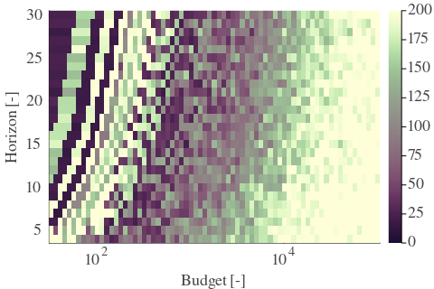 |  | 
| Std |  |  |  | 

| Cₚ = 2 | γ = 0.65, S = 33.23% | γ = 0.7, S = 43.82% | γ = 0.75, S = 57.75% | 
| --- | --- | --- | --- | 
| Mean |  |  |  | 
| Std |  |  |  | 

| Cₚ = 2 | γ = 0.8, S = 68.7% | γ = 0.85, S = 71.1% | γ = 0.9, S = 71.05% | 
| --- | --- | --- | --- | 
| Mean |  |  |  | 
| Std |  |  |  | 

| Cₚ = 2 | γ = 0.95, S = 67.87% | γ = 1.0, S = 59.68% | 
| --- | --- | --- | 
| Mean |  |  | 
| Std |  | 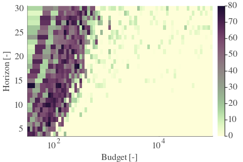 | 

---

**Exploration parameter = 4**

| Cₚ = 4 | γ = 0.5, S = 18.52% | γ = 0.55, S = 17.37% | γ = 0.6, S = 18.47% | 
| --- | --- | --- | --- | 
| Mean |  |  |  | 
| Std |  |  |  | 

| Cₚ = 4 | γ = 0.65, S = 21.91% | γ = 0.7, S = 27.33% | γ = 0.75, S = 35.99% | 
| --- | --- | --- | --- | 
| Mean |  |  |  | 
| Std |  |  |  | 

| Cₚ = 4 | γ = 0.8, S = 46.95% | γ = 0.85, S = 60.88% | γ = 0.9, S = 70.58% | 
| --- | --- | --- | --- | 
| Mean |  |  |  | 
| Std |  |  |  | 

| Cₚ = 4 | γ = 0.95, S = 72.82% | γ = 1.0, S = 70.53% | 
| --- | --- | --- | 
| Mean |  |  | 
| Std |  |  | 

---

**Exploration parameter = 8**

| Cₚ = 8 | γ = 0.5, S = 20.45% | γ = 0.55, S = 19.35% | γ = 0.6, S = 17.58% | 
| --- | --- | --- | --- | 
| Mean |  |  |  | 
| Std |  |  |  | 

| Cₚ = 8 | γ = 0.65, S = 18.41% | γ = 0.7, S = 20.24% | γ = 0.75, S = 24.78% | 
| --- | --- | --- | --- | 
| Mean |  |  |  | 
| Std |  |  | 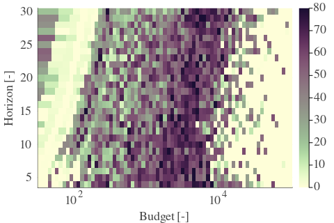 | 

| Cₚ = 8 | γ = 0.8, S = 30.73% | γ = 0.85, S = 43.51% | γ = 0.9, S = 52.53% | 
| --- | --- | --- | --- | 
| Mean | 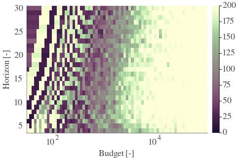 | 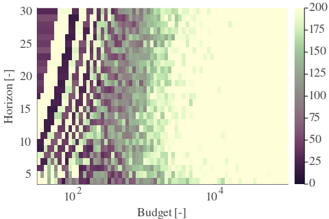 |  | 
| Std |  | 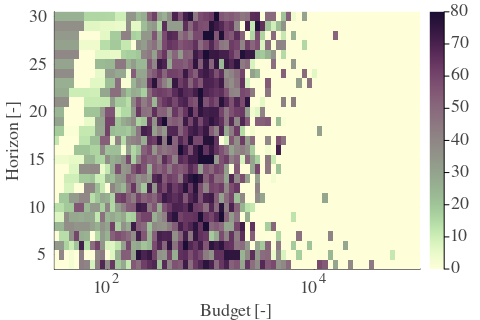 |  | 

| Cₚ = 8 | γ = 0.95, S = 65.78% | γ = 1.0, S = 70.89% | 
| --- | --- | --- | 
| Mean |  |  | 
| Std |  |  | 

---

**Exploration parameter = 16**

| Cₚ = 16 | γ = 0.5, S = 23.32% | γ = 0.55, S = 21.28% | γ = 0.6, S = 19.72% | 
| --- | --- | --- | --- | 
| Mean |  |  |  | 
| Std |  |  |  | 

| Cₚ = 16 | γ = 0.65, S = 17.94% | γ = 0.7, S = 16.9% | γ = 0.75, S = 17.32% | 
| --- | --- | --- | --- | 
| Mean |  |  |  | 
| Std |  |  |  | 

| Cₚ = 16 | γ = 0.8, S = 22.69% | γ = 0.85, S = 28.43% | γ = 0.9, S = 35.32% | 
| --- | --- | --- | --- | 
| Mean |  |  |  | 
| Std |  |  |  | 

| Cₚ = 16 | γ = 0.95, S = 47.57% | γ = 1.0, S = 57.75% | 
| --- | --- | --- | 
| Mean |  |  | 
| Std |  |  | 

---

**Exploration parameter = 32**

| Cₚ = 32 | γ = 0.5, S = 26.08% | γ = 0.55, S = 24.57% | γ = 0.6, S = 22.59% | 
| --- | --- | --- | --- | 
| Mean |  |  |  | 
| Std |  |  |  | 

| Cₚ = 32 | γ = 0.65, S = 20.71% | γ = 0.7, S = 19.09% | γ = 0.75, S = 16.95% | 
| --- | --- | --- | --- | 
| Mean |  |  |  | 
| Std |  |  |  | 

| Cₚ = 32 | γ = 0.8, S = 15.86% | γ = 0.85, S = 18.36% | γ = 0.9, S = 26.4% | 
| --- | --- | --- | --- | 
| Mean |  |  |  | 
| Std |  |  |  | 

| Cₚ = 32 | γ = 0.95, S = 32.45% | γ = 1.0, S = 41.84% | 
| --- | --- | --- | 
| Mean |  |  | 
| Std |  |  | 

---

**Exploration parameter = 64**

| Cₚ = 64 | γ = 0.5, S = 28.95% | γ = 0.55, S = 26.97% | γ = 0.6, S = 25.4% | 
| --- | --- | --- | --- | 
| Mean |  |  |  | 
| Std |  |  |  | 

| Cₚ = 64 | γ = 0.65, S = 23.58% | γ = 0.7, S = 21.86% | γ = 0.75, S = 20.03% | 
| --- | --- | --- | --- | 
| Mean |  |  |  | 
| Std | 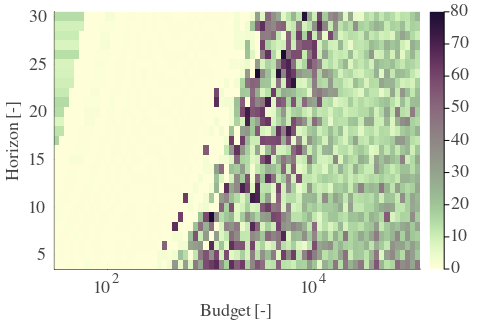 |  |  | 

| Cₚ = 64 | γ = 0.8, S = 17.74% | γ = 0.85, S = 15.55% | γ = 0.9, S = 15.81% | 
| --- | --- | --- | --- | 
| Mean |  |  |  | 
| Std |  |  |  | 

| Cₚ = 64 | γ = 0.95, S = 22.69% | γ = 1.0, S = 28.17% | 
| --- | --- | --- | 
| Mean |  |  | 
| Std |  |  | 

---

**Exploration parameter = 128**

| Cₚ = 128 | γ = 0.5, S = 31.98% | γ = 0.55, S = 29.99% | γ = 0.6, S = 28.27% | 
| --- | --- | --- | --- | 
| Mean |  |  |  | 
| Std |  |  |  | 

| Cₚ = 128 | γ = 0.65, S = 26.29% | γ = 0.7, S = 24.99% | γ = 0.75, S = 23.53% | 
| --- | --- | --- | --- | 
| Mean |  |  |  | 
| Std | 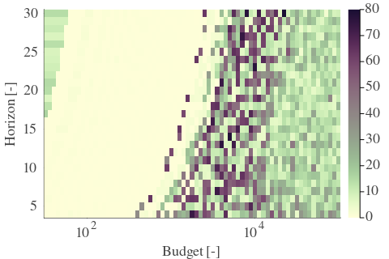 | 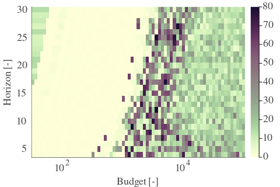 |  | 

| Cₚ = 128 | γ = 0.8, S = 20.81% | γ = 0.85, S = 18.47% | γ = 0.9, S = 16.38% | 
| --- | --- | --- | --- | 
| Mean |  |  |  | 
| Std |  |  |  | 

| Cₚ = 128 | γ = 0.95, S = 15.7% | γ = 1.0, S = 20.71% | 
| --- | --- | --- | 
| Mean | 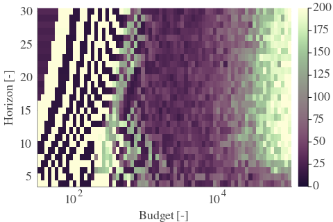 | 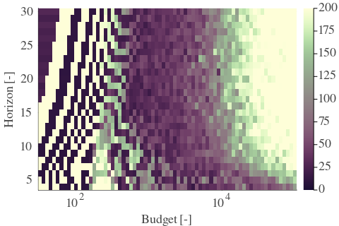 | 
| Std |  |  | 

---

**Exploration parameter = 256**

| Cₚ = 256 | γ = 0.5, S = 34.9% | γ = 0.55, S = 32.6% | γ = 0.6, S = 31.35% | 
| --- | --- | --- | --- | 
| Mean |  |  |  | 
| Std |  |  |  | 

| Cₚ = 256 | γ = 0.65, S = 29.06% | γ = 0.7, S = 27.65% | γ = 0.75, S = 26.13% | 
| --- | --- | --- | --- | 
| Mean |  |  |  | 
| Std |  |  |  | 

| Cₚ = 256 | γ = 0.8, S = 24.26% | γ = 0.85, S = 22.22% | γ = 0.9, S = 19.35% | 
| --- | --- | --- | --- | 
| Mean |  |  |  | 
| Std |  |  |  | 

| Cₚ = 256 | γ = 0.95, S = 17.48% | γ = 1.0, S = 15.6% | 
| --- | --- | --- | 
| Mean |  |  | 
| Std |  |  | 

---

**Exploration parameter = 512**

| Cₚ = 512 | γ = 0.5, S = 37.66% | γ = 0.55, S = 35.58% | γ = 0.6, S = 34.12% | 
| --- | --- | --- | --- | 
| Mean |  |  |  | 
| Std |  |  |  | 

| Cₚ = 512 | γ = 0.65, S = 32.24% | γ = 0.7, S = 30.2% | γ = 0.75, S = 28.9% | 
| --- | --- | --- | --- | 
| Mean |  |  |  | 
| Std |  |  | 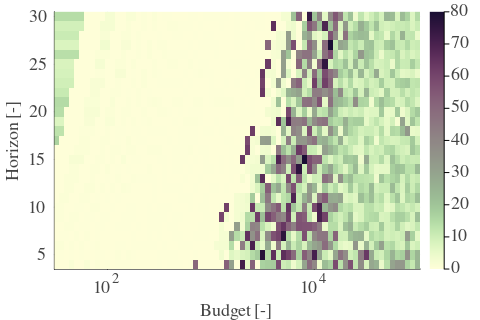 | 

| Cₚ = 512 | γ = 0.8, S = 26.86% | γ = 0.85, S = 25.25% | γ = 0.9, S = 23.06% | 
| --- | --- | --- | --- | 
| Mean |  |  |  | 
| Std |  |  |  | 

| Cₚ = 512 | γ = 0.95, S = 20.45% | γ = 1.0, S = 18.21% | 
| --- | --- | --- | 
| Mean |  |  | 
| Std |  |  | 

---

**Exploration parameter = 1024**

| Cₚ = 1024 | γ = 0.5, S = 40.95% | γ = 0.55, S = 38.34% | γ = 0.6, S = 36.93% | 
| --- | --- | --- | --- | 
| Mean |  |  |  | 
| Std | 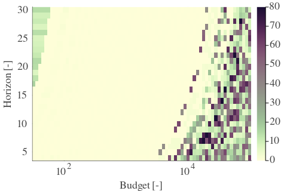 |  | 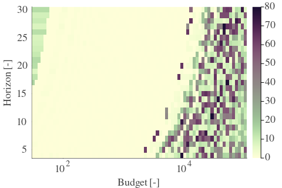 | 

| Cₚ = 1024 | γ = 0.65, S = 34.69% | γ = 0.7, S = 33.28% | γ = 0.75, S = 31.66% | 
| --- | --- | --- | --- | 
| Mean |  |  |  | 
| Std |  |  |  | 

| Cₚ = 1024 | γ = 0.8, S = 29.79% | γ = 0.85, S = 27.8% | γ = 0.9, S = 26.45% | 
| --- | --- | --- | --- | 
| Mean |  |  | 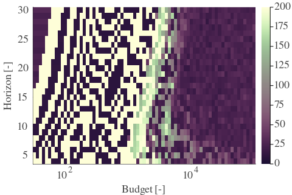 | 
| Std |  |  |  | 

| Cₚ = 1024 | γ = 0.95, S = 24.1% | γ = 1.0, S = 21.39% | 
| --- | --- | --- | 
| Mean |  |  | 
| Std |  |  | 

