# Results for the file sp_AL_20230330.csv 

Generated on 2023-11-03 14:14:19

---

**Exploration parameter = 0**

| Cₚ = 0 | γ = 0.5, S = 0.0% | γ = 0.55, S = 0.0% | γ = 0.6, S = 0.0% | 
| --- | --- | --- | --- | 
| Mean |  |  |  | 
| Std |  |  |  | 

| Cₚ = 0 | γ = 0.65, S = 0.0% | γ = 0.7, S = 0.0% | γ = 0.75, S = 0.0% | 
| --- | --- | --- | --- | 
| Mean |  |  |  | 
| Std |  |  |  | 

| Cₚ = 0 | γ = 0.8, S = 0.0% | γ = 0.85, S = 0.0% | γ = 0.9, S = 0.0% | 
| --- | --- | --- | --- | 
| Mean |  |  |  | 
| Std |  |  |  | 

| Cₚ = 0 | γ = 0.95, S = 0.0% | γ = 1.0, S = 0.0% | 
| --- | --- | --- | 
| Mean |  |  | 
| Std |  |  | 

---

**Exploration parameter = 2**

| Cₚ = 2 | γ = 0.5, S = 14.24% | γ = 0.55, S = 19.51% | γ = 0.6, S = 27.18% | 
| --- | --- | --- | --- | 
| Mean |  | 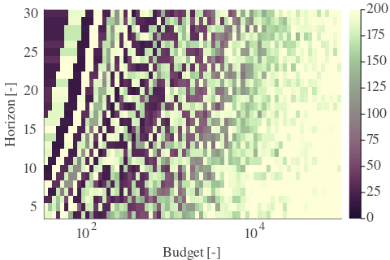 |  | 
| Std |  |  |  | 

| Cₚ = 2 | γ = 0.65, S = 38.55% | γ = 0.7, S = 49.92% | γ = 0.75, S = 62.39% | 
| --- | --- | --- | --- | 
| Mean |  |  |  | 
| Std |  |  | 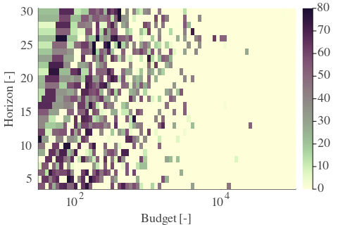 | 

| Cₚ = 2 | γ = 0.8, S = 72.04% | γ = 0.85, S = 73.08% | γ = 0.9, S = 75.12% | 
| --- | --- | --- | --- | 
| Mean |  |  |  | 
| Std |  |  |  | 

| Cₚ = 2 | γ = 0.95, S = 74.49% | γ = 1.0, S = 73.6% | 
| --- | --- | --- | 
| Mean |  |  | 
| Std |  |  | 

---

**Exploration parameter = 4**

| Cₚ = 4 | γ = 0.5, S = 13.3% | γ = 0.55, S = 14.81% | γ = 0.6, S = 17.16% | 
| --- | --- | --- | --- | 
| Mean |  |  |  | 
| Std |  |  |  | 

| Cₚ = 4 | γ = 0.65, S = 19.87% | γ = 0.7, S = 31.3% | γ = 0.75, S = 40.64% | 
| --- | --- | --- | --- | 
| Mean |  |  |  | 
| Std |  |  |  | 

| Cₚ = 4 | γ = 0.8, S = 51.49% | γ = 0.85, S = 61.87% | γ = 0.9, S = 72.77% | 
| --- | --- | --- | --- | 
| Mean |  | 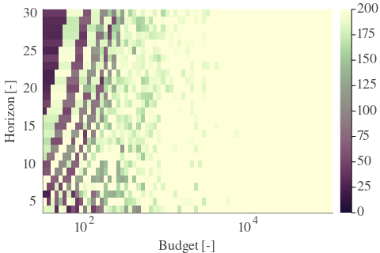 |  | 
| Std |  |  | 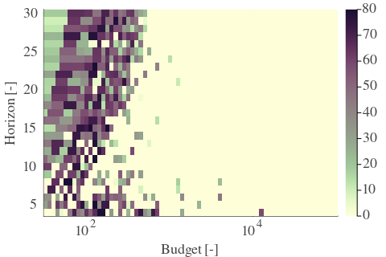 | 

| Cₚ = 4 | γ = 0.95, S = 76.26% | γ = 1.0, S = 78.77% | 
| --- | --- | --- | 
| Mean |  |  | 
| Std |  |  | 

---

**Exploration parameter = 8**

| Cₚ = 8 | γ = 0.5, S = 15.55% | γ = 0.55, S = 14.24% | γ = 0.6, S = 14.29% | 
| --- | --- | --- | --- | 
| Mean |  | 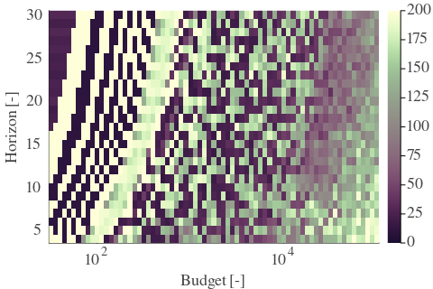 |  | 
| Std |  |  |  | 

| Cₚ = 8 | γ = 0.65, S = 14.76% | γ = 0.7, S = 20.19% | γ = 0.75, S = 25.46% | 
| --- | --- | --- | --- | 
| Mean |  |  |  | 
| Std |  |  |  | 

| Cₚ = 8 | γ = 0.8, S = 34.17% | γ = 0.85, S = 43.71% | γ = 0.9, S = 55.61% | 
| --- | --- | --- | --- | 
| Mean |  |  |  | 
| Std |  |  |  | 

| Cₚ = 8 | γ = 0.95, S = 65.78% | γ = 1.0, S = 75.17% | 
| --- | --- | --- | 
| Mean |  |  | 
| Std |  |  | 

---

**Exploration parameter = 16**

| Cₚ = 16 | γ = 0.5, S = 18.88% | γ = 0.55, S = 17.68% | γ = 0.6, S = 15.23% | 
| --- | --- | --- | --- | 
| Mean |  |  |  | 
| Std |  |  |  | 

| Cₚ = 16 | γ = 0.65, S = 13.67% | γ = 0.7, S = 13.56% | γ = 0.75, S = 15.49% | 
| --- | --- | --- | --- | 
| Mean |  |  |  | 
| Std |  |  |  | 

| Cₚ = 16 | γ = 0.8, S = 21.23% | γ = 0.85, S = 28.17% | γ = 0.9, S = 36.57% | 
| --- | --- | --- | --- | 
| Mean | 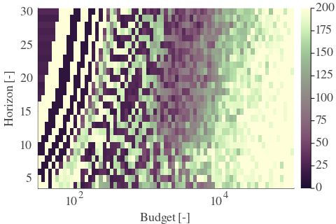 |  |  | 
| Std |  |  |  | 

| Cₚ = 16 | γ = 0.95, S = 47.52% | γ = 1.0, S = 57.64% | 
| --- | --- | --- | 
| Mean |  |  | 
| Std |  |  | 

---

**Exploration parameter = 32**

| Cₚ = 32 | γ = 0.5, S = 21.34% | γ = 0.55, S = 19.67% | γ = 0.6, S = 19.14% | 
| --- | --- | --- | --- | 
| Mean |  | 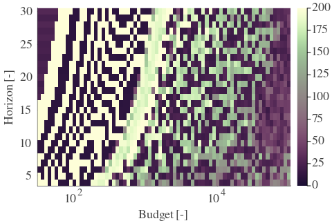 |  | 
| Std |  |  |  | 

| Cₚ = 32 | γ = 0.65, S = 17.53% | γ = 0.7, S = 15.23% | γ = 0.75, S = 14.45% | 
| --- | --- | --- | --- | 
| Mean |  |  |  | 
| Std |  |  |  | 

| Cₚ = 32 | γ = 0.8, S = 13.72% | γ = 0.85, S = 17.01% | γ = 0.9, S = 24.62% | 
| --- | --- | --- | --- | 
| Mean |  |  |  | 
| Std |  |  |  | 

| Cₚ = 32 | γ = 0.95, S = 32.5% | γ = 1.0, S = 41.73% | 
| --- | --- | --- | 
| Mean |  |  | 
| Std |  |  | 

---

**Exploration parameter = 64**

| Cₚ = 64 | γ = 0.5, S = 24.78% | γ = 0.55, S = 22.85% | γ = 0.6, S = 21.07% | 
| --- | --- | --- | --- | 
| Mean |  |  |  | 
| Std |  |  |  | 

| Cₚ = 64 | γ = 0.65, S = 19.46% | γ = 0.7, S = 17.48% | γ = 0.75, S = 17.32% | 
| --- | --- | --- | --- | 
| Mean |  |  |  | 
| Std |  | 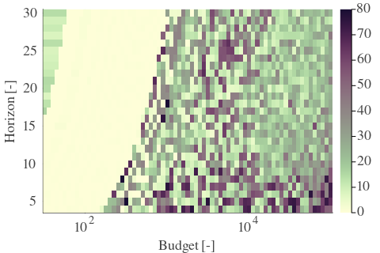 |  | 

| Cₚ = 64 | γ = 0.8, S = 16.28% | γ = 0.85, S = 14.4% | γ = 0.9, S = 15.13% | 
| --- | --- | --- | --- | 
| Mean |  |  |  | 
| Std |  |  |  | 

| Cₚ = 64 | γ = 0.95, S = 21.7% | γ = 1.0, S = 28.79% | 
| --- | --- | --- | 
| Mean |  |  | 
| Std |  | 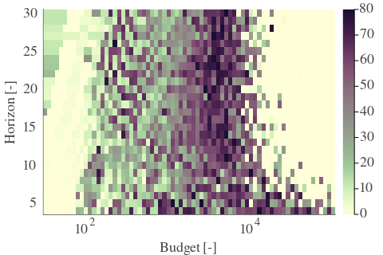 | 

---

**Exploration parameter = 128**

| Cₚ = 128 | γ = 0.5, S = 27.91% | γ = 0.55, S = 25.87% | γ = 0.6, S = 24.62% | 
| --- | --- | --- | --- | 
| Mean |  |  |  | 
| Std |  |  |  | 

| Cₚ = 128 | γ = 0.65, S = 22.48% | γ = 0.7, S = 20.81% | γ = 0.75, S = 19.04% | 
| --- | --- | --- | --- | 
| Mean |  |  |  | 
| Std |  |  |  | 

| Cₚ = 128 | γ = 0.8, S = 18.15% | γ = 0.85, S = 17.32% | γ = 0.9, S = 15.91% | 
| --- | --- | --- | --- | 
| Mean |  |  |  | 
| Std |  |  |  | 

| Cₚ = 128 | γ = 0.95, S = 14.71% | γ = 1.0, S = 18.1% | 
| --- | --- | --- | 
| Mean |  |  | 
| Std |  |  | 

---

**Exploration parameter = 256**

| Cₚ = 256 | γ = 0.5, S = 30.1% | γ = 0.55, S = 28.59% | γ = 0.6, S = 27.8% | 
| --- | --- | --- | --- | 
| Mean |  |  |  | 
| Std |  |  |  | 

| Cₚ = 256 | γ = 0.65, S = 25.87% | γ = 0.7, S = 24.2% | γ = 0.75, S = 22.48% | 
| --- | --- | --- | --- | 
| Mean | 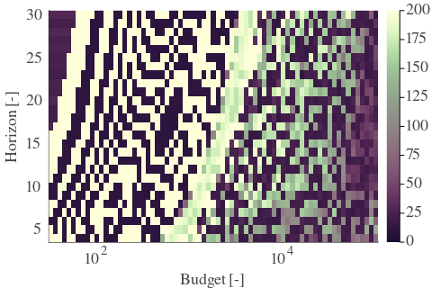 |  |  | 
| Std |  |  |  | 

| Cₚ = 256 | γ = 0.8, S = 21.49% | γ = 0.85, S = 19.87% | γ = 0.9, S = 18.47% | 
| --- | --- | --- | --- | 
| Mean |  |  |  | 
| Std | 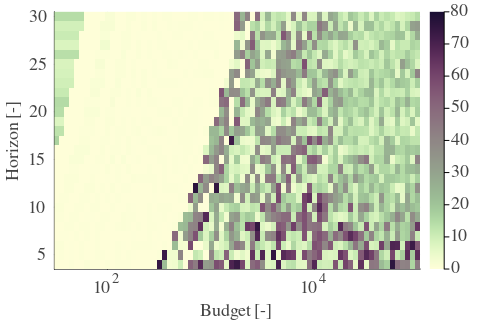 |  |  | 

| Cₚ = 256 | γ = 0.95, S = 17.32% | γ = 1.0, S = 15.55% | 
| --- | --- | --- | 
| Mean |  |  | 
| Std |  |  | 

---

**Exploration parameter = 512**

| Cₚ = 512 | γ = 0.5, S = 32.86% | γ = 0.55, S = 31.56% | γ = 0.6, S = 30.15% | 
| --- | --- | --- | --- | 
| Mean |  |  |  | 
| Std |  | 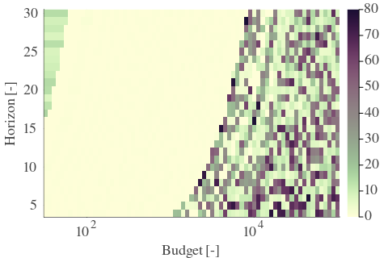 |  | 

| Cₚ = 512 | γ = 0.65, S = 28.48% | γ = 0.7, S = 26.81% | γ = 0.75, S = 25.87% | 
| --- | --- | --- | --- | 
| Mean |  |  |  | 
| Std |  |  |  | 

| Cₚ = 512 | γ = 0.8, S = 24.47% | γ = 0.85, S = 23.47% | γ = 0.9, S = 22.22% | 
| --- | --- | --- | --- | 
| Mean |  |  |  | 
| Std |  |  |  | 

| Cₚ = 512 | γ = 0.95, S = 19.72% | γ = 1.0, S = 18.36% | 
| --- | --- | --- | 
| Mean |  |  | 
| Std |  | 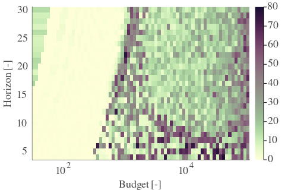 | 

---

**Exploration parameter = 1024**

| Cₚ = 1024 | γ = 0.5, S = 36.1% | γ = 0.55, S = 34.59% | γ = 0.6, S = 32.86% | 
| --- | --- | --- | --- | 
| Mean |  |  |  | 
| Std |  |  |  | 

| Cₚ = 1024 | γ = 0.65, S = 31.35% | γ = 0.7, S = 29.73% | γ = 0.75, S = 28.43% | 
| --- | --- | --- | --- | 
| Mean |  |  |  | 
| Std |  |  |  | 

| Cₚ = 1024 | γ = 0.8, S = 27.13% | γ = 0.85, S = 26.5% | γ = 0.9, S = 25.14% | 
| --- | --- | --- | --- | 
| Mean |  |  |  | 
| Std |  |  |  | 

| Cₚ = 1024 | γ = 0.95, S = 23.84% | γ = 1.0, S = 21.6% | 
| --- | --- | --- | 
| Mean |  |  | 
| Std |  |  | 

