# Results for the file sp_AN_20230401.csv 

Generated on 2023-11-03 14:14:20

---

**Exploration parameter = 0**

| Cₚ = 0 | γ = 0.5, S = 0.0% | γ = 0.55, S = 0.0% | γ = 0.6, S = 0.0% | 
| --- | --- | --- | --- | 
| Mean |  |  |  | 
| Std |  |  |  | 

| Cₚ = 0 | γ = 0.65, S = 0.0% | γ = 0.7, S = 0.0% | γ = 0.75, S = 0.0% | 
| --- | --- | --- | --- | 
| Mean |  |  |  | 
| Std |  |  |  | 

| Cₚ = 0 | γ = 0.8, S = 0.0% | γ = 0.85, S = 0.0% | γ = 0.9, S = 0.0% | 
| --- | --- | --- | --- | 
| Mean |  |  |  | 
| Std |  |  |  | 

| Cₚ = 0 | γ = 0.95, S = 0.0% | γ = 1.0, S = 0.0% | 
| --- | --- | --- | 
| Mean |  |  | 
| Std |  |  | 

---

**Exploration parameter = 2**

| Cₚ = 2 | γ = 0.5, S = 9.08% | γ = 0.55, S = 11.74% | γ = 0.6, S = 18.57% | 
| --- | --- | --- | --- | 
| Mean |  |  |  | 
| Std |  |  |  | 

| Cₚ = 2 | γ = 0.65, S = 27.23% | γ = 0.7, S = 37.19% | γ = 0.75, S = 46.11% | 
| --- | --- | --- | --- | 
| Mean |  |  |  | 
| Std |  |  |  | 

| Cₚ = 2 | γ = 0.8, S = 61.09% | γ = 0.85, S = 66.35% | γ = 0.9, S = 52.79% | 
| --- | --- | --- | --- | 
| Mean |  |  |  | 
| Std |  |  |  | 

| Cₚ = 2 | γ = 0.95, S = 32.39% | γ = 1.0, S = 21.6% | 
| --- | --- | --- | 
| Mean |  |  | 
| Std |  |  | 

---

**Exploration parameter = 4**

| Cₚ = 4 | γ = 0.5, S = 13.35% | γ = 0.55, S = 12.62% | γ = 0.6, S = 10.33% | 
| --- | --- | --- | --- | 
| Mean |  |  | 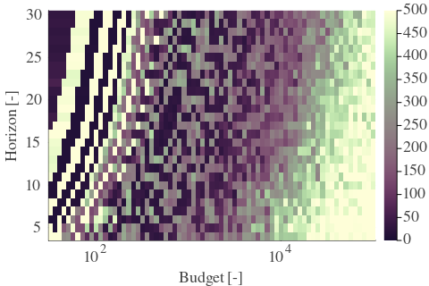 | 
| Std |  |  |  | 

| Cₚ = 4 | γ = 0.65, S = 14.24% | γ = 0.7, S = 19.41% | γ = 0.75, S = 28.59% | 
| --- | --- | --- | --- | 
| Mean |  |  |  | 
| Std |  |  |  | 

| Cₚ = 4 | γ = 0.8, S = 37.35% | γ = 0.85, S = 48.57% | γ = 0.9, S = 59.21% | 
| --- | --- | --- | --- | 
| Mean |  |  |  | 
| Std |  |  |  | 

| Cₚ = 4 | γ = 0.95, S = 54.3% | γ = 1.0, S = 33.96% | 
| --- | --- | --- | 
| Mean |  |  | 
| Std |  |  | 

---

**Exploration parameter = 8**

| Cₚ = 8 | γ = 0.5, S = 17.48% | γ = 0.55, S = 14.97% | γ = 0.6, S = 13.51% | 
| --- | --- | --- | --- | 
| Mean |  |  |  | 
| Std |  |  |  | 

| Cₚ = 8 | γ = 0.65, S = 12.78% | γ = 0.7, S = 13.15% | γ = 0.75, S = 14.81% | 
| --- | --- | --- | --- | 
| Mean |  |  |  | 
| Std |  |  |  | 

| Cₚ = 8 | γ = 0.8, S = 21.54% | γ = 0.85, S = 31.14% | γ = 0.9, S = 41.58% | 
| --- | --- | --- | --- | 
| Mean |  |  |  | 
| Std |  |  |  | 

| Cₚ = 8 | γ = 0.95, S = 50.86% | γ = 1.0, S = 43.56% | 
| --- | --- | --- | 
| Mean |  | 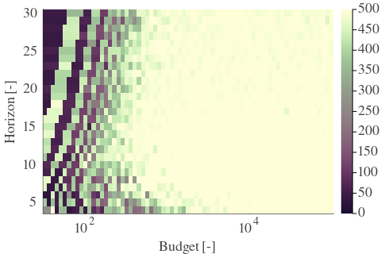 | 
| Std |  |  | 

---

**Exploration parameter = 16**

| Cₚ = 16 | γ = 0.5, S = 18.41% | γ = 0.55, S = 18.36% | γ = 0.6, S = 17.48% | 
| --- | --- | --- | --- | 
| Mean |  |  |  | 
| Std |  |  |  | 

| Cₚ = 16 | γ = 0.65, S = 15.18% | γ = 0.7, S = 13.3% | γ = 0.75, S = 11.84% | 
| --- | --- | --- | --- | 
| Mean |  |  |  | 
| Std | 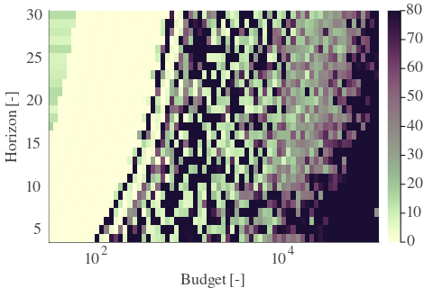 |  |  | 

| Cₚ = 16 | γ = 0.8, S = 12.99% | γ = 0.85, S = 16.22% | γ = 0.9, S = 24.99% | 
| --- | --- | --- | --- | 
| Mean |  |  |  | 
| Std |  |  | 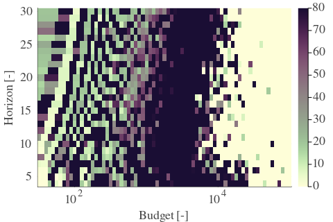 | 

| Cₚ = 16 | γ = 0.95, S = 35.58% | γ = 1.0, S = 43.19% | 
| --- | --- | --- | 
| Mean |  |  | 
| Std |  |  | 

---

**Exploration parameter = 32**

| Cₚ = 32 | γ = 0.5, S = 21.91% | γ = 0.55, S = 20.45% | γ = 0.6, S = 18.26% | 
| --- | --- | --- | --- | 
| Mean | 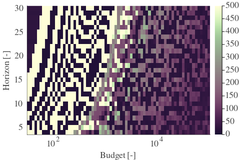 |  |  | 
| Std |  |  |  | 

| Cₚ = 32 | γ = 0.65, S = 18.36% | γ = 0.7, S = 17.42% | γ = 0.75, S = 14.66% | 
| --- | --- | --- | --- | 
| Mean | 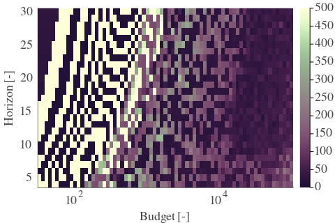 |  |  | 
| Std |  |  |  | 

| Cₚ = 32 | γ = 0.8, S = 11.95% | γ = 0.85, S = 9.6% | γ = 0.9, S = 12.88% | 
| --- | --- | --- | --- | 
| Mean |  |  |  | 
| Std |  |  |  | 

| Cₚ = 32 | γ = 0.95, S = 20.34% | γ = 1.0, S = 29.99% | 
| --- | --- | --- | 
| Mean |  |  | 
| Std |  |  | 

---

**Exploration parameter = 64**

| Cₚ = 64 | γ = 0.5, S = 25.3% | γ = 0.55, S = 24.41% | γ = 0.6, S = 22.33% | 
| --- | --- | --- | --- | 
| Mean |  |  |  | 
| Std |  |  |  | 

| Cₚ = 64 | γ = 0.65, S = 20.19% | γ = 0.7, S = 19.2% | γ = 0.75, S = 18.0% | 
| --- | --- | --- | --- | 
| Mean | 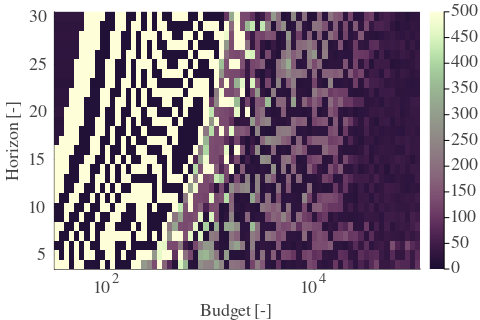 |  |  | 
| Std |  |  |  | 

| Cₚ = 64 | γ = 0.8, S = 15.86% | γ = 0.85, S = 12.47% | γ = 0.9, S = 9.49% | 
| --- | --- | --- | --- | 
| Mean |  |  |  | 
| Std |  |  |  | 

| Cₚ = 64 | γ = 0.95, S = 9.86% | γ = 1.0, S = 15.86% | 
| --- | --- | --- | 
| Mean |  | 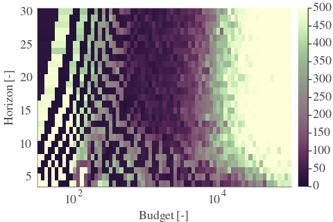 | 
| Std |  |  | 

---

**Exploration parameter = 128**

| Cₚ = 128 | γ = 0.5, S = 28.01% | γ = 0.55, S = 27.28% | γ = 0.6, S = 25.61% | 
| --- | --- | --- | --- | 
| Mean |  | 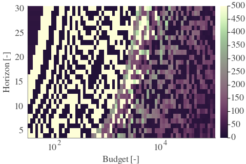 |  | 
| Std |  |  |  | 

| Cₚ = 128 | γ = 0.65, S = 24.47% | γ = 0.7, S = 22.69% | γ = 0.75, S = 20.34% | 
| --- | --- | --- | --- | 
| Mean |  |  |  | 
| Std |  | 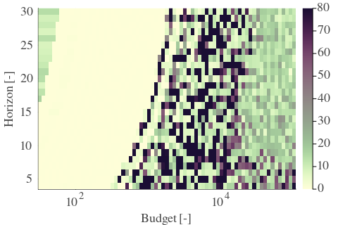 |  | 

| Cₚ = 128 | γ = 0.8, S = 18.31% | γ = 0.85, S = 15.91% | γ = 0.9, S = 12.94% | 
| --- | --- | --- | --- | 
| Mean |  |  |  | 
| Std |  |  |  | 

| Cₚ = 128 | γ = 0.95, S = 9.34% | γ = 1.0, S = 6.1% | 
| --- | --- | --- | 
| Mean |  |  | 
| Std |  |  | 

---

**Exploration parameter = 256**

| Cₚ = 256 | γ = 0.5, S = 30.73% | γ = 0.55, S = 29.37% | γ = 0.6, S = 28.59% | 
| --- | --- | --- | --- | 
| Mean |  |  |  | 
| Std | 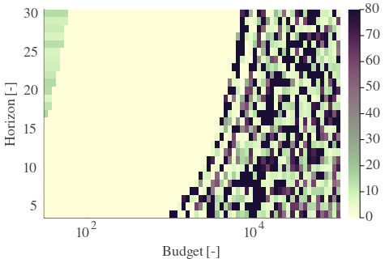 |  |  | 

| Cₚ = 256 | γ = 0.65, S = 27.54% | γ = 0.7, S = 25.98% | γ = 0.75, S = 24.78% | 
| --- | --- | --- | --- | 
| Mean |  |  |  | 
| Std |  |  |  | 

| Cₚ = 256 | γ = 0.8, S = 22.22% | γ = 0.85, S = 18.83% | γ = 0.9, S = 15.75% | 
| --- | --- | --- | --- | 
| Mean |  |  |  | 
| Std |  |  |  | 

| Cₚ = 256 | γ = 0.95, S = 12.73% | γ = 1.0, S = 8.82% | 
| --- | --- | --- | 
| Mean |  |  | 
| Std |  |  | 

---

**Exploration parameter = 512**

| Cₚ = 512 | γ = 0.5, S = 33.75% | γ = 0.55, S = 32.5% | γ = 0.6, S = 30.93% | 
| --- | --- | --- | --- | 
| Mean |  |  |  | 
| Std |  |  |  | 

| Cₚ = 512 | γ = 0.65, S = 29.89% | γ = 0.7, S = 28.85% | γ = 0.75, S = 28.17% | 
| --- | --- | --- | --- | 
| Mean |  |  |  | 
| Std |  |  |  | 

| Cₚ = 512 | γ = 0.8, S = 25.04% | γ = 0.85, S = 22.8% | γ = 0.9, S = 19.41% | 
| --- | --- | --- | --- | 
| Mean |  |  |  | 
| Std |  |  |  | 

| Cₚ = 512 | γ = 0.95, S = 15.34% | γ = 1.0, S = 12.05% | 
| --- | --- | --- | 
| Mean |  |  | 
| Std |  |  | 

---

**Exploration parameter = 1024**

| Cₚ = 1024 | γ = 0.5, S = 36.72% | γ = 0.55, S = 35.16% | γ = 0.6, S = 33.96% | 
| --- | --- | --- | --- | 
| Mean |  | 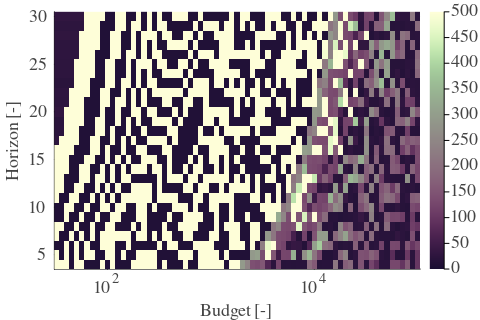 | 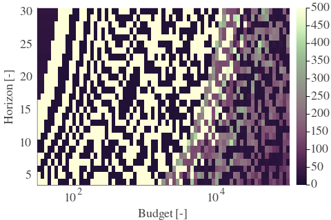 | 
| Std |  |  |  | 

| Cₚ = 1024 | γ = 0.65, S = 32.45% | γ = 0.7, S = 31.61% | γ = 0.75, S = 30.57% | 
| --- | --- | --- | --- | 
| Mean |  |  |  | 
| Std |  |  |  | 

| Cₚ = 1024 | γ = 0.8, S = 28.33% | γ = 0.85, S = 26.03% | γ = 0.9, S = 22.9% | 
| --- | --- | --- | --- | 
| Mean |  | 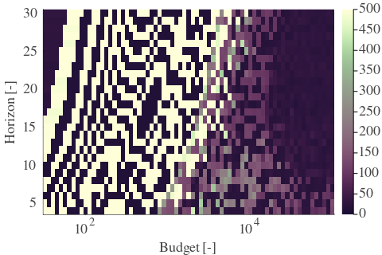 |  | 
| Std |  |  |  | 

| Cₚ = 1024 | γ = 0.95, S = 19.04% | γ = 1.0, S = 15.55% | 
| --- | --- | --- | 
| Mean |  |  | 
| Std |  |  | 

