# Results for the file sp_AO_20230401.csv 

Generated on 2023-11-03 14:14:20

---

**Exploration parameter = 0**

| Cₚ = 0 | γ = 0.5, S = 0.0% | γ = 0.55, S = 0.0% | γ = 0.6, S = 0.0% | 
| --- | --- | --- | --- | 
| Mean |  |  |  | 
| Std |  |  |  | 

| Cₚ = 0 | γ = 0.65, S = 0.0% | γ = 0.7, S = 0.0% | γ = 0.75, S = 0.0% | 
| --- | --- | --- | --- | 
| Mean |  |  |  | 
| Std |  |  |  | 

| Cₚ = 0 | γ = 0.8, S = 0.0% | γ = 0.85, S = 0.0% | γ = 0.9, S = 0.0% | 
| --- | --- | --- | --- | 
| Mean |  |  |  | 
| Std |  |  |  | 

| Cₚ = 0 | γ = 0.95, S = 0.0% | γ = 1.0, S = 0.0% | 
| --- | --- | --- | 
| Mean |  |  | 
| Std |  |  | 

---

**Exploration parameter = 2**

| Cₚ = 2 | γ = 0.5, S = 9.96% | γ = 0.55, S = 10.49% | γ = 0.6, S = 14.24% | 
| --- | --- | --- | --- | 
| Mean |  |  |  | 
| Std |  |  |  | 

| Cₚ = 2 | γ = 0.65, S = 23.58% | γ = 0.7, S = 32.6% | γ = 0.75, S = 41.58% | 
| --- | --- | --- | --- | 
| Mean |  |  |  | 
| Std |  |  |  | 

| Cₚ = 2 | γ = 0.8, S = 56.39% | γ = 0.85, S = 63.75% | γ = 0.9, S = 45.44% | 
| --- | --- | --- | --- | 
| Mean |  |  |  | 
| Std |  |  |  | 

| Cₚ = 2 | γ = 0.95, S = 27.44% | γ = 1.0, S = 17.58% | 
| --- | --- | --- | 
| Mean |  |  | 
| Std |  |  | 

---

**Exploration parameter = 4**

| Cₚ = 4 | γ = 0.5, S = 13.72% | γ = 0.55, S = 10.75% | γ = 0.6, S = 8.97% | 
| --- | --- | --- | --- | 
| Mean |  |  |  | 
| Std |  |  |  | 

| Cₚ = 4 | γ = 0.65, S = 11.11% | γ = 0.7, S = 16.01% | γ = 0.75, S = 24.67% | 
| --- | --- | --- | --- | 
| Mean |  |  |  | 
| Std |  |  |  | 

| Cₚ = 4 | γ = 0.8, S = 34.95% | γ = 0.85, S = 45.33% | γ = 0.9, S = 55.35% | 
| --- | --- | --- | --- | 
| Mean |  |  |  | 
| Std |  |  |  | 

| Cₚ = 4 | γ = 0.95, S = 46.17% | γ = 1.0, S = 25.25% | 
| --- | --- | --- | 
| Mean |  |  | 
| Std |  |  | 

---

**Exploration parameter = 8**

| Cₚ = 8 | γ = 0.5, S = 17.74% | γ = 0.55, S = 15.6% | γ = 0.6, S = 13.93% | 
| --- | --- | --- | --- | 
| Mean |  |  |  | 
| Std |  |  |  | 

| Cₚ = 8 | γ = 0.65, S = 12.31% | γ = 0.7, S = 12.26% | γ = 0.75, S = 12.83% | 
| --- | --- | --- | --- | 
| Mean |  |  |  | 
| Std |  |  |  | 

| Cₚ = 8 | γ = 0.8, S = 18.0% | γ = 0.85, S = 28.38% | γ = 0.9, S = 38.55% | 
| --- | --- | --- | --- | 
| Mean |  |  |  | 
| Std |  |  |  | 

| Cₚ = 8 | γ = 0.95, S = 47.31% | γ = 1.0, S = 37.98% | 
| --- | --- | --- | 
| Mean |  |  | 
| Std |  |  | 

---

**Exploration parameter = 16**

| Cₚ = 16 | γ = 0.5, S = 19.2% | γ = 0.55, S = 18.41% | γ = 0.6, S = 18.26% | 
| --- | --- | --- | --- | 
| Mean |  |  | 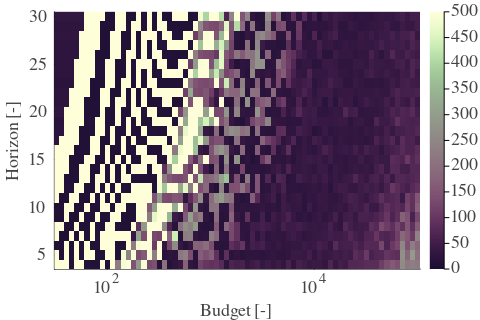 | 
| Std |  |  |  | 

| Cₚ = 16 | γ = 0.65, S = 16.28% | γ = 0.7, S = 13.56% | γ = 0.75, S = 11.58% | 
| --- | --- | --- | --- | 
| Mean |  |  |  | 
| Std |  |  |  | 

| Cₚ = 16 | γ = 0.8, S = 11.74% | γ = 0.85, S = 14.71% | γ = 0.9, S = 21.7% | 
| --- | --- | --- | --- | 
| Mean |  |  |  | 
| Std |  |  |  | 

| Cₚ = 16 | γ = 0.95, S = 33.12% | γ = 1.0, S = 41.0% | 
| --- | --- | --- | 
| Mean |  |  | 
| Std |  |  | 

---

**Exploration parameter = 32**

| Cₚ = 32 | γ = 0.5, S = 22.74% | γ = 0.55, S = 20.97% | γ = 0.6, S = 19.46% | 
| --- | --- | --- | --- | 
| Mean |  |  |  | 
| Std |  |  |  | 

| Cₚ = 32 | γ = 0.65, S = 18.31% | γ = 0.7, S = 17.68% | γ = 0.75, S = 15.7% | 
| --- | --- | --- | --- | 
| Mean |  |  |  | 
| Std | 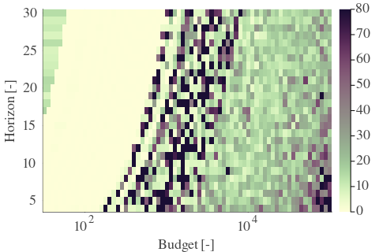 | 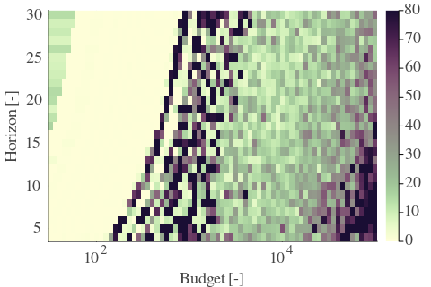 |  | 

| Cₚ = 32 | γ = 0.8, S = 12.68% | γ = 0.85, S = 9.29% | γ = 0.9, S = 10.64% | 
| --- | --- | --- | --- | 
| Mean |  |  |  | 
| Std |  |  |  | 

| Cₚ = 32 | γ = 0.95, S = 17.32% | γ = 1.0, S = 26.81% | 
| --- | --- | --- | 
| Mean |  |  | 
| Std |  |  | 

---

**Exploration parameter = 64**

| Cₚ = 64 | γ = 0.5, S = 25.56% | γ = 0.55, S = 24.52% | γ = 0.6, S = 23.16% | 
| --- | --- | --- | --- | 
| Mean |  |  |  | 
| Std |  |  |  | 

| Cₚ = 64 | γ = 0.65, S = 21.54% | γ = 0.7, S = 19.72% | γ = 0.75, S = 18.31% | 
| --- | --- | --- | --- | 
| Mean |  |  |  | 
| Std |  | 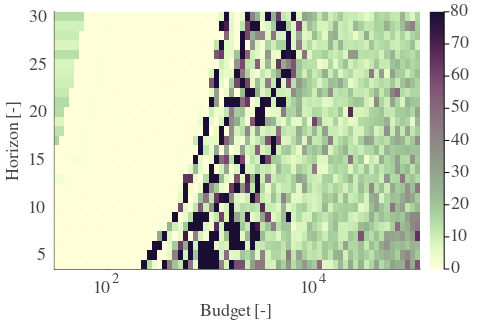 |  | 

| Cₚ = 64 | γ = 0.8, S = 16.12% | γ = 0.85, S = 12.62% | γ = 0.9, S = 9.18% | 
| --- | --- | --- | --- | 
| Mean | 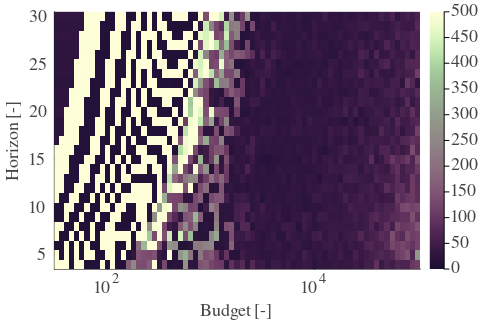 |  |  | 
| Std |  |  |  | 

| Cₚ = 64 | γ = 0.95, S = 7.2% | γ = 1.0, S = 13.67% | 
| --- | --- | --- | 
| Mean |  |  | 
| Std | 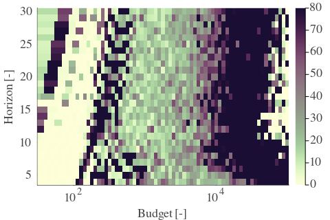 |  | 

---

**Exploration parameter = 128**

| Cₚ = 128 | γ = 0.5, S = 28.06% | γ = 0.55, S = 27.96% | γ = 0.6, S = 26.08% | 
| --- | --- | --- | --- | 
| Mean |  |  |  | 
| Std |  |  |  | 

| Cₚ = 128 | γ = 0.65, S = 25.04% | γ = 0.7, S = 23.79% | γ = 0.75, S = 21.96% | 
| --- | --- | --- | --- | 
| Mean |  |  |  | 
| Std |  |  |  | 

| Cₚ = 128 | γ = 0.8, S = 19.04% | γ = 0.85, S = 15.34% | γ = 0.9, S = 12.47% | 
| --- | --- | --- | --- | 
| Mean |  |  |  | 
| Std |  |  |  | 

| Cₚ = 128 | γ = 0.95, S = 8.76% | γ = 1.0, S = 5.43% | 
| --- | --- | --- | 
| Mean |  |  | 
| Std |  |  | 

---

**Exploration parameter = 256**

| Cₚ = 256 | γ = 0.5, S = 31.25% | γ = 0.55, S = 30.2% | γ = 0.6, S = 28.95% | 
| --- | --- | --- | --- | 
| Mean |  | 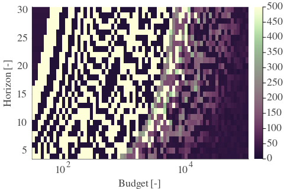 |  | 
| Std |  |  |  | 

| Cₚ = 256 | γ = 0.65, S = 27.86% | γ = 0.7, S = 26.86% | γ = 0.75, S = 25.04% | 
| --- | --- | --- | --- | 
| Mean | 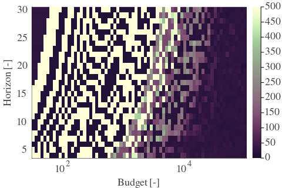 |  |  | 
| Std |  |  |  | 

| Cₚ = 256 | γ = 0.8, S = 23.0% | γ = 0.85, S = 19.04% | γ = 0.9, S = 15.55% | 
| --- | --- | --- | --- | 
| Mean |  |  |  | 
| Std |  |  |  | 

| Cₚ = 256 | γ = 0.95, S = 12.15% | γ = 1.0, S = 8.19% | 
| --- | --- | --- | 
| Mean |  |  | 
| Std |  |  | 

---

**Exploration parameter = 512**

| Cₚ = 512 | γ = 0.5, S = 34.38% | γ = 0.55, S = 32.92% | γ = 0.6, S = 31.66% | 
| --- | --- | --- | --- | 
| Mean |  |  |  | 
| Std |  |  | 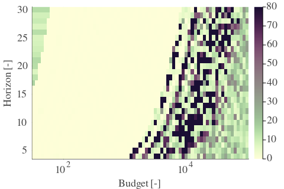 | 

| Cₚ = 512 | γ = 0.65, S = 30.52% | γ = 0.7, S = 29.06% | γ = 0.75, S = 28.22% | 
| --- | --- | --- | --- | 
| Mean | 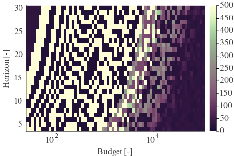 |  |  | 
| Std |  |  |  | 

| Cₚ = 512 | γ = 0.8, S = 25.82% | γ = 0.85, S = 22.43% | γ = 0.9, S = 19.56% | 
| --- | --- | --- | --- | 
| Mean |  |  |  | 
| Std |  |  |  | 

| Cₚ = 512 | γ = 0.95, S = 15.18% | γ = 1.0, S = 10.95% | 
| --- | --- | --- | 
| Mean |  |  | 
| Std |  |  | 

---

**Exploration parameter = 1024**

| Cₚ = 1024 | γ = 0.5, S = 37.14% | γ = 0.55, S = 35.94% | γ = 0.6, S = 34.64% | 
| --- | --- | --- | --- | 
| Mean |  |  |  | 
| Std | 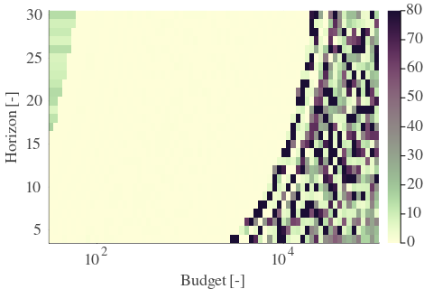 | 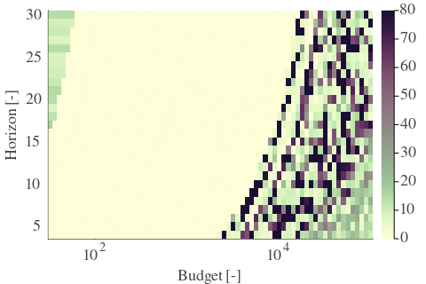 | 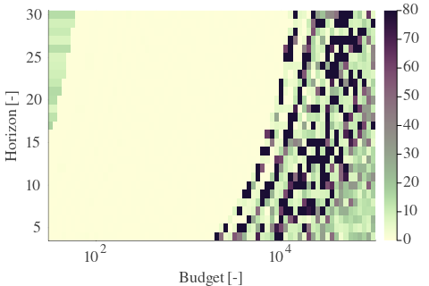 | 

| Cₚ = 1024 | γ = 0.65, S = 33.33% | γ = 0.7, S = 32.08% | γ = 0.75, S = 30.88% | 
| --- | --- | --- | --- | 
| Mean |  |  |  | 
| Std |  |  |  | 

| Cₚ = 1024 | γ = 0.8, S = 28.79% | γ = 0.85, S = 25.51% | γ = 0.9, S = 22.8% | 
| --- | --- | --- | --- | 
| Mean |  |  |  | 
| Std |  |  |  | 

| Cₚ = 1024 | γ = 0.95, S = 18.62% | γ = 1.0, S = 14.55% | 
| --- | --- | --- | 
| Mean |  |  | 
| Std |  |  | 

