# Results for the file sp_AQ_20230402.csv 

Generated on 2023-11-03 14:14:22

---

**Exploration parameter = 0**

| Cₚ = 0 | γ = 0.5, S = 0.0% | γ = 0.55, S = 0.0% | γ = 0.6, S = 0.0% | 
| --- | --- | --- | --- | 
| Mean |  |  |  | 
| Std |  |  |  | 

| Cₚ = 0 | γ = 0.65, S = 0.0% | γ = 0.7, S = 0.0% | γ = 0.75, S = 0.0% | 
| --- | --- | --- | --- | 
| Mean |  |  |  | 
| Std |  |  |  | 

| Cₚ = 0 | γ = 0.8, S = 0.0% | γ = 0.85, S = 0.0% | γ = 0.9, S = 0.0% | 
| --- | --- | --- | --- | 
| Mean |  |  |  | 
| Std |  |  |  | 

| Cₚ = 0 | γ = 0.95, S = 0.0% | γ = 1.0, S = 0.0% | 
| --- | --- | --- | 
| Mean |  |  | 
| Std |  |  | 

---

**Exploration parameter = 2**

| Cₚ = 2 | γ = 0.5, S = 3.76% | γ = 0.55, S = 5.01% | γ = 0.6, S = 11.79% | 
| --- | --- | --- | --- | 
| Mean |  |  |  | 
| Std |  |  |  | 

| Cₚ = 2 | γ = 0.65, S = 18.26% | γ = 0.7, S = 26.4% | γ = 0.75, S = 35.99% | 
| --- | --- | --- | --- | 
| Mean | 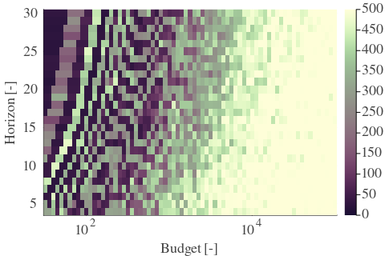 |  |  | 
| Std |  |  |  | 

| Cₚ = 2 | γ = 0.8, S = 50.81% | γ = 0.85, S = 40.85% | γ = 0.9, S = 23.74% | 
| --- | --- | --- | --- | 
| Mean |  |  |  | 
| Std |  |  |  | 

| Cₚ = 2 | γ = 0.95, S = 17.68% | γ = 1.0, S = 13.09% | 
| --- | --- | --- | 
| Mean |  |  | 
| Std |  |  | 

---

**Exploration parameter = 4**

| Cₚ = 4 | γ = 0.5, S = 11.95% | γ = 0.55, S = 6.99% | γ = 0.6, S = 5.58% | 
| --- | --- | --- | --- | 
| Mean |  |  |  | 
| Std |  |  |  | 

| Cₚ = 4 | γ = 0.65, S = 7.09% | γ = 0.7, S = 11.48% | γ = 0.75, S = 19.46% | 
| --- | --- | --- | --- | 
| Mean |  |  |  | 
| Std |  |  |  | 

| Cₚ = 4 | γ = 0.8, S = 27.33% | γ = 0.85, S = 36.41% | γ = 0.9, S = 34.06% | 
| --- | --- | --- | --- | 
| Mean |  |  |  | 
| Std |  |  |  | 

| Cₚ = 4 | γ = 0.95, S = 22.85% | γ = 1.0, S = 17.01% | 
| --- | --- | --- | 
| Mean | 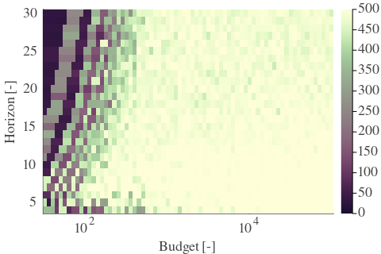 |  | 
| Std |  |  | 

---

**Exploration parameter = 8**

| Cₚ = 8 | γ = 0.5, S = 14.45% | γ = 0.55, S = 13.41% | γ = 0.6, S = 10.59% | 
| --- | --- | --- | --- | 
| Mean |  |  |  | 
| Std |  |  |  | 

| Cₚ = 8 | γ = 0.65, S = 8.29% | γ = 0.7, S = 6.47% | γ = 0.75, S = 6.94% | 
| --- | --- | --- | --- | 
| Mean |  |  |  | 
| Std | 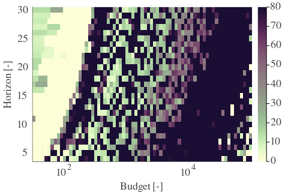 |  |  | 

| Cₚ = 8 | γ = 0.8, S = 12.52% | γ = 0.85, S = 21.39% | γ = 0.9, S = 30.2% | 
| --- | --- | --- | --- | 
| Mean |  |  |  | 
| Std | 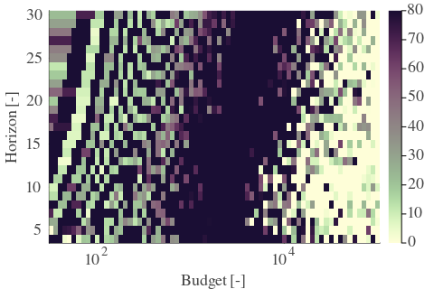 |  |  | 

| Cₚ = 8 | γ = 0.95, S = 27.91% | γ = 1.0, S = 18.15% | 
| --- | --- | --- | 
| Mean |  |  | 
| Std |  |  | 

---

**Exploration parameter = 16**

| Cₚ = 16 | γ = 0.5, S = 18.0% | γ = 0.55, S = 16.85% | γ = 0.6, S = 14.03% | 
| --- | --- | --- | --- | 
| Mean |  |  |  | 
| Std |  |  |  | 

| Cₚ = 16 | γ = 0.65, S = 10.75% | γ = 0.7, S = 9.81% | γ = 0.75, S = 8.87% | 
| --- | --- | --- | --- | 
| Mean |  |  |  | 
| Std | 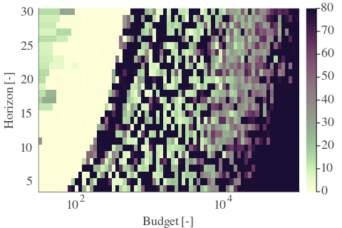 |  |  | 

| Cₚ = 16 | γ = 0.8, S = 7.09% | γ = 0.85, S = 6.73% | γ = 0.9, S = 15.28% | 
| --- | --- | --- | --- | 
| Mean |  |  |  | 
| Std | 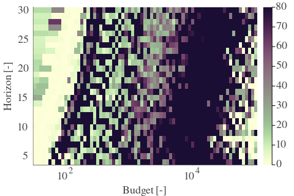 |  |  | 

| Cₚ = 16 | γ = 0.95, S = 24.41% | γ = 1.0, S = 21.23% | 
| --- | --- | --- | 
| Mean |  |  | 
| Std |  |  | 

---

**Exploration parameter = 32**

| Cₚ = 32 | γ = 0.5, S = 20.34% | γ = 0.55, S = 18.88% | γ = 0.6, S = 17.79% | 
| --- | --- | --- | --- | 
| Mean |  |  |  | 
| Std |  |  |  | 

| Cₚ = 32 | γ = 0.65, S = 14.4% | γ = 0.7, S = 13.15% | γ = 0.75, S = 11.58% | 
| --- | --- | --- | --- | 
| Mean |  |  |  | 
| Std |  |  |  | 

| Cₚ = 32 | γ = 0.8, S = 9.23% | γ = 0.85, S = 5.37% | γ = 0.9, S = 5.63% | 
| --- | --- | --- | --- | 
| Mean |  |  |  | 
| Std |  |  |  | 

| Cₚ = 32 | γ = 0.95, S = 10.33% | γ = 1.0, S = 17.53% | 
| --- | --- | --- | 
| Mean |  |  | 
| Std |  |  | 

---

**Exploration parameter = 64**

| Cₚ = 64 | γ = 0.5, S = 23.84% | γ = 0.55, S = 22.01% | γ = 0.6, S = 20.29% | 
| --- | --- | --- | --- | 
| Mean |  |  |  | 
| Std |  |  |  | 

| Cₚ = 64 | γ = 0.65, S = 16.95% | γ = 0.7, S = 15.6% | γ = 0.75, S = 14.71% | 
| --- | --- | --- | --- | 
| Mean |  |  |  | 
| Std |  |  |  | 

| Cₚ = 64 | γ = 0.8, S = 12.68% | γ = 0.85, S = 9.08% | γ = 0.9, S = 6.83% | 
| --- | --- | --- | --- | 
| Mean |  |  |  | 
| Std |  |  |  | 

| Cₚ = 64 | γ = 0.95, S = 3.81% | γ = 1.0, S = 8.19% | 
| --- | --- | --- | 
| Mean |  |  | 
| Std |  |  | 

---

**Exploration parameter = 128**

| Cₚ = 128 | γ = 0.5, S = 26.92% | γ = 0.55, S = 25.04% | γ = 0.6, S = 23.53% | 
| --- | --- | --- | --- | 
| Mean |  | 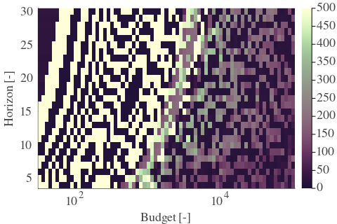 |  | 
| Std |  |  |  | 

| Cₚ = 128 | γ = 0.65, S = 20.34% | γ = 0.7, S = 18.73% | γ = 0.75, S = 16.8% | 
| --- | --- | --- | --- | 
| Mean |  |  |  | 
| Std |  |  |  | 

| Cₚ = 128 | γ = 0.8, S = 15.02% | γ = 0.85, S = 12.05% | γ = 0.9, S = 10.38% | 
| --- | --- | --- | --- | 
| Mean | 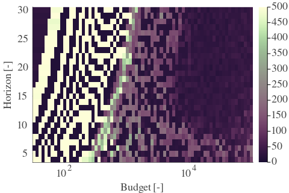 |  |  | 
| Std |  |  |  | 

| Cₚ = 128 | γ = 0.95, S = 5.58% | γ = 1.0, S = 3.91% | 
| --- | --- | --- | 
| Mean |  |  | 
| Std |  |  | 

---

**Exploration parameter = 256**

| Cₚ = 256 | γ = 0.5, S = 29.21% | γ = 0.55, S = 27.75% | γ = 0.6, S = 26.6% | 
| --- | --- | --- | --- | 
| Mean |  |  |  | 
| Std |  |  |  | 

| Cₚ = 256 | γ = 0.65, S = 23.47% | γ = 0.7, S = 22.17% | γ = 0.75, S = 20.34% | 
| --- | --- | --- | --- | 
| Mean |  |  |  | 
| Std |  | 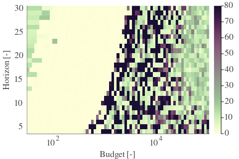 |  | 

| Cₚ = 256 | γ = 0.8, S = 18.1% | γ = 0.85, S = 14.66% | γ = 0.9, S = 13.15% | 
| --- | --- | --- | --- | 
| Mean |  |  |  | 
| Std |  |  |  | 

| Cₚ = 256 | γ = 0.95, S = 9.02% | γ = 1.0, S = 5.74% | 
| --- | --- | --- | 
| Mean |  |  | 
| Std |  |  | 

---

**Exploration parameter = 512**

| Cₚ = 512 | γ = 0.5, S = 31.98% | γ = 0.55, S = 30.93% | γ = 0.6, S = 29.16% | 
| --- | --- | --- | --- | 
| Mean |  |  |  | 
| Std |  |  |  | 

| Cₚ = 512 | γ = 0.65, S = 26.08% | γ = 0.7, S = 24.88% | γ = 0.75, S = 23.21% | 
| --- | --- | --- | --- | 
| Mean |  |  |  | 
| Std |  |  | 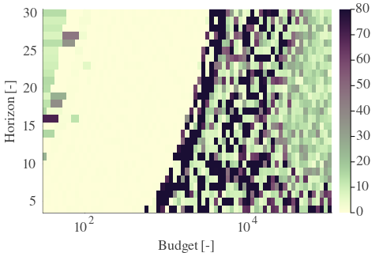 | 

| Cₚ = 512 | γ = 0.8, S = 21.28% | γ = 0.85, S = 18.1% | γ = 0.9, S = 16.43% | 
| --- | --- | --- | --- | 
| Mean |  |  |  | 
| Std |  |  |  | 

| Cₚ = 512 | γ = 0.95, S = 11.74% | γ = 1.0, S = 8.61% | 
| --- | --- | --- | 
| Mean |  |  | 
| Std | 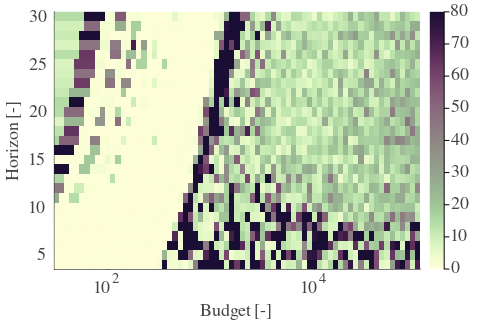 |  | 

---

**Exploration parameter = 1024**

| Cₚ = 1024 | γ = 0.5, S = 35.11% | γ = 0.55, S = 33.8% | γ = 0.6, S = 31.87% | 
| --- | --- | --- | --- | 
| Mean |  |  |  | 
| Std |  |  |  | 

| Cₚ = 1024 | γ = 0.65, S = 29.16% | γ = 0.7, S = 27.75% | γ = 0.75, S = 25.87% | 
| --- | --- | --- | --- | 
| Mean |  |  |  | 
| Std |  |  |  | 

| Cₚ = 1024 | γ = 0.8, S = 24.0% | γ = 0.85, S = 21.13% | γ = 0.9, S = 19.67% | 
| --- | --- | --- | --- | 
| Mean |  |  |  | 
| Std |  |  |  | 

| Cₚ = 1024 | γ = 0.95, S = 15.75% | γ = 1.0, S = 11.63% | 
| --- | --- | --- | 
| Mean |  |  | 
| Std |  |  | 

