# Results for the file sp_AR_20230404.csv 

Generated on 2023-11-03 14:14:22

---

**Exploration parameter = 0**

| Cₚ = 0 | γ = 0.5, S = 0.0% | γ = 0.55, S = 0.0% | γ = 0.6, S = 0.0% | 
| --- | --- | --- | --- | 
| Mean |  |  |  | 
| Std |  |  |  | 

| Cₚ = 0 | γ = 0.65, S = 0.0% | γ = 0.7, S = 0.0% | γ = 0.75, S = 0.0% | 
| --- | --- | --- | --- | 
| Mean |  |  |  | 
| Std |  |  |  | 

| Cₚ = 0 | γ = 0.8, S = 0.0% | γ = 0.85, S = 0.0% | γ = 0.9, S = 0.0% | 
| --- | --- | --- | --- | 
| Mean |  |  |  | 
| Std |  |  |  | 

| Cₚ = 0 | γ = 0.95, S = 0.0% | γ = 1.0, S = 0.0% | 
| --- | --- | --- | 
| Mean |  |  | 
| Std |  |  | 

---

**Exploration parameter = 2**

| Cₚ = 2 | γ = 0.5, S = 1.77% | γ = 0.55, S = 0.83% | γ = 0.6, S = 0.1% | 
| --- | --- | --- | --- | 
| Mean |  | 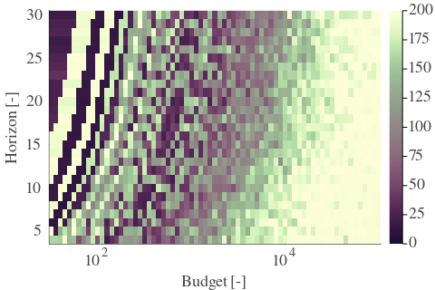 |  | 
| Std |  | 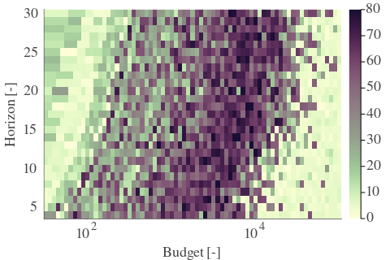 |  | 

| Cₚ = 2 | γ = 0.65, S = 0.42% | γ = 0.7, S = 0.73% | γ = 0.75, S = 1.46% | 
| --- | --- | --- | --- | 
| Mean |  |  |  | 
| Std |  |  |  | 

| Cₚ = 2 | γ = 0.8, S = 10.75% | γ = 0.85, S = 29.0% | γ = 0.9, S = 37.51% | 
| --- | --- | --- | --- | 
| Mean |  |  |  | 
| Std |  |  |  | 

| Cₚ = 2 | γ = 0.95, S = 34.95% | γ = 1.0, S = 30.62% | 
| --- | --- | --- | 
| Mean |  | 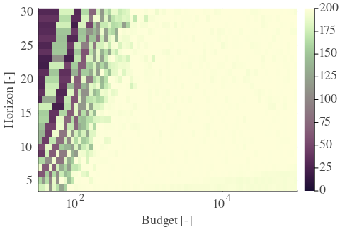 | 
| Std |  |  | 

---

**Exploration parameter = 4**

| Cₚ = 4 | γ = 0.5, S = 1.3% | γ = 0.55, S = 2.82% | γ = 0.6, S = 2.35% | 
| --- | --- | --- | --- | 
| Mean |  |  |  | 
| Std |  |  | 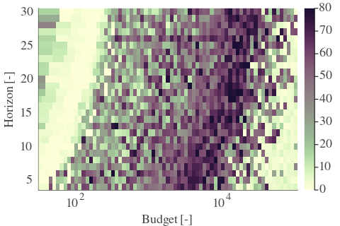 | 

| Cₚ = 4 | γ = 0.65, S = 0.89% | γ = 0.7, S = 0.78% | γ = 0.75, S = 0.89% | 
| --- | --- | --- | --- | 
| Mean |  |  |  | 
| Std |  |  |  | 

| Cₚ = 4 | γ = 0.8, S = 1.36% | γ = 0.85, S = 2.14% | γ = 0.9, S = 12.31% | 
| --- | --- | --- | --- | 
| Mean |  |  | 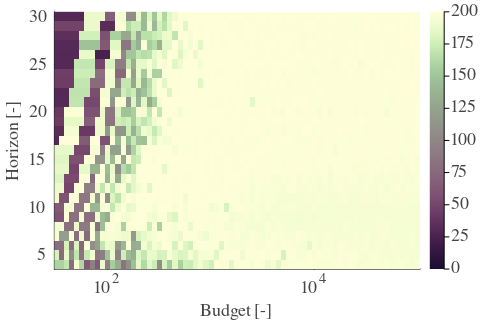 | 
| Std |  |  |  | 

| Cₚ = 4 | γ = 0.95, S = 36.2% | γ = 1.0, S = 39.02% | 
| --- | --- | --- | 
| Mean |  |  | 
| Std |  |  | 

---

**Exploration parameter = 8**

| Cₚ = 8 | γ = 0.5, S = 2.45% | γ = 0.55, S = 3.96% | γ = 0.6, S = 6.21% | 
| --- | --- | --- | --- | 
| Mean |  |  |  | 
| Std |  |  |  | 

| Cₚ = 8 | γ = 0.65, S = 5.89% | γ = 0.7, S = 4.28% | γ = 0.75, S = 1.67% | 
| --- | --- | --- | --- | 
| Mean |  |  | 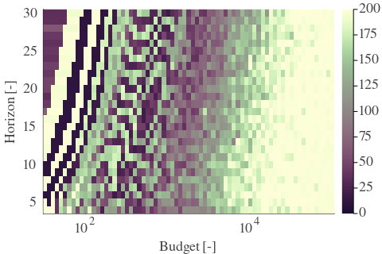 | 
| Std |  |  |  | 

| Cₚ = 8 | γ = 0.8, S = 0.73% | γ = 0.85, S = 1.46% | γ = 0.9, S = 1.88% | 
| --- | --- | --- | --- | 
| Mean | 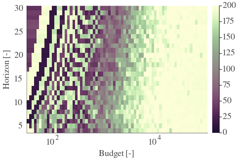 |  | 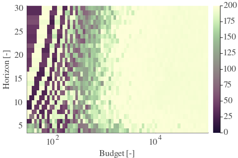 | 
| Std |  |  |  | 

| Cₚ = 8 | γ = 0.95, S = 4.8% | γ = 1.0, S = 30.46% | 
| --- | --- | --- | 
| Mean |  |  | 
| Std |  |  | 

---

**Exploration parameter = 16**

| Cₚ = 16 | γ = 0.5, S = 2.3% | γ = 0.55, S = 5.69% | γ = 0.6, S = 9.81% | 
| --- | --- | --- | --- | 
| Mean |  |  | 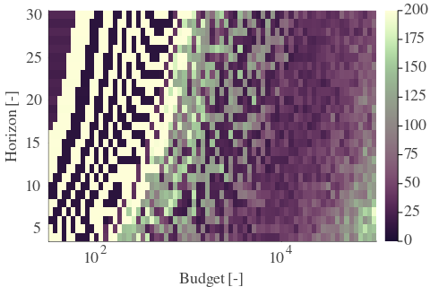 | 
| Std |  |  |  | 

| Cₚ = 16 | γ = 0.65, S = 9.44% | γ = 0.7, S = 9.75% | γ = 0.75, S = 8.4% | 
| --- | --- | --- | --- | 
| Mean |  |  |  | 
| Std |  |  |  | 

| Cₚ = 16 | γ = 0.8, S = 6.94% | γ = 0.85, S = 2.35% | γ = 0.9, S = 1.62% | 
| --- | --- | --- | --- | 
| Mean |  |  |  | 
| Std |  |  |  | 

| Cₚ = 16 | γ = 0.95, S = 1.51% | γ = 1.0, S = 4.9% | 
| --- | --- | --- | 
| Mean |  |  | 
| Std |  |  | 

---

**Exploration parameter = 32**

| Cₚ = 32 | γ = 0.5, S = 4.02% | γ = 0.55, S = 7.25% | γ = 0.6, S = 11.16% | 
| --- | --- | --- | --- | 
| Mean |  |  |  | 
| Std |  |  |  | 

| Cₚ = 32 | γ = 0.65, S = 12.05% | γ = 0.7, S = 13.72% | γ = 0.75, S = 12.31% | 
| --- | --- | --- | --- | 
| Mean |  |  |  | 
| Std |  |  |  | 

| Cₚ = 32 | γ = 0.8, S = 10.54% | γ = 0.85, S = 8.45% | γ = 0.9, S = 5.74% | 
| --- | --- | --- | --- | 
| Mean |  |  |  | 
| Std |  |  |  | 

| Cₚ = 32 | γ = 0.95, S = 2.61% | γ = 1.0, S = 2.76% | 
| --- | --- | --- | 
| Mean |  |  | 
| Std |  |  | 

---

**Exploration parameter = 64**

| Cₚ = 64 | γ = 0.5, S = 5.16% | γ = 0.55, S = 10.54% | γ = 0.6, S = 14.66% | 
| --- | --- | --- | --- | 
| Mean |  |  |  | 
| Std |  |  |  | 

| Cₚ = 64 | γ = 0.65, S = 15.08% | γ = 0.7, S = 15.91% | γ = 0.75, S = 15.28% | 
| --- | --- | --- | --- | 
| Mean |  |  |  | 
| Std |  |  |  | 

| Cₚ = 64 | γ = 0.8, S = 14.87% | γ = 0.85, S = 11.68% | γ = 0.9, S = 9.55% | 
| --- | --- | --- | --- | 
| Mean |  |  |  | 
| Std |  |  |  | 

| Cₚ = 64 | γ = 0.95, S = 8.5% | γ = 1.0, S = 4.64% | 
| --- | --- | --- | 
| Mean |  |  | 
| Std | 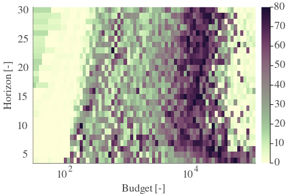 |  | 

---

**Exploration parameter = 128**

| Cₚ = 128 | γ = 0.5, S = 6.16% | γ = 0.55, S = 13.15% | γ = 0.6, S = 16.85% | 
| --- | --- | --- | --- | 
| Mean |  |  |  | 
| Std |  |  |  | 

| Cₚ = 128 | γ = 0.65, S = 18.31% | γ = 0.7, S = 19.93% | γ = 0.75, S = 18.47% | 
| --- | --- | --- | --- | 
| Mean |  |  |  | 
| Std |  |  |  | 

| Cₚ = 128 | γ = 0.8, S = 16.9% | γ = 0.85, S = 15.23% | γ = 0.9, S = 12.88% | 
| --- | --- | --- | --- | 
| Mean |  |  |  | 
| Std |  |  |  | 

| Cₚ = 128 | γ = 0.95, S = 11.48% | γ = 1.0, S = 8.5% | 
| --- | --- | --- | 
| Mean |  |  | 
| Std |  |  | 

---

**Exploration parameter = 256**

| Cₚ = 256 | γ = 0.5, S = 8.14% | γ = 0.55, S = 15.23% | γ = 0.6, S = 19.35% | 
| --- | --- | --- | --- | 
| Mean |  |  | 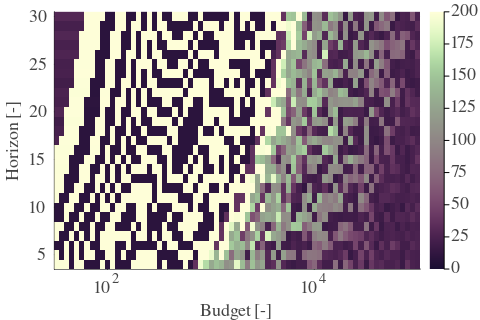 | 
| Std |  |  |  | 

| Cₚ = 256 | γ = 0.65, S = 21.34% | γ = 0.7, S = 22.33% | γ = 0.75, S = 21.8% | 
| --- | --- | --- | --- | 
| Mean |  |  |  | 
| Std |  |  |  | 

| Cₚ = 256 | γ = 0.8, S = 21.02% | γ = 0.85, S = 18.0% | γ = 0.9, S = 15.65% | 
| --- | --- | --- | --- | 
| Mean |  |  |  | 
| Std |  |  |  | 

| Cₚ = 256 | γ = 0.95, S = 14.71% | γ = 1.0, S = 11.32% | 
| --- | --- | --- | 
| Mean |  |  | 
| Std |  |  | 

---

**Exploration parameter = 512**

| Cₚ = 512 | γ = 0.5, S = 9.7% | γ = 0.55, S = 17.89% | γ = 0.6, S = 21.44% | 
| --- | --- | --- | --- | 
| Mean |  |  |  | 
| Std |  |  |  | 

| Cₚ = 512 | γ = 0.65, S = 23.58% | γ = 0.7, S = 24.99% | γ = 0.75, S = 25.4% | 
| --- | --- | --- | --- | 
| Mean |  |  |  | 
| Std |  |  |  | 

| Cₚ = 512 | γ = 0.8, S = 23.94% | γ = 0.85, S = 22.01% | γ = 0.9, S = 19.14% | 
| --- | --- | --- | --- | 
| Mean |  |  |  | 
| Std |  |  | 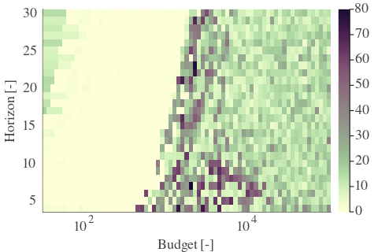 | 

| Cₚ = 512 | γ = 0.95, S = 17.48% | γ = 1.0, S = 14.35% | 
| --- | --- | --- | 
| Mean |  |  | 
| Std |  |  | 

---

**Exploration parameter = 1024**

| Cₚ = 1024 | γ = 0.5, S = 11.84% | γ = 0.55, S = 20.87% | γ = 0.6, S = 23.84% | 
| --- | --- | --- | --- | 
| Mean |  |  |  | 
| Std |  |  |  | 

| Cₚ = 1024 | γ = 0.65, S = 26.24% | γ = 0.7, S = 27.49% | γ = 0.75, S = 27.8% | 
| --- | --- | --- | --- | 
| Mean |  |  |  | 
| Std |  |  |  | 

| Cₚ = 1024 | γ = 0.8, S = 26.6% | γ = 0.85, S = 25.3% | γ = 0.9, S = 22.59% | 
| --- | --- | --- | --- | 
| Mean |  |  |  | 
| Std |  |  | 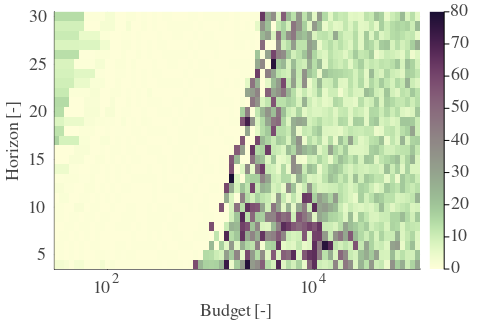 | 

| Cₚ = 1024 | γ = 0.95, S = 21.07% | γ = 1.0, S = 17.63% | 
| --- | --- | --- | 
| Mean |  |  | 
| Std | 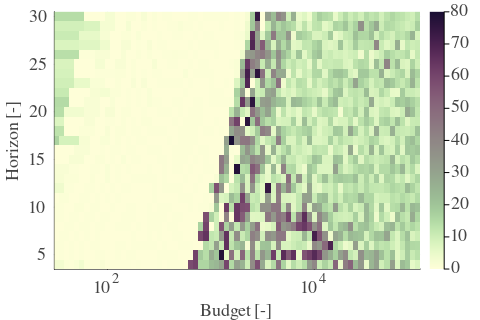 |  | 

