# Results for the file sp_D_20221128.csv 

Generated on 2023-11-03 14:13:56

---

**Exploration parameter = 0**

| Cₚ = 0 | γ = 0.5, S = 0.0% | γ = 0.55, S = 0.0% | γ = 0.6, S = 0.0% | 
| --- | --- | --- | --- | 
| Mean |  |  |  | 
| Std |  |  |  | 

| Cₚ = 0 | γ = 0.65, S = 0.0% | γ = 0.7, S = 0.0% | γ = 0.75, S = 0.0% | 
| --- | --- | --- | --- | 
| Mean |  |  |  | 
| Std |  |  |  | 

| Cₚ = 0 | γ = 0.8, S = 0.0% | γ = 0.85, S = 0.0% | γ = 0.9, S = 0.0% | 
| --- | --- | --- | --- | 
| Mean |  |  |  | 
| Std |  |  |  | 

| Cₚ = 0 | γ = 0.95, S = 0.0% | γ = 1.0, S = 0.0% | 
| --- | --- | --- | 
| Mean |  |  | 
| Std |  |  | 

---

**Exploration parameter = 2**

| Cₚ = 2 | γ = 0.5, S = 23.53% | γ = 0.55, S = 18.36% | γ = 0.6, S = 11.79% | 
| --- | --- | --- | --- | 
| Mean |  |  |  | 
| Std |  |  |  | 

| Cₚ = 2 | γ = 0.65, S = 0.68% | γ = 0.7, S = 0.05% | γ = 0.75, S = 2.5% | 
| --- | --- | --- | --- | 
| Mean | 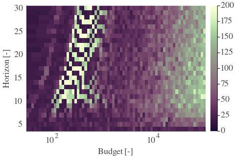 |  |  | 
| Std |  |  |  | 

| Cₚ = 2 | γ = 0.8, S = 12.78% | γ = 0.85, S = 30.26% | γ = 0.9, S = 19.09% | 
| --- | --- | --- | --- | 
| Mean |  |  | 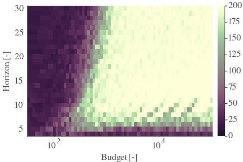 | 
| Std |  |  |  | 

| Cₚ = 2 | γ = 0.95, S = 14.29% | γ = 1.0, S = 10.33% | 
| --- | --- | --- | 
| Mean |  |  | 
| Std |  |  | 

---

**Exploration parameter = 4**

| Cₚ = 4 | γ = 0.5, S = 30.05% | γ = 0.55, S = 24.73% | γ = 0.6, S = 20.14% | 
| --- | --- | --- | --- | 
| Mean |  | 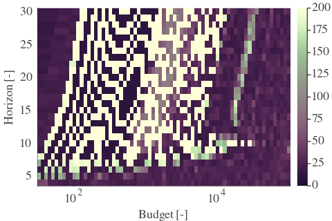 |  | 
| Std |  |  |  | 

| Cₚ = 4 | γ = 0.65, S = 15.6% | γ = 0.7, S = 6.16% | γ = 0.75, S = 0.05% | 
| --- | --- | --- | --- | 
| Mean |  |  |  | 
| Std |  |  |  | 

| Cₚ = 4 | γ = 0.8, S = 2.66% | γ = 0.85, S = 13.04% | γ = 0.9, S = 30.57% | 
| --- | --- | --- | --- | 
| Mean |  |  | 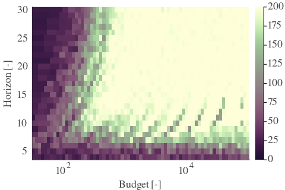 | 
| Std |  |  |  | 

| Cₚ = 4 | γ = 0.95, S = 25.77% | γ = 1.0, S = 16.43% | 
| --- | --- | --- | 
| Mean |  |  | 
| Std |  |  | 

---

**Exploration parameter = 8**

| Cₚ = 8 | γ = 0.5, S = 32.34% | γ = 0.55, S = 29.37% | γ = 0.6, S = 23.63% | 
| --- | --- | --- | --- | 
| Mean |  | 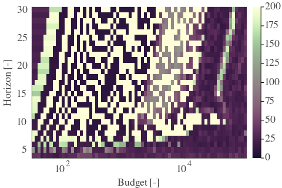 |  | 
| Std |  |  |  | 

| Cₚ = 8 | γ = 0.65, S = 19.87% | γ = 0.7, S = 15.28% | γ = 0.75, S = 9.34% | 
| --- | --- | --- | --- | 
| Mean |  |  |  | 
| Std |  |  |  | 

| Cₚ = 8 | γ = 0.8, S = 0.89% | γ = 0.85, S = 4.07% | γ = 0.9, S = 14.35% | 
| --- | --- | --- | --- | 
| Mean |  |  |  | 
| Std |  |  |  | 

| Cₚ = 8 | γ = 0.95, S = 26.6% | γ = 1.0, S = 29.37% | 
| --- | --- | --- | 
| Mean |  |  | 
| Std |  |  | 

---

**Exploration parameter = 16**

| Cₚ = 16 | γ = 0.5, S = 33.12% | γ = 0.55, S = 32.6% | γ = 0.6, S = 27.07% | 
| --- | --- | --- | --- | 
| Mean |  |  |  | 
| Std |  |  |  | 

| Cₚ = 16 | γ = 0.65, S = 22.48% | γ = 0.7, S = 19.14% | γ = 0.75, S = 15.23% | 
| --- | --- | --- | --- | 
| Mean |  |  |  | 
| Std |  |  |  | 

| Cₚ = 16 | γ = 0.8, S = 10.38% | γ = 0.85, S = 4.07% | γ = 0.9, S = 5.32% | 
| --- | --- | --- | --- | 
| Mean |  |  |  | 
| Std |  |  |  | 

| Cₚ = 16 | γ = 0.95, S = 14.5% | γ = 1.0, S = 22.01% | 
| --- | --- | --- | 
| Mean |  |  | 
| Std |  |  | 

---

**Exploration parameter = 32**

| Cₚ = 32 | γ = 0.5, S = 32.6% | γ = 0.55, S = 36.1% | γ = 0.6, S = 30.57% | 
| --- | --- | --- | --- | 
| Mean |  |  |  | 
| Std |  |  |  | 

| Cₚ = 32 | γ = 0.65, S = 25.93% | γ = 0.7, S = 21.6% | γ = 0.75, S = 18.57% | 
| --- | --- | --- | --- | 
| Mean |  |  |  | 
| Std |  |  |  | 

| Cₚ = 32 | γ = 0.8, S = 13.93% | γ = 0.85, S = 10.07% | γ = 0.9, S = 5.69% | 
| --- | --- | --- | --- | 
| Mean |  | 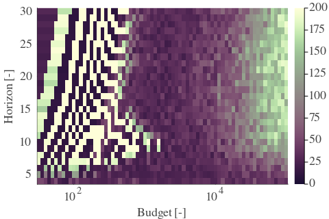 |  | 
| Std |  |  |  | 

| Cₚ = 32 | γ = 0.95, S = 5.79% | γ = 1.0, S = 14.35% | 
| --- | --- | --- | 
| Mean |  | 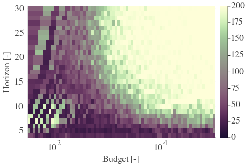 | 
| Std |  |  | 

---

**Exploration parameter = 64**

| Cₚ = 64 | γ = 0.5, S = 32.29% | γ = 0.55, S = 38.08% | γ = 0.6, S = 33.75% | 
| --- | --- | --- | --- | 
| Mean |  |  |  | 
| Std |  |  |  | 

| Cₚ = 64 | γ = 0.65, S = 29.06% | γ = 0.7, S = 25.09% | γ = 0.75, S = 21.02% | 
| --- | --- | --- | --- | 
| Mean |  |  |  | 
| Std |  |  |  | 

| Cₚ = 64 | γ = 0.8, S = 17.89% | γ = 0.85, S = 13.77% | γ = 0.9, S = 9.91% | 
| --- | --- | --- | --- | 
| Mean |  |  |  | 
| Std |  |  |  | 

| Cₚ = 64 | γ = 0.95, S = 5.37% | γ = 1.0, S = 6.83% | 
| --- | --- | --- | 
| Mean |  |  | 
| Std |  |  | 

---

**Exploration parameter = 128**

| Cₚ = 128 | γ = 0.5, S = 32.39% | γ = 0.55, S = 37.72% | γ = 0.6, S = 36.62% | 
| --- | --- | --- | --- | 
| Mean |  |  |  | 
| Std |  |  |  | 

| Cₚ = 128 | γ = 0.65, S = 31.87% | γ = 0.7, S = 27.96% | γ = 0.75, S = 24.41% | 
| --- | --- | --- | --- | 
| Mean |  |  |  | 
| Std |  |  |  | 

| Cₚ = 128 | γ = 0.8, S = 20.34% | γ = 0.85, S = 17.42% | γ = 0.9, S = 12.88% | 
| --- | --- | --- | --- | 
| Mean |  | 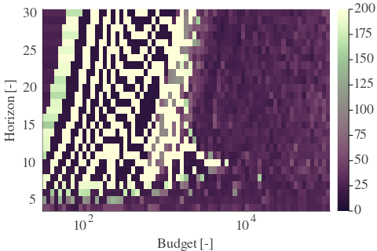 |  | 
| Std |  |  |  | 

| Cₚ = 128 | γ = 0.95, S = 9.49% | γ = 1.0, S = 5.95% | 
| --- | --- | --- | 
| Mean |  |  | 
| Std |  |  | 

---

**Exploration parameter = 256**

| Cₚ = 256 | γ = 0.5, S = 32.24% | γ = 0.55, S = 38.34% | γ = 0.6, S = 38.24% | 
| --- | --- | --- | --- | 
| Mean |  |  |  | 
| Std |  |  |  | 

| Cₚ = 256 | γ = 0.65, S = 35.0% | γ = 0.7, S = 30.93% | γ = 0.75, S = 27.13% | 
| --- | --- | --- | --- | 
| Mean |  |  |  | 
| Std |  |  | 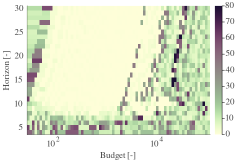 | 

| Cₚ = 256 | γ = 0.8, S = 23.47% | γ = 0.85, S = 20.03% | γ = 0.9, S = 16.74% | 
| --- | --- | --- | --- | 
| Mean |  |  |  | 
| Std |  |  |  | 

| Cₚ = 256 | γ = 0.95, S = 12.68% | γ = 1.0, S = 9.18% | 
| --- | --- | --- | 
| Mean | 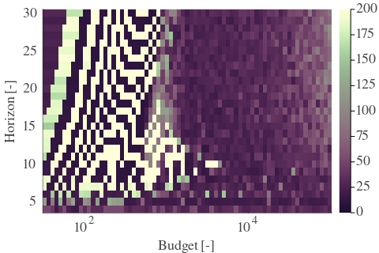 |  | 
| Std |  |  | 

---

**Exploration parameter = 512**

| Cₚ = 512 | γ = 0.5, S = 32.39% | γ = 0.55, S = 38.34% | γ = 0.6, S = 38.34% | 
| --- | --- | --- | --- | 
| Mean |  |  |  | 
| Std |  | 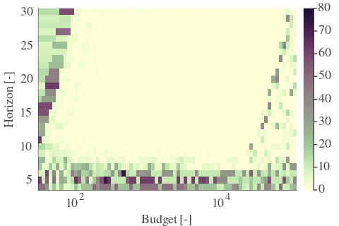 |  | 

| Cₚ = 512 | γ = 0.65, S = 37.35% | γ = 0.7, S = 33.85% | γ = 0.75, S = 30.05% | 
| --- | --- | --- | --- | 
| Mean |  |  | 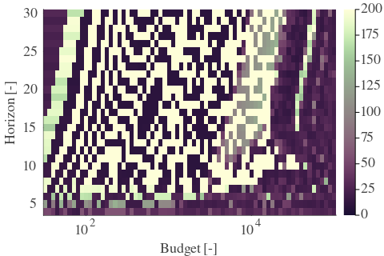 | 
| Std |  |  |  | 

| Cₚ = 512 | γ = 0.8, S = 26.5% | γ = 0.85, S = 23.21% | γ = 0.9, S = 19.46% | 
| --- | --- | --- | --- | 
| Mean |  |  |  | 
| Std | 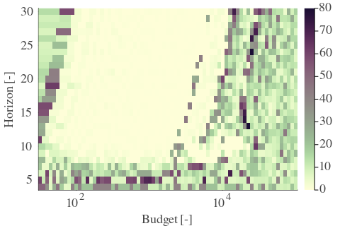 |  |  | 

| Cₚ = 512 | γ = 0.95, S = 15.49% | γ = 1.0, S = 12.36% | 
| --- | --- | --- | 
| Mean |  |  | 
| Std |  |  | 

---

**Exploration parameter = 1024**

| Cₚ = 1024 | γ = 0.5, S = 32.29% | γ = 0.55, S = 37.72% | γ = 0.6, S = 38.34% | 
| --- | --- | --- | --- | 
| Mean |  |  |  | 
| Std |  | 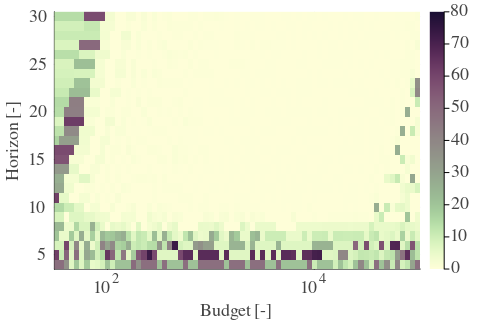 |  | 

| Cₚ = 1024 | γ = 0.65, S = 38.24% | γ = 0.7, S = 36.31% | γ = 0.75, S = 32.55% | 
| --- | --- | --- | --- | 
| Mean |  |  |  | 
| Std |  |  |  | 

| Cₚ = 1024 | γ = 0.8, S = 29.26% | γ = 0.85, S = 26.03% | γ = 0.9, S = 22.43% | 
| --- | --- | --- | --- | 
| Mean |  |  |  | 
| Std |  |  |  | 

| Cₚ = 1024 | γ = 0.95, S = 18.62% | γ = 1.0, S = 15.34% | 
| --- | --- | --- | 
| Mean |  |  | 
| Std |  |  | 

