# Results for the file sp_G_20221219.csv 

Generated on 2023-11-03 14:13:58

---

**Exploration parameter = 0**

| Cₚ = 0 | γ = 0.5, S = 0.0% | γ = 0.55, S = 0.0% | γ = 0.6, S = 0.0% | 
| --- | --- | --- | --- | 
| Mean |  |  |  | 
| Std |  |  |  | 

| Cₚ = 0 | γ = 0.65, S = 0.0% | γ = 0.7, S = 0.0% | γ = 0.75, S = 0.0% | 
| --- | --- | --- | --- | 
| Mean |  |  |  | 
| Std |  |  |  | 

| Cₚ = 0 | γ = 0.8, S = 0.0% | γ = 0.85, S = 0.0% | γ = 0.9, S = 0.0% | 
| --- | --- | --- | --- | 
| Mean |  |  |  | 
| Std |  |  |  | 

| Cₚ = 0 | γ = 0.95, S = 0.0% | γ = 1.0, S = 0.0% | 
| --- | --- | --- | 
| Mean |  |  | 
| Std |  |  | 

---

**Exploration parameter = 2**

| Cₚ = 2 | γ = 0.5, S = 0.26% | γ = 0.55, S = 0.26% | γ = 0.6, S = 0.0% | 
| --- | --- | --- | --- | 
| Mean | 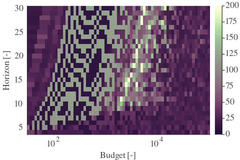 | 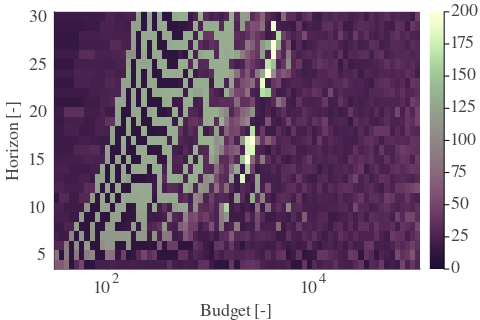 | 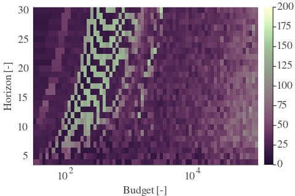 | 
| Std | 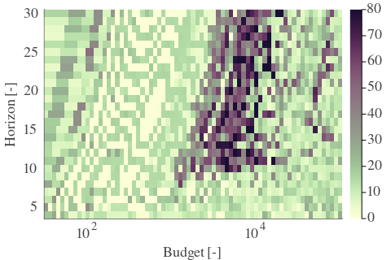 | 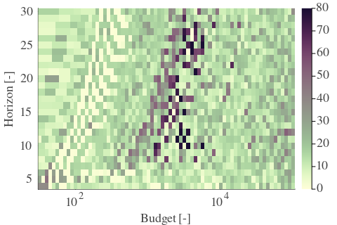 |  | 

| Cₚ = 2 | γ = 0.65, S = 0.0% | γ = 0.7, S = 0.0% | γ = 0.75, S = 0.0% | 
| --- | --- | --- | --- | 
| Mean | 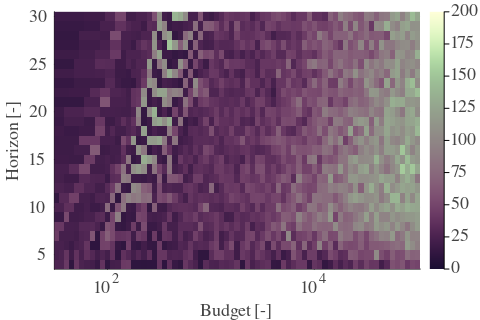 | 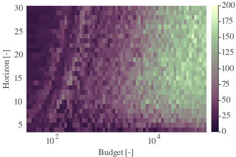 | 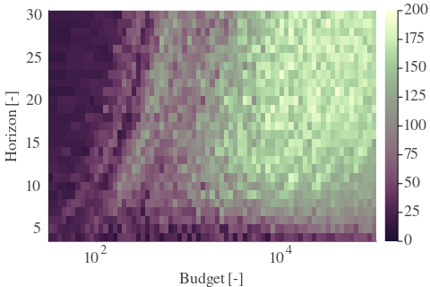 | 
| Std | 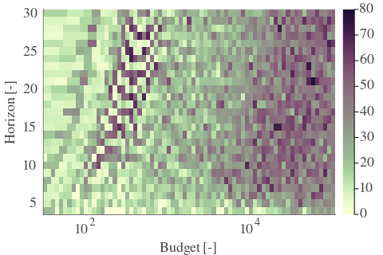 | 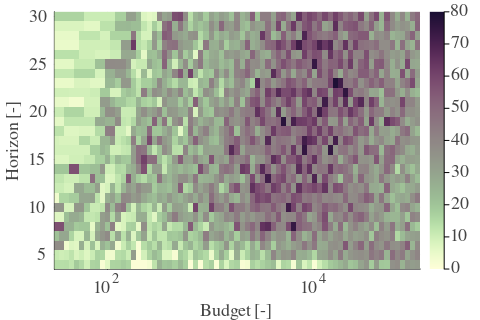 | 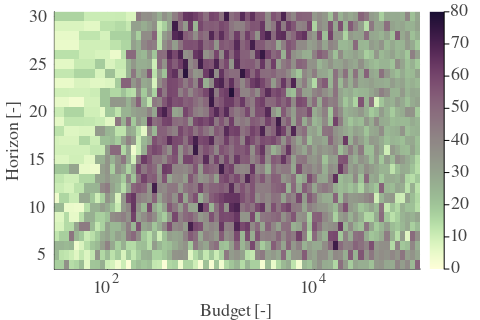 | 

| Cₚ = 2 | γ = 0.8, S = 0.05% | γ = 0.85, S = 2.82% | γ = 0.9, S = 1.77% | 
| --- | --- | --- | --- | 
| Mean | 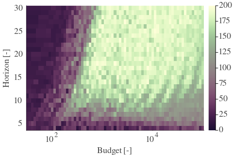 | 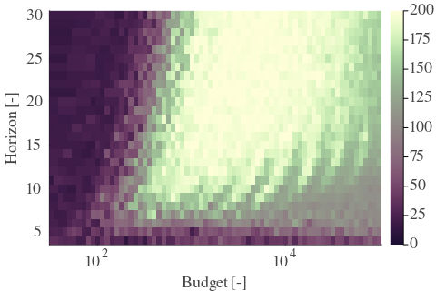 | 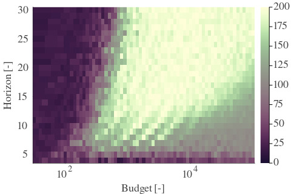 | 
| Std |  | 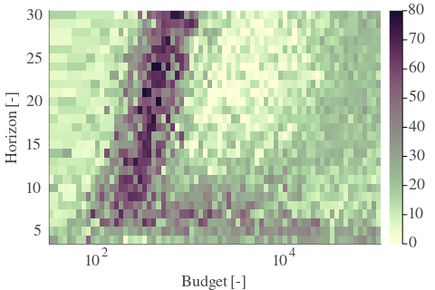 | 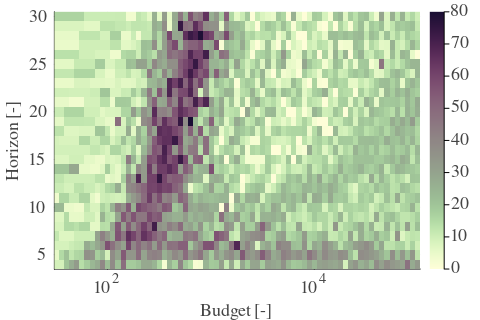 | 

| Cₚ = 2 | γ = 0.95, S = 1.04% | γ = 1.0, S = 1.04% | 
| --- | --- | --- | 
| Mean | 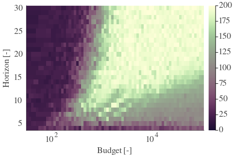 | 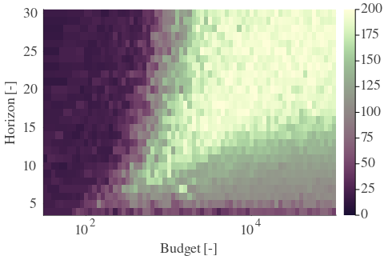 | 
| Std | 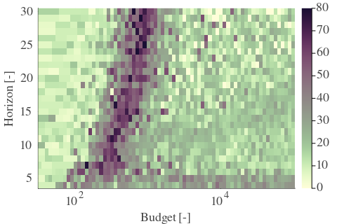 | 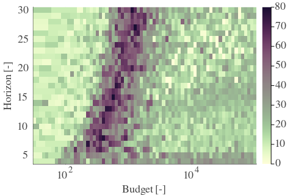 | 

---

**Exploration parameter = 4**

| Cₚ = 4 | γ = 0.5, S = 0.37% | γ = 0.55, S = 0.47% | γ = 0.6, S = 0.05% | 
| --- | --- | --- | --- | 
| Mean | 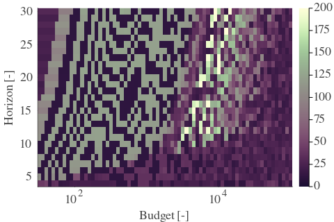 | 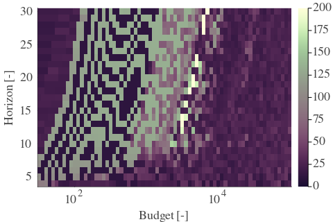 | 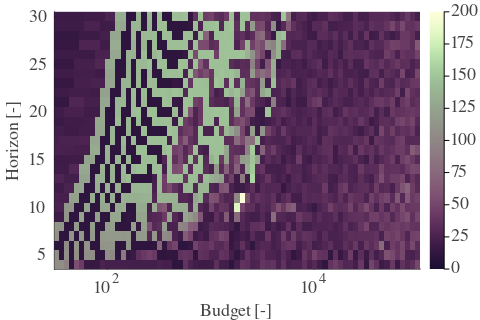 | 
| Std | 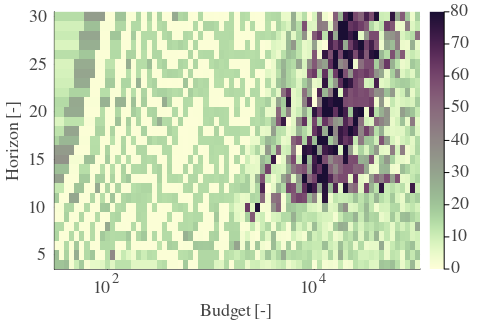 | 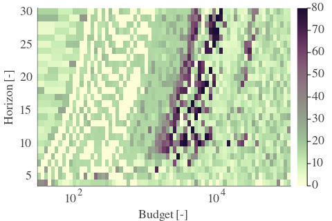 | 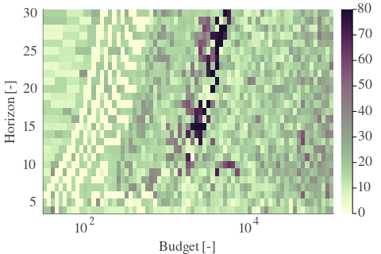 | 

| Cₚ = 4 | γ = 0.65, S = 0.0% | γ = 0.7, S = 0.0% | γ = 0.75, S = 0.0% | 
| --- | --- | --- | --- | 
| Mean | 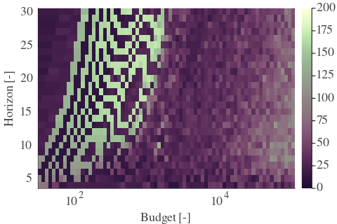 | 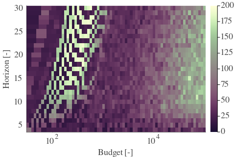 | 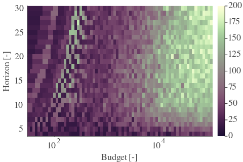 | 
| Std | 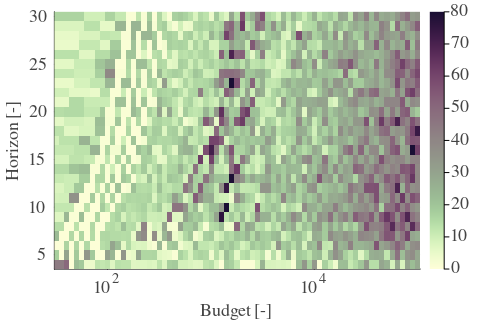 | 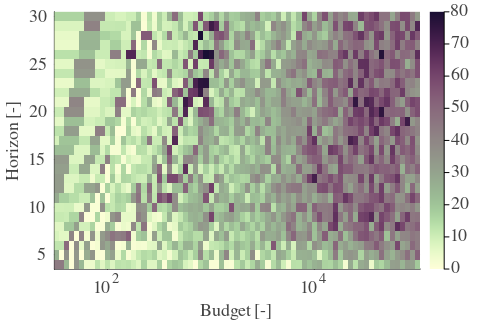 | 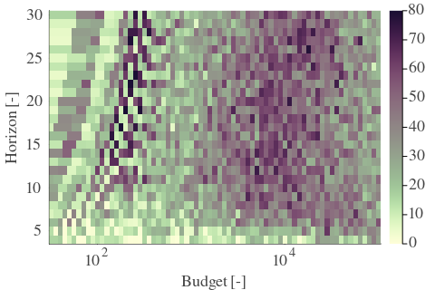 | 

| Cₚ = 4 | γ = 0.8, S = 0.0% | γ = 0.85, S = 0.37% | γ = 0.9, S = 3.55% | 
| --- | --- | --- | --- | 
| Mean | 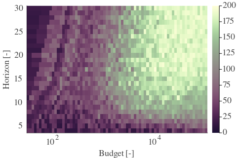 | 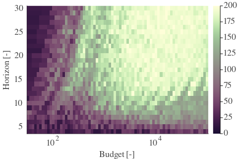 | 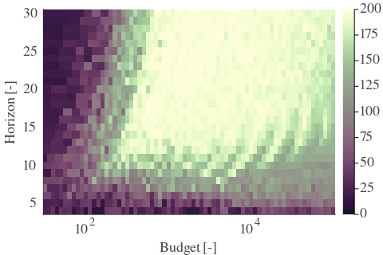 | 
| Std | 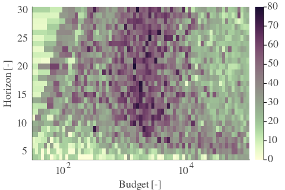 | 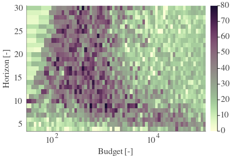 | 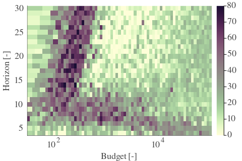 | 

| Cₚ = 4 | γ = 0.95, S = 4.12% | γ = 1.0, S = 1.72% | 
| --- | --- | --- | 
| Mean | 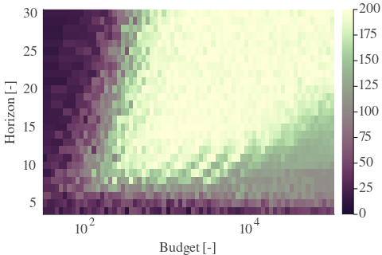 | 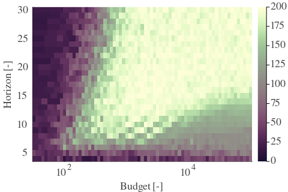 | 
| Std | 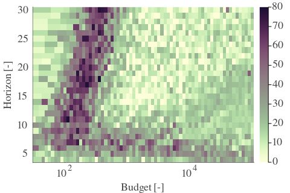 | 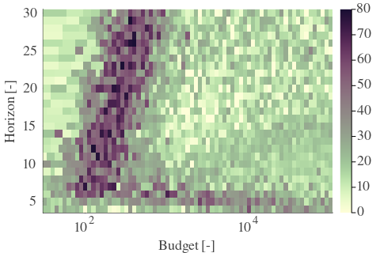 | 

---

**Exploration parameter = 8**

| Cₚ = 8 | γ = 0.5, S = 0.68% | γ = 0.55, S = 0.57% | γ = 0.6, S = 0.0% | 
| --- | --- | --- | --- | 
| Mean | 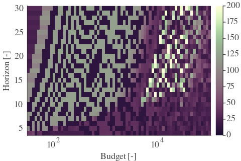 | 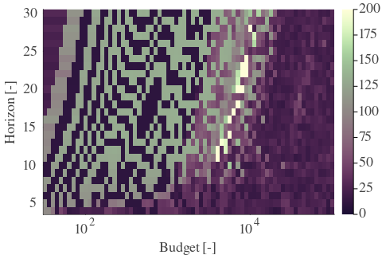 | 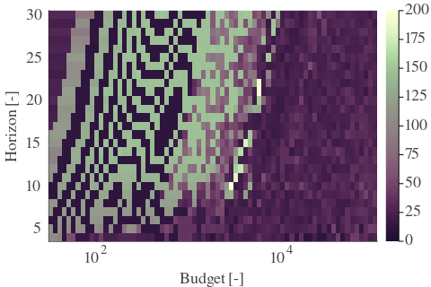 | 
| Std | 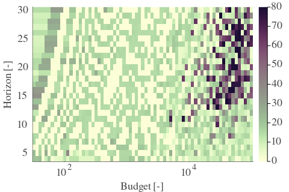 | 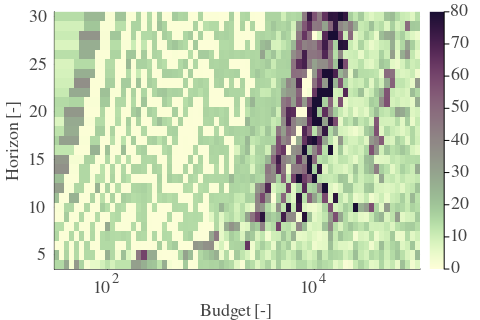 | 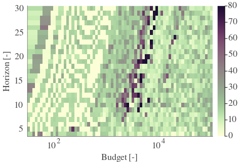 | 

| Cₚ = 8 | γ = 0.65, S = 0.0% | γ = 0.7, S = 0.0% | γ = 0.75, S = 1.72% | 
| --- | --- | --- | --- | 
| Mean | 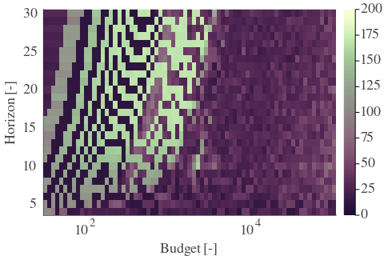 | 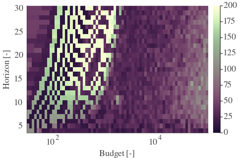 |  | 
| Std |  |  |  | 

| Cₚ = 8 | γ = 0.8, S = 0.42% | γ = 0.85, S = 0.21% | γ = 0.9, S = 1.62% | 
| --- | --- | --- | --- | 
| Mean |  |  |  | 
| Std |  |  |  | 

| Cₚ = 8 | γ = 0.95, S = 4.75% | γ = 1.0, S = 8.29% | 
| --- | --- | --- | 
| Mean |  |  | 
| Std |  |  | 

---

**Exploration parameter = 16**

| Cₚ = 16 | γ = 0.5, S = 0.1% | γ = 0.55, S = 0.89% | γ = 0.6, S = 0.05% | 
| --- | --- | --- | --- | 
| Mean |  |  |  | 
| Std |  |  |  | 

| Cₚ = 16 | γ = 0.65, S = 0.0% | γ = 0.7, S = 0.0% | γ = 0.75, S = 5.48% | 
| --- | --- | --- | --- | 
| Mean |  |  |  | 
| Std |  |  |  | 

| Cₚ = 16 | γ = 0.8, S = 5.63% | γ = 0.85, S = 1.72% | γ = 0.9, S = 0.68% | 
| --- | --- | --- | --- | 
| Mean |  |  |  | 
| Std |  |  |  | 

| Cₚ = 16 | γ = 0.95, S = 3.76% | γ = 1.0, S = 7.2% | 
| --- | --- | --- | 
| Mean |  |  | 
| Std |  |  | 

---

**Exploration parameter = 32**

| Cₚ = 32 | γ = 0.5, S = 0.0% | γ = 0.55, S = 0.57% | γ = 0.6, S = 0.21% | 
| --- | --- | --- | --- | 
| Mean |  |  |  | 
| Std |  |  |  | 

| Cₚ = 32 | γ = 0.65, S = 0.0% | γ = 0.7, S = 0.05% | γ = 0.75, S = 8.09% | 
| --- | --- | --- | --- | 
| Mean |  |  |  | 
| Std |  |  |  | 

| Cₚ = 32 | γ = 0.8, S = 8.19% | γ = 0.85, S = 6.1% | γ = 0.9, S = 2.14% | 
| --- | --- | --- | --- | 
| Mean |  |  |  | 
| Std |  |  |  | 

| Cₚ = 32 | γ = 0.95, S = 1.67% | γ = 1.0, S = 7.41% | 
| --- | --- | --- | 
| Mean |  |  | 
| Std |  |  | 

---

**Exploration parameter = 64**

| Cₚ = 64 | γ = 0.5, S = 0.0% | γ = 0.55, S = 0.42% | γ = 0.6, S = 0.57% | 
| --- | --- | --- | --- | 
| Mean |  |  |  | 
| Std |  |  |  | 

| Cₚ = 64 | γ = 0.65, S = 0.0% | γ = 0.7, S = 0.94% | γ = 0.75, S = 10.02% | 
| --- | --- | --- | --- | 
| Mean |  |  |  | 
| Std |  |  |  | 

| Cₚ = 64 | γ = 0.8, S = 11.42% | γ = 0.85, S = 9.18% | γ = 0.9, S = 6.16% | 
| --- | --- | --- | --- | 
| Mean |  |  |  | 
| Std |  |  |  | 

| Cₚ = 64 | γ = 0.95, S = 2.45% | γ = 1.0, S = 2.3% | 
| --- | --- | --- | 
| Mean |  |  | 
| Std |  |  | 

---

**Exploration parameter = 128**

| Cₚ = 128 | γ = 0.5, S = 0.0% | γ = 0.55, S = 0.0% | γ = 0.6, S = 0.52% | 
| --- | --- | --- | --- | 
| Mean |  |  |  | 
| Std |  |  |  | 

| Cₚ = 128 | γ = 0.65, S = 0.0% | γ = 0.7, S = 2.5% | γ = 0.75, S = 12.31% | 
| --- | --- | --- | --- | 
| Mean |  |  |  | 
| Std |  |  |  | 

| Cₚ = 128 | γ = 0.8, S = 13.67% | γ = 0.85, S = 12.05% | γ = 0.9, S = 8.92% | 
| --- | --- | --- | --- | 
| Mean |  |  |  | 
| Std |  |  |  | 

| Cₚ = 128 | γ = 0.95, S = 6.57% | γ = 1.0, S = 2.61% | 
| --- | --- | --- | 
| Mean |  |  | 
| Std |  |  | 

---

**Exploration parameter = 256**

| Cₚ = 256 | γ = 0.5, S = 0.0% | γ = 0.55, S = 0.0% | γ = 0.6, S = 0.52% | 
| --- | --- | --- | --- | 
| Mean |  |  |  | 
| Std |  |  |  | 

| Cₚ = 256 | γ = 0.65, S = 0.0% | γ = 0.7, S = 3.91% | γ = 0.75, S = 14.4% | 
| --- | --- | --- | --- | 
| Mean |  |  |  | 
| Std |  |  |  | 

| Cₚ = 256 | γ = 0.8, S = 15.81% | γ = 0.85, S = 14.45% | γ = 0.9, S = 12.05% | 
| --- | --- | --- | --- | 
| Mean |  |  |  | 
| Std |  |  |  | 

| Cₚ = 256 | γ = 0.95, S = 9.13% | γ = 1.0, S = 6.0% | 
| --- | --- | --- | 
| Mean |  |  | 
| Std |  |  | 

---

**Exploration parameter = 512**

| Cₚ = 512 | γ = 0.5, S = 0.0% | γ = 0.55, S = 0.0% | γ = 0.6, S = 0.16% | 
| --- | --- | --- | --- | 
| Mean |  |  |  | 
| Std |  |  |  | 

| Cₚ = 512 | γ = 0.65, S = 0.1% | γ = 0.7, S = 4.54% | γ = 0.75, S = 16.48% | 
| --- | --- | --- | --- | 
| Mean |  |  |  | 
| Std |  |  |  | 

| Cₚ = 512 | γ = 0.8, S = 18.1% | γ = 0.85, S = 16.59% | γ = 0.9, S = 14.35% | 
| --- | --- | --- | --- | 
| Mean |  |  |  | 
| Std |  |  |  | 

| Cₚ = 512 | γ = 0.95, S = 12.21% | γ = 1.0, S = 8.76% | 
| --- | --- | --- | 
| Mean |  |  | 
| Std |  |  | 

---

**Exploration parameter = 1024**

| Cₚ = 1024 | γ = 0.5, S = 0.0% | γ = 0.55, S = 0.0% | γ = 0.6, S = 0.0% | 
| --- | --- | --- | --- | 
| Mean |  |  |  | 
| Std |  |  |  | 

| Cₚ = 1024 | γ = 0.65, S = 0.0% | γ = 0.7, S = 4.54% | γ = 0.75, S = 18.57% | 
| --- | --- | --- | --- | 
| Mean |  |  |  | 
| Std |  |  |  | 

| Cₚ = 1024 | γ = 0.8, S = 20.24% | γ = 0.85, S = 18.88% | γ = 0.9, S = 16.64% | 
| --- | --- | --- | --- | 
| Mean |  |  |  | 
| Std |  |  |  | 

| Cₚ = 1024 | γ = 0.95, S = 14.45% | γ = 1.0, S = 11.53% | 
| --- | --- | --- | 
| Mean |  |  | 
| Std |  |  | 

