# Results for the file sp_H_20221219.csv 

Generated on 2023-11-03 14:13:59

---

**Exploration parameter = 0**

| Cₚ = 0 | γ = 0.5, S = 0.0% | γ = 0.55, S = 0.0% | γ = 0.6, S = 0.0% | 
| --- | --- | --- | --- | 
| Mean |  |  |  | 
| Std |  |  |  | 

| Cₚ = 0 | γ = 0.65, S = 0.0% | γ = 0.7, S = 0.0% | γ = 0.75, S = 0.0% | 
| --- | --- | --- | --- | 
| Mean |  |  |  | 
| Std |  |  |  | 

| Cₚ = 0 | γ = 0.8, S = 0.0% | γ = 0.85, S = 0.0% | γ = 0.9, S = 0.0% | 
| --- | --- | --- | --- | 
| Mean |  |  | 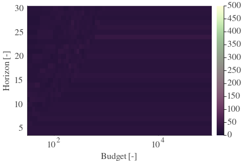 | 
| Std |  |  |  | 

| Cₚ = 0 | γ = 0.95, S = 0.0% | γ = 1.0, S = 0.0% | 
| --- | --- | --- | 
| Mean |  |  | 
| Std |  |  | 

---

**Exploration parameter = 2**

| Cₚ = 2 | γ = 0.5, S = 6.52% | γ = 0.55, S = 2.87% | γ = 0.6, S = 0.05% | 
| --- | --- | --- | --- | 
| Mean | 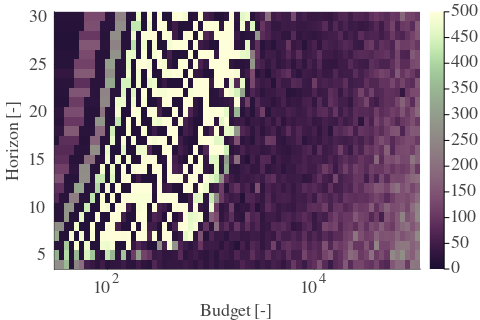 | 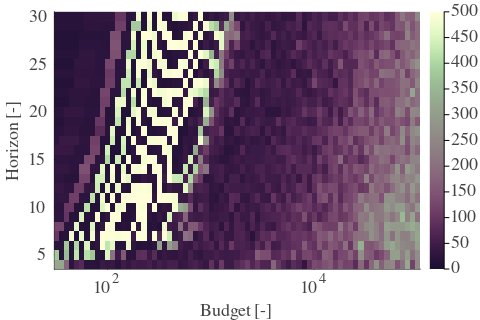 | 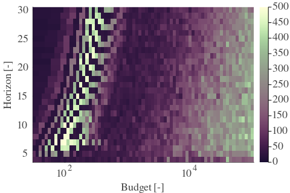 | 
| Std | 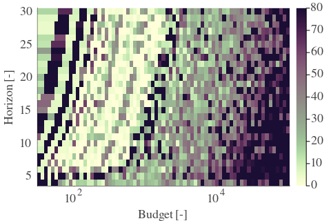 | 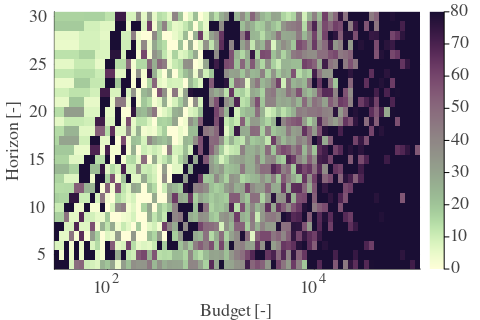 | 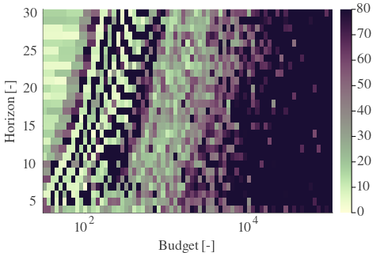 | 

| Cₚ = 2 | γ = 0.65, S = 0.0% | γ = 0.7, S = 0.0% | γ = 0.75, S = 0.0% | 
| --- | --- | --- | --- | 
| Mean |  | 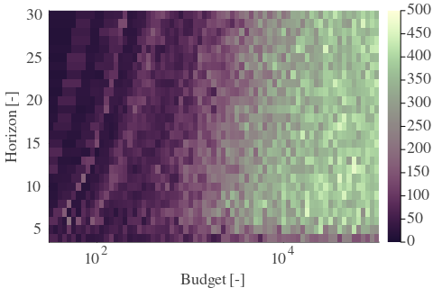 | 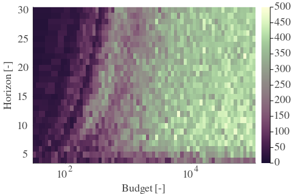 | 
| Std | 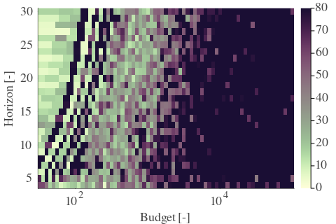 | 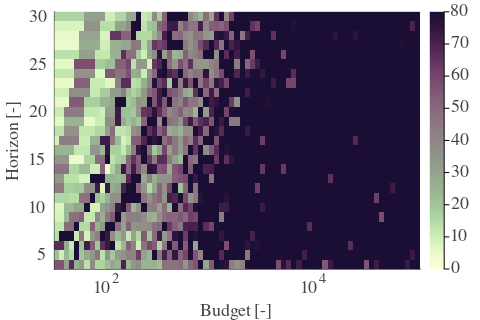 | 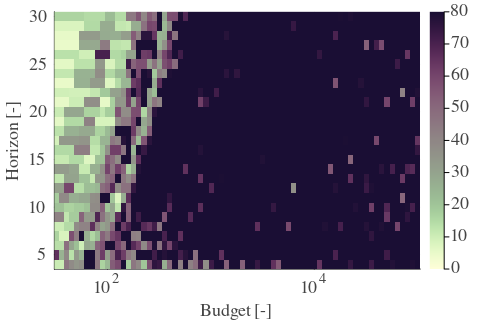 | 

| Cₚ = 2 | γ = 0.8, S = 0.0% | γ = 0.85, S = 0.0% | γ = 0.9, S = 0.05% | 
| --- | --- | --- | --- | 
| Mean | 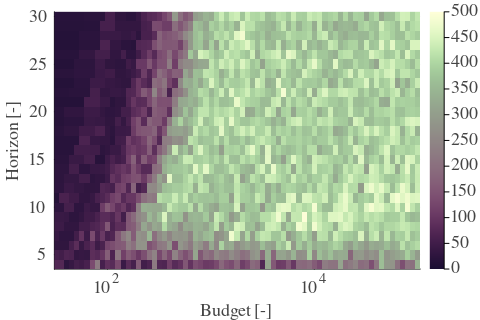 | 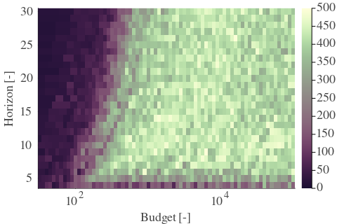 | 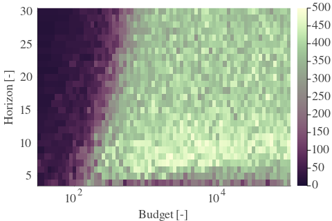 | 
| Std | 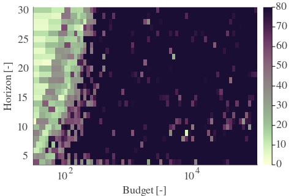 | 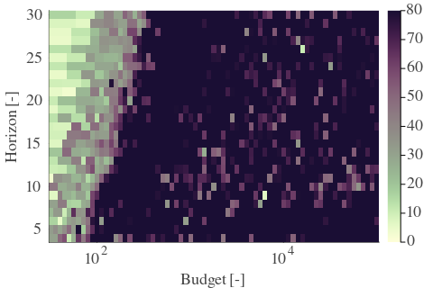 | 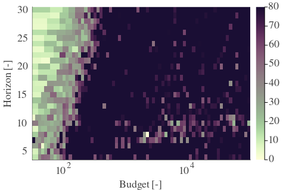 | 

| Cₚ = 2 | γ = 0.95, S = 0.05% | γ = 1.0, S = 0.16% | 
| --- | --- | --- | 
| Mean | 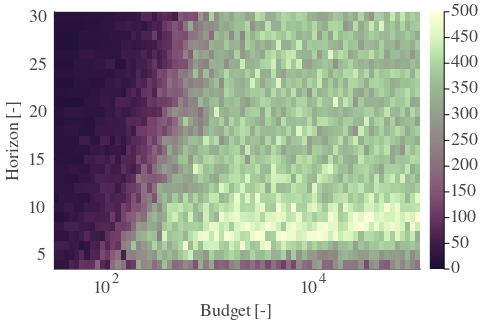 | 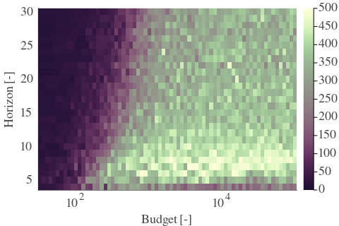 | 
| Std | 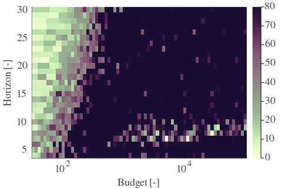 | 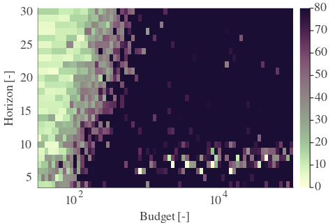 | 

---

**Exploration parameter = 4**

| Cₚ = 4 | γ = 0.5, S = 8.24% | γ = 0.55, S = 6.52% | γ = 0.6, S = 4.59% | 
| --- | --- | --- | --- | 
| Mean |  | 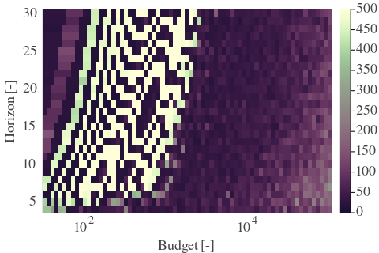 | 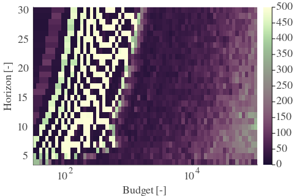 | 
| Std | 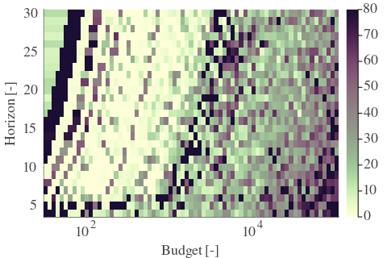 | 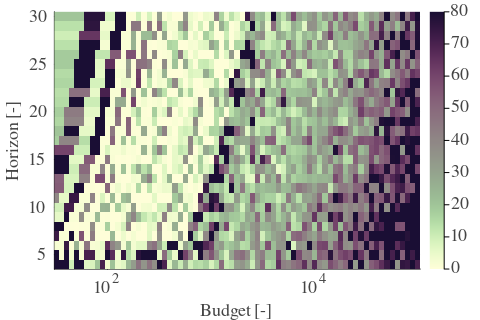 | 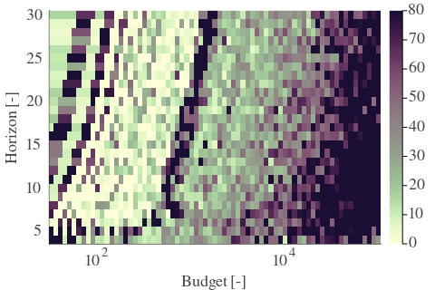 | 

| Cₚ = 4 | γ = 0.65, S = 1.77% | γ = 0.7, S = 0.0% | γ = 0.75, S = 0.0% | 
| --- | --- | --- | --- | 
| Mean | 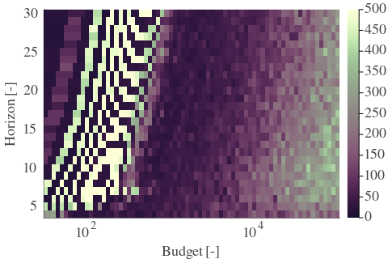 | 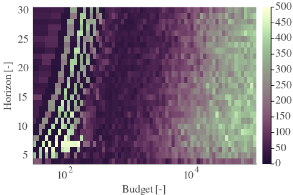 | 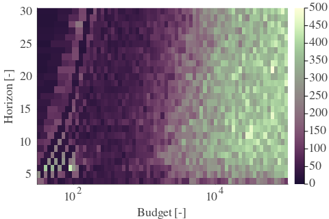 | 
| Std | 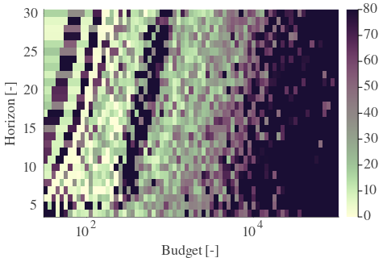 | 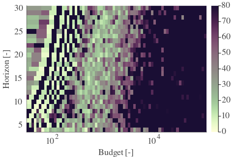 | 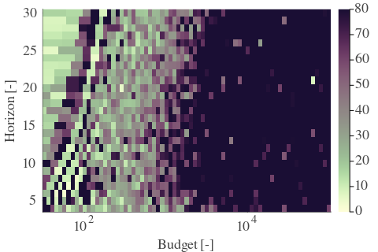 | 

| Cₚ = 4 | γ = 0.8, S = 0.0% | γ = 0.85, S = 0.0% | γ = 0.9, S = 0.1% | 
| --- | --- | --- | --- | 
| Mean | 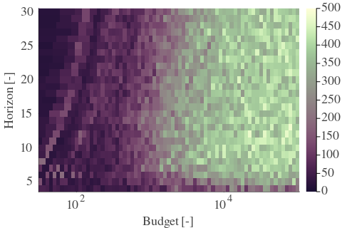 | 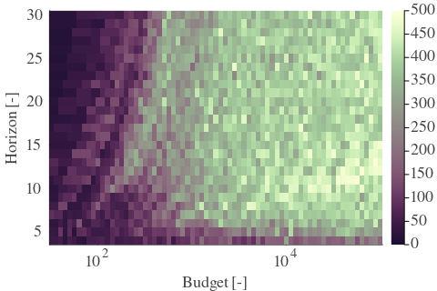 | 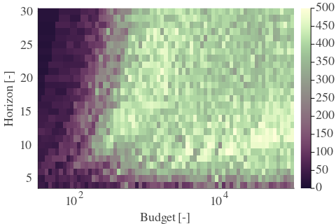 | 
| Std | 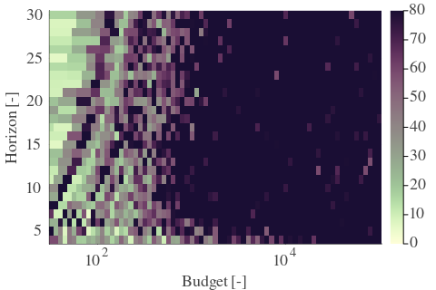 | 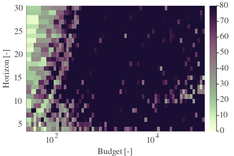 | 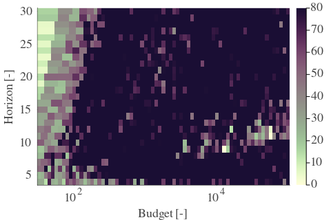 | 

| Cₚ = 4 | γ = 0.95, S = 0.05% | γ = 1.0, S = 0.0% | 
| --- | --- | --- | 
| Mean | 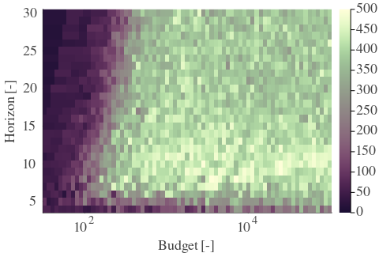 | 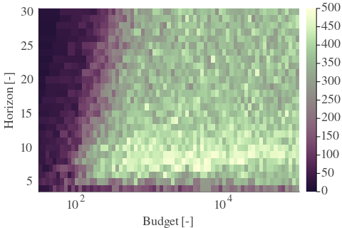 | 
| Std | 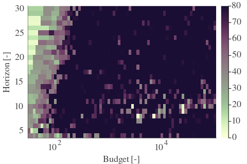 | 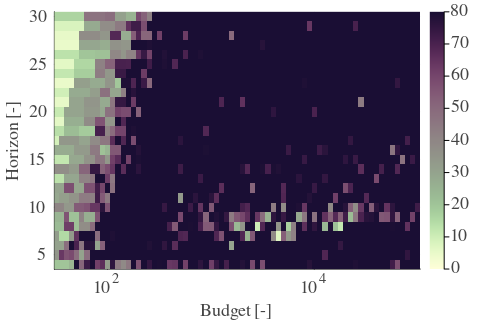 | 

---

**Exploration parameter = 8**

| Cₚ = 8 | γ = 0.5, S = 8.56% | γ = 0.55, S = 7.88% | γ = 0.6, S = 7.09% | 
| --- | --- | --- | --- | 
| Mean | 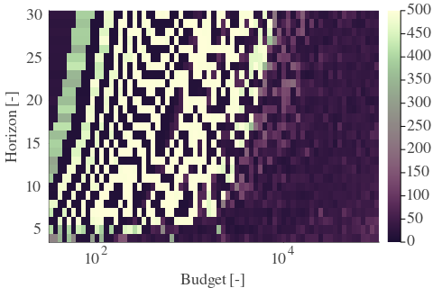 |  | 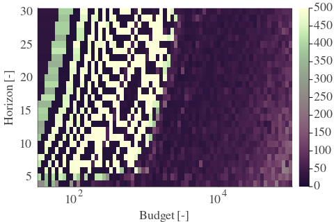 | 
| Std | 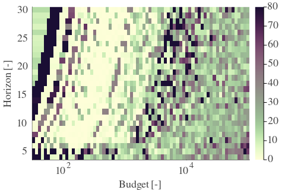 | 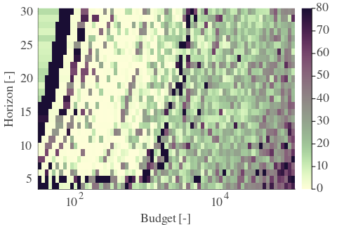 | 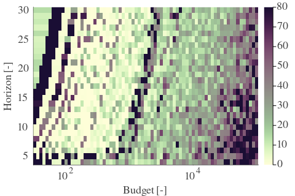 | 

| Cₚ = 8 | γ = 0.65, S = 5.63% | γ = 0.7, S = 2.45% | γ = 0.75, S = 0.57% | 
| --- | --- | --- | --- | 
| Mean | 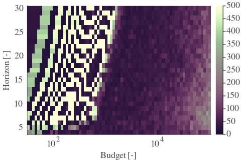 | 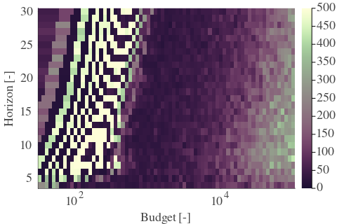 |  | 
| Std |  |  |  | 

| Cₚ = 8 | γ = 0.8, S = 0.16% | γ = 0.85, S = 0.0% | γ = 0.9, S = 0.21% | 
| --- | --- | --- | --- | 
| Mean |  |  |  | 
| Std |  |  |  | 

| Cₚ = 8 | γ = 0.95, S = 0.57% | γ = 1.0, S = 0.52% | 
| --- | --- | --- | 
| Mean |  |  | 
| Std |  |  | 

---

**Exploration parameter = 16**

| Cₚ = 16 | γ = 0.5, S = 9.55% | γ = 0.55, S = 8.4% | γ = 0.6, S = 7.82% | 
| --- | --- | --- | --- | 
| Mean |  |  |  | 
| Std |  |  |  | 

| Cₚ = 16 | γ = 0.65, S = 7.15% | γ = 0.7, S = 5.27% | γ = 0.75, S = 3.13% | 
| --- | --- | --- | --- | 
| Mean |  |  |  | 
| Std |  |  |  | 

| Cₚ = 16 | γ = 0.8, S = 1.3% | γ = 0.85, S = 0.31% | γ = 0.9, S = 0.1% | 
| --- | --- | --- | --- | 
| Mean |  |  |  | 
| Std |  |  |  | 

| Cₚ = 16 | γ = 0.95, S = 0.16% | γ = 1.0, S = 1.25% | 
| --- | --- | --- | 
| Mean |  |  | 
| Std |  |  | 

---

**Exploration parameter = 32**

| Cₚ = 32 | γ = 0.5, S = 9.08% | γ = 0.55, S = 8.56% | γ = 0.6, S = 8.4% | 
| --- | --- | --- | --- | 
| Mean |  |  |  | 
| Std |  |  |  | 

| Cₚ = 32 | γ = 0.65, S = 8.29% | γ = 0.7, S = 6.73% | γ = 0.75, S = 5.06% | 
| --- | --- | --- | --- | 
| Mean |  |  |  | 
| Std |  |  |  | 

| Cₚ = 32 | γ = 0.8, S = 2.76% | γ = 0.85, S = 1.1% | γ = 0.9, S = 0.73% | 
| --- | --- | --- | --- | 
| Mean |  |  |  | 
| Std |  |  |  | 

| Cₚ = 32 | γ = 0.95, S = 0.42% | γ = 1.0, S = 0.47% | 
| --- | --- | --- | 
| Mean |  |  | 
| Std |  |  | 

---

**Exploration parameter = 64**

| Cₚ = 64 | γ = 0.5, S = 9.08% | γ = 0.55, S = 9.18% | γ = 0.6, S = 8.5% | 
| --- | --- | --- | --- | 
| Mean |  |  |  | 
| Std |  |  |  | 

| Cₚ = 64 | γ = 0.65, S = 8.14% | γ = 0.7, S = 7.46% | γ = 0.75, S = 5.84% | 
| --- | --- | --- | --- | 
| Mean |  |  |  | 
| Std |  |  |  | 

| Cₚ = 64 | γ = 0.8, S = 4.54% | γ = 0.85, S = 2.45% | γ = 0.9, S = 1.3% | 
| --- | --- | --- | --- | 
| Mean |  |  |  | 
| Std |  |  |  | 

| Cₚ = 64 | γ = 0.95, S = 1.04% | γ = 1.0, S = 0.57% | 
| --- | --- | --- | 
| Mean |  |  | 
| Std |  |  | 

---

**Exploration parameter = 128**

| Cₚ = 128 | γ = 0.5, S = 9.6% | γ = 0.55, S = 9.55% | γ = 0.6, S = 8.29% | 
| --- | --- | --- | --- | 
| Mean |  |  |  | 
| Std |  |  |  | 

| Cₚ = 128 | γ = 0.65, S = 7.46% | γ = 0.7, S = 7.93% | γ = 0.75, S = 6.73% | 
| --- | --- | --- | --- | 
| Mean |  |  |  | 
| Std |  |  |  | 

| Cₚ = 128 | γ = 0.8, S = 5.53% | γ = 0.85, S = 3.91% | γ = 0.9, S = 2.92% | 
| --- | --- | --- | --- | 
| Mean |  |  |  | 
| Std |  |  |  | 

| Cₚ = 128 | γ = 0.95, S = 1.77% | γ = 1.0, S = 0.99% | 
| --- | --- | --- | 
| Mean |  |  | 
| Std |  |  | 

---

**Exploration parameter = 256**

| Cₚ = 256 | γ = 0.5, S = 9.13% | γ = 0.55, S = 8.87% | γ = 0.6, S = 8.29% | 
| --- | --- | --- | --- | 
| Mean |  |  |  | 
| Std |  |  |  | 

| Cₚ = 256 | γ = 0.65, S = 8.35% | γ = 0.7, S = 7.88% | γ = 0.75, S = 6.73% | 
| --- | --- | --- | --- | 
| Mean |  |  |  | 
| Std |  |  |  | 

| Cₚ = 256 | γ = 0.8, S = 5.89% | γ = 0.85, S = 5.48% | γ = 0.9, S = 3.7% | 
| --- | --- | --- | --- | 
| Mean |  |  |  | 
| Std |  |  |  | 

| Cₚ = 256 | γ = 0.95, S = 2.56% | γ = 1.0, S = 2.03% | 
| --- | --- | --- | 
| Mean |  |  | 
| Std |  |  | 

---

**Exploration parameter = 512**

| Cₚ = 512 | γ = 0.5, S = 8.92% | γ = 0.55, S = 9.44% | γ = 0.6, S = 8.76% | 
| --- | --- | --- | --- | 
| Mean |  |  |  | 
| Std |  |  |  | 

| Cₚ = 512 | γ = 0.65, S = 8.82% | γ = 0.7, S = 8.09% | γ = 0.75, S = 6.89% | 
| --- | --- | --- | --- | 
| Mean |  |  |  | 
| Std |  |  |  | 

| Cₚ = 512 | γ = 0.8, S = 6.36% | γ = 0.85, S = 5.48% | γ = 0.9, S = 5.27% | 
| --- | --- | --- | --- | 
| Mean |  |  |  | 
| Std |  |  |  | 

| Cₚ = 512 | γ = 0.95, S = 3.55% | γ = 1.0, S = 3.03% | 
| --- | --- | --- | 
| Mean |  |  | 
| Std |  |  | 

---

**Exploration parameter = 1024**

| Cₚ = 1024 | γ = 0.5, S = 9.13% | γ = 0.55, S = 9.13% | γ = 0.6, S = 9.34% | 
| --- | --- | --- | --- | 
| Mean |  |  |  | 
| Std |  |  |  | 

| Cₚ = 1024 | γ = 0.65, S = 8.45% | γ = 0.7, S = 8.19% | γ = 0.75, S = 7.36% | 
| --- | --- | --- | --- | 
| Mean |  |  |  | 
| Std |  |  |  | 

| Cₚ = 1024 | γ = 0.8, S = 6.42% | γ = 0.85, S = 5.58% | γ = 0.9, S = 5.43% | 
| --- | --- | --- | --- | 
| Mean |  |  |  | 
| Std |  |  |  | 

| Cₚ = 1024 | γ = 0.95, S = 4.38% | γ = 1.0, S = 4.12% | 
| --- | --- | --- | 
| Mean |  |  | 
| Std |  |  | 

