# Results for the file sp_I_20230310.csv 

Generated on 2023-11-03 14:13:59

---

**Exploration parameter = 0**

| Cₚ = 0 | γ = 0.5, S = 0.0% | γ = 0.55, S = 0.0% | γ = 0.6, S = 0.0% | 
| --- | --- | --- | --- | 
| Mean |  |  |  | 
| Std |  |  |  | 

| Cₚ = 0 | γ = 0.65, S = 0.0% | γ = 0.7, S = 0.0% | γ = 0.75, S = 0.0% | 
| --- | --- | --- | --- | 
| Mean |  |  |  | 
| Std |  |  |  | 

| Cₚ = 0 | γ = 0.8, S = 0.0% | γ = 0.85, S = 0.0% | γ = 0.9, S = 0.0% | 
| --- | --- | --- | --- | 
| Mean |  |  |  | 
| Std |  |  |  | 

| Cₚ = 0 | γ = 0.95, S = 0.0% | γ = 1.0, S = 0.0% | 
| --- | --- | --- | 
| Mean |  |  | 
| Std |  |  | 

---

**Exploration parameter = 2**

| Cₚ = 2 | γ = 0.5, S = 22.07% | γ = 0.55, S = 16.54% | γ = 0.6, S = 8.29% | 
| --- | --- | --- | --- | 
| Mean |  |  |  | 
| Std |  |  |  | 

| Cₚ = 2 | γ = 0.65, S = 0.0% | γ = 0.7, S = 0.05% | γ = 0.75, S = 2.76% | 
| --- | --- | --- | --- | 
| Mean |  |  |  | 
| Std | 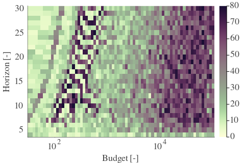 |  |  | 

| Cₚ = 2 | γ = 0.8, S = 12.15% | γ = 0.85, S = 28.27% | γ = 0.9, S = 18.41% | 
| --- | --- | --- | --- | 
| Mean |  |  |  | 
| Std |  |  |  | 

| Cₚ = 2 | γ = 0.95, S = 14.35% | γ = 1.0, S = 10.64% | 
| --- | --- | --- | 
| Mean |  |  | 
| Std |  |  | 

---

**Exploration parameter = 4**

| Cₚ = 4 | γ = 0.5, S = 27.6% | γ = 0.55, S = 22.33% | γ = 0.6, S = 17.79% | 
| --- | --- | --- | --- | 
| Mean |  |  |  | 
| Std |  |  | 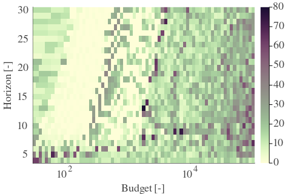 | 

| Cₚ = 4 | γ = 0.65, S = 12.88% | γ = 0.7, S = 2.3% | γ = 0.75, S = 0.31% | 
| --- | --- | --- | --- | 
| Mean |  |  |  | 
| Std |  |  |  | 

| Cₚ = 4 | γ = 0.8, S = 2.56% | γ = 0.85, S = 12.52% | γ = 0.9, S = 27.23% | 
| --- | --- | --- | --- | 
| Mean |  |  |  | 
| Std |  |  |  | 

| Cₚ = 4 | γ = 0.95, S = 23.47% | γ = 1.0, S = 17.21% | 
| --- | --- | --- | 
| Mean |  |  | 
| Std |  |  | 

---

**Exploration parameter = 8**

| Cₚ = 8 | γ = 0.5, S = 30.57% | γ = 0.55, S = 27.75% | γ = 0.6, S = 21.96% | 
| --- | --- | --- | --- | 
| Mean |  |  |  | 
| Std |  |  |  | 

| Cₚ = 8 | γ = 0.65, S = 18.21% | γ = 0.7, S = 12.42% | γ = 0.75, S = 7.2% | 
| --- | --- | --- | --- | 
| Mean | 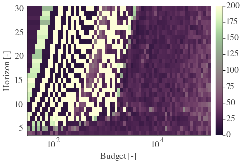 |  |  | 
| Std | 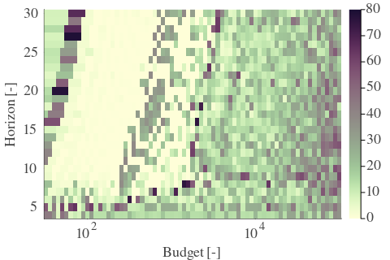 |  |  | 

| Cₚ = 8 | γ = 0.8, S = 0.89% | γ = 0.85, S = 3.5% | γ = 0.9, S = 13.72% | 
| --- | --- | --- | --- | 
| Mean |  |  |  | 
| Std |  |  |  | 

| Cₚ = 8 | γ = 0.95, S = 23.27% | γ = 1.0, S = 24.99% | 
| --- | --- | --- | 
| Mean |  |  | 
| Std |  |  | 

---

**Exploration parameter = 16**

| Cₚ = 16 | γ = 0.5, S = 30.1% | γ = 0.55, S = 31.25% | γ = 0.6, S = 25.56% | 
| --- | --- | --- | --- | 
| Mean |  | 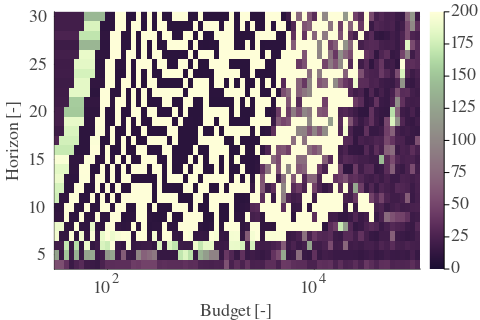 |  | 
| Std |  |  |  | 

| Cₚ = 16 | γ = 0.65, S = 21.23% | γ = 0.7, S = 17.89% | γ = 0.75, S = 13.09% | 
| --- | --- | --- | --- | 
| Mean |  |  | 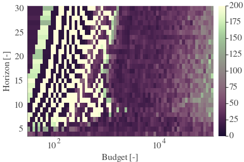 | 
| Std |  |  | 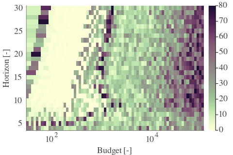 | 

| Cₚ = 16 | γ = 0.8, S = 8.82% | γ = 0.85, S = 2.56% | γ = 0.9, S = 4.38% | 
| --- | --- | --- | --- | 
| Mean |  |  |  | 
| Std | 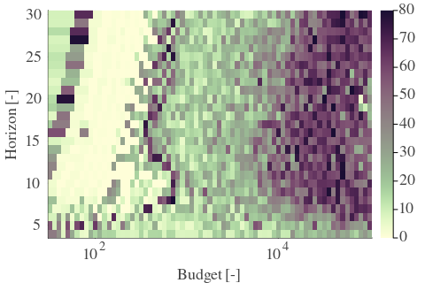 |  |  | 

| Cₚ = 16 | γ = 0.95, S = 14.29% | γ = 1.0, S = 17.94% | 
| --- | --- | --- | 
| Mean |  |  | 
| Std |  |  | 

---

**Exploration parameter = 32**

| Cₚ = 32 | γ = 0.5, S = 30.41% | γ = 0.55, S = 35.05% | γ = 0.6, S = 29.16% | 
| --- | --- | --- | --- | 
| Mean |  |  |  | 
| Std |  | 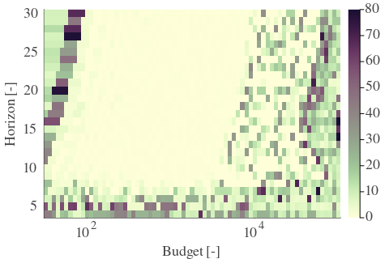 |  | 

| Cₚ = 32 | γ = 0.65, S = 24.67% | γ = 0.7, S = 20.76% | γ = 0.75, S = 17.37% | 
| --- | --- | --- | --- | 
| Mean |  |  |  | 
| Std |  |  |  | 

| Cₚ = 32 | γ = 0.8, S = 13.25% | γ = 0.85, S = 9.29% | γ = 0.9, S = 4.69% | 
| --- | --- | --- | --- | 
| Mean |  | 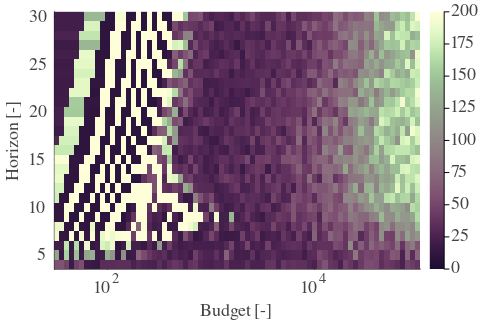 |  | 
| Std |  |  |  | 

| Cₚ = 32 | γ = 0.95, S = 4.49% | γ = 1.0, S = 12.57% | 
| --- | --- | --- | 
| Mean |  |  | 
| Std |  |  | 

---

**Exploration parameter = 64**

| Cₚ = 64 | γ = 0.5, S = 29.79% | γ = 0.55, S = 37.92% | γ = 0.6, S = 32.34% | 
| --- | --- | --- | --- | 
| Mean |  |  |  | 
| Std |  |  |  | 

| Cₚ = 64 | γ = 0.65, S = 28.12% | γ = 0.7, S = 24.05% | γ = 0.75, S = 20.4% | 
| --- | --- | --- | --- | 
| Mean |  |  |  | 
| Std |  |  |  | 

| Cₚ = 64 | γ = 0.8, S = 17.11% | γ = 0.85, S = 12.94% | γ = 0.9, S = 9.18% | 
| --- | --- | --- | --- | 
| Mean |  |  |  | 
| Std |  |  |  | 

| Cₚ = 64 | γ = 0.95, S = 4.85% | γ = 1.0, S = 5.53% | 
| --- | --- | --- | 
| Mean |  |  | 
| Std |  |  | 

---

**Exploration parameter = 128**

| Cₚ = 128 | γ = 0.5, S = 30.05% | γ = 0.55, S = 38.81% | γ = 0.6, S = 36.05% | 
| --- | --- | --- | --- | 
| Mean |  |  |  | 
| Std |  |  |  | 

| Cₚ = 128 | γ = 0.65, S = 30.83% | γ = 0.7, S = 27.28% | γ = 0.75, S = 23.37% | 
| --- | --- | --- | --- | 
| Mean |  |  |  | 
| Std |  |  |  | 

| Cₚ = 128 | γ = 0.8, S = 20.19% | γ = 0.85, S = 16.12% | γ = 0.9, S = 12.73% | 
| --- | --- | --- | --- | 
| Mean |  |  |  | 
| Std |  |  |  | 

| Cₚ = 128 | γ = 0.95, S = 8.76% | γ = 1.0, S = 5.79% | 
| --- | --- | --- | 
| Mean |  |  | 
| Std |  |  | 

---

**Exploration parameter = 256**

| Cₚ = 256 | γ = 0.5, S = 29.89% | γ = 0.55, S = 38.91% | γ = 0.6, S = 38.91% | 
| --- | --- | --- | --- | 
| Mean |  |  |  | 
| Std |  |  | 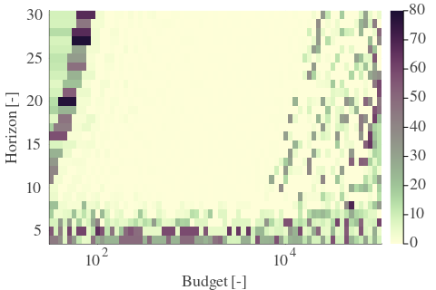 | 

| Cₚ = 256 | γ = 0.65, S = 33.91% | γ = 0.7, S = 29.94% | γ = 0.75, S = 26.71% | 
| --- | --- | --- | --- | 
| Mean |  | 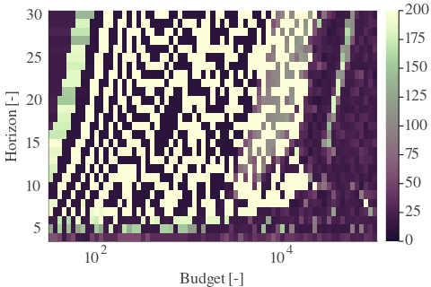 |  | 
| Std |  |  |  | 

| Cₚ = 256 | γ = 0.8, S = 23.16% | γ = 0.85, S = 19.82% | γ = 0.9, S = 15.91% | 
| --- | --- | --- | --- | 
| Mean |  |  |  | 
| Std |  |  |  | 

| Cₚ = 256 | γ = 0.95, S = 12.21% | γ = 1.0, S = 9.08% | 
| --- | --- | --- | 
| Mean |  |  | 
| Std |  |  | 

---

**Exploration parameter = 512**

| Cₚ = 512 | γ = 0.5, S = 29.73% | γ = 0.55, S = 39.65% | γ = 0.6, S = 39.54% | 
| --- | --- | --- | --- | 
| Mean |  |  |  | 
| Std |  |  |  | 

| Cₚ = 512 | γ = 0.65, S = 37.3% | γ = 0.7, S = 33.28% | γ = 0.75, S = 29.68% | 
| --- | --- | --- | --- | 
| Mean |  |  |  | 
| Std | 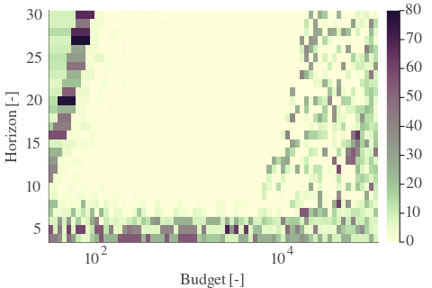 |  |  | 

| Cₚ = 512 | γ = 0.8, S = 25.93% | γ = 0.85, S = 22.64% | γ = 0.9, S = 19.46% | 
| --- | --- | --- | --- | 
| Mean | 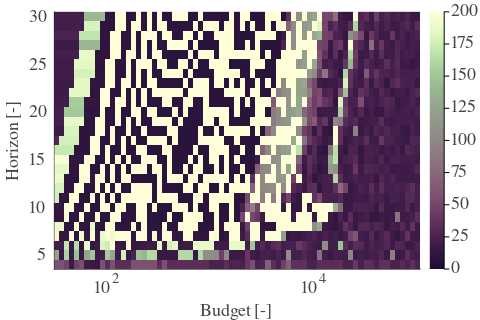 | 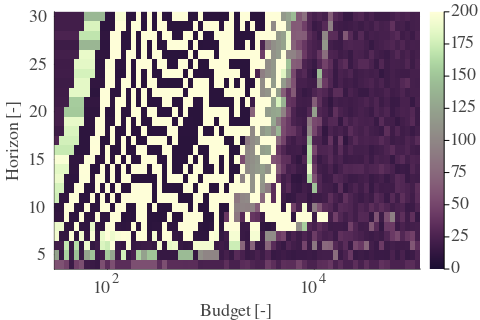 |  | 
| Std |  |  |  | 

| Cₚ = 512 | γ = 0.95, S = 15.13% | γ = 1.0, S = 12.0% | 
| --- | --- | --- | 
| Mean |  |  | 
| Std |  |  | 

---

**Exploration parameter = 1024**

| Cₚ = 1024 | γ = 0.5, S = 29.42% | γ = 0.55, S = 39.85% | γ = 0.6, S = 39.8% | 
| --- | --- | --- | --- | 
| Mean |  |  |  | 
| Std |  |  |  | 

| Cₚ = 1024 | γ = 0.65, S = 38.45% | γ = 0.7, S = 35.52% | γ = 0.75, S = 32.6% | 
| --- | --- | --- | --- | 
| Mean |  |  |  | 
| Std |  |  |  | 

| Cₚ = 1024 | γ = 0.8, S = 29.06% | γ = 0.85, S = 25.51% | γ = 0.9, S = 22.43% | 
| --- | --- | --- | --- | 
| Mean |  |  |  | 
| Std |  |  |  | 

| Cₚ = 1024 | γ = 0.95, S = 18.88% | γ = 1.0, S = 15.28% | 
| --- | --- | --- | 
| Mean |  |  | 
| Std |  |  | 

