# Results for the file sp_L_20230315.csv 

Generated on 2023-11-03 14:14:01

---

**Exploration parameter = 0**

| Cₚ = 0 | γ = 0.5, S = 0.0% | γ = 0.55, S = 0.0% | γ = 0.6, S = 0.0% | 
| --- | --- | --- | --- | 
| Mean |  |  |  | 
| Std |  |  |  | 

| Cₚ = 0 | γ = 0.65, S = 0.0% | γ = 0.7, S = 0.0% | γ = 0.75, S = 0.0% | 
| --- | --- | --- | --- | 
| Mean |  |  |  | 
| Std |  | 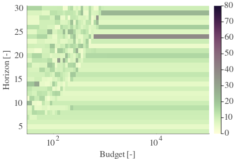 |  | 

| Cₚ = 0 | γ = 0.8, S = 0.0% | γ = 0.85, S = 0.0% | γ = 0.9, S = 0.0% | 
| --- | --- | --- | --- | 
| Mean |  |  |  | 
| Std |  |  |  | 

| Cₚ = 0 | γ = 0.95, S = 0.0% | γ = 1.0, S = 0.0% | 
| --- | --- | --- | 
| Mean |  |  | 
| Std |  |  | 

---

**Exploration parameter = 2**

| Cₚ = 2 | γ = 0.5, S = 27.49% | γ = 0.55, S = 30.57% | γ = 0.6, S = 32.19% | 
| --- | --- | --- | --- | 
| Mean |  |  |  | 
| Std |  |  |  | 

| Cₚ = 2 | γ = 0.65, S = 33.96% | γ = 0.7, S = 42.72% | γ = 0.75, S = 51.96% | 
| --- | --- | --- | --- | 
| Mean |  |  |  | 
| Std |  |  |  | 

| Cₚ = 2 | γ = 0.8, S = 67.66% | γ = 0.85, S = 70.06% | γ = 0.9, S = 71.21% | 
| --- | --- | --- | --- | 
| Mean |  |  |  | 
| Std |  |  |  | 

| Cₚ = 2 | γ = 0.95, S = 67.45% | γ = 1.0, S = 51.9% | 
| --- | --- | --- | 
| Mean |  |  | 
| Std |  |  | 

---

**Exploration parameter = 4**

| Cₚ = 4 | γ = 0.5, S = 29.89% | γ = 0.55, S = 26.92% | γ = 0.6, S = 26.97% | 
| --- | --- | --- | --- | 
| Mean |  |  |  | 
| Std |  |  |  | 

| Cₚ = 4 | γ = 0.65, S = 28.48% | γ = 0.7, S = 32.92% | γ = 0.75, S = 36.72% | 
| --- | --- | --- | --- | 
| Mean |  |  |  | 
| Std |  |  |  | 

| Cₚ = 4 | γ = 0.8, S = 46.01% | γ = 0.85, S = 56.03% | γ = 0.9, S = 67.66% | 
| --- | --- | --- | --- | 
| Mean |  |  |  | 
| Std |  |  |  | 

| Cₚ = 4 | γ = 0.95, S = 71.73% | γ = 1.0, S = 67.76% | 
| --- | --- | --- | 
| Mean | 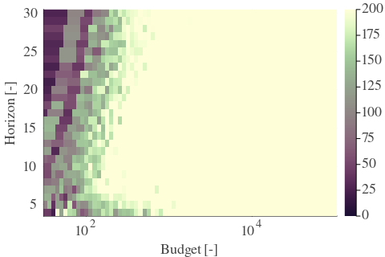 |  | 
| Std |  |  | 

---

**Exploration parameter = 8**

| Cₚ = 8 | γ = 0.5, S = 30.1% | γ = 0.55, S = 26.03% | γ = 0.6, S = 25.87% | 
| --- | --- | --- | --- | 
| Mean |  |  |  | 
| Std |  |  |  | 

| Cₚ = 8 | γ = 0.65, S = 23.0% | γ = 0.7, S = 26.71% | γ = 0.75, S = 29.68% | 
| --- | --- | --- | --- | 
| Mean | 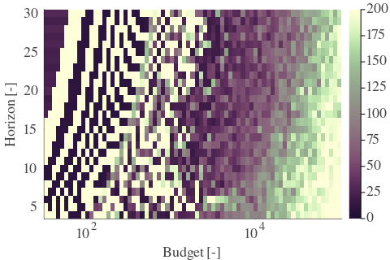 |  |  | 
| Std |  |  |  | 

| Cₚ = 8 | γ = 0.8, S = 33.65% | γ = 0.85, S = 41.63% | γ = 0.9, S = 49.92% | 
| --- | --- | --- | --- | 
| Mean |  |  |  | 
| Std |  |  |  | 

| Cₚ = 8 | γ = 0.95, S = 61.76% | γ = 1.0, S = 68.91% | 
| --- | --- | --- | 
| Mean |  |  | 
| Std |  |  | 

---

**Exploration parameter = 16**

| Cₚ = 16 | γ = 0.5, S = 34.32% | γ = 0.55, S = 29.47% | γ = 0.6, S = 25.67% | 
| --- | --- | --- | --- | 
| Mean |  |  |  | 
| Std |  |  |  | 

| Cₚ = 16 | γ = 0.65, S = 23.84% | γ = 0.7, S = 22.43% | γ = 0.75, S = 21.34% | 
| --- | --- | --- | --- | 
| Mean |  |  |  | 
| Std |  |  |  | 

| Cₚ = 16 | γ = 0.8, S = 26.24% | γ = 0.85, S = 31.04% | γ = 0.9, S = 35.58% | 
| --- | --- | --- | --- | 
| Mean |  |  |  | 
| Std |  |  |  | 

| Cₚ = 16 | γ = 0.95, S = 45.33% | γ = 1.0, S = 55.5% | 
| --- | --- | --- | 
| Mean |  |  | 
| Std | 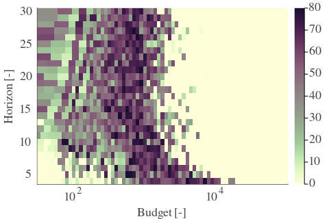 |  | 

---

**Exploration parameter = 32**

| Cₚ = 32 | γ = 0.5, S = 36.1% | γ = 0.55, S = 32.45% | γ = 0.6, S = 29.21% | 
| --- | --- | --- | --- | 
| Mean |  |  |  | 
| Std |  |  |  | 

| Cₚ = 32 | γ = 0.65, S = 26.5% | γ = 0.7, S = 24.2% | γ = 0.75, S = 21.7% | 
| --- | --- | --- | --- | 
| Mean |  |  |  | 
| Std |  |  |  | 

| Cₚ = 32 | γ = 0.8, S = 19.93% | γ = 0.85, S = 21.28% | γ = 0.9, S = 27.75% | 
| --- | --- | --- | --- | 
| Mean |  |  |  | 
| Std |  |  |  | 

| Cₚ = 32 | γ = 0.95, S = 33.02% | γ = 1.0, S = 39.96% | 
| --- | --- | --- | 
| Mean |  |  | 
| Std |  |  | 

---

**Exploration parameter = 64**

| Cₚ = 64 | γ = 0.5, S = 38.91% | γ = 0.55, S = 35.68% | γ = 0.6, S = 32.03% | 
| --- | --- | --- | --- | 
| Mean |  |  | 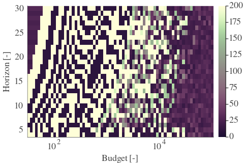 | 
| Std |  |  |  | 

| Cₚ = 64 | γ = 0.65, S = 29.68% | γ = 0.7, S = 28.22% | γ = 0.75, S = 24.93% | 
| --- | --- | --- | --- | 
| Mean |  |  |  | 
| Std |  |  |  | 

| Cₚ = 64 | γ = 0.8, S = 22.43% | γ = 0.85, S = 19.93% | γ = 0.9, S = 18.88% | 
| --- | --- | --- | --- | 
| Mean |  |  |  | 
| Std |  |  |  | 

| Cₚ = 64 | γ = 0.95, S = 24.1% | γ = 1.0, S = 28.79% | 
| --- | --- | --- | 
| Mean | 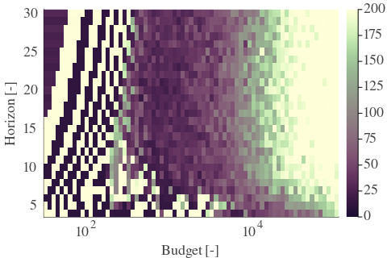 |  | 
| Std |  |  | 

---

**Exploration parameter = 128**

| Cₚ = 128 | γ = 0.5, S = 41.89% | γ = 0.55, S = 38.39% | γ = 0.6, S = 35.05% | 
| --- | --- | --- | --- | 
| Mean |  |  |  | 
| Std | 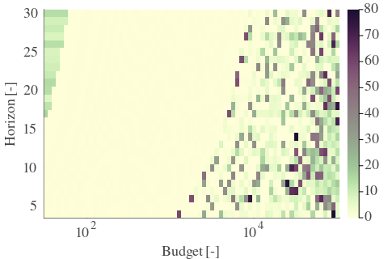 |  |  | 

| Cₚ = 128 | γ = 0.65, S = 34.12% | γ = 0.7, S = 31.09% | γ = 0.75, S = 29.32% | 
| --- | --- | --- | --- | 
| Mean |  |  |  | 
| Std |  |  |  | 

| Cₚ = 128 | γ = 0.8, S = 26.19% | γ = 0.85, S = 22.48% | γ = 0.9, S = 19.61% | 
| --- | --- | --- | --- | 
| Mean |  |  |  | 
| Std |  |  |  | 

| Cₚ = 128 | γ = 0.95, S = 18.36% | γ = 1.0, S = 20.5% | 
| --- | --- | --- | 
| Mean |  |  | 
| Std |  |  | 

---

**Exploration parameter = 256**

| Cₚ = 256 | γ = 0.5, S = 43.61% | γ = 0.55, S = 40.58% | γ = 0.6, S = 38.5% | 
| --- | --- | --- | --- | 
| Mean |  |  |  | 
| Std |  |  |  | 

| Cₚ = 256 | γ = 0.65, S = 35.99% | γ = 0.7, S = 33.7% | γ = 0.75, S = 31.66% | 
| --- | --- | --- | --- | 
| Mean |  |  | 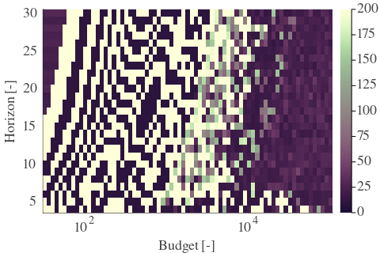 | 
| Std |  |  |  | 

| Cₚ = 256 | γ = 0.8, S = 29.37% | γ = 0.85, S = 26.92% | γ = 0.9, S = 23.58% | 
| --- | --- | --- | --- | 
| Mean |  |  |  | 
| Std |  |  |  | 

| Cₚ = 256 | γ = 0.95, S = 20.19% | γ = 1.0, S = 17.63% | 
| --- | --- | --- | 
| Mean |  |  | 
| Std |  |  | 

---

**Exploration parameter = 512**

| Cₚ = 512 | γ = 0.5, S = 45.44% | γ = 0.55, S = 43.82% | γ = 0.6, S = 41.11% | 
| --- | --- | --- | --- | 
| Mean | 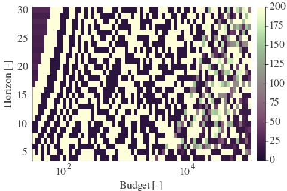 |  |  | 
| Std |  | 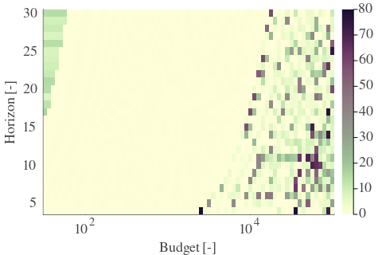 |  | 

| Cₚ = 512 | γ = 0.65, S = 38.91% | γ = 0.7, S = 36.1% | γ = 0.75, S = 34.64% | 
| --- | --- | --- | --- | 
| Mean |  |  |  | 
| Std |  |  |  | 

| Cₚ = 512 | γ = 0.8, S = 33.07% | γ = 0.85, S = 30.41% | γ = 0.9, S = 27.18% | 
| --- | --- | --- | --- | 
| Mean |  |  |  | 
| Std |  |  |  | 

| Cₚ = 512 | γ = 0.95, S = 22.95% | γ = 1.0, S = 20.61% | 
| --- | --- | --- | 
| Mean |  | 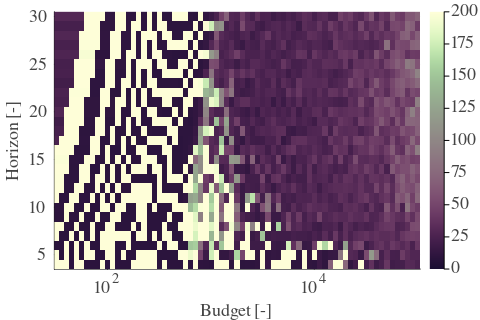 | 
| Std |  |  | 

---

**Exploration parameter = 1024**

| Cₚ = 1024 | γ = 0.5, S = 47.37% | γ = 0.55, S = 45.96% | γ = 0.6, S = 43.97% | 
| --- | --- | --- | --- | 
| Mean |  |  |  | 
| Std |  |  |  | 

| Cₚ = 1024 | γ = 0.65, S = 41.73% | γ = 0.7, S = 39.91% | γ = 0.75, S = 36.62% | 
| --- | --- | --- | --- | 
| Mean |  |  | 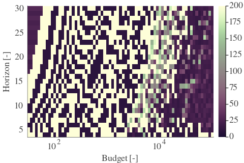 | 
| Std |  | 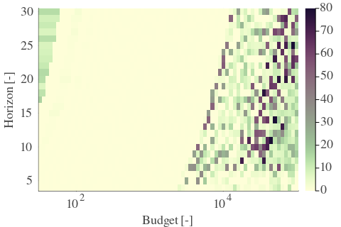 |  | 

| Cₚ = 1024 | γ = 0.8, S = 34.95% | γ = 0.85, S = 33.12% | γ = 0.9, S = 30.62% | 
| --- | --- | --- | --- | 
| Mean |  |  |  | 
| Std |  |  |  | 

| Cₚ = 1024 | γ = 0.95, S = 27.28% | γ = 1.0, S = 24.0% | 
| --- | --- | --- | 
| Mean |  |  | 
| Std |  |  | 

