# Results for the file sp_M_20230316.csv 

Generated on 2023-11-03 14:14:02

---

**Exploration parameter = 0**

| Cₚ = 0 | γ = 0.5, S = 0.0% | γ = 0.55, S = 0.0% | γ = 0.6, S = 0.0% | 
| --- | --- | --- | --- | 
| Mean |  |  |  | 
| Std |  |  |  | 

| Cₚ = 0 | γ = 0.65, S = 0.0% | γ = 0.7, S = 0.0% | γ = 0.75, S = 0.0% | 
| --- | --- | --- | --- | 
| Mean |  |  |  | 
| Std |  |  |  | 

| Cₚ = 0 | γ = 0.8, S = 0.0% | γ = 0.85, S = 0.0% | γ = 0.9, S = 0.0% | 
| --- | --- | --- | --- | 
| Mean |  |  |  | 
| Std |  |  |  | 

| Cₚ = 0 | γ = 0.95, S = 0.0% | γ = 1.0, S = 0.0% | 
| --- | --- | --- | 
| Mean |  |  | 
| Std |  |  | 

---

**Exploration parameter = 2**

| Cₚ = 2 | γ = 0.5, S = 27.7% | γ = 0.55, S = 29.21% | γ = 0.6, S = 31.35% | 
| --- | --- | --- | --- | 
| Mean |  |  |  | 
| Std |  |  |  | 

| Cₚ = 2 | γ = 0.65, S = 34.9% | γ = 0.7, S = 43.3% | γ = 0.75, S = 53.42% | 
| --- | --- | --- | --- | 
| Mean |  |  |  | 
| Std | 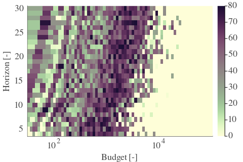 |  |  | 

| Cₚ = 2 | γ = 0.8, S = 67.4% | γ = 0.85, S = 70.89% | γ = 0.9, S = 71.94% | 
| --- | --- | --- | --- | 
| Mean | 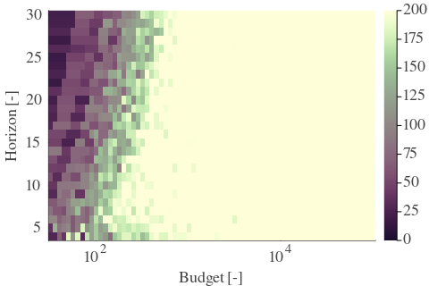 |  |  | 
| Std | 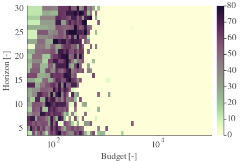 |  |  | 

| Cₚ = 2 | γ = 0.95, S = 67.24% | γ = 1.0, S = 52.95% | 
| --- | --- | --- | 
| Mean |  |  | 
| Std |  |  | 

---

**Exploration parameter = 4**

| Cₚ = 4 | γ = 0.5, S = 29.37% | γ = 0.55, S = 25.25% | γ = 0.6, S = 24.88% | 
| --- | --- | --- | --- | 
| Mean |  |  |  | 
| Std |  |  |  | 

| Cₚ = 4 | γ = 0.65, S = 27.28% | γ = 0.7, S = 33.49% | γ = 0.75, S = 37.3% | 
| --- | --- | --- | --- | 
| Mean |  |  |  | 
| Std |  |  |  | 

| Cₚ = 4 | γ = 0.8, S = 46.06% | γ = 0.85, S = 55.92% | γ = 0.9, S = 67.5% | 
| --- | --- | --- | --- | 
| Mean |  |  |  | 
| Std | 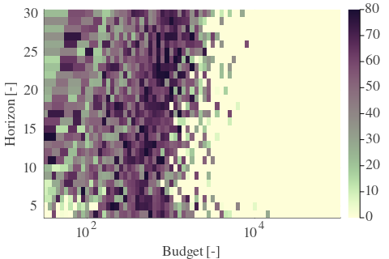 |  |  | 

| Cₚ = 4 | γ = 0.95, S = 71.73% | γ = 1.0, S = 67.34% | 
| --- | --- | --- | 
| Mean |  |  | 
| Std |  |  | 

---

**Exploration parameter = 8**

| Cₚ = 8 | γ = 0.5, S = 28.74% | γ = 0.55, S = 26.71% | γ = 0.6, S = 23.74% | 
| --- | --- | --- | --- | 
| Mean |  |  |  | 
| Std |  |  |  | 

| Cₚ = 8 | γ = 0.65, S = 21.91% | γ = 0.7, S = 26.29% | γ = 0.75, S = 29.06% | 
| --- | --- | --- | --- | 
| Mean |  |  |  | 
| Std |  |  |  | 

| Cₚ = 8 | γ = 0.8, S = 33.07% | γ = 0.85, S = 41.0% | γ = 0.9, S = 49.92% | 
| --- | --- | --- | --- | 
| Mean |  |  |  | 
| Std |  |  |  | 

| Cₚ = 8 | γ = 0.95, S = 60.51% | γ = 1.0, S = 68.44% | 
| --- | --- | --- | 
| Mean |  |  | 
| Std |  |  | 

---

**Exploration parameter = 16**

| Cₚ = 16 | γ = 0.5, S = 31.3% | γ = 0.55, S = 27.49% | γ = 0.6, S = 25.25% | 
| --- | --- | --- | --- | 
| Mean |  |  |  | 
| Std |  |  |  | 

| Cₚ = 16 | γ = 0.65, S = 22.85% | γ = 0.7, S = 20.87% | γ = 0.75, S = 20.87% | 
| --- | --- | --- | --- | 
| Mean |  |  |  | 
| Std |  |  |  | 

| Cₚ = 16 | γ = 0.8, S = 25.2% | γ = 0.85, S = 31.3% | γ = 0.9, S = 35.32% | 
| --- | --- | --- | --- | 
| Mean |  |  |  | 
| Std |  |  |  | 

| Cₚ = 16 | γ = 0.95, S = 44.18% | γ = 1.0, S = 54.09% | 
| --- | --- | --- | 
| Mean |  |  | 
| Std |  |  | 

---

**Exploration parameter = 32**

| Cₚ = 32 | γ = 0.5, S = 34.79% | γ = 0.55, S = 31.72% | γ = 0.6, S = 28.79% | 
| --- | --- | --- | --- | 
| Mean |  |  |  | 
| Std |  |  |  | 

| Cₚ = 32 | γ = 0.65, S = 24.62% | γ = 0.7, S = 23.21% | γ = 0.75, S = 21.6% | 
| --- | --- | --- | --- | 
| Mean |  |  |  | 
| Std |  |  |  | 

| Cₚ = 32 | γ = 0.8, S = 18.15% | γ = 0.85, S = 20.03% | γ = 0.9, S = 26.97% | 
| --- | --- | --- | --- | 
| Mean |  |  |  | 
| Std |  |  |  | 

| Cₚ = 32 | γ = 0.95, S = 32.08% | γ = 1.0, S = 38.97% | 
| --- | --- | --- | 
| Mean |  |  | 
| Std |  |  | 

---

**Exploration parameter = 64**

| Cₚ = 64 | γ = 0.5, S = 37.61% | γ = 0.55, S = 34.59% | γ = 0.6, S = 32.6% | 
| --- | --- | --- | --- | 
| Mean |  |  |  | 
| Std |  |  |  | 

| Cₚ = 64 | γ = 0.65, S = 29.06% | γ = 0.7, S = 25.93% | γ = 0.75, S = 23.37% | 
| --- | --- | --- | --- | 
| Mean |  |  |  | 
| Std |  | 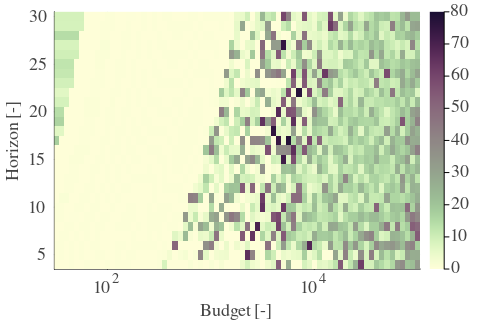 |  | 

| Cₚ = 64 | γ = 0.8, S = 20.71% | γ = 0.85, S = 19.41% | γ = 0.9, S = 17.68% | 
| --- | --- | --- | --- | 
| Mean |  |  |  | 
| Std |  |  | 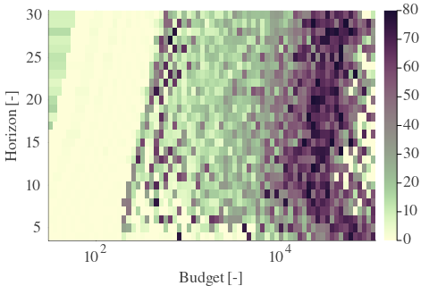 | 

| Cₚ = 64 | γ = 0.95, S = 22.64% | γ = 1.0, S = 28.64% | 
| --- | --- | --- | 
| Mean | 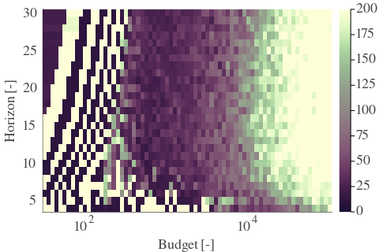 |  | 
| Std |  |  | 

---

**Exploration parameter = 128**

| Cₚ = 128 | γ = 0.5, S = 40.32% | γ = 0.55, S = 36.72% | γ = 0.6, S = 34.53% | 
| --- | --- | --- | --- | 
| Mean |  |  |  | 
| Std |  |  |  | 

| Cₚ = 128 | γ = 0.65, S = 31.92% | γ = 0.7, S = 29.11% | γ = 0.75, S = 27.28% | 
| --- | --- | --- | --- | 
| Mean |  |  |  | 
| Std | 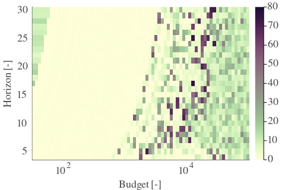 |  |  | 

| Cₚ = 128 | γ = 0.8, S = 24.67% | γ = 0.85, S = 22.07% | γ = 0.9, S = 19.67% | 
| --- | --- | --- | --- | 
| Mean |  |  |  | 
| Std |  | 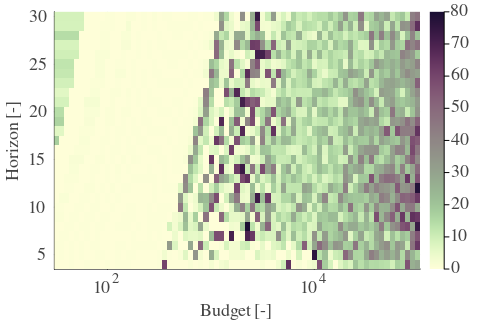 |  | 

| Cₚ = 128 | γ = 0.95, S = 16.69% | γ = 1.0, S = 18.78% | 
| --- | --- | --- | 
| Mean |  |  | 
| Std |  |  | 

---

**Exploration parameter = 256**

| Cₚ = 256 | γ = 0.5, S = 43.61% | γ = 0.55, S = 40.11% | γ = 0.6, S = 36.98% | 
| --- | --- | --- | --- | 
| Mean |  |  |  | 
| Std |  |  |  | 

| Cₚ = 256 | γ = 0.65, S = 35.16% | γ = 0.7, S = 32.45% | γ = 0.75, S = 29.99% | 
| --- | --- | --- | --- | 
| Mean |  |  |  | 
| Std |  |  |  | 

| Cₚ = 256 | γ = 0.8, S = 27.86% | γ = 0.85, S = 26.19% | γ = 0.9, S = 22.59% | 
| --- | --- | --- | --- | 
| Mean |  |  |  | 
| Std |  |  |  | 

| Cₚ = 256 | γ = 0.95, S = 19.51% | γ = 1.0, S = 16.85% | 
| --- | --- | --- | 
| Mean |  |  | 
| Std | 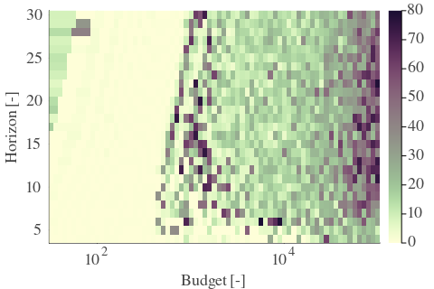 |  | 

---

**Exploration parameter = 512**

| Cₚ = 512 | γ = 0.5, S = 44.86% | γ = 0.55, S = 42.83% | γ = 0.6, S = 40.95% | 
| --- | --- | --- | --- | 
| Mean |  |  |  | 
| Std |  |  |  | 

| Cₚ = 512 | γ = 0.65, S = 37.72% | γ = 0.7, S = 35.37% | γ = 0.75, S = 33.65% | 
| --- | --- | --- | --- | 
| Mean |  |  |  | 
| Std |  |  |  | 

| Cₚ = 512 | γ = 0.8, S = 31.4% | γ = 0.85, S = 28.95% | γ = 0.9, S = 26.76% | 
| --- | --- | --- | --- | 
| Mean |  |  | 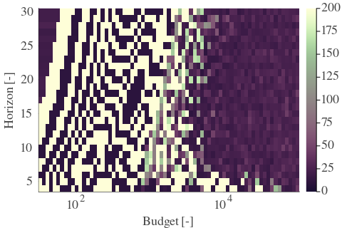 | 
| Std |  |  |  | 

| Cₚ = 512 | γ = 0.95, S = 22.22% | γ = 1.0, S = 20.4% | 
| --- | --- | --- | 
| Mean |  |  | 
| Std |  |  | 

---

**Exploration parameter = 1024**

| Cₚ = 1024 | γ = 0.5, S = 45.75% | γ = 0.55, S = 45.23% | γ = 0.6, S = 43.45% | 
| --- | --- | --- | --- | 
| Mean |  | 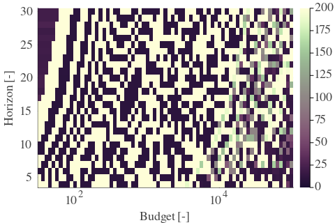 |  | 
| Std |  |  |  | 

| Cₚ = 1024 | γ = 0.65, S = 40.69% | γ = 0.7, S = 38.86% | γ = 0.75, S = 35.99% | 
| --- | --- | --- | --- | 
| Mean |  |  |  | 
| Std | 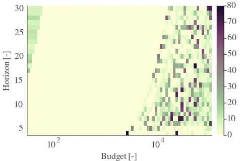 |  |  | 

| Cₚ = 1024 | γ = 0.8, S = 33.96% | γ = 0.85, S = 32.24% | γ = 0.9, S = 29.37% | 
| --- | --- | --- | --- | 
| Mean |  |  |  | 
| Std |  |  |  | 

| Cₚ = 1024 | γ = 0.95, S = 26.81% | γ = 1.0, S = 23.89% | 
| --- | --- | --- | 
| Mean |  |  | 
| Std |  |  | 

