# Results for the file sp_N_20230316.csv 

Generated on 2023-11-03 14:14:03

---

**Exploration parameter = 0**

| Cₚ = 0 | γ = 0.5, S = 0.0% | γ = 0.55, S = 0.0% | γ = 0.6, S = 0.0% | 
| --- | --- | --- | --- | 
| Mean |  |  |  | 
| Std |  |  |  | 

| Cₚ = 0 | γ = 0.65, S = 0.0% | γ = 0.7, S = 0.0% | γ = 0.75, S = 0.0% | 
| --- | --- | --- | --- | 
| Mean |  |  |  | 
| Std |  |  |  | 

| Cₚ = 0 | γ = 0.8, S = 0.0% | γ = 0.85, S = 0.0% | γ = 0.9, S = 0.0% | 
| --- | --- | --- | --- | 
| Mean |  |  |  | 
| Std |  |  |  | 

| Cₚ = 0 | γ = 0.95, S = 0.0% | γ = 1.0, S = 0.0% | 
| --- | --- | --- | 
| Mean |  | 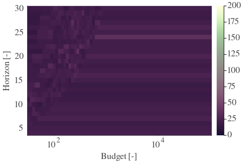 | 
| Std |  |  | 

---

**Exploration parameter = 2**

| Cₚ = 2 | γ = 0.5, S = 13.51% | γ = 0.55, S = 11.48% | γ = 0.6, S = 10.49% | 
| --- | --- | --- | --- | 
| Mean |  |  |  | 
| Std | 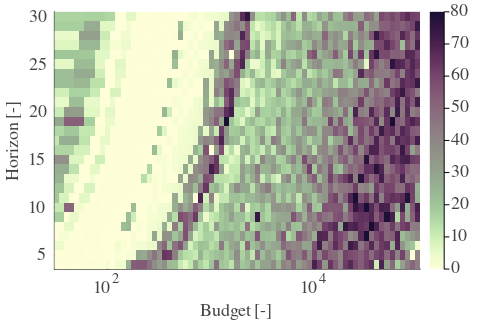 |  |  | 

| Cₚ = 2 | γ = 0.65, S = 13.98% | γ = 0.7, S = 23.37% | γ = 0.75, S = 33.96% | 
| --- | --- | --- | --- | 
| Mean | 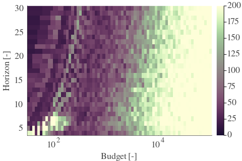 |  |  | 
| Std |  |  |  | 

| Cₚ = 2 | γ = 0.8, S = 50.55% | γ = 0.85, S = 58.84% | γ = 0.9, S = 47.84% | 
| --- | --- | --- | --- | 
| Mean |  |  |  | 
| Std |  |  |  | 

| Cₚ = 2 | γ = 0.95, S = 31.4% | γ = 1.0, S = 24.26% | 
| --- | --- | --- | 
| Mean |  |  | 
| Std |  |  | 

---

**Exploration parameter = 4**

| Cₚ = 4 | γ = 0.5, S = 20.45% | γ = 0.55, S = 14.87% | γ = 0.6, S = 13.62% | 
| --- | --- | --- | --- | 
| Mean |  |  |  | 
| Std |  |  |  | 

| Cₚ = 4 | γ = 0.65, S = 13.93% | γ = 0.7, S = 14.55% | γ = 0.75, S = 18.73% | 
| --- | --- | --- | --- | 
| Mean |  |  |  | 
| Std |  | 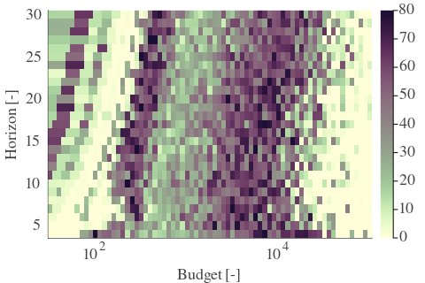 |  | 

| Cₚ = 4 | γ = 0.8, S = 28.79% | γ = 0.85, S = 39.44% | γ = 0.9, S = 55.24% | 
| --- | --- | --- | --- | 
| Mean |  |  |  | 
| Std |  |  |  | 

| Cₚ = 4 | γ = 0.95, S = 50.6% | γ = 1.0, S = 33.85% | 
| --- | --- | --- | 
| Mean |  |  | 
| Std |  |  | 

---

**Exploration parameter = 8**

| Cₚ = 8 | γ = 0.5, S = 23.63% | γ = 0.55, S = 21.86% | γ = 0.6, S = 20.03% | 
| --- | --- | --- | --- | 
| Mean |  |  |  | 
| Std |  | 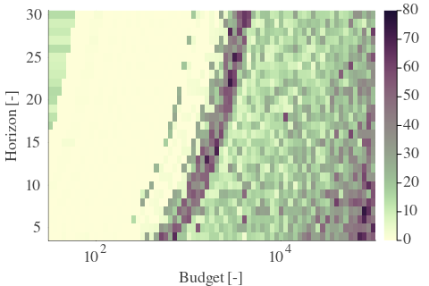 |  | 

| Cₚ = 8 | γ = 0.65, S = 17.94% | γ = 0.7, S = 12.88% | γ = 0.75, S = 13.35% | 
| --- | --- | --- | --- | 
| Mean |  |  |  | 
| Std |  |  |  | 

| Cₚ = 8 | γ = 0.8, S = 16.12% | γ = 0.85, S = 24.78% | γ = 0.9, S = 34.95% | 
| --- | --- | --- | --- | 
| Mean |  |  | 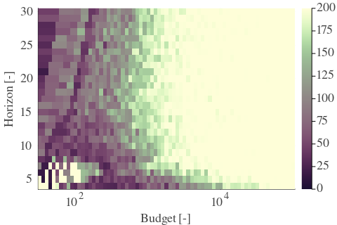 | 
| Std |  |  |  | 

| Cₚ = 8 | γ = 0.95, S = 46.06% | γ = 1.0, S = 47.84% | 
| --- | --- | --- | 
| Mean |  |  | 
| Std |  |  | 

---

**Exploration parameter = 16**

| Cₚ = 16 | γ = 0.5, S = 26.5% | γ = 0.55, S = 24.78% | γ = 0.6, S = 23.16% | 
| --- | --- | --- | --- | 
| Mean |  |  |  | 
| Std |  |  |  | 

| Cₚ = 16 | γ = 0.65, S = 21.23% | γ = 0.7, S = 19.14% | γ = 0.75, S = 16.64% | 
| --- | --- | --- | --- | 
| Mean |  |  |  | 
| Std |  |  |  | 

| Cₚ = 16 | γ = 0.8, S = 14.5% | γ = 0.85, S = 13.25% | γ = 0.9, S = 20.5% | 
| --- | --- | --- | --- | 
| Mean | 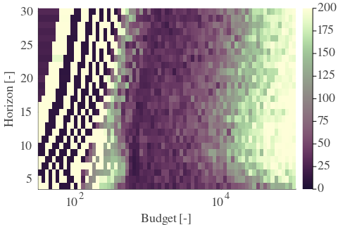 |  |  | 
| Std |  |  |  | 

| Cₚ = 16 | γ = 0.95, S = 29.63% | γ = 1.0, S = 37.56% | 
| --- | --- | --- | 
| Mean |  |  | 
| Std |  |  | 

---

**Exploration parameter = 32**

| Cₚ = 32 | γ = 0.5, S = 29.06% | γ = 0.55, S = 27.44% | γ = 0.6, S = 25.98% | 
| --- | --- | --- | --- | 
| Mean |  |  |  | 
| Std |  |  | 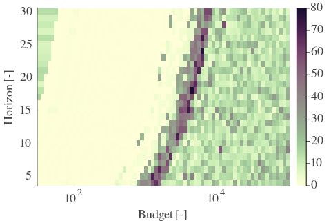 | 

| Cₚ = 32 | γ = 0.65, S = 24.31% | γ = 0.7, S = 22.69% | γ = 0.75, S = 19.72% | 
| --- | --- | --- | --- | 
| Mean |  |  |  | 
| Std |  |  |  | 

| Cₚ = 32 | γ = 0.8, S = 16.54% | γ = 0.85, S = 13.51% | γ = 0.9, S = 13.35% | 
| --- | --- | --- | --- | 
| Mean |  |  |  | 
| Std |  |  |  | 

| Cₚ = 32 | γ = 0.95, S = 16.48% | γ = 1.0, S = 26.19% | 
| --- | --- | --- | 
| Mean |  |  | 
| Std |  |  | 

---

**Exploration parameter = 64**

| Cₚ = 64 | γ = 0.5, S = 31.92% | γ = 0.55, S = 30.31% | γ = 0.6, S = 28.59% | 
| --- | --- | --- | --- | 
| Mean |  |  |  | 
| Std |  |  |  | 

| Cₚ = 64 | γ = 0.65, S = 27.23% | γ = 0.7, S = 25.4% | γ = 0.75, S = 23.42% | 
| --- | --- | --- | --- | 
| Mean |  |  |  | 
| Std |  |  |  | 

| Cₚ = 64 | γ = 0.8, S = 19.87% | γ = 0.85, S = 16.9% | γ = 0.9, S = 12.88% | 
| --- | --- | --- | --- | 
| Mean |  |  | 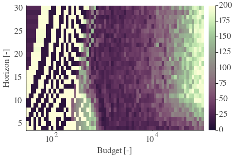 | 
| Std |  |  |  | 

| Cₚ = 64 | γ = 0.95, S = 11.32% | γ = 1.0, S = 14.92% | 
| --- | --- | --- | 
| Mean |  |  | 
| Std |  |  | 

---

**Exploration parameter = 128**

| Cₚ = 128 | γ = 0.5, S = 35.0% | γ = 0.55, S = 33.28% | γ = 0.6, S = 31.46% | 
| --- | --- | --- | --- | 
| Mean | 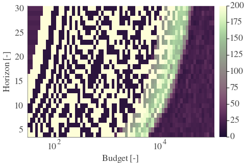 |  |  | 
| Std |  |  |  | 

| Cₚ = 128 | γ = 0.65, S = 29.89% | γ = 0.7, S = 28.06% | γ = 0.75, S = 26.34% | 
| --- | --- | --- | --- | 
| Mean |  |  | 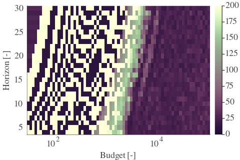 | 
| Std |  |  |  | 

| Cₚ = 128 | γ = 0.8, S = 23.74% | γ = 0.85, S = 20.19% | γ = 0.9, S = 16.17% | 
| --- | --- | --- | --- | 
| Mean |  |  |  | 
| Std |  |  |  | 

| Cₚ = 128 | γ = 0.95, S = 12.62% | γ = 1.0, S = 10.69% | 
| --- | --- | --- | 
| Mean | 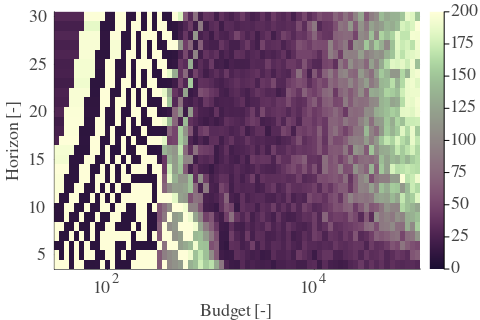 |  | 
| Std |  |  | 

---

**Exploration parameter = 256**

| Cₚ = 256 | γ = 0.5, S = 37.66% | γ = 0.55, S = 36.15% | γ = 0.6, S = 34.59% | 
| --- | --- | --- | --- | 
| Mean |  |  |  | 
| Std |  |  |  | 

| Cₚ = 256 | γ = 0.65, S = 32.71% | γ = 0.7, S = 31.04% | γ = 0.75, S = 28.74% | 
| --- | --- | --- | --- | 
| Mean |  |  |  | 
| Std |  |  |  | 

| Cₚ = 256 | γ = 0.8, S = 26.5% | γ = 0.85, S = 23.89% | γ = 0.9, S = 19.93% | 
| --- | --- | --- | --- | 
| Mean |  |  |  | 
| Std |  |  |  | 

| Cₚ = 256 | γ = 0.95, S = 16.07% | γ = 1.0, S = 13.77% | 
| --- | --- | --- | 
| Mean |  |  | 
| Std |  |  | 

---

**Exploration parameter = 512**

| Cₚ = 512 | γ = 0.5, S = 40.85% | γ = 0.55, S = 39.18% | γ = 0.6, S = 37.4% | 
| --- | --- | --- | --- | 
| Mean |  |  |  | 
| Std |  | 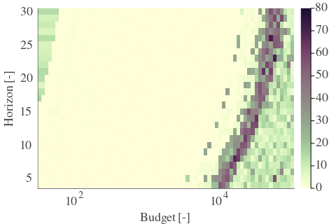 |  | 

| Cₚ = 512 | γ = 0.65, S = 35.73% | γ = 0.7, S = 34.01% | γ = 0.75, S = 31.72% | 
| --- | --- | --- | --- | 
| Mean |  |  |  | 
| Std |  |  |  | 

| Cₚ = 512 | γ = 0.8, S = 29.11% | γ = 0.85, S = 26.81% | γ = 0.9, S = 23.47% | 
| --- | --- | --- | --- | 
| Mean |  |  |  | 
| Std |  |  |  | 

| Cₚ = 512 | γ = 0.95, S = 19.67% | γ = 1.0, S = 17.01% | 
| --- | --- | --- | 
| Mean |  | 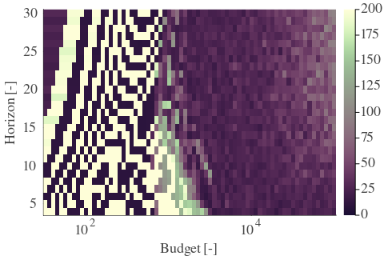 | 
| Std |  |  | 

---

**Exploration parameter = 1024**

| Cₚ = 1024 | γ = 0.5, S = 43.97% | γ = 0.55, S = 42.25% | γ = 0.6, S = 40.53% | 
| --- | --- | --- | --- | 
| Mean |  |  |  | 
| Std |  |  |  | 

| Cₚ = 1024 | γ = 0.65, S = 38.71% | γ = 0.7, S = 36.93% | γ = 0.75, S = 34.79% | 
| --- | --- | --- | --- | 
| Mean |  |  |  | 
| Std |  |  |  | 

| Cₚ = 1024 | γ = 0.8, S = 32.08% | γ = 0.85, S = 29.68% | γ = 0.9, S = 26.4% | 
| --- | --- | --- | --- | 
| Mean |  |  |  | 
| Std |  |  |  | 

| Cₚ = 1024 | γ = 0.95, S = 23.0% | γ = 1.0, S = 20.34% | 
| --- | --- | --- | 
| Mean |  |  | 
| Std |  |  | 

