# Results for the file sp_P_20230320.csv 

Generated on 2023-11-03 14:14:04

---

**Exploration parameter = 0**

| Cₚ = 0 | γ = 0.5, S = 0.0% | γ = 0.55, S = 0.0% | γ = 0.6, S = 0.0% | 
| --- | --- | --- | --- | 
| Mean |  |  |  | 
| Std |  |  |  | 

| Cₚ = 0 | γ = 0.65, S = 0.0% | γ = 0.7, S = 0.0% | γ = 0.75, S = 0.0% | 
| --- | --- | --- | --- | 
| Mean |  |  |  | 
| Std |  |  |  | 

| Cₚ = 0 | γ = 0.8, S = 0.0% | γ = 0.85, S = 0.0% | γ = 0.9, S = 0.0% | 
| --- | --- | --- | --- | 
| Mean |  |  |  | 
| Std |  |  |  | 

| Cₚ = 0 | γ = 0.95, S = 0.0% | γ = 1.0, S = 0.0% | 
| --- | --- | --- | 
| Mean |  |  | 
| Std |  |  | 

---

**Exploration parameter = 2**

| Cₚ = 2 | γ = 0.5, S = 15.96% | γ = 0.55, S = 13.25% | γ = 0.6, S = 15.55% | 
| --- | --- | --- | --- | 
| Mean |  |  |  | 
| Std |  |  |  | 

| Cₚ = 2 | γ = 0.65, S = 20.61% | γ = 0.7, S = 30.93% | γ = 0.75, S = 41.78% | 
| --- | --- | --- | --- | 
| Mean | 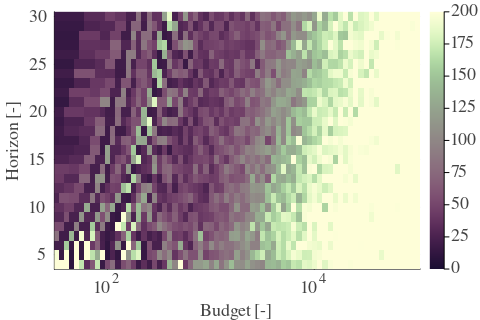 |  |  | 
| Std |  |  |  | 

| Cₚ = 2 | γ = 0.8, S = 57.96% | γ = 0.85, S = 64.68% | γ = 0.9, S = 62.81% | 
| --- | --- | --- | --- | 
| Mean |  |  |  | 
| Std |  |  |  | 

| Cₚ = 2 | γ = 0.95, S = 49.82% | γ = 1.0, S = 34.17% | 
| --- | --- | --- | 
| Mean |  |  | 
| Std | 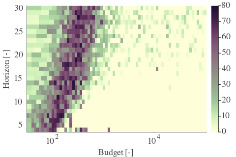 |  | 

---

**Exploration parameter = 4**

| Cₚ = 4 | γ = 0.5, S = 19.98% | γ = 0.55, S = 17.53% | γ = 0.6, S = 14.24% | 
| --- | --- | --- | --- | 
| Mean |  |  |  | 
| Std |  |  |  | 

| Cₚ = 4 | γ = 0.65, S = 15.34% | γ = 0.7, S = 20.87% | γ = 0.75, S = 26.55% | 
| --- | --- | --- | --- | 
| Mean |  |  | 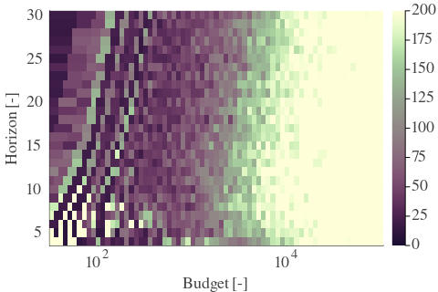 | 
| Std |  |  |  | 

| Cₚ = 4 | γ = 0.8, S = 36.72% | γ = 0.85, S = 48.57% | γ = 0.9, S = 61.71% | 
| --- | --- | --- | --- | 
| Mean |  |  |  | 
| Std |  |  |  | 

| Cₚ = 4 | γ = 0.95, S = 62.91% | γ = 1.0, S = 47.84% | 
| --- | --- | --- | 
| Mean |  |  | 
| Std |  |  | 

---

**Exploration parameter = 8**

| Cₚ = 8 | γ = 0.5, S = 24.52% | γ = 0.55, S = 21.07% | γ = 0.6, S = 19.09% | 
| --- | --- | --- | --- | 
| Mean |  |  |  | 
| Std |  |  |  | 

| Cₚ = 8 | γ = 0.65, S = 17.48% | γ = 0.7, S = 15.86% | γ = 0.75, S = 17.11% | 
| --- | --- | --- | --- | 
| Mean |  |  |  | 
| Std |  |  |  | 

| Cₚ = 8 | γ = 0.8, S = 24.78% | γ = 0.85, S = 31.61% | γ = 0.9, S = 42.31% | 
| --- | --- | --- | --- | 
| Mean |  |  |  | 
| Std |  | 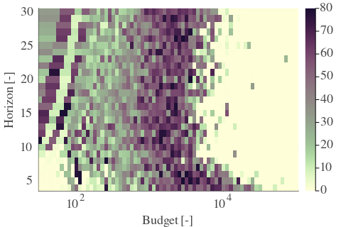 |  | 

| Cₚ = 8 | γ = 0.95, S = 54.04% | γ = 1.0, S = 59.94% | 
| --- | --- | --- | 
| Mean | 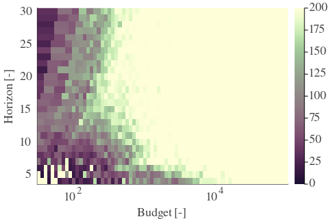 |  | 
| Std |  |  | 

---

**Exploration parameter = 16**

| Cₚ = 16 | γ = 0.5, S = 27.44% | γ = 0.55, S = 25.14% | γ = 0.6, S = 23.0% | 
| --- | --- | --- | --- | 
| Mean |  |  |  | 
| Std |  |  |  | 

| Cₚ = 16 | γ = 0.65, S = 20.29% | γ = 0.7, S = 17.94% | γ = 0.75, S = 16.33% | 
| --- | --- | --- | --- | 
| Mean |  |  |  | 
| Std |  |  |  | 

| Cₚ = 16 | γ = 0.8, S = 16.74% | γ = 0.85, S = 20.5% | γ = 0.9, S = 28.22% | 
| --- | --- | --- | --- | 
| Mean |  |  |  | 
| Std |  |  |  | 

| Cₚ = 16 | γ = 0.95, S = 37.09% | γ = 1.0, S = 46.22% | 
| --- | --- | --- | 
| Mean |  |  | 
| Std |  |  | 

---

**Exploration parameter = 32**

| Cₚ = 32 | γ = 0.5, S = 29.99% | γ = 0.55, S = 28.59% | γ = 0.6, S = 25.56% | 
| --- | --- | --- | --- | 
| Mean |  |  |  | 
| Std |  |  |  | 

| Cₚ = 32 | γ = 0.65, S = 24.05% | γ = 0.7, S = 22.07% | γ = 0.75, S = 19.14% | 
| --- | --- | --- | --- | 
| Mean |  |  | 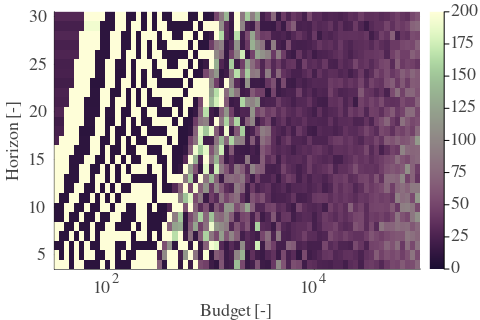 | 
| Std |  |  |  | 

| Cₚ = 32 | γ = 0.8, S = 17.27% | γ = 0.85, S = 15.39% | γ = 0.9, S = 18.83% | 
| --- | --- | --- | --- | 
| Mean |  |  |  | 
| Std |  |  |  | 

| Cₚ = 32 | γ = 0.95, S = 23.63% | γ = 1.0, S = 32.55% | 
| --- | --- | --- | 
| Mean |  |  | 
| Std |  |  | 

---

**Exploration parameter = 64**

| Cₚ = 64 | γ = 0.5, S = 33.59% | γ = 0.55, S = 30.88% | γ = 0.6, S = 28.64% | 
| --- | --- | --- | --- | 
| Mean |  |  |  | 
| Std |  |  |  | 

| Cₚ = 64 | γ = 0.65, S = 27.23% | γ = 0.7, S = 24.99% | γ = 0.75, S = 22.9% | 
| --- | --- | --- | --- | 
| Mean |  |  |  | 
| Std |  |  |  | 

| Cₚ = 64 | γ = 0.8, S = 20.34% | γ = 0.85, S = 17.74% | γ = 0.9, S = 14.55% | 
| --- | --- | --- | --- | 
| Mean |  |  |  | 
| Std |  |  |  | 

| Cₚ = 64 | γ = 0.95, S = 15.86% | γ = 1.0, S = 20.66% | 
| --- | --- | --- | 
| Mean |  |  | 
| Std |  |  | 

---

**Exploration parameter = 128**

| Cₚ = 128 | γ = 0.5, S = 36.31% | γ = 0.55, S = 33.44% | γ = 0.6, S = 31.72% | 
| --- | --- | --- | --- | 
| Mean |  |  |  | 
| Std |  |  | 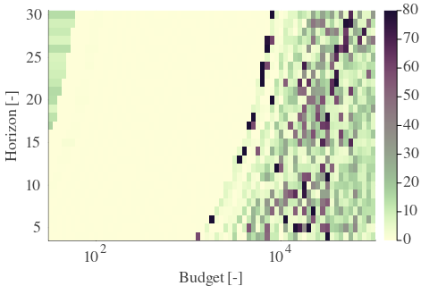 | 

| Cₚ = 128 | γ = 0.65, S = 29.79% | γ = 0.7, S = 28.01% | γ = 0.75, S = 25.98% | 
| --- | --- | --- | --- | 
| Mean |  |  |  | 
| Std |  |  |  | 

| Cₚ = 128 | γ = 0.8, S = 23.84% | γ = 0.85, S = 21.07% | γ = 0.9, S = 17.63% | 
| --- | --- | --- | --- | 
| Mean | 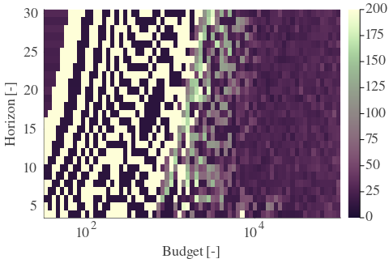 |  |  | 
| Std |  |  |  | 

| Cₚ = 128 | γ = 0.95, S = 13.88% | γ = 1.0, S = 13.46% | 
| --- | --- | --- | 
| Mean |  |  | 
| Std |  |  | 

---

**Exploration parameter = 256**

| Cₚ = 256 | γ = 0.5, S = 39.28% | γ = 0.55, S = 36.46% | γ = 0.6, S = 34.69% | 
| --- | --- | --- | --- | 
| Mean |  |  |  | 
| Std |  |  |  | 

| Cₚ = 256 | γ = 0.65, S = 32.45% | γ = 0.7, S = 31.09% | γ = 0.75, S = 28.69% | 
| --- | --- | --- | --- | 
| Mean |  |  |  | 
| Std |  |  | 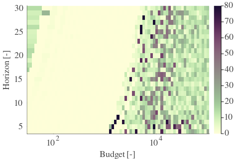 | 

| Cₚ = 256 | γ = 0.8, S = 27.18% | γ = 0.85, S = 25.35% | γ = 0.9, S = 20.76% | 
| --- | --- | --- | --- | 
| Mean |  |  |  | 
| Std |  |  |  | 

| Cₚ = 256 | γ = 0.95, S = 16.95% | γ = 1.0, S = 14.19% | 
| --- | --- | --- | 
| Mean |  |  | 
| Std |  |  | 

---

**Exploration parameter = 512**

| Cₚ = 512 | γ = 0.5, S = 42.62% | γ = 0.55, S = 39.49% | γ = 0.6, S = 37.35% | 
| --- | --- | --- | --- | 
| Mean | 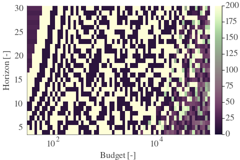 |  |  | 
| Std |  | 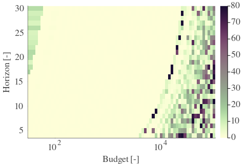 |  | 

| Cₚ = 512 | γ = 0.65, S = 35.68% | γ = 0.7, S = 33.85% | γ = 0.75, S = 31.77% | 
| --- | --- | --- | --- | 
| Mean | 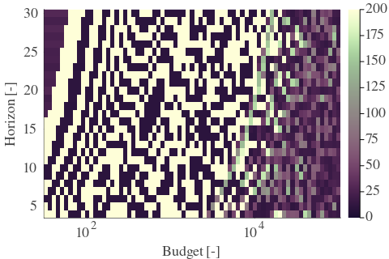 |  |  | 
| Std |  |  |  | 

| Cₚ = 512 | γ = 0.8, S = 29.73% | γ = 0.85, S = 28.06% | γ = 0.9, S = 24.57% | 
| --- | --- | --- | --- | 
| Mean |  |  |  | 
| Std |  |  |  | 

| Cₚ = 512 | γ = 0.95, S = 20.34% | γ = 1.0, S = 17.58% | 
| --- | --- | --- | 
| Mean |  |  | 
| Std |  |  | 

---

**Exploration parameter = 1024**

| Cₚ = 1024 | γ = 0.5, S = 45.17% | γ = 0.55, S = 42.25% | γ = 0.6, S = 40.64% | 
| --- | --- | --- | --- | 
| Mean |  |  |  | 
| Std |  |  |  | 

| Cₚ = 1024 | γ = 0.65, S = 38.65% | γ = 0.7, S = 37.04% | γ = 0.75, S = 35.0% | 
| --- | --- | --- | --- | 
| Mean | 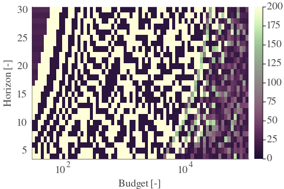 |  |  | 
| Std |  |  |  | 

| Cₚ = 1024 | γ = 0.8, S = 33.02% | γ = 0.85, S = 30.41% | γ = 0.9, S = 27.39% | 
| --- | --- | --- | --- | 
| Mean |  |  | 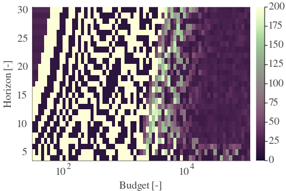 | 
| Std |  |  |  | 

| Cₚ = 1024 | γ = 0.95, S = 23.94% | γ = 1.0, S = 21.23% | 
| --- | --- | --- | 
| Mean |  |  | 
| Std |  |  | 

