# Results for the file sp_Q_20230320.csv 

Generated on 2023-11-03 14:14:05

---

**Exploration parameter = 0**

| Cₚ = 0 | γ = 0.5, S = 0.0% | γ = 0.55, S = 0.0% | γ = 0.6, S = 0.0% | 
| --- | --- | --- | --- | 
| Mean |  |  |  | 
| Std |  |  |  | 

| Cₚ = 0 | γ = 0.65, S = 0.0% | γ = 0.7, S = 0.0% | γ = 0.75, S = 0.0% | 
| --- | --- | --- | --- | 
| Mean |  |  |  | 
| Std |  |  |  | 

| Cₚ = 0 | γ = 0.8, S = 0.0% | γ = 0.85, S = 0.0% | γ = 0.9, S = 0.0% | 
| --- | --- | --- | --- | 
| Mean |  |  |  | 
| Std |  |  |  | 

| Cₚ = 0 | γ = 0.95, S = 0.0% | γ = 1.0, S = 0.0% | 
| --- | --- | --- | 
| Mean |  |  | 
| Std |  |  | 

---

**Exploration parameter = 2**

| Cₚ = 2 | γ = 0.5, S = 19.35% | γ = 0.55, S = 21.75% | γ = 0.6, S = 26.55% | 
| --- | --- | --- | --- | 
| Mean |  |  |  | 
| Std |  |  |  | 

| Cₚ = 2 | γ = 0.65, S = 29.99% | γ = 0.7, S = 37.14% | γ = 0.75, S = 48.04% | 
| --- | --- | --- | --- | 
| Mean |  |  |  | 
| Std |  |  |  | 

| Cₚ = 2 | γ = 0.8, S = 64.06% | γ = 0.85, S = 67.92% | γ = 0.9, S = 68.49% | 
| --- | --- | --- | --- | 
| Mean |  |  |  | 
| Std |  |  |  | 

| Cₚ = 2 | γ = 0.95, S = 59.31% | γ = 1.0, S = 43.71% | 
| --- | --- | --- | 
| Mean | 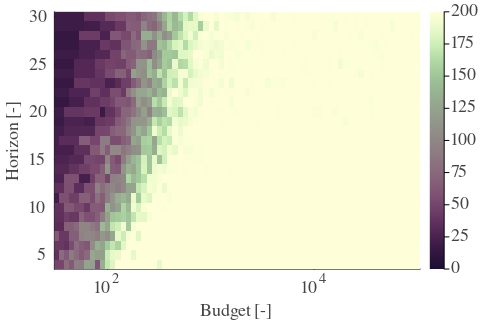 |  | 
| Std |  |  | 

---

**Exploration parameter = 4**

| Cₚ = 4 | γ = 0.5, S = 22.48% | γ = 0.55, S = 21.96% | γ = 0.6, S = 17.74% | 
| --- | --- | --- | --- | 
| Mean |  |  |  | 
| Std |  |  |  | 

| Cₚ = 4 | γ = 0.65, S = 23.58% | γ = 0.7, S = 29.0% | γ = 0.75, S = 32.08% | 
| --- | --- | --- | --- | 
| Mean |  |  |  | 
| Std |  |  |  | 

| Cₚ = 4 | γ = 0.8, S = 43.04% | γ = 0.85, S = 53.89% | γ = 0.9, S = 66.2% | 
| --- | --- | --- | --- | 
| Mean |  |  |  | 
| Std |  |  |  | 

| Cₚ = 4 | γ = 0.95, S = 68.28% | γ = 1.0, S = 60.15% | 
| --- | --- | --- | 
| Mean |  |  | 
| Std |  |  | 

---

**Exploration parameter = 8**

| Cₚ = 8 | γ = 0.5, S = 25.61% | γ = 0.55, S = 23.21% | γ = 0.6, S = 21.65% | 
| --- | --- | --- | --- | 
| Mean |  |  |  | 
| Std |  |  |  | 

| Cₚ = 8 | γ = 0.65, S = 20.55% | γ = 0.7, S = 20.76% | γ = 0.75, S = 23.79% | 
| --- | --- | --- | --- | 
| Mean |  | 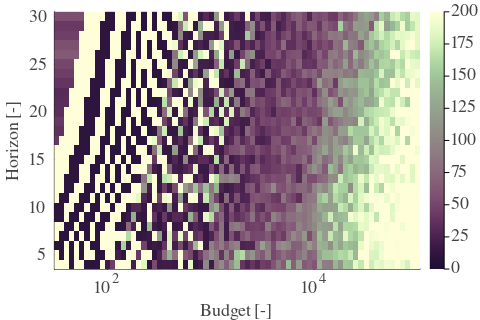 |  | 
| Std | 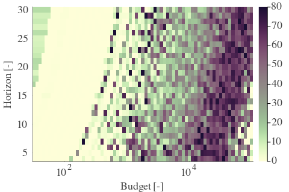 |  |  | 

| Cₚ = 8 | γ = 0.8, S = 30.67% | γ = 0.85, S = 37.35% | γ = 0.9, S = 47.26% | 
| --- | --- | --- | --- | 
| Mean |  |  |  | 
| Std |  |  |  | 

| Cₚ = 8 | γ = 0.95, S = 58.79% | γ = 1.0, S = 66.82% | 
| --- | --- | --- | 
| Mean |  |  | 
| Std |  |  | 

---

**Exploration parameter = 16**

| Cₚ = 16 | γ = 0.5, S = 29.58% | γ = 0.55, S = 27.02% | γ = 0.6, S = 24.15% | 
| --- | --- | --- | --- | 
| Mean |  |  |  | 
| Std |  |  |  | 

| Cₚ = 16 | γ = 0.65, S = 21.6% | γ = 0.7, S = 19.72% | γ = 0.75, S = 18.68% | 
| --- | --- | --- | --- | 
| Mean |  |  |  | 
| Std | 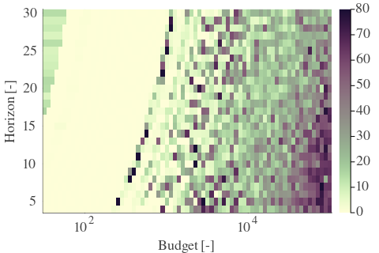 |  |  | 

| Cₚ = 16 | γ = 0.8, S = 21.65% | γ = 0.85, S = 25.82% | γ = 0.9, S = 33.23% | 
| --- | --- | --- | --- | 
| Mean |  |  |  | 
| Std |  |  |  | 

| Cₚ = 16 | γ = 0.95, S = 41.78% | γ = 1.0, S = 51.85% | 
| --- | --- | --- | 
| Mean |  |  | 
| Std |  | 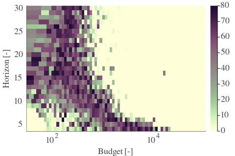 | 

---

**Exploration parameter = 32**

| Cₚ = 32 | γ = 0.5, S = 33.85% | γ = 0.55, S = 30.57% | γ = 0.6, S = 28.22% | 
| --- | --- | --- | --- | 
| Mean |  | 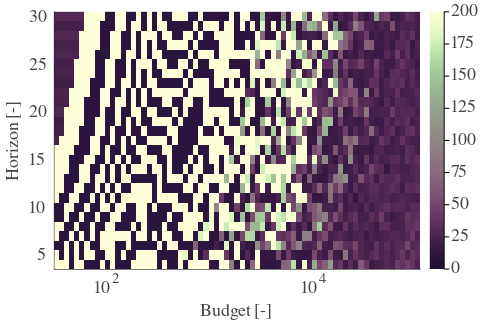 |  | 
| Std |  |  |  | 

| Cₚ = 32 | γ = 0.65, S = 24.67% | γ = 0.7, S = 22.38% | γ = 0.75, S = 19.87% | 
| --- | --- | --- | --- | 
| Mean |  |  |  | 
| Std |  |  |  | 

| Cₚ = 32 | γ = 0.8, S = 17.94% | γ = 0.85, S = 17.94% | γ = 0.9, S = 24.83% | 
| --- | --- | --- | --- | 
| Mean |  |  |  | 
| Std |  |  |  | 

| Cₚ = 32 | γ = 0.95, S = 29.21% | γ = 1.0, S = 37.87% | 
| --- | --- | --- | 
| Mean |  |  | 
| Std | 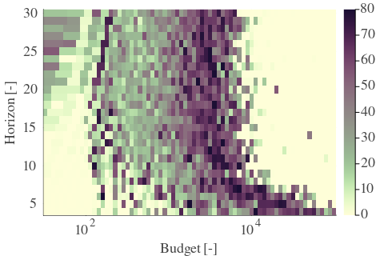 |  | 

---

**Exploration parameter = 64**

| Cₚ = 64 | γ = 0.5, S = 35.52% | γ = 0.55, S = 33.28% | γ = 0.6, S = 31.61% | 
| --- | --- | --- | --- | 
| Mean |  |  |  | 
| Std |  |  |  | 

| Cₚ = 64 | γ = 0.65, S = 27.96% | γ = 0.7, S = 25.77% | γ = 0.75, S = 23.53% | 
| --- | --- | --- | --- | 
| Mean |  |  |  | 
| Std |  |  |  | 

| Cₚ = 64 | γ = 0.8, S = 20.81% | γ = 0.85, S = 18.78% | γ = 0.9, S = 16.48% | 
| --- | --- | --- | --- | 
| Mean |  |  |  | 
| Std |  |  |  | 

| Cₚ = 64 | γ = 0.95, S = 20.29% | γ = 1.0, S = 25.09% | 
| --- | --- | --- | 
| Mean |  |  | 
| Std |  |  | 

---

**Exploration parameter = 128**

| Cₚ = 128 | γ = 0.5, S = 37.35% | γ = 0.55, S = 36.41% | γ = 0.6, S = 34.22% | 
| --- | --- | --- | --- | 
| Mean | 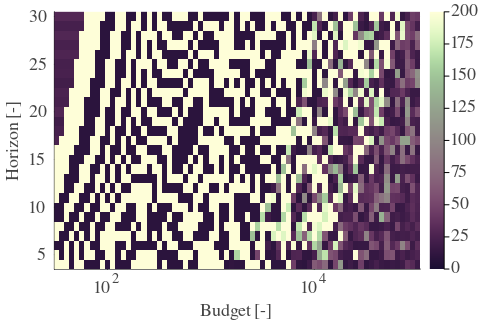 |  |  | 
| Std |  |  |  | 

| Cₚ = 128 | γ = 0.65, S = 31.51% | γ = 0.7, S = 28.64% | γ = 0.75, S = 26.29% | 
| --- | --- | --- | --- | 
| Mean |  |  |  | 
| Std |  |  |  | 

| Cₚ = 128 | γ = 0.8, S = 24.31% | γ = 0.85, S = 21.7% | γ = 0.9, S = 18.83% | 
| --- | --- | --- | --- | 
| Mean |  |  |  | 
| Std | 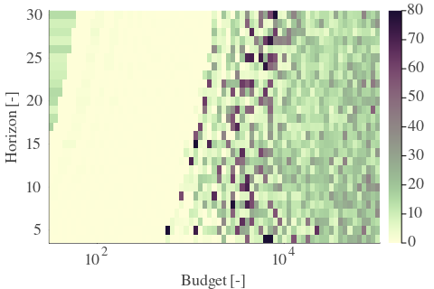 |  |  | 

| Cₚ = 128 | γ = 0.95, S = 15.02% | γ = 1.0, S = 16.43% | 
| --- | --- | --- | 
| Mean | 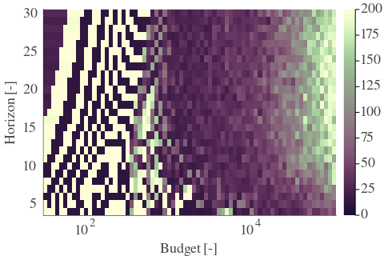 |  | 
| Std |  |  | 

---

**Exploration parameter = 256**

| Cₚ = 256 | γ = 0.5, S = 40.85% | γ = 0.55, S = 38.81% | γ = 0.6, S = 36.36% | 
| --- | --- | --- | --- | 
| Mean |  |  |  | 
| Std |  |  |  | 

| Cₚ = 256 | γ = 0.65, S = 34.12% | γ = 0.7, S = 31.51% | γ = 0.75, S = 29.63% | 
| --- | --- | --- | --- | 
| Mean |  |  | 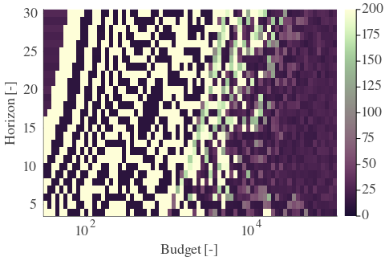 | 
| Std |  |  |  | 

| Cₚ = 256 | γ = 0.8, S = 27.28% | γ = 0.85, S = 25.3% | γ = 0.9, S = 22.01% | 
| --- | --- | --- | --- | 
| Mean |  |  |  | 
| Std |  |  | 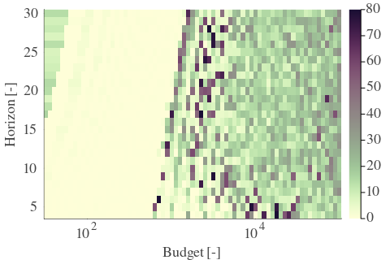 | 

| Cₚ = 256 | γ = 0.95, S = 18.52% | γ = 1.0, S = 15.91% | 
| --- | --- | --- | 
| Mean |  |  | 
| Std |  |  | 

---

**Exploration parameter = 512**

| Cₚ = 512 | γ = 0.5, S = 44.34% | γ = 0.55, S = 41.68% | γ = 0.6, S = 39.8% | 
| --- | --- | --- | --- | 
| Mean |  |  |  | 
| Std |  |  |  | 

| Cₚ = 512 | γ = 0.65, S = 37.51% | γ = 0.7, S = 34.38% | γ = 0.75, S = 32.29% | 
| --- | --- | --- | --- | 
| Mean |  |  |  | 
| Std |  |  |  | 

| Cₚ = 512 | γ = 0.8, S = 30.46% | γ = 0.85, S = 28.74% | γ = 0.9, S = 25.87% | 
| --- | --- | --- | --- | 
| Mean |  |  |  | 
| Std |  |  |  | 

| Cₚ = 512 | γ = 0.95, S = 21.65% | γ = 1.0, S = 18.78% | 
| --- | --- | --- | 
| Mean |  |  | 
| Std | 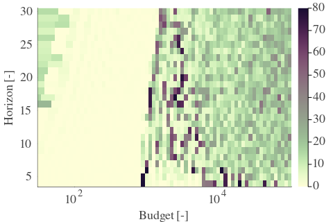 |  | 

---

**Exploration parameter = 1024**

| Cₚ = 1024 | γ = 0.5, S = 45.75% | γ = 0.55, S = 44.44% | γ = 0.6, S = 42.57% | 
| --- | --- | --- | --- | 
| Mean |  |  |  | 
| Std |  |  |  | 

| Cₚ = 1024 | γ = 0.65, S = 40.17% | γ = 0.7, S = 38.03% | γ = 0.75, S = 35.89% | 
| --- | --- | --- | --- | 
| Mean | 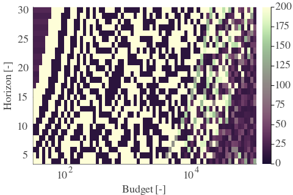 |  |  | 
| Std |  |  |  | 

| Cₚ = 1024 | γ = 0.8, S = 33.8% | γ = 0.85, S = 31.25% | γ = 0.9, S = 29.32% | 
| --- | --- | --- | --- | 
| Mean |  |  |  | 
| Std |  |  |  | 

| Cₚ = 1024 | γ = 0.95, S = 25.35% | γ = 1.0, S = 22.33% | 
| --- | --- | --- | 
| Mean |  |  | 
| Std |  |  | 

