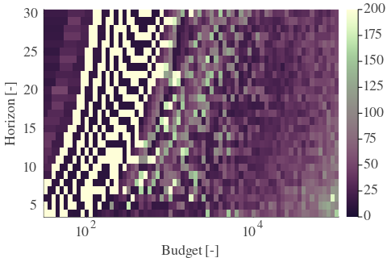
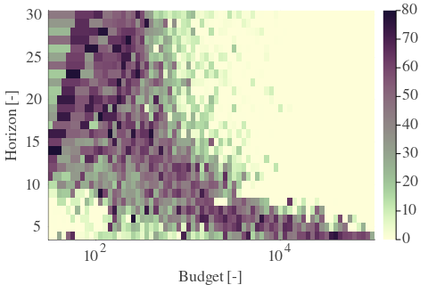
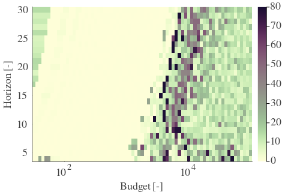
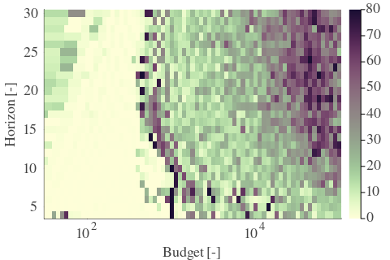

# Results for the file csv/sp_R_20230320.csv 

Generated on 2023-03-21 16:28:53

---

**Exploration parameter = 0**

| Cₚ = 0| γ = 0.5 | γ = 0.55 | γ = 0.6 | 
| --- | --- | --- | --- | 
| Mean |  |  |  | 
| Std |  |  |  | 

| Cₚ = 0| γ = 0.65 | γ = 0.7 | γ = 0.75 | 
| --- | --- | --- | --- | 
| Mean |  |  |  | 
| Std |  |  |  | 

| Cₚ = 0| γ = 0.8 | γ = 0.85 | γ = 0.9 | 
| --- | --- | --- | --- | 
| Mean |  |  |  | 
| Std |  |  |  | 

| Cₚ = 0| γ = 0.95 | γ = 1.0 | 
| --- | --- | --- | 
| Mean |  |  | 
| Std |  |  | 

---

**Exploration parameter = 2**

| Cₚ = 2| γ = 0.5 | γ = 0.55 | γ = 0.6 | 
| --- | --- | --- | --- | 
| Mean |  |  |  | 
| Std |  |  |  | 

| Cₚ = 2| γ = 0.65 | γ = 0.7 | γ = 0.75 | 
| --- | --- | --- | --- | 
| Mean |  |  |  | 
| Std |  |  |  | 

| Cₚ = 2| γ = 0.8 | γ = 0.85 | γ = 0.9 | 
| --- | --- | --- | --- | 
| Mean |  |  |  | 
| Std |  |  |  | 

| Cₚ = 2| γ = 0.95 | γ = 1.0 | 
| --- | --- | --- | 
| Mean |  |  | 
| Std |  |  | 

---

**Exploration parameter = 4**

| Cₚ = 4| γ = 0.5 | γ = 0.55 | γ = 0.6 | 
| --- | --- | --- | --- | 
| Mean |  |  |  | 
| Std |  |  |  | 

| Cₚ = 4| γ = 0.65 | γ = 0.7 | γ = 0.75 | 
| --- | --- | --- | --- | 
| Mean |  |  |  | 
| Std |  |  |  | 

| Cₚ = 4| γ = 0.8 | γ = 0.85 | γ = 0.9 | 
| --- | --- | --- | --- | 
| Mean |  |  |  | 
| Std |  |  |  | 

| Cₚ = 4| γ = 0.95 | γ = 1.0 | 
| --- | --- | --- | 
| Mean |  |  | 
| Std |  |  | 

---

**Exploration parameter = 8**

| Cₚ = 8| γ = 0.5 | γ = 0.55 | γ = 0.6 | 
| --- | --- | --- | --- | 
| Mean |  |  |  | 
| Std |  |  |  | 

| Cₚ = 8| γ = 0.65 | γ = 0.7 | γ = 0.75 | 
| --- | --- | --- | --- | 
| Mean |  |  |  | 
| Std |  |  |  | 

| Cₚ = 8| γ = 0.8 | γ = 0.85 | γ = 0.9 | 
| --- | --- | --- | --- | 
| Mean |  |  |  | 
| Std |  |  |  | 

| Cₚ = 8| γ = 0.95 | γ = 1.0 | 
| --- | --- | --- | 
| Mean |  |  | 
| Std |  |  | 

---

**Exploration parameter = 16**

| Cₚ = 16| γ = 0.5 | γ = 0.55 | γ = 0.6 | 
| --- | --- | --- | --- | 
| Mean |  |  |  | 
| Std |  |  |  | 

| Cₚ = 16| γ = 0.65 | γ = 0.7 | γ = 0.75 | 
| --- | --- | --- | --- | 
| Mean |  |  |  | 
| Std |  |  |  | 

| Cₚ = 16| γ = 0.8 | γ = 0.85 | γ = 0.9 | 
| --- | --- | --- | --- | 
| Mean |  |  |  | 
| Std |  |  |  | 

| Cₚ = 16| γ = 0.95 | γ = 1.0 | 
| --- | --- | --- | 
| Mean |  |  | 
| Std |  |  | 

---

**Exploration parameter = 32**

| Cₚ = 32| γ = 0.5 | γ = 0.55 | γ = 0.6 | 
| --- | --- | --- | --- | 
| Mean |  |  |  | 
| Std |  |  |  | 

| Cₚ = 32| γ = 0.65 | γ = 0.7 | γ = 0.75 | 
| --- | --- | --- | --- | 
| Mean |  |  |  | 
| Std |  |  |  | 

| Cₚ = 32| γ = 0.8 | γ = 0.85 | γ = 0.9 | 
| --- | --- | --- | --- | 
| Mean |  |  |  | 
| Std |  |  |  | 

| Cₚ = 32| γ = 0.95 | γ = 1.0 | 
| --- | --- | --- | 
| Mean |  |  | 
| Std |  |  | 

---

**Exploration parameter = 64**

| Cₚ = 64| γ = 0.5 | γ = 0.55 | γ = 0.6 | 
| --- | --- | --- | --- | 
| Mean |  |  |  | 
| Std |  |  |  | 

| Cₚ = 64| γ = 0.65 | γ = 0.7 | γ = 0.75 | 
| --- | --- | --- | --- | 
| Mean |  |  |  | 
| Std |  |  |  | 

| Cₚ = 64| γ = 0.8 | γ = 0.85 | γ = 0.9 | 
| --- | --- | --- | --- | 
| Mean |  |  |  | 
| Std |  |  |  | 

| Cₚ = 64| γ = 0.95 | γ = 1.0 | 
| --- | --- | --- | 
| Mean |  |  | 
| Std |  |  | 

---

**Exploration parameter = 128**

| Cₚ = 128| γ = 0.5 | γ = 0.55 | γ = 0.6 | 
| --- | --- | --- | --- | 
| Mean |  |  |  | 
| Std |  |  |  | 

| Cₚ = 128| γ = 0.65 | γ = 0.7 | γ = 0.75 | 
| --- | --- | --- | --- | 
| Mean |  |  |  | 
| Std |  |  |  | 

| Cₚ = 128| γ = 0.8 | γ = 0.85 | γ = 0.9 | 
| --- | --- | --- | --- | 
| Mean |  |  |  | 
| Std |  |  |  | 

| Cₚ = 128| γ = 0.95 | γ = 1.0 | 
| --- | --- | --- | 
| Mean |  |  | 
| Std |  |  | 

---

**Exploration parameter = 256**

| Cₚ = 256| γ = 0.5 | γ = 0.55 | γ = 0.6 | 
| --- | --- | --- | --- | 
| Mean |  |  |  | 
| Std |  |  |  | 

| Cₚ = 256| γ = 0.65 | γ = 0.7 | γ = 0.75 | 
| --- | --- | --- | --- | 
| Mean |  |  |  | 
| Std |  |  |  | 

| Cₚ = 256| γ = 0.8 | γ = 0.85 | γ = 0.9 | 
| --- | --- | --- | --- | 
| Mean |  |  |  | 
| Std |  |  |  | 

| Cₚ = 256| γ = 0.95 | γ = 1.0 | 
| --- | --- | --- | 
| Mean |  |  | 
| Std |  |  | 

---

**Exploration parameter = 512**

| Cₚ = 512| γ = 0.5 | γ = 0.55 | γ = 0.6 | 
| --- | --- | --- | --- | 
| Mean |  |  |  | 
| Std |  |  |  | 

| Cₚ = 512| γ = 0.65 | γ = 0.7 | γ = 0.75 | 
| --- | --- | --- | --- | 
| Mean |  |  |  | 
| Std |  |  |  | 

| Cₚ = 512| γ = 0.8 | γ = 0.85 | γ = 0.9 | 
| --- | --- | --- | --- | 
| Mean |  |  |  | 
| Std |  |  |  | 

| Cₚ = 512| γ = 0.95 | γ = 1.0 | 
| --- | --- | --- | 
| Mean |  |  | 
| Std |  |  | 

---

**Exploration parameter = 1024**

| Cₚ = 1024| γ = 0.5 | γ = 0.55 | γ = 0.6 | 
| --- | --- | --- | --- | 
| Mean |  |  |  | 
| Std |  |  |  | 

| Cₚ = 1024| γ = 0.65 | γ = 0.7 | γ = 0.75 | 
| --- | --- | --- | --- | 
| Mean |  |  |  | 
| Std |  |  |  | 

| Cₚ = 1024| γ = 0.8 | γ = 0.85 | γ = 0.9 | 
| --- | --- | --- | --- | 
| Mean |  |  |  | 
| Std |  |  |  | 

| Cₚ = 1024| γ = 0.95 | γ = 1.0 | 
| --- | --- | --- | 
| Mean |  |  | 
| Std |  |  | 

