# Results for the file sp_U_20230323.csv 

Generated on 2023-11-03 14:14:07

---

**Exploration parameter = 0**

| Cₚ = 0 | γ = 0.5, S = 0.0% | γ = 0.55, S = 0.0% | γ = 0.6, S = 0.0% | 
| --- | --- | --- | --- | 
| Mean |  |  |  | 
| Std |  |  |  | 

| Cₚ = 0 | γ = 0.65, S = 0.0% | γ = 0.7, S = 0.0% | γ = 0.75, S = 0.0% | 
| --- | --- | --- | --- | 
| Mean |  |  |  | 
| Std |  |  |  | 

| Cₚ = 0 | γ = 0.8, S = 0.0% | γ = 0.85, S = 0.0% | γ = 0.9, S = 0.0% | 
| --- | --- | --- | --- | 
| Mean |  |  |  | 
| Std |  |  |  | 

| Cₚ = 0 | γ = 0.95, S = 0.0% | γ = 1.0, S = 0.0% | 
| --- | --- | --- | 
| Mean |  |  | 
| Std |  |  | 

---

**Exploration parameter = 2**

| Cₚ = 2 | γ = 0.5, S = 14.66% | γ = 0.55, S = 15.6% | γ = 0.6, S = 19.3% | 
| --- | --- | --- | --- | 
| Mean |  |  |  | 
| Std | 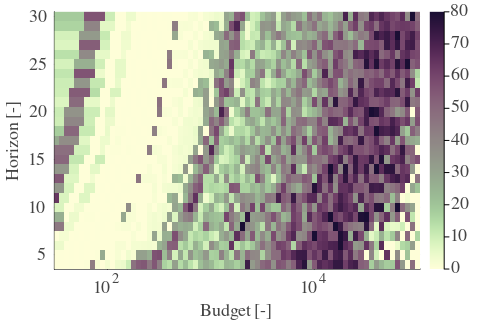 |  |  | 

| Cₚ = 2 | γ = 0.65, S = 24.83% | γ = 0.7, S = 36.93% | γ = 0.75, S = 47.26% | 
| --- | --- | --- | --- | 
| Mean |  |  |  | 
| Std |  |  |  | 

| Cₚ = 2 | γ = 0.8, S = 64.06% | γ = 0.85, S = 64.95% | γ = 0.9, S = 61.35% | 
| --- | --- | --- | --- | 
| Mean |  |  | 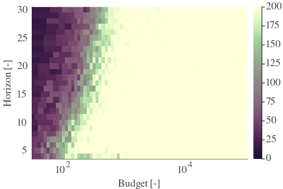 | 
| Std | 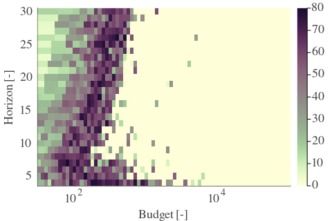 |  | 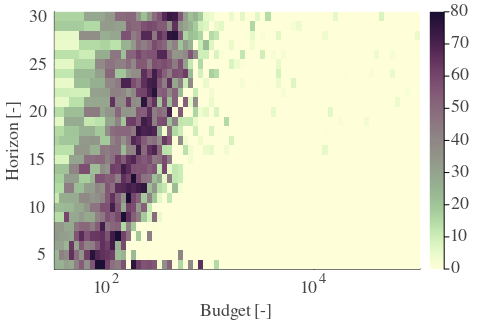 | 

| Cₚ = 2 | γ = 0.95, S = 47.47% | γ = 1.0, S = 34.17% | 
| --- | --- | --- | 
| Mean |  |  | 
| Std |  |  | 

---

**Exploration parameter = 4**

| Cₚ = 4 | γ = 0.5, S = 19.77% | γ = 0.55, S = 14.29% | γ = 0.6, S = 15.96% | 
| --- | --- | --- | --- | 
| Mean |  |  |  | 
| Std | 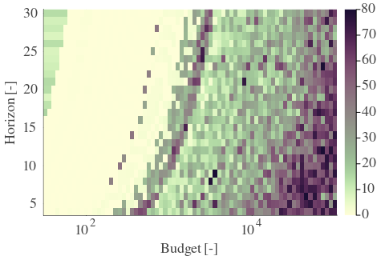 |  |  | 

| Cₚ = 4 | γ = 0.65, S = 19.87% | γ = 0.7, S = 22.22% | γ = 0.75, S = 31.56% | 
| --- | --- | --- | --- | 
| Mean |  |  |  | 
| Std |  |  |  | 

| Cₚ = 4 | γ = 0.8, S = 41.58% | γ = 0.85, S = 54.36% | γ = 0.9, S = 64.89% | 
| --- | --- | --- | --- | 
| Mean | 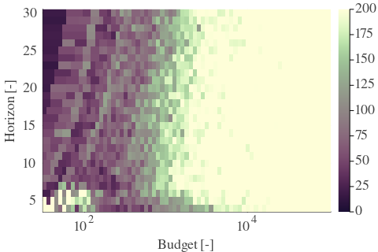 |  |  | 
| Std |  |  |  | 

| Cₚ = 4 | γ = 0.95, S = 64.16% | γ = 1.0, S = 46.11% | 
| --- | --- | --- | 
| Mean | 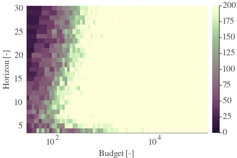 |  | 
| Std |  |  | 

---

**Exploration parameter = 8**

| Cₚ = 8 | γ = 0.5, S = 22.85% | γ = 0.55, S = 20.97% | γ = 0.6, S = 18.94% | 
| --- | --- | --- | --- | 
| Mean |  |  |  | 
| Std |  |  |  | 

| Cₚ = 8 | γ = 0.65, S = 17.84% | γ = 0.7, S = 15.44% | γ = 0.75, S = 20.71% | 
| --- | --- | --- | --- | 
| Mean |  |  |  | 
| Std |  |  |  | 

| Cₚ = 8 | γ = 0.8, S = 28.17% | γ = 0.85, S = 37.09% | γ = 0.9, S = 46.84% | 
| --- | --- | --- | --- | 
| Mean |  |  |  | 
| Std |  |  |  | 

| Cₚ = 8 | γ = 0.95, S = 59.83% | γ = 1.0, S = 61.55% | 
| --- | --- | --- | 
| Mean |  |  | 
| Std |  |  | 

---

**Exploration parameter = 16**

| Cₚ = 16 | γ = 0.5, S = 25.82% | γ = 0.55, S = 23.94% | γ = 0.6, S = 22.54% | 
| --- | --- | --- | --- | 
| Mean |  |  |  | 
| Std |  |  |  | 

| Cₚ = 16 | γ = 0.65, S = 20.55% | γ = 0.7, S = 18.41% | γ = 0.75, S = 16.9% | 
| --- | --- | --- | --- | 
| Mean |  |  |  | 
| Std |  |  |  | 

| Cₚ = 16 | γ = 0.8, S = 20.5% | γ = 0.85, S = 23.94% | γ = 0.9, S = 31.98% | 
| --- | --- | --- | --- | 
| Mean |  |  |  | 
| Std |  |  |  | 

| Cₚ = 16 | γ = 0.95, S = 41.99% | γ = 1.0, S = 51.64% | 
| --- | --- | --- | 
| Mean |  |  | 
| Std |  |  | 

---

**Exploration parameter = 32**

| Cₚ = 32 | γ = 0.5, S = 28.59% | γ = 0.55, S = 26.92% | γ = 0.6, S = 25.2% | 
| --- | --- | --- | --- | 
| Mean |  |  |  | 
| Std |  |  |  | 

| Cₚ = 32 | γ = 0.65, S = 23.58% | γ = 0.7, S = 21.75% | γ = 0.75, S = 19.41% | 
| --- | --- | --- | --- | 
| Mean |  |  |  | 
| Std |  |  |  | 

| Cₚ = 32 | γ = 0.8, S = 16.59% | γ = 0.85, S = 17.37% | γ = 0.9, S = 22.01% | 
| --- | --- | --- | --- | 
| Mean |  |  |  | 
| Std |  |  |  | 

| Cₚ = 32 | γ = 0.95, S = 27.23% | γ = 1.0, S = 36.88% | 
| --- | --- | --- | 
| Mean |  |  | 
| Std |  |  | 

---

**Exploration parameter = 64**

| Cₚ = 64 | γ = 0.5, S = 31.51% | γ = 0.55, S = 29.73% | γ = 0.6, S = 28.01% | 
| --- | --- | --- | --- | 
| Mean |  |  |  | 
| Std |  |  |  | 

| Cₚ = 64 | γ = 0.65, S = 26.45% | γ = 0.7, S = 24.73% | γ = 0.75, S = 23.11% | 
| --- | --- | --- | --- | 
| Mean |  |  | 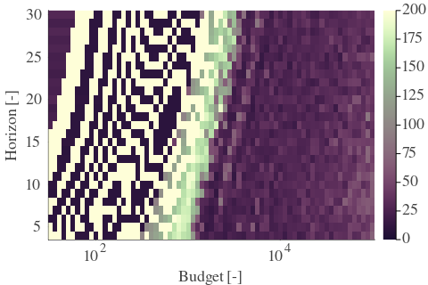 | 
| Std |  |  |  | 

| Cₚ = 64 | γ = 0.8, S = 19.61% | γ = 0.85, S = 16.85% | γ = 0.9, S = 15.55% | 
| --- | --- | --- | --- | 
| Mean |  |  |  | 
| Std |  | 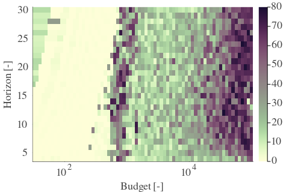 |  | 

| Cₚ = 64 | γ = 0.95, S = 18.88% | γ = 1.0, S = 24.88% | 
| --- | --- | --- | 
| Mean |  | 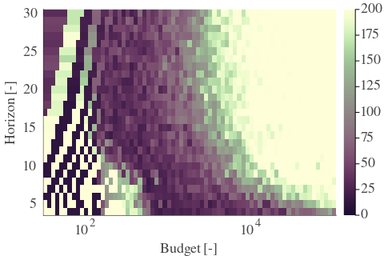 | 
| Std |  |  | 

---

**Exploration parameter = 128**

| Cₚ = 128 | γ = 0.5, S = 34.59% | γ = 0.55, S = 32.71% | γ = 0.6, S = 30.88% | 
| --- | --- | --- | --- | 
| Mean |  |  |  | 
| Std |  |  |  | 

| Cₚ = 128 | γ = 0.65, S = 29.21% | γ = 0.7, S = 27.54% | γ = 0.75, S = 25.93% | 
| --- | --- | --- | --- | 
| Mean |  |  |  | 
| Std |  |  |  | 

| Cₚ = 128 | γ = 0.8, S = 23.42% | γ = 0.85, S = 20.24% | γ = 0.9, S = 17.01% | 
| --- | --- | --- | --- | 
| Mean | 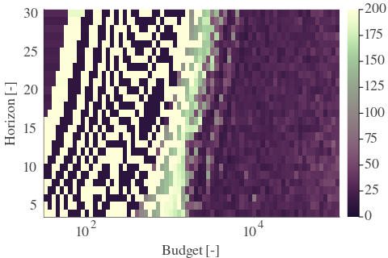 |  |  | 
| Std |  |  |  | 

| Cₚ = 128 | γ = 0.95, S = 13.67% | γ = 1.0, S = 15.08% | 
| --- | --- | --- | 
| Mean |  |  | 
| Std | 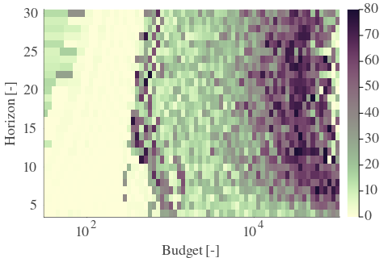 |  | 

---

**Exploration parameter = 256**

| Cₚ = 256 | γ = 0.5, S = 37.4% | γ = 0.55, S = 35.42% | γ = 0.6, S = 33.8% | 
| --- | --- | --- | --- | 
| Mean |  |  |  | 
| Std |  |  | 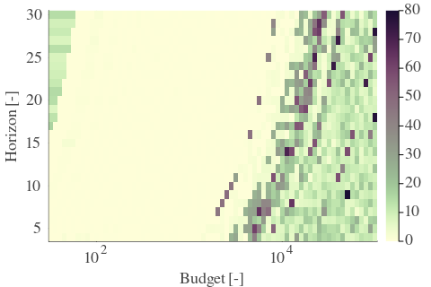 | 

| Cₚ = 256 | γ = 0.65, S = 32.03% | γ = 0.7, S = 30.36% | γ = 0.75, S = 28.43% | 
| --- | --- | --- | --- | 
| Mean |  |  |  | 
| Std |  | 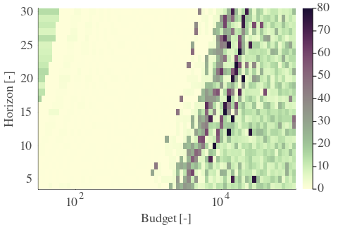 |  | 

| Cₚ = 256 | γ = 0.8, S = 26.4% | γ = 0.85, S = 24.26% | γ = 0.9, S = 20.45% | 
| --- | --- | --- | --- | 
| Mean |  |  |  | 
| Std |  |  |  | 

| Cₚ = 256 | γ = 0.95, S = 16.8% | γ = 1.0, S = 13.72% | 
| --- | --- | --- | 
| Mean |  |  | 
| Std |  |  | 

---

**Exploration parameter = 512**

| Cₚ = 512 | γ = 0.5, S = 40.53% | γ = 0.55, S = 38.5% | γ = 0.6, S = 36.83% | 
| --- | --- | --- | --- | 
| Mean |  |  |  | 
| Std |  |  | 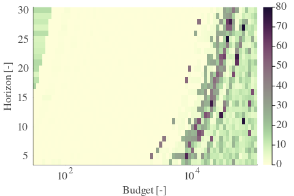 | 

| Cₚ = 512 | γ = 0.65, S = 35.05% | γ = 0.7, S = 33.28% | γ = 0.75, S = 31.3% | 
| --- | --- | --- | --- | 
| Mean |  |  |  | 
| Std |  |  |  | 

| Cₚ = 512 | γ = 0.8, S = 29.06% | γ = 0.85, S = 27.18% | γ = 0.9, S = 24.2% | 
| --- | --- | --- | --- | 
| Mean |  |  |  | 
| Std |  |  |  | 

| Cₚ = 512 | γ = 0.95, S = 20.08% | γ = 1.0, S = 16.85% | 
| --- | --- | --- | 
| Mean |  |  | 
| Std |  |  | 

---

**Exploration parameter = 1024**

| Cₚ = 1024 | γ = 0.5, S = 43.51% | γ = 0.55, S = 41.47% | γ = 0.6, S = 39.65% | 
| --- | --- | --- | --- | 
| Mean |  |  |  | 
| Std |  |  |  | 

| Cₚ = 1024 | γ = 0.65, S = 37.87% | γ = 0.7, S = 36.15% | γ = 0.75, S = 34.48% | 
| --- | --- | --- | --- | 
| Mean |  |  |  | 
| Std |  |  |  | 

| Cₚ = 1024 | γ = 0.8, S = 31.98% | γ = 0.85, S = 29.94% | γ = 0.9, S = 27.23% | 
| --- | --- | --- | --- | 
| Mean |  |  | 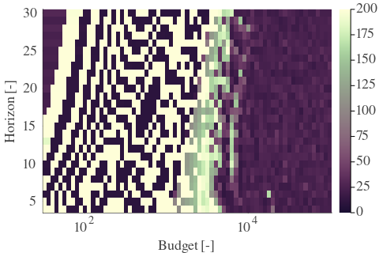 | 
| Std |  |  |  | 

| Cₚ = 1024 | γ = 0.95, S = 23.89% | γ = 1.0, S = 20.29% | 
| --- | --- | --- | 
| Mean |  |  | 
| Std |  |  | 

