# Results for the file sp_V_20230323.csv 

Generated on 2023-11-03 14:14:08

---

**Exploration parameter = 0**

| Cₚ = 0 | γ = 0.5, S = 0.0% | γ = 0.55, S = 0.0% | γ = 0.6, S = 0.0% | 
| --- | --- | --- | --- | 
| Mean |  |  |  | 
| Std |  |  |  | 

| Cₚ = 0 | γ = 0.65, S = 0.0% | γ = 0.7, S = 0.0% | γ = 0.75, S = 0.0% | 
| --- | --- | --- | --- | 
| Mean |  |  |  | 
| Std |  |  |  | 

| Cₚ = 0 | γ = 0.8, S = 0.0% | γ = 0.85, S = 0.0% | γ = 0.9, S = 0.0% | 
| --- | --- | --- | --- | 
| Mean |  |  |  | 
| Std |  | 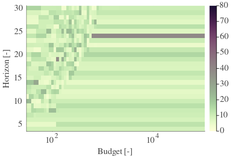 |  | 

| Cₚ = 0 | γ = 0.95, S = 0.0% | γ = 1.0, S = 0.0% | 
| --- | --- | --- | 
| Mean |  |  | 
| Std |  |  | 

---

**Exploration parameter = 2**

| Cₚ = 2 | γ = 0.5, S = 19.56% | γ = 0.55, S = 24.47% | γ = 0.6, S = 30.93% | 
| --- | --- | --- | --- | 
| Mean |  |  |  | 
| Std |  |  |  | 

| Cₚ = 2 | γ = 0.65, S = 35.21% | γ = 0.7, S = 41.05% | γ = 0.75, S = 48.93% | 
| --- | --- | --- | --- | 
| Mean |  |  |  | 
| Std |  |  |  | 

| Cₚ = 2 | γ = 0.8, S = 60.98% | γ = 0.85, S = 69.74% | γ = 0.9, S = 72.3% | 
| --- | --- | --- | --- | 
| Mean |  |  |  | 
| Std |  |  |  | 

| Cₚ = 2 | γ = 0.95, S = 72.77% | γ = 1.0, S = 67.76% | 
| --- | --- | --- | 
| Mean |  |  | 
| Std |  |  | 

---

**Exploration parameter = 4**

| Cₚ = 4 | γ = 0.5, S = 20.45% | γ = 0.55, S = 20.19% | γ = 0.6, S = 22.74% | 
| --- | --- | --- | --- | 
| Mean |  |  |  | 
| Std |  |  |  | 

| Cₚ = 4 | γ = 0.65, S = 28.22% | γ = 0.7, S = 32.5% | γ = 0.75, S = 37.35% | 
| --- | --- | --- | --- | 
| Mean |  |  |  | 
| Std |  | 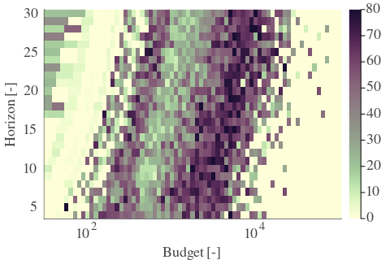 |  | 

| Cₚ = 4 | γ = 0.8, S = 42.25% | γ = 0.85, S = 50.97% | γ = 0.9, S = 62.75% | 
| --- | --- | --- | --- | 
| Mean |  |  |  | 
| Std | 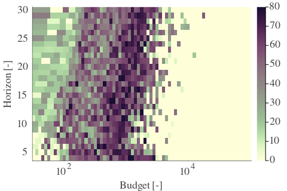 |  |  | 

| Cₚ = 4 | γ = 0.95, S = 70.84% | γ = 1.0, S = 73.14% | 
| --- | --- | --- | 
| Mean |  |  | 
| Std | 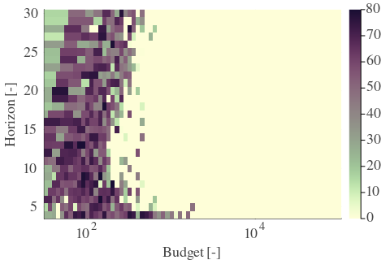 |  | 

---

**Exploration parameter = 8**

| Cₚ = 8 | γ = 0.5, S = 20.45% | γ = 0.55, S = 20.76% | γ = 0.6, S = 21.8% | 
| --- | --- | --- | --- | 
| Mean |  |  |  | 
| Std |  |  | 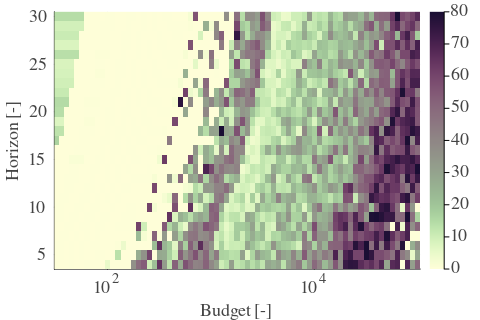 | 

| Cₚ = 8 | γ = 0.65, S = 21.28% | γ = 0.7, S = 23.06% | γ = 0.75, S = 28.74% | 
| --- | --- | --- | --- | 
| Mean |  |  |  | 
| Std |  |  |  | 

| Cₚ = 8 | γ = 0.8, S = 33.54% | γ = 0.85, S = 37.66% | γ = 0.9, S = 45.96% | 
| --- | --- | --- | --- | 
| Mean |  |  |  | 
| Std |  |  |  | 

| Cₚ = 8 | γ = 0.95, S = 56.49% | γ = 1.0, S = 66.67% | 
| --- | --- | --- | 
| Mean |  |  | 
| Std |  |  | 

---

**Exploration parameter = 16**

| Cₚ = 16 | γ = 0.5, S = 24.26% | γ = 0.55, S = 23.06% | γ = 0.6, S = 22.01% | 
| --- | --- | --- | --- | 
| Mean |  |  |  | 
| Std |  |  |  | 

| Cₚ = 16 | γ = 0.65, S = 21.86% | γ = 0.7, S = 21.34% | γ = 0.75, S = 20.08% | 
| --- | --- | --- | --- | 
| Mean |  | 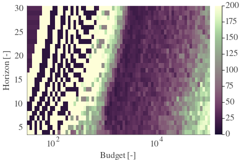 |  | 
| Std |  |  |  | 

| Cₚ = 16 | γ = 0.8, S = 21.75% | γ = 0.85, S = 28.33% | γ = 0.9, S = 34.59% | 
| --- | --- | --- | --- | 
| Mean |  |  |  | 
| Std |  |  |  | 

| Cₚ = 16 | γ = 0.95, S = 40.9% | γ = 1.0, S = 50.08% | 
| --- | --- | --- | 
| Mean |  |  | 
| Std |  |  | 

---

**Exploration parameter = 32**

| Cₚ = 32 | γ = 0.5, S = 27.44% | γ = 0.55, S = 26.4% | γ = 0.6, S = 25.98% | 
| --- | --- | --- | --- | 
| Mean |  |  |  | 
| Std |  |  |  | 

| Cₚ = 32 | γ = 0.65, S = 24.31% | γ = 0.7, S = 22.74% | γ = 0.75, S = 21.28% | 
| --- | --- | --- | --- | 
| Mean |  |  |  | 
| Std |  |  |  | 

| Cₚ = 32 | γ = 0.8, S = 19.25% | γ = 0.85, S = 18.52% | γ = 0.9, S = 23.06% | 
| --- | --- | --- | --- | 
| Mean |  |  |  | 
| Std |  |  |  | 

| Cₚ = 32 | γ = 0.95, S = 30.99% | γ = 1.0, S = 36.15% | 
| --- | --- | --- | 
| Mean |  | 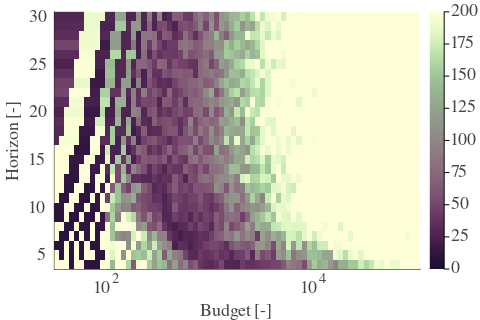 | 
| Std |  |  | 

---

**Exploration parameter = 64**

| Cₚ = 64 | γ = 0.5, S = 29.89% | γ = 0.55, S = 29.47% | γ = 0.6, S = 28.9% | 
| --- | --- | --- | --- | 
| Mean |  |  |  | 
| Std |  |  |  | 

| Cₚ = 64 | γ = 0.65, S = 28.06% | γ = 0.7, S = 26.45% | γ = 0.75, S = 24.0% | 
| --- | --- | --- | --- | 
| Mean |  | 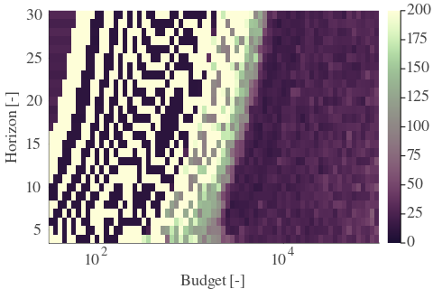 |  | 
| Std |  |  |  | 

| Cₚ = 64 | γ = 0.8, S = 21.8% | γ = 0.85, S = 19.72% | γ = 0.9, S = 16.74% | 
| --- | --- | --- | --- | 
| Mean |  |  |  | 
| Std |  |  |  | 

| Cₚ = 64 | γ = 0.95, S = 19.09% | γ = 1.0, S = 25.93% | 
| --- | --- | --- | 
| Mean |  |  | 
| Std |  |  | 

---

**Exploration parameter = 128**

| Cₚ = 128 | γ = 0.5, S = 32.92% | γ = 0.55, S = 31.82% | γ = 0.6, S = 31.61% | 
| --- | --- | --- | --- | 
| Mean |  |  |  | 
| Std |  |  |  | 

| Cₚ = 128 | γ = 0.65, S = 31.19% | γ = 0.7, S = 29.63% | γ = 0.75, S = 27.96% | 
| --- | --- | --- | --- | 
| Mean |  |  |  | 
| Std |  |  |  | 

| Cₚ = 128 | γ = 0.8, S = 25.61% | γ = 0.85, S = 22.27% | γ = 0.9, S = 19.72% | 
| --- | --- | --- | --- | 
| Mean |  |  |  | 
| Std |  | 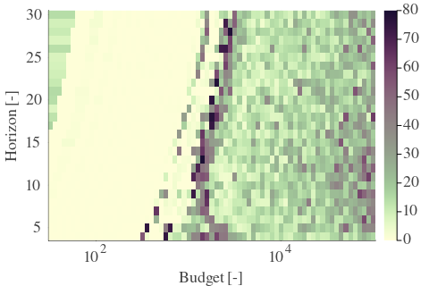 |  | 

| Cₚ = 128 | γ = 0.95, S = 17.27% | γ = 1.0, S = 17.11% | 
| --- | --- | --- | 
| Mean |  |  | 
| Std |  | 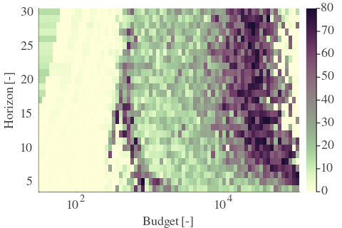 | 

---

**Exploration parameter = 256**

| Cₚ = 256 | γ = 0.5, S = 35.84% | γ = 0.55, S = 34.85% | γ = 0.6, S = 34.22% | 
| --- | --- | --- | --- | 
| Mean |  |  |  | 
| Std |  |  |  | 

| Cₚ = 256 | γ = 0.65, S = 33.54% | γ = 0.7, S = 32.39% | γ = 0.75, S = 31.3% | 
| --- | --- | --- | --- | 
| Mean |  |  |  | 
| Std |  |  |  | 

| Cₚ = 256 | γ = 0.8, S = 28.43% | γ = 0.85, S = 26.4% | γ = 0.9, S = 23.53% | 
| --- | --- | --- | --- | 
| Mean |  |  |  | 
| Std |  |  |  | 

| Cₚ = 256 | γ = 0.95, S = 19.77% | γ = 1.0, S = 17.68% | 
| --- | --- | --- | 
| Mean |  |  | 
| Std |  |  | 

---

**Exploration parameter = 512**

| Cₚ = 512 | γ = 0.5, S = 38.29% | γ = 0.55, S = 37.72% | γ = 0.6, S = 37.35% | 
| --- | --- | --- | --- | 
| Mean | 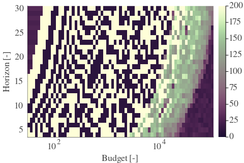 |  |  | 
| Std |  |  |  | 

| Cₚ = 512 | γ = 0.65, S = 36.05% | γ = 0.7, S = 35.52% | γ = 0.75, S = 33.39% | 
| --- | --- | --- | --- | 
| Mean |  |  |  | 
| Std |  |  |  | 

| Cₚ = 512 | γ = 0.8, S = 31.51% | γ = 0.85, S = 29.73% | γ = 0.9, S = 26.55% | 
| --- | --- | --- | --- | 
| Mean |  |  |  | 
| Std |  |  |  | 

| Cₚ = 512 | γ = 0.95, S = 23.63% | γ = 1.0, S = 20.66% | 
| --- | --- | --- | 
| Mean |  |  | 
| Std |  |  | 

---

**Exploration parameter = 1024**

| Cₚ = 1024 | γ = 0.5, S = 41.68% | γ = 0.55, S = 40.95% | γ = 0.6, S = 40.06% | 
| --- | --- | --- | --- | 
| Mean |  |  |  | 
| Std |  | 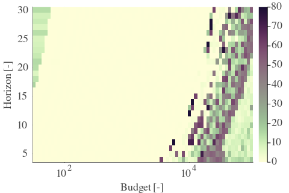 |  | 

| Cₚ = 1024 | γ = 0.65, S = 39.54% | γ = 0.7, S = 38.29% | γ = 0.75, S = 35.79% | 
| --- | --- | --- | --- | 
| Mean |  |  |  | 
| Std |  |  |  | 

| Cₚ = 1024 | γ = 0.8, S = 34.38% | γ = 0.85, S = 32.13% | γ = 0.9, S = 29.94% | 
| --- | --- | --- | --- | 
| Mean |  |  |  | 
| Std |  |  |  | 

| Cₚ = 1024 | γ = 0.95, S = 26.71% | γ = 1.0, S = 24.41% | 
| --- | --- | --- | 
| Mean |  |  | 
| Std |  |  | 

