# Results for the file sp_W_20230323.csv 

Generated on 2023-11-03 14:14:09

---

**Exploration parameter = 0**

| Cₚ = 0 | γ = 0.5, S = 0.0% | γ = 0.55, S = 0.0% | γ = 0.6, S = 0.0% | 
| --- | --- | --- | --- | 
| Mean |  |  |  | 
| Std |  |  |  | 

| Cₚ = 0 | γ = 0.65, S = 0.0% | γ = 0.7, S = 0.0% | γ = 0.75, S = 0.0% | 
| --- | --- | --- | --- | 
| Mean |  |  |  | 
| Std |  |  |  | 

| Cₚ = 0 | γ = 0.8, S = 0.0% | γ = 0.85, S = 0.0% | γ = 0.9, S = 0.0% | 
| --- | --- | --- | --- | 
| Mean |  |  |  | 
| Std |  |  |  | 

| Cₚ = 0 | γ = 0.95, S = 0.0% | γ = 1.0, S = 0.0% | 
| --- | --- | --- | 
| Mean |  |  | 
| Std |  |  | 

---

**Exploration parameter = 2**

| Cₚ = 2 | γ = 0.5, S = 14.45% | γ = 0.55, S = 15.75% | γ = 0.6, S = 19.41% | 
| --- | --- | --- | --- | 
| Mean |  |  |  | 
| Std |  |  |  | 

| Cₚ = 2 | γ = 0.65, S = 25.04% | γ = 0.7, S = 36.93% | γ = 0.75, S = 47.37% | 
| --- | --- | --- | --- | 
| Mean |  |  |  | 
| Std |  |  |  | 

| Cₚ = 2 | γ = 0.8, S = 64.27% | γ = 0.85, S = 65.1% | γ = 0.9, S = 61.09% | 
| --- | --- | --- | --- | 
| Mean |  |  |  | 
| Std |  |  |  | 

| Cₚ = 2 | γ = 0.95, S = 48.15% | γ = 1.0, S = 33.49% | 
| --- | --- | --- | 
| Mean |  |  | 
| Std |  |  | 

---

**Exploration parameter = 4**

| Cₚ = 4 | γ = 0.5, S = 19.87% | γ = 0.55, S = 14.4% | γ = 0.6, S = 15.7% | 
| --- | --- | --- | --- | 
| Mean |  |  |  | 
| Std |  |  |  | 

| Cₚ = 4 | γ = 0.65, S = 20.87% | γ = 0.7, S = 22.95% | γ = 0.75, S = 31.61% | 
| --- | --- | --- | --- | 
| Mean |  |  |  | 
| Std |  |  |  | 

| Cₚ = 4 | γ = 0.8, S = 41.68% | γ = 0.85, S = 53.83% | γ = 0.9, S = 65.15% | 
| --- | --- | --- | --- | 
| Mean |  |  |  | 
| Std |  |  |  | 

| Cₚ = 4 | γ = 0.95, S = 63.54% | γ = 1.0, S = 46.84% | 
| --- | --- | --- | 
| Mean |  |  | 
| Std |  |  | 

---

**Exploration parameter = 8**

| Cₚ = 8 | γ = 0.5, S = 23.16% | γ = 0.55, S = 21.18% | γ = 0.6, S = 18.94% | 
| --- | --- | --- | --- | 
| Mean | 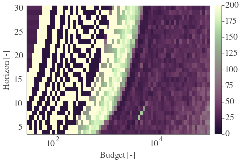 |  |  | 
| Std |  |  |  | 

| Cₚ = 8 | γ = 0.65, S = 17.94% | γ = 0.7, S = 15.55% | γ = 0.75, S = 21.86% | 
| --- | --- | --- | --- | 
| Mean |  |  | 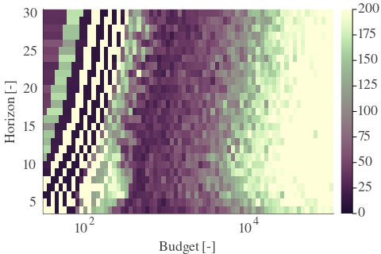 | 
| Std |  |  |  | 

| Cₚ = 8 | γ = 0.8, S = 28.59% | γ = 0.85, S = 35.89% | γ = 0.9, S = 47.42% | 
| --- | --- | --- | --- | 
| Mean | 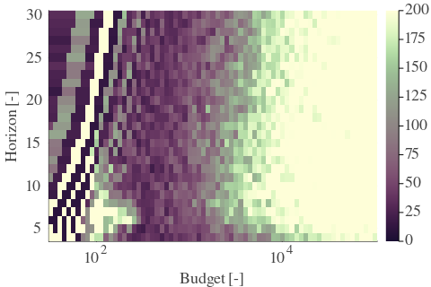 |  |  | 
| Std |  |  |  | 

| Cₚ = 8 | γ = 0.95, S = 60.51% | γ = 1.0, S = 60.88% | 
| --- | --- | --- | 
| Mean |  |  | 
| Std |  |  | 

---

**Exploration parameter = 16**

| Cₚ = 16 | γ = 0.5, S = 26.08% | γ = 0.55, S = 24.05% | γ = 0.6, S = 22.54% | 
| --- | --- | --- | --- | 
| Mean |  | 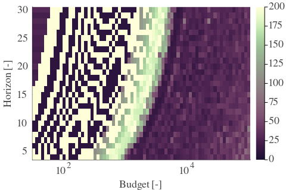 |  | 
| Std |  |  |  | 

| Cₚ = 16 | γ = 0.65, S = 20.55% | γ = 0.7, S = 18.52% | γ = 0.75, S = 17.74% | 
| --- | --- | --- | --- | 
| Mean |  |  |  | 
| Std |  |  |  | 

| Cₚ = 16 | γ = 0.8, S = 20.4% | γ = 0.85, S = 24.99% | γ = 0.9, S = 32.19% | 
| --- | --- | --- | --- | 
| Mean |  |  |  | 
| Std |  |  |  | 

| Cₚ = 16 | γ = 0.95, S = 42.04% | γ = 1.0, S = 52.01% | 
| --- | --- | --- | 
| Mean |  |  | 
| Std |  | 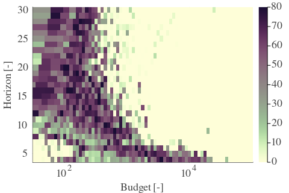 | 

---

**Exploration parameter = 32**

| Cₚ = 32 | γ = 0.5, S = 28.79% | γ = 0.55, S = 26.92% | γ = 0.6, S = 25.25% | 
| --- | --- | --- | --- | 
| Mean | 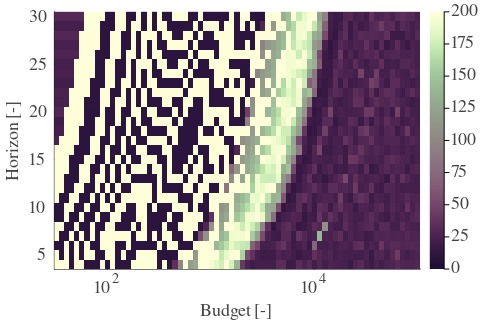 | 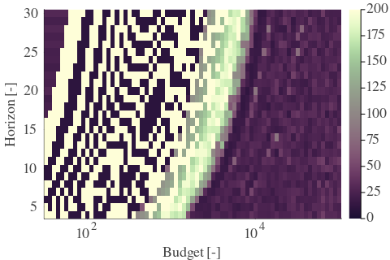 |  | 
| Std |  |  |  | 

| Cₚ = 32 | γ = 0.65, S = 23.58% | γ = 0.7, S = 21.75% | γ = 0.75, S = 19.41% | 
| --- | --- | --- | --- | 
| Mean |  |  |  | 
| Std |  |  |  | 

| Cₚ = 32 | γ = 0.8, S = 16.48% | γ = 0.85, S = 17.79% | γ = 0.9, S = 22.07% | 
| --- | --- | --- | --- | 
| Mean |  |  |  | 
| Std |  |  | 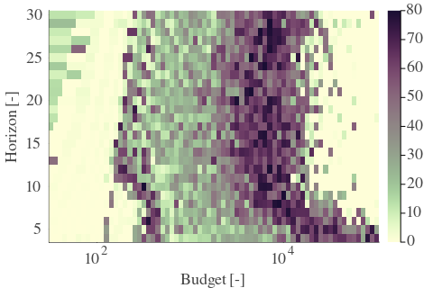 | 

| Cₚ = 32 | γ = 0.95, S = 26.86% | γ = 1.0, S = 37.19% | 
| --- | --- | --- | 
| Mean |  |  | 
| Std |  | 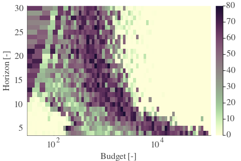 | 

---

**Exploration parameter = 64**

| Cₚ = 64 | γ = 0.5, S = 31.66% | γ = 0.55, S = 29.79% | γ = 0.6, S = 28.01% | 
| --- | --- | --- | --- | 
| Mean |  |  |  | 
| Std |  |  |  | 

| Cₚ = 64 | γ = 0.65, S = 26.45% | γ = 0.7, S = 24.73% | γ = 0.75, S = 23.11% | 
| --- | --- | --- | --- | 
| Mean |  |  |  | 
| Std |  |  |  | 

| Cₚ = 64 | γ = 0.8, S = 19.61% | γ = 0.85, S = 17.16% | γ = 0.9, S = 15.23% | 
| --- | --- | --- | --- | 
| Mean | 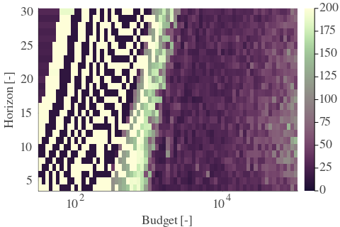 |  |  | 
| Std |  |  |  | 

| Cₚ = 64 | γ = 0.95, S = 19.46% | γ = 1.0, S = 24.2% | 
| --- | --- | --- | 
| Mean |  |  | 
| Std |  |  | 

---

**Exploration parameter = 128**

| Cₚ = 128 | γ = 0.5, S = 34.9% | γ = 0.55, S = 32.66% | γ = 0.6, S = 30.83% | 
| --- | --- | --- | --- | 
| Mean |  |  |  | 
| Std |  |  |  | 

| Cₚ = 128 | γ = 0.65, S = 29.26% | γ = 0.7, S = 27.54% | γ = 0.75, S = 25.93% | 
| --- | --- | --- | --- | 
| Mean |  |  |  | 
| Std |  |  |  | 

| Cₚ = 128 | γ = 0.8, S = 23.37% | γ = 0.85, S = 20.66% | γ = 0.9, S = 17.27% | 
| --- | --- | --- | --- | 
| Mean |  |  |  | 
| Std |  | 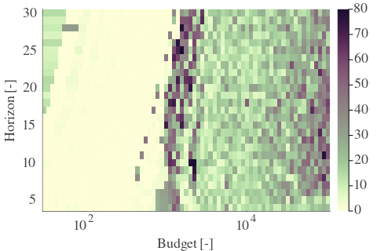 |  | 

| Cₚ = 128 | γ = 0.95, S = 13.93% | γ = 1.0, S = 15.55% | 
| --- | --- | --- | 
| Mean |  |  | 
| Std | 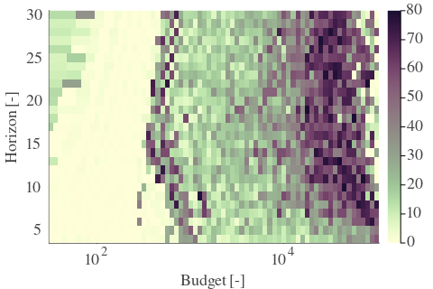 | 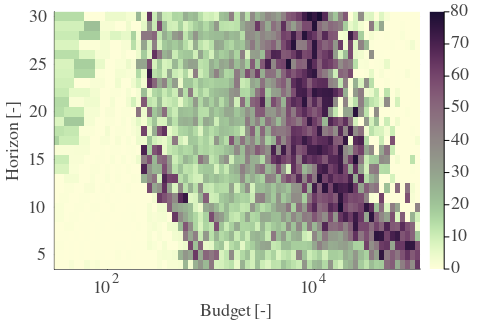 | 

---

**Exploration parameter = 256**

| Cₚ = 256 | γ = 0.5, S = 37.66% | γ = 0.55, S = 35.37% | γ = 0.6, S = 33.85% | 
| --- | --- | --- | --- | 
| Mean |  | 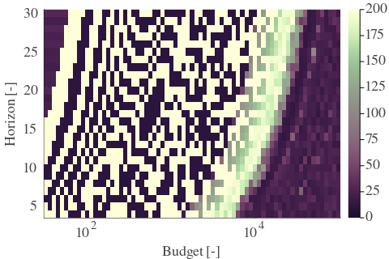 |  | 
| Std | 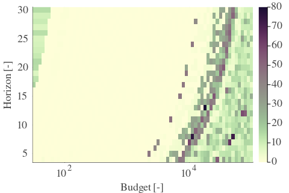 |  |  | 

| Cₚ = 256 | γ = 0.65, S = 32.13% | γ = 0.7, S = 30.36% | γ = 0.75, S = 28.48% | 
| --- | --- | --- | --- | 
| Mean |  |  |  | 
| Std |  |  |  | 

| Cₚ = 256 | γ = 0.8, S = 26.45% | γ = 0.85, S = 24.62% | γ = 0.9, S = 20.71% | 
| --- | --- | --- | --- | 
| Mean |  |  |  | 
| Std |  |  |  | 

| Cₚ = 256 | γ = 0.95, S = 16.64% | γ = 1.0, S = 13.46% | 
| --- | --- | --- | 
| Mean |  |  | 
| Std |  |  | 

---

**Exploration parameter = 512**

| Cₚ = 512 | γ = 0.5, S = 40.64% | γ = 0.55, S = 38.6% | γ = 0.6, S = 36.88% | 
| --- | --- | --- | --- | 
| Mean | 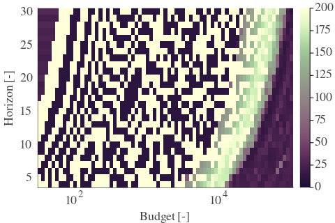 |  |  | 
| Std |  |  |  | 

| Cₚ = 512 | γ = 0.65, S = 35.05% | γ = 0.7, S = 33.33% | γ = 0.75, S = 31.4% | 
| --- | --- | --- | --- | 
| Mean |  |  |  | 
| Std |  |  |  | 

| Cₚ = 512 | γ = 0.8, S = 29.06% | γ = 0.85, S = 27.54% | γ = 0.9, S = 24.52% | 
| --- | --- | --- | --- | 
| Mean |  |  |  | 
| Std |  |  |  | 

| Cₚ = 512 | γ = 0.95, S = 19.87% | γ = 1.0, S = 16.95% | 
| --- | --- | --- | 
| Mean |  |  | 
| Std |  |  | 

---

**Exploration parameter = 1024**

| Cₚ = 1024 | γ = 0.5, S = 43.77% | γ = 0.55, S = 41.47% | γ = 0.6, S = 39.75% | 
| --- | --- | --- | --- | 
| Mean |  |  |  | 
| Std |  |  |  | 

| Cₚ = 1024 | γ = 0.65, S = 37.82% | γ = 0.7, S = 36.2% | γ = 0.75, S = 34.53% | 
| --- | --- | --- | --- | 
| Mean |  |  |  | 
| Std |  |  |  | 

| Cₚ = 1024 | γ = 0.8, S = 32.03% | γ = 0.85, S = 30.26% | γ = 0.9, S = 27.44% | 
| --- | --- | --- | --- | 
| Mean |  |  |  | 
| Std |  |  |  | 

| Cₚ = 1024 | γ = 0.95, S = 23.79% | γ = 1.0, S = 20.14% | 
| --- | --- | --- | 
| Mean |  |  | 
| Std |  |  | 

