# Results for the file sp_Y_20230323.csv 

Generated on 2023-11-03 14:14:10

---

**Exploration parameter = 0**

| Cₚ = 0 | γ = 0.5, S = 0.0% | γ = 0.55, S = 0.0% | γ = 0.6, S = 0.0% | 
| --- | --- | --- | --- | 
| Mean |  |  |  | 
| Std |  |  |  | 

| Cₚ = 0 | γ = 0.65, S = 0.0% | γ = 0.7, S = 0.0% | γ = 0.75, S = 0.0% | 
| --- | --- | --- | --- | 
| Mean |  |  |  | 
| Std |  |  |  | 

| Cₚ = 0 | γ = 0.8, S = 0.0% | γ = 0.85, S = 0.0% | γ = 0.9, S = 0.0% | 
| --- | --- | --- | --- | 
| Mean |  |  |  | 
| Std |  |  |  | 

| Cₚ = 0 | γ = 0.95, S = 0.0% | γ = 1.0, S = 0.0% | 
| --- | --- | --- | 
| Mean |  |  | 
| Std |  |  | 

---

**Exploration parameter = 2**

| Cₚ = 2 | γ = 0.5, S = 19.41% | γ = 0.55, S = 24.73% | γ = 0.6, S = 27.39% | 
| --- | --- | --- | --- | 
| Mean |  |  |  | 
| Std |  |  |  | 

| Cₚ = 2 | γ = 0.65, S = 34.79% | γ = 0.7, S = 44.34% | γ = 0.75, S = 55.35% | 
| --- | --- | --- | --- | 
| Mean |  | 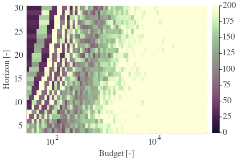 |  | 
| Std | 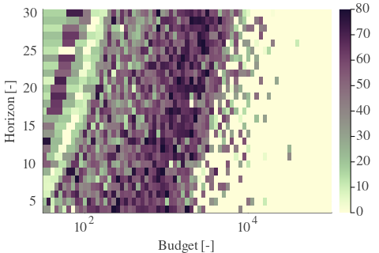 |  |  | 

| Cₚ = 2 | γ = 0.8, S = 68.13% | γ = 0.85, S = 71.15% | γ = 0.9, S = 72.25% | 
| --- | --- | --- | --- | 
| Mean |  |  |  | 
| Std |  |  |  | 

| Cₚ = 2 | γ = 0.95, S = 72.56% | γ = 1.0, S = 68.49% | 
| --- | --- | --- | 
| Mean |  |  | 
| Std | 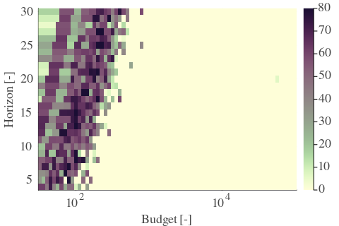 |  | 

---

**Exploration parameter = 4**

| Cₚ = 4 | γ = 0.5, S = 16.85% | γ = 0.55, S = 18.62% | γ = 0.6, S = 22.8% | 
| --- | --- | --- | --- | 
| Mean |  |  |  | 
| Std |  |  |  | 

| Cₚ = 4 | γ = 0.65, S = 26.4% | γ = 0.7, S = 31.61% | γ = 0.75, S = 39.54% | 
| --- | --- | --- | --- | 
| Mean |  |  |  | 
| Std |  |  |  | 

| Cₚ = 4 | γ = 0.8, S = 47.05% | γ = 0.85, S = 57.59% | γ = 0.9, S = 70.11% | 
| --- | --- | --- | --- | 
| Mean |  | 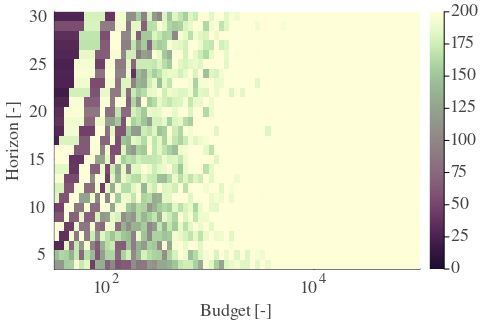 |  | 
| Std |  |  |  | 

| Cₚ = 4 | γ = 0.95, S = 74.33% | γ = 1.0, S = 75.38% | 
| --- | --- | --- | 
| Mean |  |  | 
| Std |  |  | 

---

**Exploration parameter = 8**

| Cₚ = 8 | γ = 0.5, S = 19.25% | γ = 0.55, S = 18.99% | γ = 0.6, S = 16.69% | 
| --- | --- | --- | --- | 
| Mean |  |  |  | 
| Std |  |  | 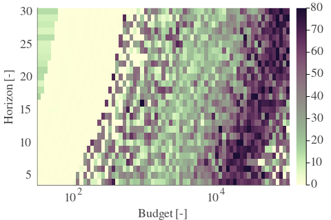 | 

| Cₚ = 8 | γ = 0.65, S = 17.37% | γ = 0.7, S = 23.32% | γ = 0.75, S = 28.33% | 
| --- | --- | --- | --- | 
| Mean |  |  |  | 
| Std |  |  |  | 

| Cₚ = 8 | γ = 0.8, S = 35.11% | γ = 0.85, S = 41.05% | γ = 0.9, S = 52.22% | 
| --- | --- | --- | --- | 
| Mean |  |  | 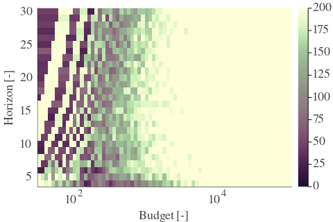 | 
| Std |  |  |  | 

| Cₚ = 8 | γ = 0.95, S = 63.59% | γ = 1.0, S = 73.14% | 
| --- | --- | --- | 
| Mean |  |  | 
| Std |  |  | 

---

**Exploration parameter = 16**

| Cₚ = 16 | γ = 0.5, S = 20.92% | γ = 0.55, S = 19.93% | γ = 0.6, S = 19.67% | 
| --- | --- | --- | --- | 
| Mean |  |  |  | 
| Std |  |  |  | 

| Cₚ = 16 | γ = 0.65, S = 18.78% | γ = 0.7, S = 16.9% | γ = 0.75, S = 18.0% | 
| --- | --- | --- | --- | 
| Mean |  |  |  | 
| Std |  |  | 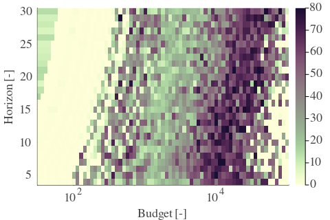 | 

| Cₚ = 16 | γ = 0.8, S = 23.42% | γ = 0.85, S = 30.36% | γ = 0.9, S = 36.78% | 
| --- | --- | --- | --- | 
| Mean |  |  |  | 
| Std |  |  |  | 

| Cₚ = 16 | γ = 0.95, S = 44.6% | γ = 1.0, S = 57.02% | 
| --- | --- | --- | 
| Mean |  |  | 
| Std |  |  | 

---

**Exploration parameter = 32**

| Cₚ = 32 | γ = 0.5, S = 25.04% | γ = 0.55, S = 23.27% | γ = 0.6, S = 21.07% | 
| --- | --- | --- | --- | 
| Mean |  |  |  | 
| Std |  |  |  | 

| Cₚ = 32 | γ = 0.65, S = 20.19% | γ = 0.7, S = 19.41% | γ = 0.75, S = 18.1% | 
| --- | --- | --- | --- | 
| Mean |  |  |  | 
| Std |  |  |  | 

| Cₚ = 32 | γ = 0.8, S = 16.28% | γ = 0.85, S = 19.14% | γ = 0.9, S = 26.19% | 
| --- | --- | --- | --- | 
| Mean |  |  |  | 
| Std |  | 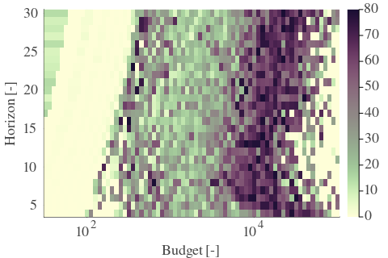 |  | 

| Cₚ = 32 | γ = 0.95, S = 32.5% | γ = 1.0, S = 39.75% | 
| --- | --- | --- | 
| Mean |  |  | 
| Std |  |  | 

---

**Exploration parameter = 64**

| Cₚ = 64 | γ = 0.5, S = 27.86% | γ = 0.55, S = 25.98% | γ = 0.6, S = 25.25% | 
| --- | --- | --- | --- | 
| Mean |  |  |  | 
| Std |  | 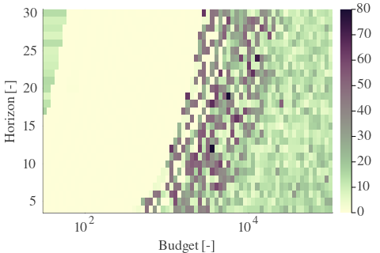 |  | 

| Cₚ = 64 | γ = 0.65, S = 23.63% | γ = 0.7, S = 21.39% | γ = 0.75, S = 20.45% | 
| --- | --- | --- | --- | 
| Mean |  |  |  | 
| Std |  |  |  | 

| Cₚ = 64 | γ = 0.8, S = 19.35% | γ = 0.85, S = 16.8% | γ = 0.9, S = 15.91% | 
| --- | --- | --- | --- | 
| Mean |  |  |  | 
| Std |  |  |  | 

| Cₚ = 64 | γ = 0.95, S = 22.74% | γ = 1.0, S = 29.21% | 
| --- | --- | --- | 
| Mean |  |  | 
| Std |  |  | 

---

**Exploration parameter = 128**

| Cₚ = 128 | γ = 0.5, S = 30.2% | γ = 0.55, S = 28.95% | γ = 0.6, S = 27.96% | 
| --- | --- | --- | --- | 
| Mean |  |  |  | 
| Std |  |  |  | 

| Cₚ = 128 | γ = 0.65, S = 26.5% | γ = 0.7, S = 25.51% | γ = 0.75, S = 23.42% | 
| --- | --- | --- | --- | 
| Mean |  |  |  | 
| Std |  |  |  | 

| Cₚ = 128 | γ = 0.8, S = 21.54% | γ = 0.85, S = 19.61% | γ = 0.9, S = 18.1% | 
| --- | --- | --- | --- | 
| Mean |  |  |  | 
| Std |  |  |  | 

| Cₚ = 128 | γ = 0.95, S = 15.81% | γ = 1.0, S = 19.51% | 
| --- | --- | --- | 
| Mean |  |  | 
| Std |  |  | 

---

**Exploration parameter = 256**

| Cₚ = 256 | γ = 0.5, S = 32.76% | γ = 0.55, S = 31.35% | γ = 0.6, S = 30.31% | 
| --- | --- | --- | --- | 
| Mean |  |  |  | 
| Std |  |  |  | 

| Cₚ = 256 | γ = 0.65, S = 29.32% | γ = 0.7, S = 28.22% | γ = 0.75, S = 26.55% | 
| --- | --- | --- | --- | 
| Mean |  |  |  | 
| Std |  |  |  | 

| Cₚ = 256 | γ = 0.8, S = 25.4% | γ = 0.85, S = 23.21% | γ = 0.9, S = 20.03% | 
| --- | --- | --- | --- | 
| Mean |  |  |  | 
| Std |  |  |  | 

| Cₚ = 256 | γ = 0.95, S = 18.73% | γ = 1.0, S = 16.22% | 
| --- | --- | --- | 
| Mean |  |  | 
| Std |  |  | 

---

**Exploration parameter = 512**

| Cₚ = 512 | γ = 0.5, S = 35.73% | γ = 0.55, S = 34.64% | γ = 0.6, S = 32.97% | 
| --- | --- | --- | --- | 
| Mean |  |  |  | 
| Std |  |  |  | 

| Cₚ = 512 | γ = 0.65, S = 31.98% | γ = 0.7, S = 30.73% | γ = 0.75, S = 29.73% | 
| --- | --- | --- | --- | 
| Mean |  |  |  | 
| Std |  |  |  | 

| Cₚ = 512 | γ = 0.8, S = 28.12% | γ = 0.85, S = 25.93% | γ = 0.9, S = 24.36% | 
| --- | --- | --- | --- | 
| Mean |  |  |  | 
| Std |  |  |  | 

| Cₚ = 512 | γ = 0.95, S = 21.7% | γ = 1.0, S = 18.73% | 
| --- | --- | --- | 
| Mean |  |  | 
| Std |  | 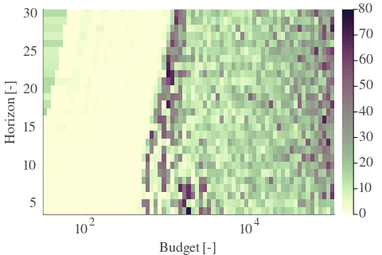 | 

---

**Exploration parameter = 1024**

| Cₚ = 1024 | γ = 0.5, S = 38.39% | γ = 0.55, S = 37.51% | γ = 0.6, S = 35.94% | 
| --- | --- | --- | --- | 
| Mean |  |  |  | 
| Std |  |  |  | 

| Cₚ = 1024 | γ = 0.65, S = 34.9% | γ = 0.7, S = 33.18% | γ = 0.75, S = 32.45% | 
| --- | --- | --- | --- | 
| Mean |  |  |  | 
| Std |  |  |  | 

| Cₚ = 1024 | γ = 0.8, S = 30.67% | γ = 0.85, S = 29.63% | γ = 0.9, S = 27.6% | 
| --- | --- | --- | --- | 
| Mean |  |  |  | 
| Std |  | 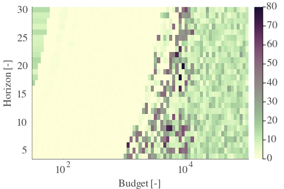 |  | 

| Cₚ = 1024 | γ = 0.95, S = 25.04% | γ = 1.0, S = 22.33% | 
| --- | --- | --- | 
| Mean |  |  | 
| Std |  |  | 

