# Results for the file sp_Z_20230324.csv 

Generated on 2023-11-03 14:14:11

---

**Exploration parameter = 0**

| Cₚ = 0 | γ = 0.5, S = 0.0% | γ = 0.55, S = 0.0% | γ = 0.6, S = 0.0% | 
| --- | --- | --- | --- | 
| Mean |  |  |  | 
| Std |  |  |  | 

| Cₚ = 0 | γ = 0.65, S = 0.0% | γ = 0.7, S = 0.0% | γ = 0.75, S = 0.0% | 
| --- | --- | --- | --- | 
| Mean |  |  |  | 
| Std |  |  |  | 

| Cₚ = 0 | γ = 0.8, S = 0.0% | γ = 0.85, S = 0.0% | γ = 0.9, S = 0.0% | 
| --- | --- | --- | --- | 
| Mean |  |  | 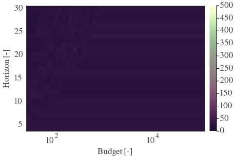 | 
| Std |  |  |  | 

| Cₚ = 0 | γ = 0.95, S = 0.0% | γ = 1.0, S = 0.0% | 
| --- | --- | --- | 
| Mean |  |  | 
| Std |  |  | 

---

**Exploration parameter = 2**

| Cₚ = 2 | γ = 0.5, S = 12.26% | γ = 0.55, S = 8.87% | γ = 0.6, S = 8.92% | 
| --- | --- | --- | --- | 
| Mean |  |  |  | 
| Std |  |  | 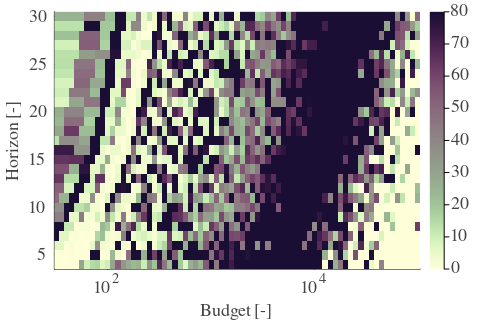 | 

| Cₚ = 2 | γ = 0.65, S = 14.81% | γ = 0.7, S = 22.12% | γ = 0.75, S = 31.72% | 
| --- | --- | --- | --- | 
| Mean |  |  |  | 
| Std | 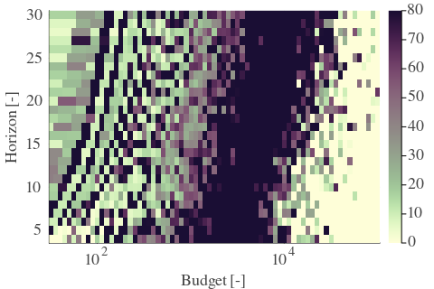 |  |  | 

| Cₚ = 2 | γ = 0.8, S = 41.73% | γ = 0.85, S = 48.83% | γ = 0.9, S = 23.11% | 
| --- | --- | --- | --- | 
| Mean |  |  |  | 
| Std | 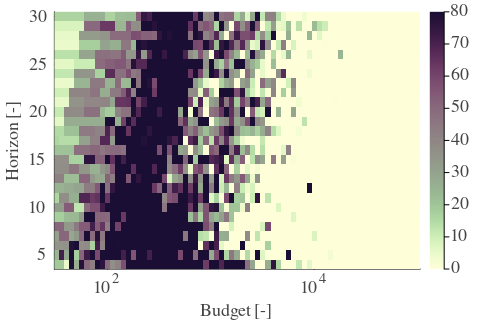 |  |  | 

| Cₚ = 2 | γ = 0.95, S = 15.6% | γ = 1.0, S = 12.88% | 
| --- | --- | --- | 
| Mean |  |  | 
| Std |  |  | 

---

**Exploration parameter = 4**

| Cₚ = 4 | γ = 0.5, S = 18.83% | γ = 0.55, S = 14.03% | γ = 0.6, S = 11.22% | 
| --- | --- | --- | --- | 
| Mean |  | 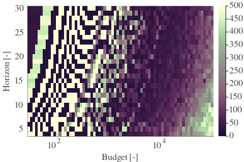 |  | 
| Std |  |  |  | 

| Cₚ = 4 | γ = 0.65, S = 9.86% | γ = 0.7, S = 9.39% | γ = 0.75, S = 16.43% | 
| --- | --- | --- | --- | 
| Mean |  |  |  | 
| Std |  |  |  | 

| Cₚ = 4 | γ = 0.8, S = 24.93% | γ = 0.85, S = 33.8% | γ = 0.9, S = 40.95% | 
| --- | --- | --- | --- | 
| Mean |  |  |  | 
| Std |  |  |  | 

| Cₚ = 4 | γ = 0.95, S = 24.62% | γ = 1.0, S = 16.85% | 
| --- | --- | --- | 
| Mean |  |  | 
| Std |  |  | 

---

**Exploration parameter = 8**

| Cₚ = 8 | γ = 0.5, S = 21.6% | γ = 0.55, S = 19.56% | γ = 0.6, S = 17.58% | 
| --- | --- | --- | --- | 
| Mean |  |  |  | 
| Std |  |  |  | 

| Cₚ = 8 | γ = 0.65, S = 15.55% | γ = 0.7, S = 9.81% | γ = 0.75, S = 9.18% | 
| --- | --- | --- | --- | 
| Mean |  |  |  | 
| Std |  |  |  | 

| Cₚ = 8 | γ = 0.8, S = 10.64% | γ = 0.85, S = 17.21% | γ = 0.9, S = 27.39% | 
| --- | --- | --- | --- | 
| Mean |  |  |  | 
| Std |  | 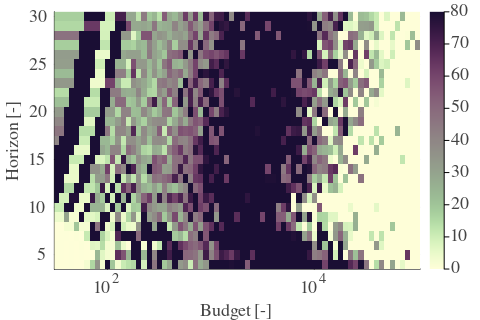 |  | 

| Cₚ = 8 | γ = 0.95, S = 34.32% | γ = 1.0, S = 21.54% | 
| --- | --- | --- | 
| Mean |  |  | 
| Std |  |  | 

---

**Exploration parameter = 16**

| Cₚ = 16 | γ = 0.5, S = 25.25% | γ = 0.55, S = 22.9% | γ = 0.6, S = 20.03% | 
| --- | --- | --- | --- | 
| Mean |  |  |  | 
| Std |  |  | 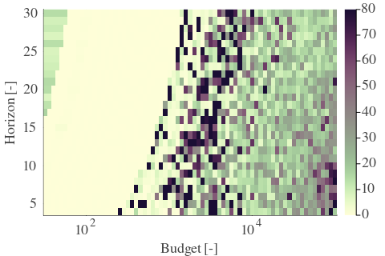 | 

| Cₚ = 16 | γ = 0.65, S = 17.79% | γ = 0.7, S = 14.66% | γ = 0.75, S = 11.68% | 
| --- | --- | --- | --- | 
| Mean |  |  |  | 
| Std |  |  |  | 

| Cₚ = 16 | γ = 0.8, S = 8.45% | γ = 0.85, S = 6.26% | γ = 0.9, S = 11.32% | 
| --- | --- | --- | --- | 
| Mean |  |  |  | 
| Std |  |  |  | 

| Cₚ = 16 | γ = 0.95, S = 21.39% | γ = 1.0, S = 24.15% | 
| --- | --- | --- | 
| Mean |  |  | 
| Std |  |  | 

---

**Exploration parameter = 32**

| Cₚ = 32 | γ = 0.5, S = 28.85% | γ = 0.55, S = 25.61% | γ = 0.6, S = 24.2% | 
| --- | --- | --- | --- | 
| Mean |  |  |  | 
| Std |  |  |  | 

| Cₚ = 32 | γ = 0.65, S = 21.13% | γ = 0.7, S = 17.48% | γ = 0.75, S = 14.71% | 
| --- | --- | --- | --- | 
| Mean |  |  |  | 
| Std |  |  |  | 

| Cₚ = 32 | γ = 0.8, S = 11.84% | γ = 0.85, S = 8.87% | γ = 0.9, S = 4.69% | 
| --- | --- | --- | --- | 
| Mean |  |  |  | 
| Std |  |  |  | 

| Cₚ = 32 | γ = 0.95, S = 7.82% | γ = 1.0, S = 17.58% | 
| --- | --- | --- | 
| Mean |  |  | 
| Std |  |  | 

---

**Exploration parameter = 64**

| Cₚ = 64 | γ = 0.5, S = 31.51% | γ = 0.55, S = 28.59% | γ = 0.6, S = 27.28% | 
| --- | --- | --- | --- | 
| Mean |  |  |  | 
| Std |  |  |  | 

| Cₚ = 64 | γ = 0.65, S = 24.41% | γ = 0.7, S = 21.18% | γ = 0.75, S = 18.31% | 
| --- | --- | --- | --- | 
| Mean |  |  |  | 
| Std |  |  |  | 

| Cₚ = 64 | γ = 0.8, S = 14.66% | γ = 0.85, S = 12.47% | γ = 0.9, S = 7.77% | 
| --- | --- | --- | --- | 
| Mean |  |  |  | 
| Std |  |  |  | 

| Cₚ = 64 | γ = 0.95, S = 4.59% | γ = 1.0, S = 6.42% | 
| --- | --- | --- | 
| Mean | 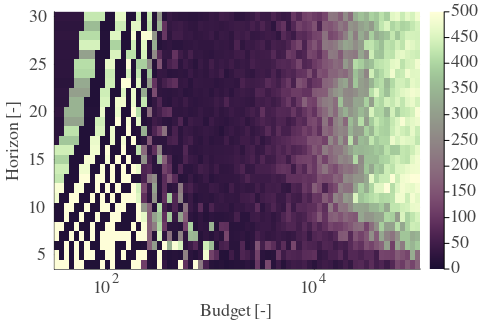 |  | 
| Std |  |  | 

---

**Exploration parameter = 128**

| Cₚ = 128 | γ = 0.5, S = 33.91% | γ = 0.55, S = 31.82% | γ = 0.6, S = 29.79% | 
| --- | --- | --- | --- | 
| Mean |  |  |  | 
| Std |  |  |  | 

| Cₚ = 128 | γ = 0.65, S = 27.65% | γ = 0.7, S = 24.15% | γ = 0.75, S = 21.34% | 
| --- | --- | --- | --- | 
| Mean | 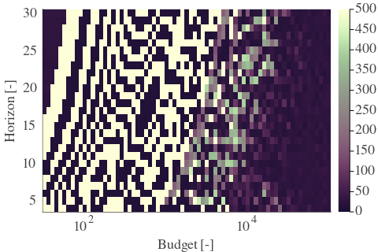 |  |  | 
| Std |  |  |  | 

| Cₚ = 128 | γ = 0.8, S = 18.21% | γ = 0.85, S = 15.23% | γ = 0.9, S = 11.22% | 
| --- | --- | --- | --- | 
| Mean | 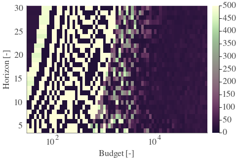 |  |  | 
| Std |  |  |  | 

| Cₚ = 128 | γ = 0.95, S = 6.62% | γ = 1.0, S = 5.32% | 
| --- | --- | --- | 
| Mean |  |  | 
| Std |  |  | 

---

**Exploration parameter = 256**

| Cₚ = 256 | γ = 0.5, S = 36.83% | γ = 0.55, S = 34.74% | γ = 0.6, S = 32.29% | 
| --- | --- | --- | --- | 
| Mean |  |  |  | 
| Std |  |  |  | 

| Cₚ = 256 | γ = 0.65, S = 30.31% | γ = 0.7, S = 26.6% | γ = 0.75, S = 24.26% | 
| --- | --- | --- | --- | 
| Mean |  |  |  | 
| Std | 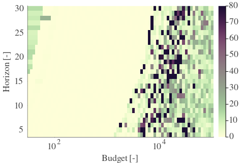 |  |  | 

| Cₚ = 256 | γ = 0.8, S = 21.39% | γ = 0.85, S = 18.94% | γ = 0.9, S = 14.24% | 
| --- | --- | --- | --- | 
| Mean |  |  |  | 
| Std | 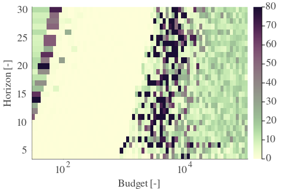 |  |  | 

| Cₚ = 256 | γ = 0.95, S = 9.7% | γ = 1.0, S = 6.89% | 
| --- | --- | --- | 
| Mean |  |  | 
| Std |  |  | 

---

**Exploration parameter = 512**

| Cₚ = 512 | γ = 0.5, S = 40.06% | γ = 0.55, S = 37.61% | γ = 0.6, S = 35.32% | 
| --- | --- | --- | --- | 
| Mean |  |  | 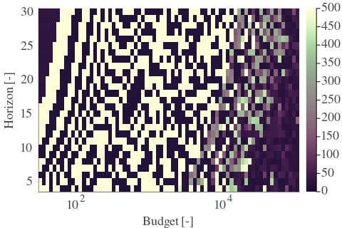 | 
| Std | 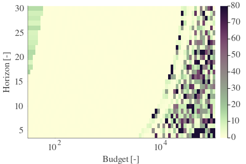 |  |  | 

| Cₚ = 512 | γ = 0.65, S = 33.12% | γ = 0.7, S = 29.42% | γ = 0.75, S = 26.92% | 
| --- | --- | --- | --- | 
| Mean |  |  |  | 
| Std |  |  |  | 

| Cₚ = 512 | γ = 0.8, S = 24.31% | γ = 0.85, S = 22.43% | γ = 0.9, S = 18.15% | 
| --- | --- | --- | --- | 
| Mean |  |  |  | 
| Std |  | 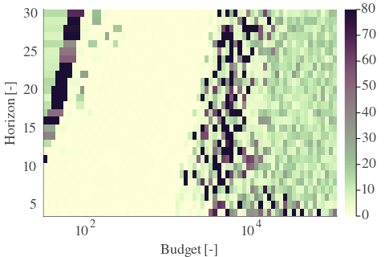 |  | 

| Cₚ = 512 | γ = 0.95, S = 12.52% | γ = 1.0, S = 8.76% | 
| --- | --- | --- | 
| Mean |  |  | 
| Std |  |  | 

---

**Exploration parameter = 1024**

| Cₚ = 1024 | γ = 0.5, S = 42.67% | γ = 0.55, S = 40.64% | γ = 0.6, S = 38.5% | 
| --- | --- | --- | --- | 
| Mean |  |  | 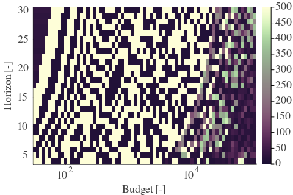 | 
| Std |  |  |  | 

| Cₚ = 1024 | γ = 0.65, S = 36.15% | γ = 0.7, S = 32.5% | γ = 0.75, S = 29.94% | 
| --- | --- | --- | --- | 
| Mean |  |  |  | 
| Std |  |  | 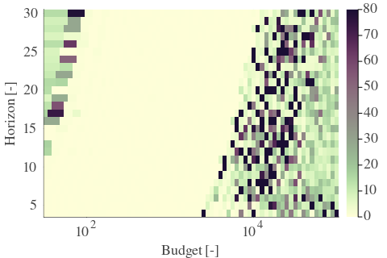 | 

| Cₚ = 1024 | γ = 0.8, S = 27.18% | γ = 0.85, S = 24.78% | γ = 0.9, S = 21.28% | 
| --- | --- | --- | --- | 
| Mean |  |  |  | 
| Std |  |  |  | 

| Cₚ = 1024 | γ = 0.95, S = 16.17% | γ = 1.0, S = 11.74% | 
| --- | --- | --- | 
| Mean |  |  | 
| Std |  |  | 

